<p align="center">
  
</p>

<h2 align="center">Universidad Peruana de Ciencias Aplicadas</h2>
<h3 align="center">Ingenieri­a de Software</h3>

<p align="center">
    Periodo: 202610 <br>
    1ASI0732 | Diseño de Experimentos de Ingenierí­a de Software <br>
    NRC: 16879 <br>
    Docente: Alex Humberto Sanchez Ponce <br>
</p>

<hr>

<div align="center">
    <h5><strong>Informe del Trabajo Final</strong></h5>
    Startup: Stoq <br>
    Producto: StockWise <br>
</div>

<div align="center">
    <h5><strong>Integrantes</strong></h5>
    <p>
        U202319431 - Luciana Carolina Choquehuanca Nuñez <br>
        U202224619 - Ronald Joel Peralta Chipa <br>
        U202210973 - Sanchez Rios, Camila Cristina <br>
        U202313773 - Fabiola Del Rocio Saldaña Ayalan <br>
        U20221B778 - Roy Linsh Fernandez Remon  <br>
    </p>
    <p><em>Mayo, 2026</em></p>
</div>

<br>

<div style="page-break-after: always;"></div>

# Registro de Versiones del Informe


| Version | Fecha | Autor | Descripcion de modificaciones |
|---|---|---|---|
| TP  |11/05/2026  | - Luciana Carolina Choquehuanca Nuñez <br> - Ronald Joel Peralta Chipa <br> - Sanchez Rios, Camila Cristina <br> - Fabiola Del Rocio Saldaña Ayalan <br> - Roy Linsh Fernandez Remon  <br> | Capitulo I: Introduccion <br> Capitulo II: Requirements Elicitation & Analysis <br> Capítulo III: Requirements Specification <br> Capítulo IV: Product Design <br> Capítulo V: Product Implementation<br> Capítulo VI: Product Verification & Validation <br> Capítulo VII: DevOps Practices     |

<div style="page-break-after: always;"></div>

# Project Report Collaboration Insights

## Enlace del repositorio del informe

https://github.com/upc-1ASI0732-2610-16879-Stoq/Report 

## Enlace de los repositorios de la organizacion

https://github.com/upc-1ASI0732-2610-16879-Stoq 

<div style="page-break-after: always;"></div>

# Contenido

## Tabla de contenidos

- [Registro de Versiones del Informe](#registro-de-versiones-del-informe)
- [Project Report Collaboration Insights](#project-report-collaboration-insights)
  - [Enlace del repositorio del informe](#enlace-del-repositorio-del-informe)
  - [Enlace de los repositorios de la organizacion](#enlace-de-los-repositorios-de-la-organizacion)
- [Contenido](#contenido)
  - [Tabla de contenidos](#tabla-de-contenidos)
- [Student Outcome](#student-outcome)
- [Part I: As-Is Software Project](#part-i-as-is-software-project)
- [Capitulo I: Introduccion](#capitulo-i-introduccion)
  - [1.1. Startup Profile](#11-startup-profile)
    - [1.1.1. Descripcion de la Startup](#111-descripcion-de-la-startup)
    - [1.1.2. Perfiles de integrantes del equipo](#112-perfiles-de-integrantes-del-equipo)
  - [1.2. Solution Profile](#12-solution-profile)
    - [1.2.1. Antecedentes y problematica](#121-antecedentes-y-problematica)
    - [1.2.2. Lean UX Process](#122-lean-ux-process)
      - [1.2.2.1. Lean UX Problem Statements](#1221-lean-ux-problem-statements)
      - [1.2.2.2. Lean UX Assumptions](#1222-lean-ux-assumptions)
      - [1.2.2.3. Lean UX Hypothesis Statements](#1223-lean-ux-hypothesis-statements)
      - [1.2.2.4. Lean UX Canvas](#1224-lean-ux-canvas)
  - [1.3. Segmentos objetivo](#13-segmentos-objetivo)
- [Capitulo II: Requirements Elicitation \& Analysis](#capitulo-ii-requirements-elicitation--analysis)
  - [2.1. Competidores](#21-competidores)
    - [2.1.1. Analisis competitivo](#211-analisis-competitivo)
    - [2.1.2. Estrategias y tacticas frente a competidores](#212-estrategias-y-tacticas-frente-a-competidores)
      - [Estrategias Generales de Posicionamiento](#estrategias-generales-de-posicionamiento)
      - [Estrategias Ofensivas frente a Competidores](#estrategias-ofensivas-frente-a-competidores)
      - [Estrategias Defensivas](#estrategias-defensivas)
  - [2.2. Entrevistas](#22-entrevistas)
    - [2.2.1. Diseno de entrevistas](#221-diseno-de-entrevistas)
    - [2.2.1. Diseño de entrevistas](#221-diseño-de-entrevistas)
    - [2.2.2. Registro de entrevistas](#222-registro-de-entrevistas)
    - [2.2.3. Analisis de entrevistas](#223-analisis-de-entrevistas)
  - [2.3. Needfinding](#23-needfinding)
    - [2.3.1. User Personas](#231-user-personas)
    - [2.3.2. User Task Matrix](#232-user-task-matrix)
    - [2.3.3. User Journey Mapping](#233-user-journey-mapping)
    - [2.3.4. Empathy Mapping](#234-empathy-mapping)
    - [2.3.5. As-is Scenario Mapping](#235-as-is-scenario-mapping)
  - [2.4. Ubiquitous Language](#24-ubiquitous-language)
- [Capitulo III: Requirements Specification](#capitulo-iii-requirements-specification)
  - [3.1. To-Be Scenario Mapping](#31-to-be-scenario-mapping)
  - [3.2. User Stories](#32-user-stories)
  - [3.3. Product Backlog](#33-product-backlog)
  - [3.4. Impact Mapping](#34-impact-mapping)
- [Capitulo IV: Product Design](#capitulo-iv-product-design)
  - [4.1. Style Guidelines](#41-style-guidelines)
    - [4.1.1. General Style Guidelines](#411-general-style-guidelines)
    - [4.1.2. Web Style Guidelines](#412-web-style-guidelines)
    - [4.1.3. Mobile Style Guidelines](#413-mobile-style-guidelines)
      - [4.1.3.1. iOS Mobile Style Guidelines](#4131-ios-mobile-style-guidelines)
      - [4.1.3.2. Android Mobile Style Guidelines](#4132-android-mobile-style-guidelines)
  - [4.2. Information Architecture](#42-information-architecture)
    - [4.2.1. Organization Systems](#421-organization-systems)
      - [Organization Systems](#organization-systems)
    - [4.2.2. Labeling Systems](#422-labeling-systems)
    - [4.2.3. SEO Tags and Meta Tags](#423-seo-tags-and-meta-tags)
    - [4.2.4. Searching Systems](#424-searching-systems)
    - [4.2.5. Navigation Systems](#425-navigation-systems)
  - [4.3. Landing Page UI Design](#43-landing-page-ui-design)
    - [4.3.1. Landing Page Wireframe](#431-landing-page-wireframe)
    - [4.3.2. Landing Page Mock-up](#432-landing-page-mock-up)
  - [4.4. Mobile Applications UX/UI Design](#44-mobile-applications-uxui-design)
    - [4.4.1. Mobile Applications Wireframes](#441-mobile-applications-wireframes)
    - [4.4.2. Mobile Applications Wireflow Diagrams](#442-mobile-applications-wireflow-diagrams)
    - [4.4.3. Mobile Applications Mock-ups](#443-mobile-applications-mock-ups)
    - [4.4.4. Mobile Applications User Flow Diagrams](#444-mobile-applications-user-flow-diagrams)
  - [4.5. Mobile Applications Prototyping](#45-mobile-applications-prototyping)
    - [4.5.1. Android Mobile Applications Prototyping](#451-android-mobile-applications-prototyping)
    - [4.5.2. iOS Mobile Applications Prototyping](#452-ios-mobile-applications-prototyping)
  - [4.6. Web Applications UX/UI Design](#46-web-applications-uxui-design)
    - [4.6.2. Web Applications Wireflow Diagrams](#462-web-applications-wireflow-diagrams)
    - [User Goal: “Crear cuenta e ingresar a la aplicación”](#user-goal-crear-cuenta-e-ingresar-a-la-aplicación)
    - [User Goal: “Crear un nuevo rol para el personal”](#user-goal-crear-un-nuevo-rol-para-el-personal)
    - [4.6.3. Web Applications Mock-ups](#463-web-applications-mock-ups)
    - [4.6.4. Web Applications User Flow Diagrams](#464-web-applications-user-flow-diagrams)
    - [User Goal: “Registrar salida de productos (venta/consumo/merma)”](#user-goal-registrar-salida-de-productos-ventaconsumomerma)
    - [User Goal: “Gestionar inventario (ingresar reposición y crear producto)”](#user-goal-gestionar-inventario-ingresar-reposición-y-crear-producto)
  - [4.7. Web Applications Prototyping](#47-web-applications-prototyping)
  - [4.8. Domain-Driven Software Architecture](#48-domain-driven-software-architecture)
    - [4.8.1. Software Architecture Context Diagram](#481-software-architecture-context-diagram)
    - [4.8.2. Software Architecture Container Diagrams](#482-software-architecture-container-diagrams)
    - [4.8.3. Software Architecture Components Diagrams](#483-software-architecture-components-diagrams)
  - [4.9. Software Object-Oriented Design](#49-software-object-oriented-design)
    - [4.9.1. Class Diagrams](#491-class-diagrams)
    - [4.9.2. Class Dictionary](#492-class-dictionary)
    - [IAM Context](#iam-context)
    - [Product Management Context](#product-management-context)
    - [Inventory Context](#inventory-context)
    - [Sales Context](#sales-context)
    - [Alert Stock Context](#alert-stock-context)
    - [Reports Context](#reports-context)
  - [4.10. Database Design](#410-database-design)
    - [4.10.1. Relational/Non-Relational Database Diagram](#4101-relationalnon-relational-database-diagram)
- [Capitulo V: Product Implementation](#capitulo-v-product-implementation)
  - [5.1. Software Configuration Management](#51-software-configuration-management)
    - [5.1.1. Software Development Environment Configuration](#511-software-development-environment-configuration)
      - [Software Deployment](#software-deployment)
    - [5.1.2. Source Code Management](#512-source-code-management)
      - [GitFlow](#gitflow)
    - [5.1.3. Source Code Style Guide \& Conventions](#513-source-code-style-guide--conventions)
      - [Mobile Development (UI \& Logic)](#mobile-development-ui--logic)
    - [5.1.4. Software Deployment Configuration](#514-software-deployment-configuration)
      - [Requisitos de Estructura](#requisitos-de-estructura)
      - [Pasos para el Despliegue](#pasos-para-el-despliegue)
  - [5.2. Product Implementation \& Deployment](#52-product-implementation--deployment)
    - [5.2.1. Sprint Backlogs](#521-sprint-backlogs)
    - [Sprint 1: Núcleo Móvil, APIs Base y Landing Page](#sprint-1-núcleo-móvil-apis-base-y-landing-page)
    - [Sprint 2: Funcionalidades Avanzadas y Alertas](#sprint-2-funcionalidades-avanzadas-y-alertas)
    - [Sprint 3: Integración de Hardware, Geolocalización y Cierre](#sprint-3-integración-de-hardware-geolocalización-y-cierre)
    - [5.2.2. Implemented Landing Page Evidence](#522-implemented-landing-page-evidence)
    - [5.2.3. Implemented Frontend-Web Application Evidence](#523-implemented-frontend-web-application-evidence)
    - [5.2.4. Acuerdo de Servicio - SaaS](#524-acuerdo-de-servicio---saas)
      - [1. Definiciones](#1-definiciones)
      - [2. Objeto del Acuerdo](#2-objeto-del-acuerdo)
      - [3. Registro y Acceso](#3-registro-y-acceso)
      - [4. Tarifas y Planes](#4-tarifas-y-planes)
      - [5. Propiedad Intelectual](#5-propiedad-intelectual)
      - [6. Uso Aceptable](#6-uso-aceptable)
      - [7. Protección de Datos y Privacidad](#7-protección-de-datos-y-privacidad)
      - [8. Disponibilidad del Servicio](#8-disponibilidad-del-servicio)
      - [9. Limitación de Responsabilidad](#9-limitación-de-responsabilidad)
      - [10. Modificaciones del Acuerdo](#10-modificaciones-del-acuerdo)
    - [5.2.5. Implemented Native-Mobile Application Evidence](#525-implemented-native-mobile-application-evidence)
    - [5.2.6. Implemented RESTful API and/or Serverless Backend Evidence](#526-implemented-restful-api-andor-serverless-backend-evidence)
    - [5.2.7. RESTful API documentation](#527-restful-api-documentation)
      - [Authentication](#authentication)
      - [Products](#products)
      - [Combos](#combos)
      - [Tags](#tags)
      - [Units](#units)
      - [Sales](#sales)
      - [Inventory](#inventory)
      - [StockAlert](#stockalert)
      - [Report](#report)
    - [5.2.8. Team Collaboration Insights](#528-team-collaboration-insights)
  - [5.3. Video About-the-Product](#53-video-about-the-product)
- [Part II: Verification, Validation \& Pipeline](#part-ii-verification-validation--pipeline)
- [Capitulo VI: Product Verification \& Validation](#capitulo-vi-product-verification--validation)
  - [6.1. Testing Suites \& Validation](#61-testing-suites--validation)
    - [6.1.1. Core Entities Unit Tests](#611-core-entities-unit-tests)
    - [6.1.2. Core Integration Tests](#612-core-integration-tests)
    - [Información General Test-1](#información-general-test-1)
    - [Escenario 1](#escenario-1)
    - [Escenario 2](#escenario-2)
    - [Escenario 3](#escenario-3)
    - [Escenario 4](#escenario-4)
    - [Información General Test-2](#información-general-test-2)
    - [Escenario 1](#escenario-1-1)
    - [Escenario 2](#escenario-2-1)
    - [Escenario 3](#escenario-3-1)
    - [6.1.3. Core Behavior-Driven Development](#613-core-behavior-driven-development)
      - [Evidence 1: Product Registration Feature File](#evidence-1-product-registration-feature-file)
      - [Evidence 2: Low Stock Alert Feature File](#evidence-2-low-stock-alert-feature-file)
      - [Evidence 3: BDD Test Execution Results](#evidence-3-bdd-test-execution-results)
    - [6.1.4. Core System Tests](#614-core-system-tests)
- [Capitulo VII: DevOps Practices](#capitulo-vii-devops-practices)
  - [7.1. Continuous Integration](#71-continuous-integration)
    - [7.1.1. Tools and Practices](#711-tools-and-practices)
    - [7.1.2. Build \& Test Suite Pipeline Components](#712-build--test-suite-pipeline-components)
  - [7.2. Continuous Delivery](#72-continuous-delivery)
    - [7.2.1. Tools and Practices](#721-tools-and-practices)
    - [7.2.2. Stages Deployment Pipeline Components](#722-stages-deployment-pipeline-components)
  - [7.3. Continuous deployment](#73-continuous-deployment)
    - [7.3.1. Tools and Practices](#731-tools-and-practices)
    - [7.3.2. Production Deployment Pipeline Components](#732-production-deployment-pipeline-components)
  - [7.4. Continuous Monitoring](#74-continuous-monitoring)
    - [7.4.1. Tools and Practices](#741-tools-and-practices)
    - [7.4.2. Monitoring Pipeline Components](#742-monitoring-pipeline-components)
    - [7.4.3. Alerting Pipeline Components](#743-alerting-pipeline-components)
    - [7.4.4. Notification Pipeline Components](#744-notification-pipeline-components)
- [Part III: Experiment-Driven Lifecycle](#part-iii-experiment-driven-lifecycle)
- [Capitulo VIII: Experiment-Driven Development](#capitulo-viii-experiment-driven-development)
  - [8.1. Experiment Planning](#81-experiment-planning)
    - [8.1.1. As-Is Summary](#811-as-is-summary)
    - [8.1.2. Raw Material: Assumptions, Knowledge Gaps, Ideas, Claims](#812-raw-material-assumptions-knowledge-gaps-ideas-claims)
    - [8.1.3. Experiment-Ready Questions](#813-experiment-ready-questions)
    - [8.1.4. Question Backlog](#814-question-backlog)
    - [8.1.5. Experiment Cards](#815-experiment-cards)
  - [8.2. Experiment Design](#82-experiment-design)
    - [8.2.1. Hypotheses](#821-hypotheses)
    - [8.2.2. Domain Business Metrics](#822-domain-business-metrics)
    - [8.2.3. Measures](#823-measures)
    - [8.2.4. Conditions](#824-conditions)
    - [8.2.5. Scale Calculations and Decisions](#825-scale-calculations-and-decisions)
    - [8.2.6. Methods Selection](#826-methods-selection)
    - [8.2.7. Data Analytics: Goals, KPIs and Metrics Selection](#827-data-analytics-goals-kpis-and-metrics-selection)
    - [8.2.8. Web and Mobile Tracking Plan](#828-web-and-mobile-tracking-plan)
  - [8.3. Experimentation](#83-experimentation)
    - [8.3.1. To-Be User Stories](#831-to-be-user-stories)
    - [8.3.2. To-Be Product Backlog](#832-to-be-product-backlog)
    - [8.3.3. Pipeline-supported, Experiment-Driven To-Be Software Platform Lifecycle](#833-pipeline-supported-experiment-driven-to-be-software-platform-lifecycle)
      - [8.3.3.1. To-Be Sprint Backlogs](#8331-to-be-sprint-backlogs)
      - [8.3.3.2. Implemented To-Be Landing Page Evidence](#8332-implemented-to-be-landing-page-evidence)
    - [5.2.3. Implemented Frontend-Web Application Evidence](#523-implemented-frontend-web-application-evidence-1)
      - [8.3.3.4. Implemented To-Be Native-Mobile Application Evidence](#8334-implemented-to-be-native-mobile-application-evidence)
      - [8.3.3.5. Implemented To-Be RESTful API and/or Serverless Backend Evidence](#8335-implemented-to-be-restful-api-andor-serverless-backend-evidence)
      - [8.3.3.6. Team Collaboration Insights](#8336-team-collaboration-insights)
    - [8.3.4. To-Be Validation Interviews](#834-to-be-validation-interviews)
      - [8.3.4.1. Diseno de Entrevistas](#8341-diseno-de-entrevistas)
      - [8.3.4.2. Registro de Entrevistas](#8342-registro-de-entrevistas)
  - [8.4. Experiment Aftermath \& Analysis](#84-experiment-aftermath--analysis)
    - [8.4.1. Analysis and Interpretation of Results](#841-analysis-and-interpretation-of-results)
    - [8.4.2. Re-scored and Re-prioritized Question Backlog](#842-re-scored-and-re-prioritized-question-backlog)
  - [8.5. Continuous Learning](#85-continuous-learning)
    - [8.5.1. Shareback Session Artifacts: Learning Workflow](#851-shareback-session-artifacts-learning-workflow)
  - [8.6. To-Be Software Platform Pre-launch](#86-to-be-software-platform-pre-launch)
    - [8.6.1. About-the-Product Intro Video](#861-about-the-product-intro-video)
- [Conclusiones](#conclusiones)
- [Conclusiones y recomendaciones](#conclusiones-y-recomendaciones)
- [Bibliografia](#bibliografia)
- [Anexos](#anexos)

<div style="page-break-after: always;"></div>

# Student Outcome

ABET – EAC - Student Outcome 4

**Criterio:** La capacidad de reconocer responsabilidades éticas y profesionales en situaciones de ingeniería y hacer juicios informados, que deben considerar el impacto de las soluciones de ingeniería en contextos globales, económicos, ambientales y sociales.

En el siguiente cuadro se describe las acciones realizadas y enunciados de conclusiones por parte del grupo, que permiten sustentar el haber alcanzado el logro del ABET – EAC - Student Outcome 4.

<table>
  <tr>
    <td><b>Criterio específico</b></td>
    <td><b>Acciones realizadas</b></td>
    <td><b>Conclusiones</b></td>
  </tr>
  <tbody>
    <tr>
      <td><b>Reconoce responsabilidad ética y profesional en situaciones de ingeniería de software</b></td>
      <td>
        <p><b>Peralta Chipa, Ronald Joel </b></p>
        <p><b>AV1:Demostré compromiso ético y profesional en el desarrollo del proyecto al participar en la configuración del entorno de desarrollo, la gestión del código fuente y la definición de estándares de codificación, promoviendo un trabajo colaborativo ordenado, mantenible y alineado con buenas prácticas de ingeniería de software. Además, aseguré que las configuraciones y convenciones aplicadas facilitaran la trazabilidad de cambios, la integración entre integrantes del equipo y la sostenibilidad del proyecto a largo plazo. </b> </p>
        <p><b>TB1:Apliqué criterios éticos y profesionales durante la implementación y despliegue del producto, contribuyendo en el documentacion y desarrollo de la landing page, aplicaciones web y mobile, APIs RESTful, pruebas de integración y procesos de despliegue continuo. Asimismo, participé en la documentación técnica y en la coordinación del equipo para asegurar la calidad, confiabilidad y disponibilidad de la solución desarrollada. </b> </p>
        <p><b>AV2: </b> </p>
        <p><b>TB2: </b> </p>
        <p><b>Saldaña Ayalan, Fabiola Del Rocio</b></p>
        <p><b>AV1: Demostré responsabilidad profesional al liderar el diseño del producto (Capítulo IV), aplicando estándares como Domain-Driven Design (DDD) y el modelo C4 para la arquitectura de StockWise. Me aseguré de documentar de manera clara y simplificada la alta disponibilidad, el aislamiento de IA, garantizando que el diseño arquitectónico, de bases de datos y de interfaces (UX/UI) responda fielmente a las necesidades del negocio y permita un mantenimiento ordenado y sostenible por parte de todo el equipo.</b> </p>
        <p><b>TB1: Reconocí mi responsabilidad ética y profesional al implementar los Core System Tests y configurar el Build & Test Suite Pipeline. Al automatizar la validación del código y estructurar las pruebas de los flujos críticos (como las ventas y el descuento de inventario secuencial), garantizo la integridad de los datos de los usuarios, evitando que despliegues con errores técnicos lleguen a producción y afecten las operaciones diarias de las empresas que confían en nuestra plataforma.</b> </p>
        <p><b>AV2: </b> </p>
        <p><b>TB2: </b> </p>
        <p><b>Sanchez Rios, Camila</b></p>
        <p><b>AV1:  Reconozco mi responsabilidad ética y profesional de garantizar que la gestión digital de inventarios no excluya a quienes tienen poca experiencia tecnológica. Por eso, he priorizado una interfaz intuitiva, accesible desde cualquier dispositivo y con entrada por voz, asegurando que emprendedores y bodegueros puedan usar la solución sin barreras.  </b> </p>
        <p><b>TB1: Reconozco que protejer la información comercial de los usuarios mediante prácticas seguras de manejo de datos, respetando la confidencialidad de sus registros de stock, ventas y ganancias. </b> </p>
        <p><b>AV2: </b> </p>
        <p><b>TB2: </b> </p>
        <p><b>Choquehuanca Nuñez, Luciana Carolina</b></p>
        <p><b>AV1: Reconocí responsabilidad ética y profesional en situaciones de ingeniería de software al sustentar la propuesta con evidencia obtenida de entrevistas, análisis de competidores y artefactos de needfinding. Esto permitió evitar decisiones basadas en suposiciones y orientar la solución hacia necesidades reales de los usuarios. </b> </p>
        <p><b>TB1: Reconocí responsabilidad ética y profesional en situaciones de ingeniería de software al aplicar BDD y prácticas de integración continua para comprobar el comportamiento esperado del sistema antes de su entrega. Esto ayudó a reducir errores, mejorar la trazabilidad del desarrollo y fortalecer la confiabilidad del producto. </b> </p>
        <p><b>AV2: </b> </p>
        <p><b>TB2: </b> </p>
        <p><b>Fernandez Remon, Roy Linsh</b></p>
        <p><b>AV1: </b> </p>
        <p><b>TB1: </b> </p>
        <p><b>AV2: </b> </p>
        <p><b>TB2: </b> </p>
      </td>
      <td> Como equipo, se logró cumplir este criterio porque el desarrollo del proyecto se realizó con responsabilidad profesional, tomando decisiones basadas en evidencia obtenida durante el análisis de usuarios, entrevistas, evaluación del contexto y revisión de buenas prácticas de ingeniería de software. Esto permitió evitar que la solución se construyera únicamente sobre suposiciones, priorizando necesidades reales y problemas identificados en los segmentos objetivo. Además, se consideró la importancia de trabajar con trazabilidad, validación y calidad durante el proceso, fortaleciendo la confiabilidad del producto y el compromiso ético del equipo con una solución útil y bien sustentada. </td>
    </tr>
    <tr>
      <td><b>Emite juicios informados considerando el impacto de las soluciones de ingeniería de software en contextos globales, económicos, ambientales y sociales</b></td>
      <td>
        <p><b>Peralta Chipa, Ronald Joel</b></p>
        <p><b>AV1: Participé en la configuración del entorno de desarrollo, la gestión del código fuente y la definición de estándares de codificación, promoviendo un flujo de trabajo ordenado, mantenible y alineado con buenas prácticas de ingeniería de software. Además, las decisiones técnicas adoptadas permitieron optimizar recursos, facilitar la colaboración entre integrantes del equipo y asegurar una mejor escalabilidad y sostenibilidad del proyecto. </b> </p>
        <p><b>TB1: Contribuí en la implementación y despliegue de aplicaciones web, mobile y APIs RESTful, priorizando la calidad, disponibilidad y confiabilidad de la solución desarrollada. Asimismo, participé en la documentación técnica, pruebas de integración y procesos de despliegue continuo para garantizar un funcionamiento estable y una experiencia consistente para los usuarios.También impulsé el uso de herramientas y prácticas de integración y despliegue continuo que ayudaron a reducir errores en producción, optimizar tiempos de entrega y mejorar la eficiencia del desarrollo. </b> </p>
        <p><b>AV2: </b> </p>
        <p><b>TB2: </b> </p>
        <p><b>Saldaña Ayalan, Fabiola Del Rocio</b></p>
        <p><b>AV1: Emití juicios informados durante el diseño arquitectónico y de producto de StockWise, evaluando directamente el impacto económico y operativo en nuestros usuarios finales. Diseñé una arquitectura enfocada en la alta disponibilidad y el procesamiento Edge para que los negocios no detengan sus ventas por falta de conectividad, protegiendo su competitividad y reduciendo drásticamente las pérdidas económicas asociadas a las caídas del sistema o desorganización de la información.</b> </p>
        <p><b>TB1: Consideré el impacto tecnológico y económico al implementar los componentes del pipeline de Integración Continua (CI) y las pruebas del sistema central. Esta decisión técnica optimiza los recursos tecnológicos del equipo, acelera la entrega de valor de forma segura y, al asegurar matemáticamente que los cálculos de inventario sean exactos en cada despliegue, protege el margen de ganancia y la estabilidad financiera de los negocios que adoptan la solución.</b> </p>
        <p><b>AV2: </b> </p>
        <p><b>TB2: </b> </p>
        <p><b>Sanchez Rios, Camila</b></p>
        <p><b>AV1: Me encargué de crear la organización y los repositorios en el github. Colaboré con Capítulo I: Introduccion y Capítulo IV: Product Design, del mismo modo de subir la landing actualizada en el repositorio. </b> </p>
        <p><b>TB1: Contribuí en la implementación de los avances de las pruebas de los Core Entities Unit Tests y colabore en la realizacion del Capítulo VII: DevOps Practices.   </b> </p>
        <p><b>AV2: </b> </p>
        <p><b>TB2: </b> </p>
        <p><b>Choquehuanca Nuñez, Luciana Carolina</b></p>
        <p><b>AV1: Emití juicios informados considerando el impacto de la solución al analizar cómo las necesidades, frustraciones y tareas de los usuarios podían afectar la aceptación del producto. Esto permitió orientar la propuesta hacia una solución útil, viable y alineada al contexto social y económico del público objetivo. </b> </p>
        <p><b>TB1: Emití juicios informados considerando el impacto de la solución al seleccionar prácticas como BDD e integración continua para mejorar la calidad del software. Esto permitió reducir riesgos técnicos, evitar retrabajo y asegurar que el producto pueda mantenerse y evolucionar de forma más confiable. </b> </p>
        <p><b>AV2: </b> </p>
        <p><b>TB2: </b> </p>
        <p><b>Fernandez Remon, Roy Linsh</b></p>
        <p><b>AV1: </b> </p>
        <p><b>TB1: </b> </p>
        <p><b>AV2: </b> </p>
        <p><b>TB2: </b> </p>
      </td>
      <td> Como equipo, se logró cumplir este criterio porque las decisiones del proyecto fueron evaluadas considerando el impacto que la solución puede generar en los usuarios, el negocio y el entorno. Se analizaron aspectos sociales relacionados con la utilidad y accesibilidad del producto, así como aspectos económicos vinculados a la reducción de errores, optimización de procesos y mejora de la eficiencia. También se consideró la sostenibilidad del desarrollo mediante prácticas que favorecen la mantenibilidad, escalabilidad y evolución del software, permitiendo que la propuesta aporte valor de forma responsable y alineada a necesidades reales. </td>
    </tr>
  </tbody>
</table>

<div style="page-break-after: always;"></div>

# Part I: As-Is Software Project

# Capitulo I: Introduccion

## 1.1. Startup Profile

### 1.1.1. Descripcion de la Startup

StockWise es una startup tecnológica especializada en el desarrollo de soluciones digitales para la gestión de inventarios. La compañía está dirigida principalmente a pequeñas y medianas empresas, startups en fase de crecimiento y bodegas especializadas que requieren un control preciso y eficiente de sus productos. Su propuesta de valor se centra en facilitar el registro de entradas y salidas de mercancía, la administración de múltiples usuarios, la configuración de alertas inteligentes, la generación de reportes detallados y la emisión de boletas de venta. Todo ello se ofrece a través de una interfaz intuitiva y accesible desde cualquier dispositivo, lo que permite a los negocios operar con mayor agilidad y sin limitaciones geográficas.

StockWise propone digitalizar y centralizar tanto el control del inventario como el registro de las ganancias de la tienda, brindando a los negocios la capacidad de tomar decisiones basadas en datos reales y optimizar su operación diaria .Para adaptarse a las distintas necesidades y niveles ofrece cuatro planes de funcionalidad avanzada. El Plan A – Geolocalización (GPS) incorpora funciones de ubicación para optimizar la trazabilidad y distribución de productos, posibilitando identificar su procedencia, registrar puntos de entrega y visualizar en un mapa interactivo todas las sedes o sucursales vinculadas a la tienda principal.

El Plan B – Localización y predicción inteligente combina dos capacidades clave. Por un lado, localiza mediante un mapa interactivo con integración de códigos QR para ubicar productos dentro del almacén de manera precisa. Por otro lado, predice mediante un sistema de reabastecimiento inteligente basado en patrones de ventas, que sugiere cuándo y cuánto stock reponer para evitar quiebres de inventario. Finalmente, el Plan C – Escaneo por lotes con cámara rápida ofrece una alternativa eficiente al código de barras tradicional: la aplicación toma una fotografía del producto o lote, y una API de visión —como Google ML Kit— devuelve etiquetas genéricas. El usuario confirma el producto exacto y la cantidad en un menú antes de registrarlo, pudiendo ver directamente su ubicación en el almacén virtual. Esta variedad de planes permite a StockWise atender desde negocios que recién comienzan su transformación digital hasta aquellos que requieren funcionalidades avanzadas de inteligencia y geolocalización.

<br>
<b>Misión: </b>Brindar a pequeñas y medianas empresas una solución de gestión de inventarios y pagos sencilla, accesible y eficiente, que les permita digitalizar su operación, reducir errores logísticos y tomar decisiones basadas en datos reales, apoyando así su crecimiento sostenible.

<br>
<b>Visión: </b>StockWise se enfoca en ser una aplicación preferida de los empresarios que buscan una gestión de inventarios, herramientas de alto valor con un modelo escalable, adaptable y centrado en el usuario.

### 1.1.2. Perfiles de integrantes del equipo

<table>
  <tr>
    <th>
      
    </th>
    <td valign="top">
      <p><b> Saldaña Ayala, Fabiola del Rocio</b></p>
      <p>
        Soy estudiante de la carrera de Ingeniería de Software, actualmente me encuentro en el quinto ciclo. Me gusta viajar, aprender nuevos idiomas, leer y me interesa aprender más acerca de nuevas tecnologías.
      </p>
    </td>
  </tr>
  <tr>
    <th>
      
    </th>
    <td valign="top">
      <p><b>Luciana Carolina Choquehuanca Nuñez</b></p>
      <p>
       Soy estudiante de la carrera de Ingeniería de Software, actualmente cursando el séptimo ciclo, y tengo 20 años. Me considero una persona proactiva, con gran interés en participar en proyectos que impliquen adquirir nuevos conocimientos y seguir aprendiendo constantemente. Me gusta mantener el orden en mi trabajo, por lo que siempre busco entregar resultados que cumplan con los estándares requeridos. Además, disfruto aprender tanto de mis profesores como de mis compañeros, ya que considero que el aprendizaje colaborativo es clave para mi desarrollo profesional.
      </p>
    </td>
  </tr>
  <tr>
    <th>
      
    </th>
    <td valign="top">
      <p><b>Sánchez Ríos, Camila Cristina</b></p>
      <p>
       Soy estudiante de la carrera de Ingeniería de Software en la Universidad Peruana de Ciencias Aplicadas, actualmente me encuentro en el octavo ciclo. Poseo conocimientos sólidos en el desarrollo de aplicaciones web y de escritorio utilizando lenguajes como HTML, Java y C#, aplicando principios de diseño orientados al dominio (Domain Driven Design) y metodologías de desarrollo modernas. Además, tengo experiencia en diseño de interfaces y prototipado con Figma, lo que me permite aportar al equipo en la creación de soluciones visualmente coherentes, funcionales y centradas en la experiencia del usuario (UI/UX)..
      </p>
    </td>
  </tr>
  <tr>
    <th>
      
    </th>
    <td valign="top">
      <p><b>Ronald Joel Peralta Chipa</b></p>
      <p>
        Soy estudiante de la carrera de Ingeniería de Software. Soy una persona comprometida con el orden, con un estilo de liderazgo democrático y una gran capacidad para escuchar y comprender. Disfruto crecer en equipo y aprender constantemente de los demás. Además, tengo interés en la cultura DevSecOps y la gestión de proyectos, lo que me permite tener un enfoque integral orientado a la seguridad, organización y mejora continua.
      </p>
    </td>
  </tr>
  </tr>
  <tr>
    <th>
      
    </th>
    <td valign="top">
      <p><b>Roy Fernández Remón</b></p>
      <p>
        Soy estudiante de la carrera de Ingeniería de Software. Soy una persona muy responsable y mi pasión del día a día es codificar sin errores. Conozco ampliamente los lenguajes de C#, Java, Phyton y Kotlin
      </p>
    </td>
  </tr>
    <tr>
  </tr>
</table>
<br>

## 1.2. Solution Profile

### 1.2.1. Antecedentes y problematica

- **Who (¿Quiénes?)**<br>
  Emprendedores, startups y pequeñas/medianas empresas con bodegas físicas que almacenan productos de distintos rubros como ropa, calzado, electrodomésticos, ferretería o alimentos.

- **What (¿Qué sucede?)**<br>
  A medida que sus negocios escalan, la gestión manual del inventario con hojas de cálculo o registros físicos se vuelve ineficiente, generando pérdidas, errores, quiebres de stock, sobrecompras y desorden logístico.

- **When (¿Cuándo ocurre?)**<br>
  En el momento en que el negocio empieza a crecer, aumentar su variedad de productos o abrir múltiples canales de venta, como tiendas físicas y plataformas online.

- **Where (¿Dónde ocurre?)**<br>
  En bodegas físicas propias, espacios alquilados o incluso en el hogar del emprendedor, especialmente en etapas tempranas o de expansión del negocio.

- **Why (¿Por qué es un problema?)**<br>
  La falta de un sistema centralizado y en tiempo real impide tomar decisiones estratégicas basadas en datos. Esto afecta la planificación de compras, genera pérdidas económicas, y daña la experiencia del cliente final.

- **How (¿Cómo lo solucionan hoy?)**<br>
  Mediante herramientas manuales como cuaderno o hojas de papel, inventarios escritos o software no especializado, que resultan limitados, propensos a errores y poco escalables.

- **How much (¿Cuánto cuesta no resolverlo?)**<br>
  El costo se traduce en pérdidas económicas significativas por productos no vendidos, errores de stock, tiempo invertido en tareas manuales y menor competitividad frente a negocios más organizados.

  Según un estudio realizado por GS1 Uruguay (2024), el porcentaje de productos no encontrados en góndolas alcanzó el 7.08 %, lo que representa un aumento del 74 % respecto al año anterior; este dato indica que por cada 100 productos auditados, 7 no estaban disponibles, evidenciando el impacto directo que una gestión ineficiente de inventarios puede tener en la disponibilidad, las ventas y la experiencia del cliente.

   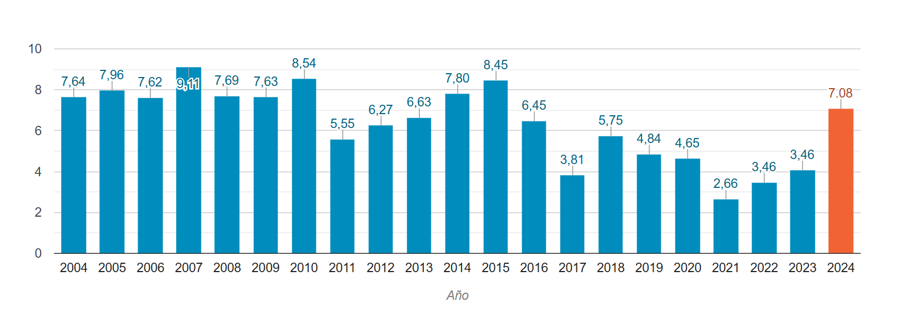


### 1.2.2. Lean UX Process

#### 1.2.2.1. Lean UX Problem Statements

El propósito de StockWise es proporcionar un sistema intuitiva y accesible para que empresas pequeñas y medianas, startups y bodegas especializadas puedan gestionar su inventario de forma eficiente, digitalizada y sin complicaciones técnicas ni altos costos.

Actualmente, pequeñas y medianas empresas, startups y bodegas especializadas dependen de métodos manuales como hojas de cálculo o registros en papel para gestionar su inventario. Esta forma de trabajo genera errores frecuentes en los registros, desactualización en tiempo real, pérdida de productos, sobrecompras innecesarias, falta de trazabilidad y una gestión logística ineficiente. Según NetSuite (2024), la precisión promedio del inventario en este tipo de negocios es solo del 83%, lo que impacta directamente en los costos operativos, la satisfacción del cliente y la rentabilidad general. A medida que estas empresas escalan, el desorden operativo se vuelve insostenible, reduciendo su capacidad de respuesta ante la demanda y su competitividad en el mercado.

Por lo tanto, surge la necesidad de diseñar una aplicación de gestión de inventarios que sea simple, funcional y adaptable, capaz de ofrecer control exacto del stock en tiempo real, reducción de errores humanos, mejora de la trazabilidad, alertas inteligentes y reportes analíticos que respalden la toma de decisiones. Frente a este escenario, la pregunta clave que guía el desarrollo de StockWise es: ¿cómo lograr que las bodegas y almacenes adopten un sistema automatizado que elimine los procesos manuales, reduzca errores y mejore la eficiencia operativa sin limitar el crecimiento del negocio?

#### 1.2.2.2. Lean UX Assumptions

**Business Assumptions:**

1. Creemos que los negocios emergentes necesitan digitalizar su gestión de inventarios a través de una solución móvil accesible.

2. Estas necesidades se pueden satisfacer con una aplicación móvil intuitiva, escalable y de bajo costo.

3. Nuestros clientes iniciales serán emprendedores, startups y pequeñas empresas con bodegas especializadas que operan de manera ágil.

4. El principal valor que busca el cliente es tener control y visibilidad total de su inventario en tiempo real, desde cualquier lugar.

5. El cliente obtendrá además alertas inteligentes, reportes automáticos, generación de boletas de venta y una experiencia de usuario móvil optimizada.

6. Adquiriremos la mayoría de nuestros clientes mediante publicidad en redes sociales dirigida, ASO (Optimización de la App Store) y asociaciones con comunidades de emprendedores.

7. Nuestro modelo de ingresos se basará en un esquema freemium dentro de la app, con upgrade a planes premium que desbloqueen funcionalidades avanzadas.

8. Nuestra competencia directa e indirecta incluye aplicaciones genéricas como hojas de cálculo móviles (Excel, Sheets), recordatorios básicos (Calendar) y ERPs complejos con apps móviles poco intuitivas.

9. Nuestra ventaja competitiva radicará en la simplicidad móvil, el enfoque específico en las pymes y la especialización en la gestión de inventarios sobre la marcha.

10. El mayor riesgo para el negocio es una baja tasa de adopción o la percepción de que la app es compleja o redundante frente a métodos manuales.

11. Mitigaremos este riesgo realizando pruebas de usabilidad móvil con usuarios reales, iteraciones rápidas basadas en feedback y una estrategia de onboarding dentro de la app que guíe al usuario paso a paso.

**User Assumptions:**</br>

- **¿Quién es el usuario?** Dueños de negocios, encargados de bodegas o logística en pymes/startups que necesitan gestionar inventarios de forma remota.
- **¿Qué problemas busca resolver nuestro producto?** La falta de control inmediato del stock, los errores por registros manuales en papel, los sobrecostos por pérdidas y las ventas fallidas debido a quiebres de stock inesperados.

- **¿Qué características son importantes?** Un registro rápido de productos (por voz, cámara o manual), un historial de movimientos accesible, alertas push personalizables, reportes visuales simplificados y la generación de boletas de venta directamente desde el dispositivo móvil.

- **¿Dónde encaja nuestro producto en su trabajo?** Se integra en su flujo de trabajo diario para la gestión del inventario en la bodega, en el punto de venta o durante las rondas de reposición, permitiendo decisiones informadas desde cualquier lugar.

- **¿Cuándo y cómo es usado nuestro producto?** Se utiliza de manera frecuente a lo largo del día, directamente desde sus teléfonos inteligentes, para registrar entradas/salidas al momento, consultar niveles de stock en tiempo real y generar comprobantes al instante.

- **¿Cómo debe verse y comportarse?** Debe tener una interfaz de usuario (UI) móvil limpia, simple y con navegación táctil intuitiva. Debe ser rápida, responsiva y funcionar sin conexión para casos de uso críticos.

**Feature Assumptions:**

Creemos que la aplicación móvil debe contar con una interfaz táctil intuitiva y diseños adaptados a dispositivos móviles que permitan a emprendedores y administradores adoptarla sin dificultad, minimizando la curva de aprendizaje.

Creemos que la app debe proporcionar notificaciones push y alertas personalizables (por stock bajo, fechas de vencimiento o pedidos de proveedores) que mantendrán a los usuarios informados de manera proactiva para prevenir errores operativos.

Creemos que el sistema debe incluir un módulo de reportes y dashboards visuales optimizados para móvil que permitan visualizar de un vistazo métricas clave (productos más vendidos, niveles de stock, tendencias), facilitando la toma de decisiones ágiles.

#### 1.2.2.3. Lean UX Hypothesis Statements

**Hipótesis 1:** Creemos que las alertas inteligentes push resolverán el problema de pérdidas económicas por quiebres de stock inesperados que enfrentan las pymes.  
Sabremos que es cierto  
Cuando al menos el 80% de los usuarios activos reporten una reducción del 25% en pérdidas por productos agotados y mejoren su planificación de reabastecimiento en encuestas trimestrales.

**Hipótesis 2:** Creemos que los reportes visuales móviles resolverán la falta de visibilidad sobre el rendimiento del inventario que impide a los emprendedores tomar decisiones estratégicas basadas en datos.  
Sabremos que es cierto  
Cuando el 70% de los usuarios utilicen los reportes semanalmente y reporten una mejora del 30% en sus decisiones de compra y gestión de stock.

**Hipótesis 3:** Creemos que el modelo freemium resolverá la barrera económica que impide a pequeños negocios acceder a herramientas profesionales de gestión de inventarios.  
Sabremos que es cierto  
Cuando logremos una adopción del 15% de usuarios gratuitos que conviertan a premium en 60 días, demostrando el valor percibido de la solución.

**Hipótesis 4:** Creemos que las alertas automatizadas por stock bajo resolverán el problema de sobrecostos operativos causados por el monitoreo manual del inventario.  
Sabremos que tenemos razón  
Cuando los usuarios reduzcan en 40% el tiempo dedicado a control manual de stock y eliminen el 90% de los quiebres de inventario críticos.

**Hipótesis 5:** Creemos que la generación digital de boletas de venta resolverá los errores de facturación y la desorganización financiera que afecta el flujo de caja de las pymes.  
Sabremos que tenemos razón  
Cuando los usuarios reporten una reducción del 50% en errores de facturación y mejoren en 35% la precisión de su control de ingresos diarios.

#### 1.2.2.4. Lean UX Canvas

 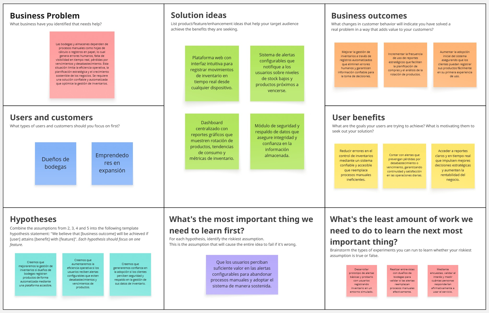

_Imagen (N°1). Elaboración propia. Realizado en Canva_

<div style="page-break-after: always;"></div>

## 1.3. Segmentos objetivo

**Segmento 1: Dueños de bodegas**

**Aspectos demográficos:**

- Sexo: Femenino, Masculino
- Edades: 20 a 60 años
- Nivel socioeconómico: Clases B y C
- Aspectos geográficos:
- Nacionalidad: Peruana
- Zona geográfica: Urbana
- Departamento: Lima Metropolitana y otras ciudades con fuerte actividad comercial

**Aspectos psicográficos:**

- Dirigen negocios mayoristas o minoristas que gestionan inventario con productos variados en tallas, colores, fechas de vencimiento o dimensiones técnicas.
- Enfrentan desafíos como alta rotación de productos, pérdidas por desorden o falta de trazabilidad y decisiones poco informadas de compra.
- Buscan soluciones para profesionalizar su operación, evitar errores y mantener el control del stock.
- Valoran herramientas tecnológicas, que les permite ordenar su inventario, recibir alertas según el tipo de producto y tomar decisiones basadas en reportes visuales y detallados

**Segmento 2: Startups y emprendedores en expansión con necesidades logísticas**

**Aspectos demográficos:**

- Sexo: Masculino
- Edades: 22 a 45 años
- Nivel socioeconómico: Clases B y C
- Aspectos geográficos:
- Nacionalidad: Peruana
- Zona geográfica: Urbana
- Departamento: Lima Metropolitana y otras ciudades con fuerte actividad comercial

**Aspectos psicográficos:**

- Están en una etapa de crecimiento empresarial y buscan escalar su operación de manera eficiente.
- Tienen una mentalidad emprendedora y están dispuestos a invertir en herramientas que optimicen su logística.
- Reconocen que el desorden en su inventario afecta su productividad y atención al cliente.
- Valoran las soluciones tecnológicas que profesionalicen su negocio y les permitan competir a mayor escala.

Además de definir los segmentos por criterios psicográficos, hemos incorporado datos demográficos concretos para fundamentar mejor la selección de segmentos y mejorar las estrategias de mercado hacia los usuarios reales de nuestra app.

# Capitulo II: Requirements Elicitation & Analysis

## 2.1. Competidores

### 2.1.1. Analisis competitivo

<table border="1" cellspacing="0" cellpadding="6">
  <tr>
    <th colspan="5">
      <b>Objetivo del análisis:</b> Identificar el posicionamiento competitivo de StockWise en el mercado de plataformas digitales de gestión de inventarios para pymes, entendiendo sus ventajas diferenciales y oportunidades de mejora.
    </th>
  </tr>
  <tr>
    <th></th>
    <th>StockWise </th>
    <th>Zoho Inventory 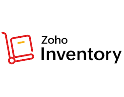</th>
    <th>Odoo Inventory 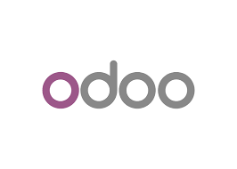</th>
    <th>TradeGecko </th>
  </tr>
  <tr>
    <th colspan="5"><b>PERFIL</b></th>
  </tr>
  <tr>
    <td><b>Overview</b></td>
    <td>Solución digital integral de gestión de inventarios para pymes y emprendedores, accesible desde cualquier dispositivo</td>
    <td>Suite de negocio completa con módulo de inventario como parte de su ecosistema</td>
    <td>Software de gestión open-source con módulo de inventario personalizable</td>
    <td>Plataforma de gestión de inventario centrada en comercio electrónico y retail</td>
  </tr>
  <tr>
    <td><b>Ventaja competitiva</b></td>
    <td>Accesibilidad multidispositivo, interfaz intuitiva, planes funcionales específicos (GPS, QR, IA y escaneo por cámara) y enfoque en pymes</td>
    <td>Integración completa con ecosistema Zoho y terceros, robustez funcional</td>
    <td>Flexibilidad y personalización por ser open-source</td>
    <td>Fuerte integración con canales de e-commerce y plataformas de venta</td>
  </tr>
  <tr>
    <th colspan="5"><b>PERFIL DE MARKETING</b></th>
  </tr>
  <tr>
    <td><b>Mercado objetivo</b></td>
    <td>Pymes, emprendedores, startups y bodegas especializadas</td>
    <td>Medianas empresas y pymes en crecimiento</td>
    <td>Empresas de todos los tamaños que buscan personalización</td>
    <td>Negocios de e-commerce y retail</td>
  </tr>
  <tr>
    <td><b>Estrategias de marketing</b></td>
    <td>Marketing digital, SEO, comunidades de emprendedores, modelo freemium</td>
    <td>Marketing B2B, fuerza de ventas, contenido educativo</td>
    <td>Comunidad open-source, partners de implementación</td>
    <td>Marketing especializado en e-commerce, ferias sectoriales</td>
  </tr>
  <tr>
    <th colspan="5"><b>PERFIL DE PRODUCTO</b></th>
  </tr>
  <tr>
    <td><b>Productos & Servicios</b></td>
    <td>Plataforma web responsive con gestión de inventario, alertas, reportes, boletas y planes avanzados con GPS, QR, predicción inteligente y escaneo por cámara</td>
    <td>Software web y móvil con inventario, órdenes de venta, envíos y facturación</td>
    <td>Suite modular web/móvil con inventario, manufactura, ventas y CRM</td>
    <td>Plataforma web/móvil con inventario, pedidos, logística y analítica</td>
  </tr>
  <tr>
    <td><b>Precios & Costos</b></td>
    <td>Modelo freemium con planes premium escalables por funcionalidad</td>
    <td>Planes por volumen de órdenes, desde gratis hasta enterprise</td>
    <td>Freemium modular, costos de implementación y personalización</td>
    <td>Planes premium por volumen de ventas y usuarios</td>
  </tr>
  <tr>
    <td><b>Canales de distribución</b></td>
    <td>Web responsive accesible desde laptop, tablet o celular</td>
    <td>Web y móvil (iOS/Android)</td>
    <td>Web y móvil (iOS/Android)</td>
    <td>Web y móvil (iOS/Android)</td>
  </tr>
  <tr>
    <th colspan="5"><b>Análisis SWOT</b></th>
  </tr>
  <tr>
    <td><b>Fortalezas</b></td>
    <td>- Accesibilidad desde cualquier dispositivo<br>- Interfaz intuitiva<br>- Funcionalidades innovadoras (GPS, QR, IA y escaneo por cámara)<br>- Enfoque específico en pymes</td>
    <td>- Ecosistema integrado<br>- Solución completa<br>- Reconocimiento de marca<br>- Escalabilidad</td>
    <td>- Flexibilidad y personalización<br>- Comunidad activa<br>- Modelo open-source<br>- Múltiples módulos integrados</td>
    <td>- Especialización en e-commerce<br>- Integraciones con plataformas de venta<br>- Analytics avanzado</td>
  </tr>
  <tr>
    <td><b>Debilidades</b></td>
    <td>- Marca desconocida<br>- Ecosistema limitado vs competidores<br>- Recursos limitados vs grandes competidores</td>
    <td>- Curva de aprendizaje más pronunciada<br>- Puede ser complejo para pymes muy pequeñas<br>- Costo elevado para planes avanzados</td>
    <td>- Requiere personalización para funcionar óptimamente<br>- Soporte puede ser limitado en versión community</td>
    <td>- Enfoque muy específico en e-commerce<br>- Menos adaptable a otros modelos de negocio<br>- Precios elevados</td>
  </tr>
  <tr>
    <td><b>Oportunidades</b></td>
    <td>- Crecimiento del mercado de pymes digitales<br>- Tendencia hacia soluciones accesibles desde cualquier dispositivo<br>- Expansión a Latinoamérica<br>- Alianzas con comunidades de emprendedores</td>
    <td>- Expansión a nuevos mercados<br>- Desarrollo de más integraciones<br>- Consolidación como suite integral</td>
    <td>- Crecimiento de la comunidad de desarrolladores<br>- Expansión de funcionalidades multidispositivo<br>- Alianzas con implementadores</td>
    <td>- Crecimiento del e-commerce global<br>- Expansión a nuevos verticales de retail<br>- Desarrollo de analytics predictivo</td>
  </tr>
  <tr>
    <td><b>Amenazas</b></td>
    <td>- Entrada de competidores establecidos al mercado de soluciones digitales para inventarios<br>- Commoditización de funcionalidades básicas<br>- Dificultad para captar usuarios frente a alternativas gratuitas</td>
    <td>- Competencia de soluciones más especializadas<br>- Precios más competitivos de alternativas<br>- Cambios en regulaciones internacionales</td>
    <td>- Fragmentación de la comunidad<br>- Calidad variable de implementaciones<br>- Competencia de soluciones SaaS más pulidas</td>
    <td>- Competencia de plataformas de e-commerce con módulos nativos<br>- Cambios en APIs de plataformas de venta<br>- Consolidación del mercado</td>
  </tr>
</table>


### 2.1.2. Estrategias y tacticas frente a competidores

#### Estrategias Generales de Posicionamiento

**1. Especialización en experiencia multidispositivo**

**Objetivo:** Diferenciarnos como una solución digital intuitiva, accesible desde cualquier dispositivo y adaptada a la operación diaria de las pymes.

**Tácticas:**

- Desarrollar funcionalidades avanzadas como GPS, ubicación por QR, predicción inteligente y escaneo por cámara.
- Optimizar la interfaz para laptop, tablet y celular, manteniendo una navegación clara y rápida.
- Garantizar funcionamiento offline para operaciones críticas.
- Implementar notificaciones contextuales y personalizables para alertas de stock, vencimientos y movimientos.

**2. Enfoque en usabilidad para PYMES**

**Objetivo:** Ofrecer la curva de aprendizaje más corta del mercado.

**Tácticas:**

- Crear un sistema de onboarding guiado dentro de la plataforma.
- Desarrollar tutoriales interactivos por funcionalidad.
- Implementar asistente inteligente para tareas complejas.
- Diseñar plantillas preconfiguradas por tipo de negocio.

#### Estrategias Ofensivas frente a Competidores

**1. Contra Zoho Inventory**

**Debilidad a explotar:** Complejidad para PYMES pequeñas.

**Tácticas:**

- Campañas comparativas destacando simplicidad frente a complejidad.
- Programa de migración asistida desde Zoho.
- Planes de precio más competitivos para el segmento pequeño-mediano.
- Funcionalidades “justo lo necesario” sin sobrecarga de opciones.

**2. Contra Odoo Inventory**

**Debilidad a explotar:** Requiere personalización e implementación.

**Tácticas:**

- Mensajería centrada en “funciona desde el día 1”.
- Precios transparentes sin costos ocultos de implementación.
- Casos de éxito de implementación en menos de 24 horas.
- Servicio de configuración inicial incluido en planes premium.

**3. Contra TradeGecko**

**Debilidad a explotar:** Enfoque limitado a e-commerce.

**Tácticas:**

- Posicionamiento como solución multicanal integral.
- Funcionalidades para negocios físicos y digitales.
- Campañas dirigidas a retail tradicional con interés en digitalizarse.
- Precios más accesibles para negocios mixtos.

#### Estrategias Defensivas

**1. Ante posible commoditización**

**Tácticas:**

- Desarrollo continuo de funcionalidades innovadoras como GPS, QR, predicción inteligente y escaneo por lotes.
- Programa de fidelización con beneficios escalables.
- Integraciones exclusivas con proveedores locales.
- Comunidad de usuarios para feedback y co-creación.

**2. Protección frente a entrada de grandes competidores**

**Tácticas:**

- Alianzas estratégicas con asociaciones de PYMES.
- Contratos a largo plazo con precios congelados.
- Desarrollo de especialización vertical por industria.
- Branding fuerte centrado en el enfoque PYME.


## 2.2. Entrevistas

### 2.2.1. Diseno de entrevistas

La finalidad de realizar entrevistas es obtener un alcance más completo sobre las experiencias, perspectivas y opiniones de los segmentos de mercado definidos. Nuestro objetivo es recolectar información valiosa que nos permita conocer mejor a nuestro público objetivo. Con estas entrevistas se tendrá una visión más clara de las necesidades y expectativas de nuestros usuarios.

### 2.2.1. Diseño de entrevistas

**Segmento #1: Bodegas especializadas por rubro**

**Preguntas principales**

1. ¿Podrías contarme cómo gestionas actualmente el inventario de tu bodega?
2. ¿Cuáles son los mayores retos que enfrentas al momento de organizar tus productos?
3. ¿Has tenido pérdidas o problemas por errores en el inventario? ¿Cómo los resolviste?
4. ¿Qué tan importante es para ti tener un control en tiempo real de tu stock?
5. ¿Utilizas algún sistema o herramienta digital? ¿Cuál y cómo te va con ella?

**Preguntas complementarias**

1. ¿Cómo te enteras cuando falta un producto o está a punto de vencerse?
2. ¿Qué tipo de reportes o información te gustaría tener sobre tu inventario?
3. ¿Qué dispositivos usas más en tu trabajo, como laptop, celular o tablet?
4. ¿Cómo crees que una plataforma digital podría ayudarte a mejorar tu operación?

**Segmento #2: Startups y emprendedores en expansión con necesidades logísticas**

**Preguntas principales**

1. ¿Cómo manejas actualmente el inventario de tu negocio?
2. ¿En qué momentos has sentido que el control del stock te limita o te hace perder tiempo?
3. ¿Cómo llevas el registro de entradas y salidas de productos?
4. ¿Qué te gustaría mejorar de tu proceso logístico actual?
5. ¿Has considerado usar alguna plataforma para gestionar tu inventario? ¿Por qué sí o por qué no?

**Preguntas complementarias**

1. ¿Qué herramientas digitales usas en tu negocio actualmente?
2. ¿Dónde almacenas tus productos?
3. ¿Qué tan seguido necesitas revisar el stock?
4. ¿Qué redes sociales o canales digitales usas para vender?


### 2.2.2. Registro de entrevistas

**Segmento 1: Bodegas especializadas por rubro**

<table border="1">
  <tr>
    <th>Entrevista</th>
    <td>1</td>
    <th>Nombre</th>
    <td>Marcelo Binda</td>
  </tr>
  <tr>
    <th>Edad</th>
    <td>26</td>
    <th>Distrito</th>
    <td>San Borja</td>
  </tr>
  <tr>
    <th>Captura de la entrevista: </th>
    <td colspan="3">
      En la entrevista, Marcelo Binda comenta que gestiona el inventario de su bodega de forma manual, usando un cuaderno y, en algunos casos, Excel. Señala que su principal dificultad es mantener el stock actualizado, controlar los productos próximos a vencer y saber qué mercadería debe reponer. También menciona que ha tenido pérdidas por productos vencidos o por pensar que tenía stock cuando ya se había agotado. Actualmente realiza conteos manuales y organiza los productos por fecha de vencimiento. Considera importante contar con una plataforma digital que le permita registrar entradas y salidas, recibir alertas de bajo stock o vencimiento y acceder a reportes sobre ventas, ganancias y movimientos del negocio.
    </td>
  </tr>
  <tr>
    <th>URL de la grabación</th>
    <td colspan="3">
      <a href="https://youtu.be/BDUiVJaxxLY">
        Ver grabación
      </a>
    </td>
  </tr>
  <tr>
    <th>Timing</th>
    <td colspan="3">00:00 - 5:11</td>
  </tr>
</table>

<br>

<table border="1">
  <tr>
    <th>Entrevista</th>
    <td>2</td>
    <th>Nombre</th>
    <td>Elvis Aranga Mesa</td>
  </tr>
  <tr>
    <th>Edad</th>
    <td>31</td>
    <th>Distrito</th>
    <td>Santiago de Surco</td>
  </tr>
  <tr>
    <th>Captura de la entrevista: </th>
    <td colspan="3">
      Elvis Aranga Meza, encargado de un mini market en Surco, compartió su experiencia utilizando la plataforma StockWise para la gestión de bodegas, destacando la facilidad de uso tanto para agregar productos como para navegar por las funciones principales, y calificando su utilidad con un 9 sobre 10. Consideró el diseño visual adecuado y sencillo, aunque sugirió optimizar la interfaz para pantallas pequeñas y otros dispositivos. Resaltó la utilidad de funciones como la visualización de fechas de vencimiento para evitar mermas y la organización de productos por lote, lo cual facilita la gestión de promociones. Sugirió incorporar reportes y estadísticas que permitan proyectar ventas y establecer metas. Finalmente, recomendó la plataforma a otros bodegueros, especialmente por su precio y utilidad, aunque señaló la importancia de brindar asistencia a usuarios con menos experiencia tecnológica.
    </td>
  </tr>
  <tr>
    <th>URL de la grabación</th>
    <td colspan="3">
      <a href="https://upcedupe-my.sharepoint.com/:v:/g/personal/u20221g068_upc_edu_pe/EfICOj-xe6REtnBdqmvY7QsB40AX08yJQHh4VQP5k9XQUA?nav=eyJyZWZlcnJhbEluZm8iOnsicmVmZXJyYWxBcHAiOiJPbmVEcml2ZUZvckJ1c2luZXNzIiwicmVmZXJyYWxBcHBQbGF0Zm9ybSI6IldlYiIsInJlZmVycmFsTW9kZSI6InZpZXciLCJyZWZlcnJhbFZpZXciOiJNeUZpbGVzTGlua0NvcHkifX0&e=SCUtfJ">
        Ver grabación
      </a>
    </td>
  </tr>
  <tr>
    <th>Timing</th>
    <td colspan="3">5:48 - 11:47</td>
  </tr>
</table>

<br>

<table border="1">
  <tr>
    <th>Entrevista</th>
    <td>3</td>
    <th>Nombre</th>
    <td>Catalina Villa Guerra</td>
  </tr>
  <tr>
    <th>Edad</th>
    <td>28</td>
    <th>Distrito</th>
    <td>Breña</td>
  </tr>
  <tr>
    <th>Captura de la entrevista: </th>
    <td colspan="3">
      Catalina es una administradora de 28 años, encargada de gestionar una bodega familiar en el distrito de Breña. Ella menciona que las funciones que más le gustaron fueron la de alerta de productos próximos a vencer y la de control de stock, ya que considera que le ayudarían a evitar pérdidas por productos caducados y a mantener un mejor seguimiento de sus existencias. Sin embargo, percibe que estas funciones aún son básicas y podrían ofrecer opciones más avanzadas, como recordatorios personalizados o reportes automáticos. En cuanto a la interfaz, a Catalina le agradó el diseño sencillo y organizado, destacando que los botones son fáciles de identificar y las categorías están bien distribuidas. También comentó que la plataforma le resultaría útil para delegar mejor el control del inventario entre los miembros de su familia, facilitando así la administración general de la bodega.
    </td>
  </tr>
  <tr>
    <th>URL de la grabación</th>
    <td colspan="3">
      <a href="https://upcedupe-my.sharepoint.com/:v:/g/personal/u20221g068_upc_edu_pe/EfICOj-xe6REtnBdqmvY7QsB40AX08yJQHh4VQP5k9XQUA?nav=eyJyZWZlcnJhbEluZm8iOnsicmVmZXJyYWxBcHAiOiJPbmVEcml2ZUZvckJ1c2luZXNzIiwicmVmZXJyYWxBcHBQbGF0Zm9ybSI6IldlYiIsInJlZmVycmFsTW9kZSI6InZpZXciLCJyZWZlcnJhbFZpZXciOiJNeUZpbGVzTGlua0NvcHkifX0&e=SCUtfJ">
        Ver grabación
      </a>
    </td>
  </tr>
  <tr>
    <th>Timing</th>
    <td colspan="3">11:48 - 21:31</td>
  </tr>
</table>

<br>

**Segmento 2: Startups y emprendedores en expansión con necesidades logísticas**

<table border="1">
  <tr>
    <th>Entrevista</th>
    <td>4</td>
    <th>Nombre</th>
    <td>Juan Carlos Ramírez</td>
  </tr>
  <tr>
    <th>Edad</th>
    <td>49</td>
    <th>Distrito</th>
    <td>Surquillo</td>
  </tr>
  <tr>
    <th>Captura de la entrevista: </th>
    <td colspan="3">
      Juan Carlos Ramírez, emprendedor de 49 años, compartió su experiencia al utilizar la plataforma para la gestión de inventarios, destacando la facilidad de uso en el registro y control de productos, así como la organización del historial de movimientos. Consideró que estas herramientas podrían ayudarlo significativamente en su proceso de digitalización, ya que actualmente gestiona las entradas y salidas de manera manual mediante boletas y facturas físicas. En cuanto al diseño, señaló que la interfaz es clara y ordenada, aunque sugirió mejorar la personalización de reportes para adaptarlo mejor a las necesidades de su negocio. Finalmente, destacó que funcionalidades como la alerta de stock bajo y la gestión por lotes serían de gran apoyo para tener un control más preciso del inventario, y que la incorporación de estas herramientas digitales le permitiría automatizar procesos y liberar tiempo operativo en su gestión diaria.
    </td>
  </tr>
  <tr>
    <th>URL de la grabación</th>
    <td colspan="3">
      <a href="https://upcedupe-my.sharepoint.com/:v:/g/personal/u20221g068_upc_edu_pe/EfICOj-xe6REtnBdqmvY7QsB40AX08yJQHh4VQP5k9XQUA?nav=eyJyZWZlcnJhbEluZm8iOnsicmVmZXJyYWxBcHAiOiJPbmVEcml2ZUZvckJ1c2luZXNzIiwicmVmZXJyYWxBcHBQbGF0Zm9ybSI6IldlYiIsInJlZmVycmFsTW9kZSI6InZpZXciLCJyZWZlcnJhbFZpZXciOiJNeUZpbGVzTGlua0NvcHkifX0&e=SCUtfJ">
        Ver grabación
      </a>
    </td>
  </tr>
  <tr>
    <th>Timing</th>
    <td colspan="3">21:31 - 25:14</td>
  </tr>
</table>

<br>

<table border="1">
  <tr>
    <th>Entrevista</th>
    <td>5</td>
    <th>Nombre</th>
    <td>Leonardo Gamboa</td>
  </tr>
  <tr>
    <th>Edad</th>
    <td>26</td>
    <th>Distrito</th>
    <td>San Miguel</td>
  </tr>
  <tr>
    <th>Captura de la entrevista: </th>
    <td colspan="3">
      Leonardo G., emprendedor que maneja actualmente su inventario de manera manual con hojas de Excel y una libreta, probó la plataforma y comentó que le pareció intuitiva, útil y eficaz para el control de su negocio. Señaló que la sección de alertas de stock le resultó especialmente atractiva, ya que le permitiría evitar ventas de productos agotados y responder más rápido a la demanda constante que maneja. En cuanto al diseño, mencionó que la interfaz es clara y sencilla, con botones fáciles de identificar y una navegación fluida. Leonardo destacó que la herramienta podría ayudarlo a organizar mejor sus pedidos y actualizar su inventario sin esfuerzo, reemplazando las hojas manuales que utiliza actualmente. También valoró que la plataforma sea accesible y de fácil uso, algo clave para quienes aún no están acostumbrados a los sistemas digitales, pero buscan dar ese paso hacia la automatización de su negocio.
    </td>
  </tr>
  <tr>
    <th>URL de la grabación</th>
    <td colspan="3">
      <a href="">
        Ver grabación
      </a>
    </td>
  </tr>
  <tr>
    <th>Timing</th>
    <td colspan="3">25:14 - 29:36</td>
  </tr>
</table>

<br>

<table border="1">
  <tr>
    <th>Entrevista</th>
    <td>6</td>
    <th>Nombre</th>
    <td>Smith Morales Quispe</td>
  </tr>
  <tr>
    <th>Edad</th>
    <td>22</td>
    <th>Distrito</th>
    <td>Surco-Lima</td>
  </tr>
  <tr>
    <th>Captura de la entrevista: </th>
    <td colspan="3">
      Un propietario de una ferretería comentó que la propuesta del proyecto le resultó muy interesante y especialmente útil para negocios que manejan una gran variedad de productos y herramientas. Durante la prueba, destacó la facilidad de uso de la plataforma y la organización del panel principal, sobre todo en el registro de productos y el control del inventario. Mencionó que actualmente administra todo su inventario utilizando Excel, por lo que considera que la plataforma podría simplificar y centralizar el control de stock, pedidos y movimientos en un solo sistema digital. También valoró la función de alertas de stock bajo y el historial de movimientos, ya que le permitirían tener un mejor control de sus existencias, evitar faltantes y reducir errores humanos en la actualización de datos. Respecto al diseño visual, señaló que la landing page le pareció moderna, atractiva y profesional, transmitiendo confianza desde el primer momento. Como sugerencia de mejora, indicó que las opciones de exportación de datos a Excel o PDF podrían ofrecer formatos más personalizables según las necesidades del negocio.
    </td>
  </tr>
  <tr>
    <th>URL de la grabación</th>
    <td colspan="3">
      <a href="https://drive.google.com/file/d/1CU0BlBX412Uo9P1yHLja47PFH4_acMIu/view?usp=sharing">
        Ver grabación
      </a>
    </td>
  </tr>
  <tr>
    <th>Timing</th>
    <td colspan="3">29:36 - 33:36</td>
  </tr>
</table>


### 2.2.3. Analisis de entrevistas

**Segmento 1: Bodegas especializadas por rubro**

Los entrevistados (Milagros, Elvis, Catalina) gestionan inventarios de forma manual, con cuadernos o Excel, lo que dificulta mantener la información precisa y actualizada. Cuando los datos llegan tarde, los productos se vencen sin que nadie lo note y se pierden ventas; además, los cambios de precio no quedan registrados. El problema no es falta de interés por la tecnología, sino que registrar toma tiempo mientras atienden a clientes. Para este grupo, la solución debe reducir pasos: registro rápido desde cualquier dispositivo, duplicado de fichas o carga de varios productos a la vez, una pantalla que muestre “lo que vence pronto” con avisos simples y la ubicación por estantería para encontrar productos sin perder minutos. Con ello deberían bajar las pérdidas, reducir el tiempo de registro y aumentar la confianza en el sistema.

Además de los aspectos técnicos, los entrevistados expresan frustración por el desorden y la pérdida de productos, pero también muestran disposición a adoptar soluciones simples que les permitan sentir mayor control y tranquilidad en la gestión diaria.

<table border="1" cellpadding="6" cellspacing="0" style="border-collapse:collapse; width:100%; font-family: Arial, sans-serif; font-size: 13px;">
  <thead style="background:#f2f2f2;">
    <tr>
      <th style="text-align:left;">Característica</th>
      <th style="text-align:center;">Frecuencia (n/3)</th>
      <th style="text-align:center;">Porcentaje</th>
      <th style="text-align:left;">Entrevistas relacionadas</th>
    </tr>
  </thead>
  <tbody>
    <tr>
      <td>Control manual del inventario (cuaderno/Excel)</td>
      <td style="text-align:center;">3/3</td>
      <td style="text-align:center;"><strong>100%</strong></td>
      <td>1(Milagros), 2(Elvis), 3(Catalina)</td>
    </tr>
    <tr>
      <td>Pérdidas por productos vencidos / falta de alertas</td>
      <td style="text-align:center;">3/3</td>
      <td style="text-align:center;"><strong>100%</strong></td>
      <td>1, 2, 3</td>
    </tr>
    <tr>
      <td>Precios desactualizados o cambios no registrados</td>
      <td style="text-align:center;">2/3</td>
      <td style="text-align:center;">67%</td>
      <td>1, 2</td>
    </tr>
    <tr>
      <td>Falta de tiempo por atención a clientes (se omiten registros)</td>
      <td style="text-align:center;">2/3</td>
      <td style="text-align:center;">67%</td>
      <td>1, 3</td>
    </tr>
    <tr>
      <td>Preferencia por solución simple y rápida (alertas de vencimiento, registro ágil)</td>
      <td style="text-align:center;">3/3</td>
      <td style="text-align:center;"><strong>100%</strong></td>
      <td>1, 2, 3</td>
    </tr>
    <tr>
      <td>Necesidad de ubicar productos por estantería/sector</td>
      <td style="text-align:center;">2/3</td>
      <td style="text-align:center;">67%</td>
      <td>1, 3</td>
    </tr>
  </tbody>
</table>

**Segmento 2: Startups y emprendedores en expansión con necesidades logísticas**

Los entrevistados Juan Carlos, Leonardo y Eduardo manejan inventarios mayormente manuales o semiautomatizados mediante Excel, cuadernos y sistemas en transición. El reto principal es coordinar más volumen y varios canales, como WhatsApp y redes sociales. Muchas salidas no quedan en un solo registro y preparar pedidos demora porque no se ubican los productos con precisión. Además, varias personas pueden cambiar precios o cantidades, pero no siempre queda claro quién realizó cada modificación. Necesitan orden sin un sistema pesado: roles y permisos con historial para saber quién hizo cada cambio, zonas y códigos QR para acelerar el picking, combos que resten insumos automáticamente y reportes simples por canal para ver qué se mueve más. Así pueden crecer sin perder control.

Pese a estas limitaciones operativas, en este grupo se percibe una actitud proactiva y de mejora continua: buscan herramientas que reflejen su crecimiento y les brinden seguridad al delegar tareas, evidenciando motivación por alcanzar mayor eficiencia y profesionalización.

<table border="1" cellpadding="6" cellspacing="0" style="border-collapse:collapse; width:100%; font-family: Arial, sans-serif; font-size: 13px;">
  <thead style="background:#f2f2f2;">
    <tr>
      <th style="text-align:left;">Característica</th>
      <th style="text-align:center;">Frecuencia (n/3)</th>
      <th style="text-align:center;">Porcentaje</th>
      <th style="text-align:left;">Entrevistas relacionadas</th>
    </tr>
  </thead>
  <tbody>
    <tr>
      <td>Gestión manual o semiautomatizada (Excel/cuadernos/sistema parcial)</td>
      <td style="text-align:center;">3/3</td>
      <td style="text-align:center;"><strong>100%</strong></td>
      <td>4(Juan Carlos), 5(Leonardo), 6(Eduardo)</td>
    </tr>
    <tr>
      <td>Ventas y coordinación por WhatsApp/redes sociales</td>
      <td style="text-align:center;">3/3</td>
      <td style="text-align:center;"><strong>100%</strong></td>
      <td>4, 5, 6</td>
    </tr>
    <tr>
      <td>Problemas para ubicar productos y preparar pedidos rápido</td>
      <td style="text-align:center;">2/3</td>
      <td style="text-align:center;">67%</td>
      <td>4, 5</td>
    </tr>
    <tr>
      <td>Falta de control centralizado / trazabilidad de cambios de precio y salidas</td>
      <td style="text-align:center;">2/3</td>
      <td style="text-align:center;">67%</td>
      <td>5, 6</td>
    </tr>
    <tr>
      <td>Interés en digitalizar para ganar eficiencia (sin sistemas pesados)</td>
      <td style="text-align:center;">3/3</td>
      <td style="text-align:center;"><strong>100%</strong></td>
      <td>4, 5, 6</td>
    </tr>
    <tr>
      <td>Necesidad de roles/permisos e historial de cambios</td>
      <td style="text-align:center;">2/3</td>
      <td style="text-align:center;">67%</td>
      <td>5, 6</td>
    </tr>
    <tr>
      <td>Reportes simples por canal y mayor visibilidad del stock</td>
      <td style="text-align:center;">2/3</td>
      <td style="text-align:center;">67%</td>
      <td>4, 5</td>
    </tr>
  </tbody>
</table>

Ambos segmentos comparten el manejo manual, los problemas con perecibles y la falta de visibilidad, por lo que requieren automatización. La diferencia es que las bodegas piden simplicidad inmediata, mientras que las startups necesitan además trazabilidad y velocidad. Por ello se propone empezar con un núcleo fácil de usar, basado en alertas de caducidad, registro rápido, ubicación clara y cambios de precio con historial. Luego, según la necesidad del negocio, se pueden activar funciones de escala como roles, QR, combos y reportes por canal. Si con esto bajan las mermas, disminuye el tiempo de registro y sube la exactitud del stock, la solución será escalable, intuitiva y eficiente, alineada con lo que se recogió en las entrevistas.


## 2.3. Needfinding

En el siguiente apartado, analizaremos a nuestros segmentos objetivos para identificar sus necesidades y, con base en ello, ofrecerles soluciones óptimas a sus problemas.


### 2.3.1. User Personas

**Segmento 1: Bodegas especializadas por rubro**


_Imagen (N°2). Elaboración propia. Realizado en UXPressia_

**Segmento 2: Startups y emprendedores en expansión con necesidades logísticas**

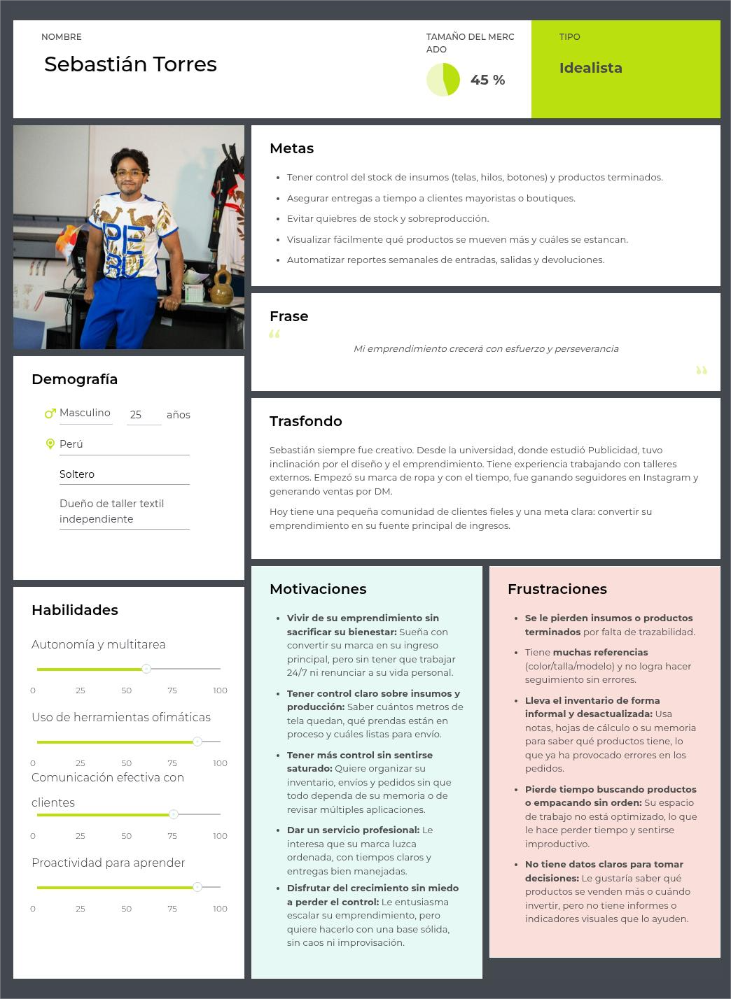

_Imagen (N°3). Elaboración propia. Realizado en UXPressia_

<br>
<br>
<br>

### 2.3.2. User Task Matrix

**Segmento 1: Bodegas especializadas por rubro**

| **Task Matrix**                                                   | **Frecuencia** | **Importancia** |
| ----------------------------------------------------------------- | -------------- | --------------- |
| Supervisar el stock y revisar niveles de inventario               | Alta           | Alta            |
| Realizar conteos físicos o auditorías manuales                    | Media          | Alta            |
| Negociar precios y coordinar con proveedores                      | Alta           | Alta            |
| Revisar reportes de ventas, rotación y márgenes                   | Media          | Alta            |
| Ingresar datos en Excel o sistemas básicos de control             | Media          | Media           |
| Delegar tareas a sus asistentes o empleados                       | Media          | Alta            |
| Atender clientes en tienda                                        | Alta           | Alta            |
| Coordinar pedidos con mayoristas o distribuidores                 | Alta           | Alta            |
| Capacitarse en nuevas herramientas digitales                      | Baja           | Media           |
| Resolver errores de inventario (_sobrestock_, productos vencidos) | Alta           | Alta            |
| Registrar productos rápidamente y confirmar datos                 | Media          | Alta            |
| Escanear lotes con cámara rápida y validar                        | Alta           | Alta            |
| Ubicar productos en almacén con QR/mapa                           | Alta           | Alta            |
| Revisar alertas de predicción de stock                            | Media          | Alta            |
| Visualizar sedes, entregas y procedencia en mapa (GPS)            | Baja           | Media           |

<br>

**Segmento 2: Startups y emprendedores en expansión con necesidades logísticas**

| **Task Matrix**                                                    | **Frecuencia** | **Importancia** |
| ------------------------------------------------------------------ | -------------- | --------------- |
| Supervisar la operación del negocio y el movimiento de productos   | Alta           | Alta            |
| Gestionar inventario de insumos y productos terminados             | Alta           | Alta            |
| Registrar entradas, salidas y devoluciones de productos            | Media          | Alta            |
| Coordinar pedidos con clientes o puntos de venta                   | Alta           | Alta            |
| Definir nuevos productos o adaptar la oferta según la demanda      | Alta           | Alta            |
| Publicar contenido y gestionar redes sociales                      | Alta           | Media           |
| Empaquetar productos y organizar despachos                         | Media          | Alta            |
| Analizar qué productos se venden más y qué insumos se usan más     | Media          | Alta            |
| Actualizar listas de precios, catálogos o colecciones              | Media          | Media           |
| Registrar ventas y organizar información contable o administrativa | Media          | Alta            |
| Aprender herramientas digitales para mejorar su operativa          | Media          | Alta            |
| Registrar insumos o productos desde cualquier dispositivo          | Alta           | Alta            |
| Registrar clientes y entregas con GPS                              | Alta           | Alta            |
| Analizar predicciones de ventas y reabastecimiento                 | Media          | Alta            |
| Escanear productos en lotes y asignar ubicación                    | Alta           | Alta            |
| Recibir alertas de sobrestock o quiebre                            | Media          | Alta            |

<br>

### 2.3.3. User Journey Mapping

**Segmento 1: Bodegas especializadas por rubro**

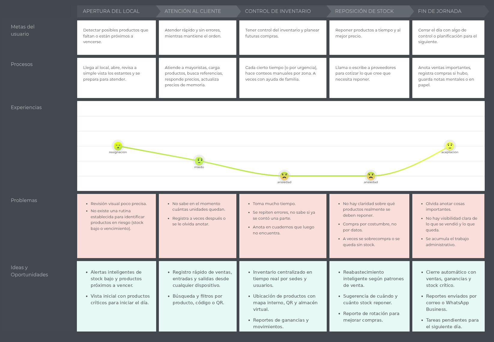

_Imagen (N°4). Elaboración propia. Realizado en UXPressia_

**Segmento 2: Startups y emprendedores en expansión con necesidades logísticas**


_Imagen (N°5). Elaboración propia. Realizado en UXPressia_

<br>
<br>

### 2.3.4. Empathy Mapping

**Segmento 1: Bodegas especializadas por rubro**


_Imagen (N°6). Elaboración propia. Realizado en UXPressia_

**Segmento 2: Startups y emprendedores en expansión con necesidades logísticas**

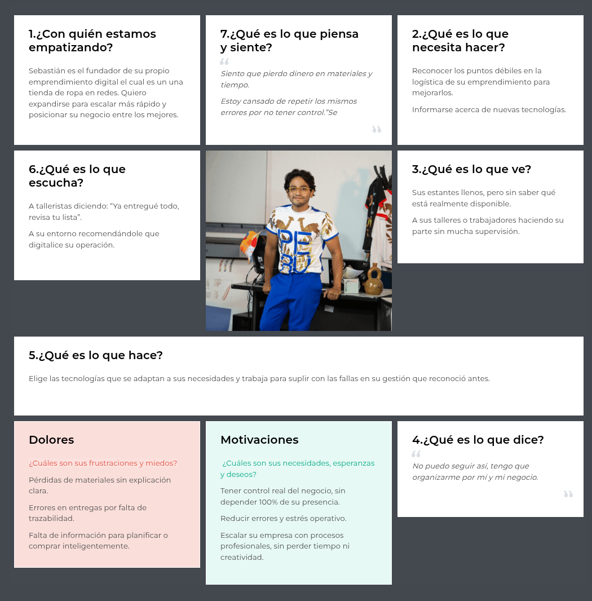

_Imagen (N°7). Elaboración propia. Realizado en UXPressia_

<br>
<br>


### 2.3.5. As-is Scenario Mapping

Esta sección describe cómo los usuarios realizan actualmente sus actividades antes de incorporar StockWise. El objetivo es identificar los puntos de fricción del proceso actual y evidenciar dónde la plataforma puede aportar mayor valor.

**Segmento 1: Bodegas especializadas por rubro**

| Etapa actual | Acción del usuario | Problema identificado | Oportunidad para StockWise |
| ------------ | ------------------ | --------------------- | -------------------------- |
| Registro de productos | Anota entradas y salidas en cuadernos, Excel o sistemas básicos. | La información puede quedar incompleta, duplicada o desactualizada. | Centralizar el registro de productos y movimientos desde una plataforma accesible desde cualquier dispositivo. |
| Control de stock | Revisa manualmente la cantidad disponible en estantes o almacén. | Se pierde tiempo y no siempre se detecta el stock bajo a tiempo. | Mostrar alertas de stock bajo y reportes simples para tomar decisiones rápidas. |
| Gestión de vencimientos | Revisa fechas de vencimiento producto por producto. | Pueden generarse pérdidas por productos vencidos o próximos a vencer. | Activar alertas de vencimiento y visualización por lotes. |
| Ubicación de productos | Busca productos por memoria o por ubicación física aproximada. | La atención puede volverse lenta y desordenada. | Usar ubicación por estantería, QR o mapa interno del almacén. |
| Revisión de resultados | Calcula ventas y ganancias de forma manual. | La toma de decisiones depende de información tardía o imprecisa. | Generar reportes de movimientos, ventas y ganancias. |

**Segmento 2: Startups y emprendedores en expansión con necesidades logísticas**

| Etapa actual | Acción del usuario | Problema identificado | Oportunidad para StockWise |
| ------------ | ------------------ | --------------------- | -------------------------- |
| Registro operativo | Usa Excel, libretas, Notion u otras herramientas separadas. | La información queda dispersa y es difícil mantener trazabilidad. | Unificar inventario, movimientos, reportes y usuarios en una sola plataforma. |
| Preparación de pedidos | Coordina ventas y entregas por WhatsApp, redes sociales o puntos de venta. | Se generan errores por falta de actualización del stock. | Registrar salidas, devoluciones y boletas de venta en tiempo real. |
| Delegación de tareas | Varias personas modifican productos, precios o cantidades. | No siempre se sabe quién realizó cada cambio. | Incorporar roles, permisos e historial de movimientos. |
| Reabastecimiento | Decide compras según experiencia o revisión manual. | Puede haber quiebres de stock o sobrestock. | Usar predicción inteligente basada en patrones de venta. |
| Análisis del negocio | Revisa datos de ventas de forma manual o incompleta. | Es difícil saber qué productos generan mayor rotación o ganancia. | Generar reportes detallados para apoyar decisiones basadas en datos reales. |

<br>


## 2.4. Ubiquitous Language

El siguiente glosario presenta los términos clave utilizados a lo largo del desarrollo del proyecto StockWise. Este lenguaje común busca asegurar que todos los miembros del equipo, tanto técnicos como no técnicos, compartan una comprensión unificada de los conceptos centrales del sistema, facilitando así la comunicación y el diseño colaborativo.

<table border="1" cellpadding="8" cellspacing="0" style="border-collapse: collapse; width: 100%; font-family: Arial, sans-serif;">
  <thead style="background-color: #f2a654; color: white;">
    <tr>
      <th style="width: 30%;">Palabra</th>
      <th>Descripción</th>
    </tr>
  </thead>
  <tbody>
    <tr>
      <td>Landing Page</td>
      <td>Página principal de presentación al llegar al sitio oficial de StockWise.</td>
    </tr>
    <tr>
      <td>Inventario</td>
      <td>Conjunto de productos almacenados en una bodega, almacén o negocio, con detalles como cantidad, ubicación y fecha de vencimiento.</td>
    </tr>
    <tr>
      <td>Producto</td>
      <td>Artículo registrado en la plataforma con nombre, descripción, stock mínimo, unidades, fecha de vencimiento y categoría.</td>
    </tr>
    <tr>
      <td>Stock</td>
      <td>Cantidad disponible de un producto específico en el inventario.</td>
    </tr>
    <tr>
      <td>Stock bajo</td>
      <td>Estado que indica que la cantidad de un producto está por debajo del mínimo definido por el usuario.</td>
    </tr>
    <tr>
      <td>Panel de Control</td>
      <td>Interfaz principal para visualizar métricas, movimientos y reportes del inventario.</td>
    </tr>
    <tr>
      <td>Movimiento de Inventario</td>
      <td>Registro de cambios en cantidades de productos por compras, ventas, pérdidas o ajustes.</td>
    </tr>
    <tr>
      <td>Reporte</td>
      <td>Documento visual o estadístico que resume información clave del inventario para la toma de decisiones.</td>
    </tr>
    <tr>
      <td>Bodega</td>
      <td>Negocio pequeño con venta de productos de primera necesidad, como alimentos, bebidas y artículos de consumo diario.</td>
    </tr>
    <tr>
      <td>Usuario Administrador</td>
      <td>Persona con acceso total que puede gestionar usuarios, configuraciones y datos de la plataforma.</td>
    </tr>
    <tr>
      <td>Emprendedor</td>
      <td>Usuario en etapa de crecimiento que busca profesionalizar la gestión de su negocio.</td>
    </tr>
    <tr>
      <td>Dueña de bodega</td>
      <td>Usuario con experiencia comercial que desea optimizar la gestión operativa con herramientas digitales.</td>
    </tr>
    <tr>
      <td>Versión Freemium</td>
      <td>Modelo que permite acceso gratuito a funciones básicas y pago por funciones premium.</td>
    </tr>
    <tr>
      <td>Onboarding</td>
      <td>Proceso de bienvenida y guía para enseñar a nuevos usuarios a usar la plataforma.</td>
    </tr>
    <tr>
      <td>MVP (Producto Mínimo Viable)</td>
      <td>Versión inicial con funciones mínimas para validar hipótesis clave con usuarios reales.</td>
    </tr>
    <tr>
      <td>Geolocalización</td>
      <td>Funcionalidad que permite registrar o visualizar ubicaciones relacionadas con sedes, entregas, procedencia de productos o puntos de distribución.</td>
    </tr>
    <tr>
      <td>Código QR</td>
      <td>Código escaneable utilizado para identificar productos, lotes o ubicaciones dentro del almacén.</td>
    </tr>
    <tr>
      <td>Predicción inteligente</td>
      <td>Funcionalidad que analiza patrones de ventas para sugerir cuándo y cuánto stock reponer.</td>
    </tr>
    <tr>
      <td>Escaneo por cámara</td>
      <td>Funcionalidad que permite registrar productos o lotes mediante una fotografía, apoyándose en una API de visión para reconocer etiquetas generales.</td>
    </tr>
    <tr>
      <td>Boleta de venta</td>
      <td>Documento emitido por la plataforma para registrar una venta realizada por el negocio.</td>
    </tr>
  </tbody>
</table>

# Capitulo III: Requirements Specification

## 3.1. To-Be Scenario Mapping

Para el desarrollo de esta sección, el equipo llevó a cabo un proceso estructurado centrado en proyectar la experiencia ideal de nuestros User Personas al interactuar con StockWise. El proceso inició con una etapa de preparación, donde se revisaron los problemas identificados en los As-Is Scenario Mappings. Posteriormente, se realizó una lluvia de ideas individual para proponer soluciones tecnológicas directas a través de las funcionalidades de la aplicación (como el escaneo rápido o las alertas de stock). 

Tras esto, el equipo se reunió para una revisión e identificación de fases, agrupando las ideas y estableciendo las columnas cronológicas que representan el nuevo flujo de trabajo. Una vez que procedimos a nombrar las fases, comparamos el mapa resultante con el As-Is, identificando que el To-Be Scenario Mapping ofrece cambios significativos: reduce la carga cognitiva, automatiza el registro de datos y transforma sentimientos de frustración y estrés en tranquilidad y control. A continuación, se presentan los escenarios elaborados para cada User Persona. 

**1. To-Be Scenario Mapping: Carla Dueña de Bodega / Microempresa)** 

Carla acaba de recibir un nuevo pedido de proveedores en su tienda y necesita registrar el ingreso de los productos al inventario rápidamente mientras atiende su negocio. 

  

**2. To-Be Scenario Mapping: Sebastián (Administrador de Inventario / Startup)**

Sebastián necesita generar un reporte de fin de mes para identificar qué productos tienen baja rotación y cuáles necesitan reabastecimiento urgente antes de la próxima. 

 

**Cambios identificados frente al As-Is Scenario Mapping (Comparación)** 

Al contrastar estos mapas con la situación actual (As-Is), destacan los siguientes beneficios del escenario To-Be con StockWise: 

- De manual a automatizado: Se elimina el registro en libretas o la digitación celda por celda en hojas de cálculo, pasando al escaneo de códigos y automatización de sumas. 
- De reactivo a proactivo: Los usuarios ya no descubren que falta stock cuando el cliente lo pide; el sistema les avisa antes mediante alertas de "Stock Crítico".
- Cambio emocional drástico: La frustración, el miedo a equivocarse en los cálculos y la pérdida de tiempo se transforman en sentimientos de confianza, eficiencia y tranquilidad. 

## 3.2. User Stories

Las User Stories son clave en metodologías ágiles porque traducen los requisitos funcionales desde la mirada del usuario. Cada historia especifica una necesidad concreta, lo que permite planificar, priorizar y construir el sistema de forma iterativa. Así se asegura que cada función aporte valor real y permanezca alineada con las expectativas del usuario final.

  

  

  

  

  

  

  

  

  

  

  

  

  

 

 

 

 

  

  

  

  

  

  

  

  

  

  

  

  

  

  

  

  

  

  

 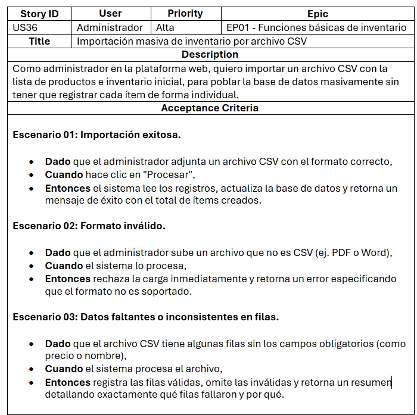 

 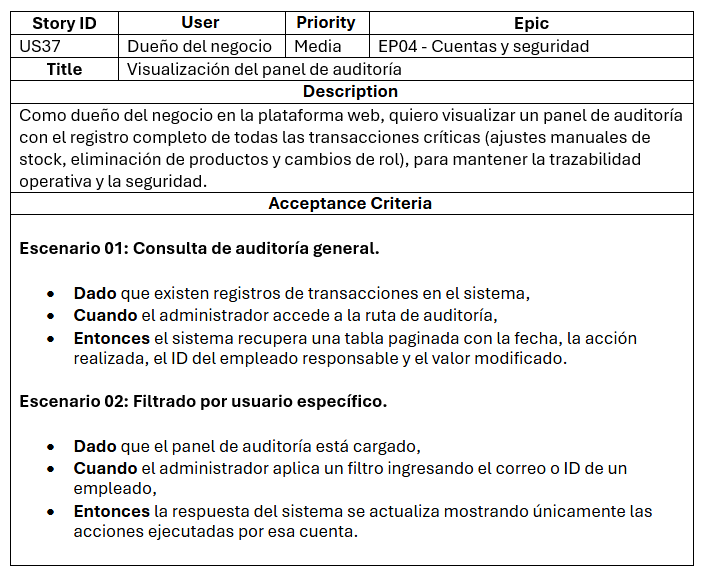 

 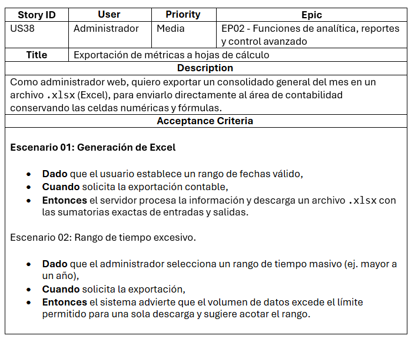 

 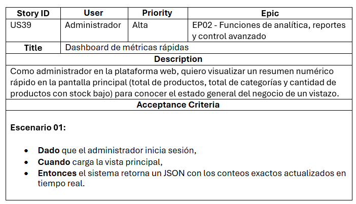 

 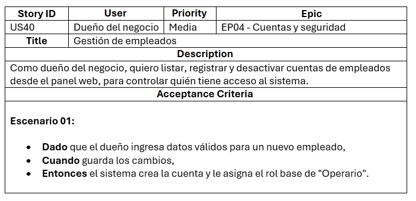 


**Technical Stories** 

En esta sección se describen las historias técnicas que desarrollamos para implementar las funcionalidades clave. Cada historia define tareas específicas que el equipo de desarrollo debe realizar, como crear endpoints, manejar validaciones, controlar el stock, generar reportes, entre otros.

  

  

  

  

  

  

  

  

  

  

  

  

  

  

  

  

**Spike Story** 

  

  

  

  

  

## 3.3. Product Backlog

| #  | User Story ID | Título                                                               | Story Points |
|----|---------------|----------------------------------------------------------------------|--------------|
| 1  | US01          | Registrar producto nuevo                                             | 5            |
| 2  | US05          | Generar alertas por bajo stock                                       | 5            |
| 3  | US07          | Añadir etiquetas para productos                                      | 5            |
| 4  | US08          | Generar estadística de productos más vendidos                        | 5            |
| 5  | US09          | Generar estadística de categoría más vendida                         | 5            |
| 6  | US11          | Generar estadística de stock promedio                                | 5            |
| 7  | US15          | Configurar roles y permisos                                          | 5            |
| 8  | US17          | Registrar lote de productos                                          | 5            |
| 9  | US20          | Añadir etiquetas a productos                                         | 5            |
| 10 | US26          | Registrar productos por voz                                          | 5            |
| 11 | US27          | Registrar geolocalización de productos y entregas                    | 5            |
| 12 | US28          | Localizar productos con mapa y QR                                    | 5            |
| 13 | US02          | Editar información de producto                                       | 3            |
| 14 | US03          | Registrar salida de producto                                         | 3            |
| 15 | US04          | Ver historial de movimientos                                         | 3            |
| 16 | US06          | Buscar productos en inventario                                       | 3            |
| 17 | US10          | Generar ticket promedio                                              | 3            |
| 18 | US12          | Generar reportes de inventario                                       | 3            |
| 19 | US13          | Controlar productos caducados                                        | 3            |
| 20 | US14          | Registrar devolución de productos                                    | 3            |
| 21 | US16          | Gestionar proveedores                                                | 3            |
| 22 | US18          | Visualizar historial de stock                                        | 3            |
| 23 | US19          | Configurar alertas de stock mínimo                                   | 3            |
| 24 | US21          | Buscar productos en inventario                                       | 3            |
| 25 | US22          | Generar alertas por productos caducados                              | 3            |
| 26 | US23          | Registrar ingreso de productos                                       | 3            |
| 27 | US25          | Comparar ventas entre periodos                                       | 3            |
| 28 | US29          | Gestionar predicción de reabastecimiento                             | 3            |
| 29 | TS03          | Generar API Creación de productos                                    | 3            |
| 30 | TS06          | Generar API Productos por etiqueta                                   | 3            |
| 31 | SPK01         | Implementar entrada por voz, comandos estructurados e interpretación | 3            |
| 32 | SPK03         | Geolocalizar y modelar la ubicación                                  | 3            |
| 33 | SPK04         | Configurar predicción de reabastecimiento                            | 3            |
| 34 | TS07          | Generar API Registro de inventario                                   | 3            |
| 35 | US30          | Escanear por lotes con cámara rápida                                 | 3            |
| 36 | US32          | Optimizar tiempos de respuesta                                       | 3            |
| 37 | US35          | Alertas en tiempo real                                               | 3            |
| 38 | TS14          | Generar API Consulta de alertas                                      | 3            |
| 39 | US24          | Visualizar resumen de stock por categoría                            | 2            |

**Gestión del producto Backlog** 

  

_Imagen (N°10). Elaboración propia. Realizado en Trello_ 

Trello del Product Backlog:
https://trello.com/invite/b/69fcb34c3773ca9fb5de2d61/ATTI1644207d65abc14d280915502d0695bc0DE32724/stoq-product-backlog

## 3.4. Impact Mapping

**Segmento Objetivo 1: Bodegas especializadas por rubro** 

  

_Imagen (N°8). Elaboración propia. Realizado en UXPRESSIA_

  

_Imagen (N°9). Elaboración propia. Realizado en UXPRESSIA_

# Capitulo IV: Product Design

## 4.1. Style Guidelines
### 4.1.1. General Style Guidelines

**Branding**

StockWise es una marca pensada para ofrecer confianza, cercanía y eficiencia a pequeñas y medianas empresas, especialmente bodegas de barrio y emprendimientos. El branding refleja accesibilidad, modernidad y calidez. El enfoque está en facilitar la transformación digital de la gestión de inventarios con una interfaz clara, amigable y funcional.

**Logotipo**

El logo combina una bodega estilizada con colores cálidos y un código de barras, representando tanto la esencia física del negocio como la modernización a través de tecnología.

- La palabra "Stock" en rojo (#BC162A) resalta la acción y lo esencial del inventario.
- La palabra "Wise" en marrón oscuro (#302325) sugiere inteligencia y fiabilidad.
  
El código de barras integrado representa la gestión estructurada y la automatización del stock.

<div align="center">
  
</div>

**Tono de comunicación**

Nos comunicamos como lo haría un buen amigo del barrio, claro, sin complicaciones, y con buena onda. Queremos transmitir una sensación de seguridad y eficiencia, mientras mantenemos una comunicación cercana y amigable.

**Lenguaje (Language):**

Usamos términos fáciles de entender: “productos”, “alertas”, “entradas/salidas”, “usuarios”. Evitamos jerga técnica innecesaria o anglicismos si no son esenciales.

**Colores**

La paleta de colores de StockWise ha sido cuidadosamente seleccionada para transmitir profesionalismo, confianza y accesibilidad.

**Primary Colors:**

- #BC162A (Rojo intenso): Botones principales, acciones críticas, alertas importantes
- #EE7F27 (Naranja vibrante): Botones secundarios, estados activos, notificaciones
- #302325 (Marrón oscuro): Texto principal, headers, elementos de navegación

**Background Colors:**

- #F5E1A4 (Fondo cálido claro): Fondo general de la aplicación
- #D9D593 (Gris suave): Fondos de secciones, cards secundarios

**Functional Colors:**

- #27A300 (Verde éxito): Confirmaciones, estados positivos
- #FFC107 (Amarillo advertencia): Alertas moderadas, advertencias
- #DC3545 (Rojo error): Estados de error, acciones destructivas

<center> 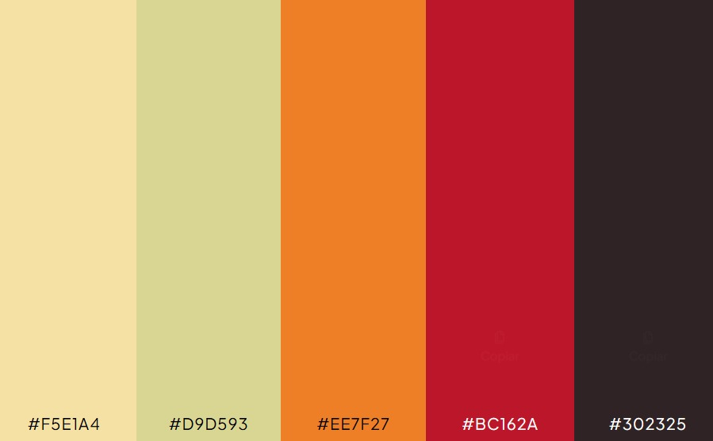 </center>
<br>

**Tipografía**

La elección tipográfica para StockWise es un componente esencial que complementa la identidad visual de la marca. Se han seleccionado dos familias tipográficas que juntas ofrecen versatilidad y coherencia, asegurando que la comunicación sea clara y efectiva en todos los medios.

**Font Families:**

- Inter: Para textos largos, body copy y contenido principal
- Nunito: Para headers, botones y elementos de interfaz

**Font Scale (Mobile First):**

- h1: 24px / 1.1 / Bold
- h2: 20px / 1.1 / SemiBold
- h3: 18px / 1.2 / Medium
- Body Large: 17px / 1.4 / Regular
- Body: 16px / 1.4 / Regular
- Small: 14px / 1.4 / Regular
- Caption: 12px / 1.3 / Regular

**Weights:**

- Bold (700): Títulos principales, acciones críticas
- SemiBold (600): Subtítulos, botones importantes
- Medium (500): Etiquetas, elementos interactivos
- Regular (400): Texto body, contenido principal
- Light (300): Texto secundario, descripciones

**Border Radius:**

- Small: 8px (botones pequeños, inputs)
- Medium: 12px (cards, modales)
- Large: 16px (containers principales)

**Spacing System (8px base):**

- xs: 4px
- sm: 8px
- md: 16px
- lg: 24px
- xl: 32px
- xxl: 48px

**Shadows:**

- Low: 0 2px 4px rgba(48, 35, 37, 0.1)
- Medium: 0 4px 8px rgba(48, 35, 37, 0.15)
- High: 0 8px 16px rgba(48, 35, 37, 0.2)
  
### 4.1.2. Web Style Guidelines

DISEÑO RESPONSIVE:

- El diseño se adaptará automáticamente al tamaño de la pantalla.

COMPONENTES VISUALES:

- Botones: Redondeados con 10px de radio. Cambian de color y tienen un efecto de sombra al usarse.

- Formularios: Cajas de texto con bordes suaves y sombreados ligeros, 40px. de alto.

- Links: En azul (#0000FF), subrayado. Subrayado, con color de cambio a azul oscuro (#00008E).

- Navegación: Menú superior: Con enlaces a las principales secciones.

<center>  </center>
<br>

### 4.1.3. Mobile Style Guidelines

El diseño móvil de StockWise prioriza la eficiencia en tareas rápidas, la facilidad de uso con una sola mano y la legibilidad en condiciones de poca luz o movimiento (típicas en bodegas y almacenes). Los principios clave son: accesibilidad táctil, minimalismo visual y respuesta inmediata.

**Navegación Móvil**

- Barra inferior (Bottom Tab Bar): Principal elemento de navegación. Contiene entre 4 y 5 iconos con etiqueta textual: _Inicio , Inventario, Movimientos, Alertas y Perfil._

  - Altura: 56px.
  - Iconos activos: Color primario #BC162A.
  - Iconos inactivos: Gris medio (#8E8E93).
  - Efecto táctil: Ripple o cambio de opacidad al presionar.

- **Navegación jerárquica:** Uso de flecha de retorno (<) en la esquina superior izquierda de cada pantalla secundaria, siguiendo el estándar de iOS y Android.

**Componentes Táctiles**

- Botones: Altura mínima de 48px (recomendación de accesibilidad). Ancho ajustable según contenido.

  - Botón primario: Fondo #BC162A, texto blanco, border radius 12px. Padding vertical: 12px, horizontal: 24px.
  - Botón secundario: Borde de 1.5px sólido #EE7F27, texto #EE7F27, fondo transparente.
  - Botón flotante (FAB): Para acciones rápidas como "Agregar producto" o "Escanear lote". Fondo #EE7F27, icono blanco, tamaño 56px, sombra media.

- Elementos de lista (Cards): Altura mínima 72px, separación entre cards de 8px. Al tocar una card, se resalta con un fondo gris muy claro (#F2F2F2) o un cambio de sombra. Espaciado interno: 12px.

**Entradas de Datos Específicas para Móvil**

- Campos de texto: Altura 48px, border radius 12px, borde de 1px #D9D593. Fondo blanco o #F5E1A4. Al activarse, borde cambia a #EE7F27 y aparece un ícono de limpiar (X) si hay texto.
  
- Escáner QR / Cámara rápida (Plan C): Llamada a pantalla completa con visor. El botón de captura debe estar en la parte inferior, a 72px del borde, para alcanzar con el pulgar. Confirmación posterior con un modal de resumen (producto sugerido + cantidad) antes de registrar.

**Feedback y Estados**

- Alerta in-app (Snackbar/Toast): Aparece en la parte inferior, sobre la barra de navegación. Duración 3 segundos. Fondo #302325, texto blanco, botón de acción (si aplica) en color #FFC107.

- Estados de carga: Indicador circular (spinner) con color primario, centrado en pantalla o dentro del componente correspondiente. Para acciones largas, mostrar mensaje: "Actualizando inventario...".

- Gestos táctiles: Soporte para "pull to refresh" en listas de inventario y movimientos. Deslizar horizontalmente (swipe) sobre un producto para mostrar acciones rápidas: Editar (lápiz) y Eliminar (basurero, color rojo error).

**Adaptabilidad y Accesibilidad**

- Tamaño mínimo de objetivo táctil: 44x44 puntos (Apple HIG) o 48x48dp (Material Design). Aplicado a todos los elementos interactivos: botones, enlaces, tarjetas seleccionables.

- Modo oscuro (no incluido inicialmente): Preparado para futura implementación. Usar variables de color que permitan mapeo inverso.

- Orientación: Soportada principalmente vertical (retrato). La orientación horizontal (landscape) se habilita solo para mapas (Plan B y C) y visualización de reportes gráficos, con adaptación de la barra superior.

#### 4.1.3.1. iOS Mobile Style Guidelines

Para la versión iOS de StockWise, se aplican las pautas generales de la marca (colores, tipografía, espaciado) adaptadas a las convenciones del ecosistema Apple (Human Interface Guidelines).

**Navegación**

- Barra inferior (Tab Bar): Altura 49px (estándar iOS). Íconos con estilo de línea (SF Symbols) que se llenan en estado activo. Color activo #BC162A, inactivo gris sistema (#8E8E93).

- Barra superior (Navigation Bar): Título grande (Large Title) en pantalla principal. Título pequeño en pantallas secundarias. Botón de retorno con texto de pantalla anterior.

**Controles y Componentes**

- Botones primarios: Texto centrado en mayúsculas? No (evitar mayúsculas forzadas en iOS). Fondo #BC162A, esquinas redondeadas (12px), altura 50px.

- Botón flotante (FAB): No se usa en iOS nativo. En su lugar, acción primaria como botón fijo en la parte inferior de la pantalla o dentro de la barra de navegación superior (lado derecho).

- Switches y toggles: Estilo iOS estándar (fondo gris, círculo blanco), con color activo #27A300 (verde éxito).

- Alertas (UIAlertController): Para confirmaciones destructivas (ej. eliminar producto), usar acción en rojo. Para notificaciones simples, preferir UIAlertController estilo action sheet desde la parte inferior.

**Gestos y Comportamiento**

- Swipe para atrás: Gestual nativo desde el borde izquierdo de la pantalla, soportado en todas las vistas.

- Pull to refresh: Animación estándar de iOS (spinner con líneas curvas).

- Selección de fecha/cantidad: Usar UIDatePicker (ruedas) o UIPickerView en la parte inferior, en lugar de modales personalizados.

**Teclado y Entrada de Datos**

- Escáner QR: Usar AVFoundation para cámara. El visor debe respetar las esquinas redondeadas del dispositivo.

**Tipografía y Escala**

- Mantener las fuentes Inter y Nunito (no usar SF Pro por consistencia de marca). Asegurarse de que el tamaño mínimo de texto sea 15pt para body (vs 16px en Android/web).

- Títulos grandes (Large Title): 34pt, Bold, #302325.

#### 4.1.3.2. Android Mobile Style Guidelines

Para la versión Android de StockWise, se aplican las pautas generales de la marca adaptadas a las convenciones de Material Design.

**Navegación**

- Barra inferior (Bottom Navigation): Altura 56px (estándar Material). Íconos con línea en estado inactivo, rellenos en estado activo. Color activo #BC162A, inactivo gris oscuro (#757575). Efecto ripple al presionar.

- Barra superior (Top App Bar): Altura 56px. Color de fondo #F5E1A4 o blanco. Ícono de hamburguesa (☰) para navegación lateral si aplica.

**Controles y Componentes**

- Botones primarios: Texto en mayúsculas? Sí (convención Material). Fondo #BC162A, esquinas redondeadas 12px, altura 48px, padding horizontal 24px. Efecto ripple en #EE7F27 al presionar.

- Botón flotante (FAB): Sí se usa. Tamaño 56px, fondo #EE7F27, icono blanco (@drawable/ic_add o similar). Elevación (sombra) por defecto 6dp. Ubicación: inferior derecha, margen 16px.

- Switches y toggles: Estilo Material Switch. Color activo #27A300, inactivo #D9D593.

- Alertas (Dialog): Para confirmaciones, usar AlertDialog con botones "Cancelar" (izquierda) y "Aceptar" (derecha).

**Gestos y Comportamiento**

- Swipe para atrás: Gestual desde cualquier borde lateral, sin botón de flecha adicional (navegación predictiva).

- Pull to refresh: Animación estándar Material (spinner circular con trayectoria).

- Swipe sobre lista: Deslizar horizontalmente sobre un producto para acciones rápidas: Editar (lápiz) y Eliminar (basurero, fondo rojo #DC3545).

**Entrada de Datos**

- Escáner QR / cámara rápida: Usar CameraX o ML Kit. El visor debe mostrar un rectángulo guía para encuadre.

- Campos de texto: Altura 48px, border radius 8px. Al activarse, subrayado o borde cambia a #EE7F27. Soporte para autocompletado sugerido.

**Tipografía y Escala**

- Mantener Inter y Nunito. Tamaño mínimo de texto: 14sp (vs 16px en web). Escala tipográfica basada en dp (no pt ni px).


## 4.2. Information Architecture

La arquitectura de la información, también conocida como Information Architecture (IA), implica la organización de la información de manera clara y lógica, de modo que los usuarios puedan comprender su ubicación, lo que han descubierto, qué pueden esperar y qué está disponible a su alrededor. Esto tiene como objetivo permitir a los usuarios encontrar con facilidad lo que están buscando, y a los clientes, comprender las capacidades de la plataforma. Además, la arquitectura de la información posibilita la incorporación de nuevas funciones y la expansión del producto sin generar una estructura compleja o de difícil comprensión (Rosenfeld, Morville & Arango 2015).

### 4.2.1. Organization Systems
La interfaz se divide en módulos bien definidos, accesibles desde un panel de navegación estructurado jerárquicamente. Estos módulos incluyen: Inicio, Home, Inventario y Configuración. Cada sección agrupa funciones específicas según su propósito, permitiendo que las tareas clave estén siempre al alcance del usuario.

#### Organization Systems

La arquitectura de organización de StockWise está diseñada siguiendo principios de agrupación lógica y progresiva de la información, permitiendo a los usuarios acceder rápidamente a las funciones necesarias según su rol y contexto de uso.

**Estructura Organizacional Principal**

| Módulo                        | Descripción                                                  | Funciones Principales                                                                                                                   | Acceso por Rol             |
| ----------------------------- | ------------------------------------------------------------ | --------------------------------------------------------------------------------------------------------------------------------------- | -------------------------- |
| **Dashboard Principal**       | Vista consolidada del estado del inventario y métricas clave | - Resumen ejecutivo de stock<br>- Alertas prioritarias<br>- Acciones rápidas<br>- Métricas en tiempo real                               | Admin, Encargado           |
| **Gestión de Inventario**     | Núcleo operativo para administración completa de productos   | - Registro y edición de productos<br>- Control de niveles de stock<br>- Categorización y etiquetado<br>- Gestión de ubicaciones físicas | Admin, Encargado, Empleado |
| **Operaciones Diarias**       | Módulo para transacciones y movimientos regulares            | - Registro de entradas/salidas<br>- Ajustes de inventario<br>- Historial de movimientos<br>- Devoluciones y mermas                      | Admin, Encargado, Empleado |
| **Reportes y Analytics**      | Sistema de generación y visualización de datos               | - Reportes personalizados<br>- Análisis de tendencias<br>- Métricas de rendimiento<br>- Exportación de datos                            | Admin, Encargado           |
| **Configuración del Sistema** | Administración de preferencias y usuarios                    | - Gestión de perfiles de usuario<br>- Configuración de empresa<br>- Preferencias de notificaciones<br>- Backup y seguridad              | Admin                      |

**Principios de Organización Aplicados**

1. **Agrupación por Funcionalidad**
   Las características se organizan según su propósito común, facilitando la asociación mental y reduciendo la carga cognitiva.

1. **Jerarquía Visual Progresiva**
   La información se presenta desde lo general hacia lo específico, permitiendo drill-down controlado según las necesidades del usuario.

1. **Contextualización Dinámica**
   Las opciones disponibles se adaptan según el rol del usuario y el módulo activo, mostrando solo las funciones relevantes.

1. **Consistencia Transversal**
   Mismos patrones organizativos se aplican en todos los módulos, creando una experiencia unificada y predecible.

**Organización de Contenido por Módulo**

**Módulo de Inventario**

- **Agrupación Primaria:** Por estado de stock (Normal, Bajo, Crítico)
- **Agrupación Secundaria:** Por categorías de producto
- **Agrupación Terciaria:** Por ubicación física en bodega

**Módulo de Reportes**

- **Agrupación Temporal:** Diario, Semanal, Mensual
- **Agrupación por Métrica:** Ventas, Stock, Rentabilidad
- **Agrupación por Producto:** Individual, Por categoría, Global
  
### 4.2.2. Labeling Systems

El sistema de etiquetado en StockWise sigue principios de claridad, consistencia y contexto, asegurando que los usuarios comprendan inmediatamente la función de cada elemento.

**Principios de Etiquetado:**

- Lenguaje Natural: Usamos términos del dominio del usuario ("productos", "proveedores", "ventas")
- Consistencia: Mismo término para misma función en toda la aplicación
- Jerarquía Visual: Tamaño y peso tipográfico reflejan importancia
- Contexto: Las etiquetas cambian según el módulo y las acciones disponibles

**Sistema de Iconografía:**

- **Acciones Principales:**

  - Agregar/Registrar
  - Editar/Modificar
  - Eliminar/Descartar
  - Buscar/Filtrar
  - Exportar/Compartir

- **Módulos y Secciones:**

  - Dashboard - Vista general
  - Inventario - Gestión de productos
  - Movimientos - Entradas y salidas
  - Reportes - Analytics y métricas
  - Configuración - Ajustes del sistema

- **Estados del Sistema:**
  - Completado/Éxito
  - Advertencia/Alerta
  - Error/Problema
  - Procesando/En curso

**Microcopy y Mensajes:**

- **Botones de Acción:** "Agregar Producto", "Registrar Entrada", "Generar Reporte"
- **Mensajes de Confirmación:** "¿Estás seguro de eliminar este producto?"
- **Estados Vacíos:** "Aún no tienes productos registrados"
- **Guías Contextuales:** "Usa el código de barras para buscar más rápido"

### 4.2.3. SEO Tags and Meta Tags

**SEO Tags**

SEO (Search Engine Optimization) Tags son elementos de HTML que ayudan a los motores de búsqueda a entender el contenido y la estructura de una página web. Estos tags influyen en cómo los motores de búsqueda indexan y clasifican tu sitio en los resultados de búsqueda.

**Algunos ejemplos importantes de SEO Tags para StockWise:**

**Title Tags para Páginas Principales:**

```html
<!-- Página de Inicio -->
<title>StockWise - App de Gestión de Inventarios para PYMES</title>

<!-- Página de Características -->
<title>Gestión de Inventario | StockWise App</title>

<!-- Página de Precios -->
<title>Planes de Gestión de Inventario | StockWise</title>
```

**Header Tags Estructurados:**

```html
<h1>Gestiona Tu Inventario desde tu Móvil y PC</h1>
<h2>La solución simple para negocios en crecimiento</h2>
<h3>Control total de tu stock en tiempo real</h3>
```

**Meta Descriptions Optimizadas:**

```html
<meta
  name="description"
  content="StockWise - App móvil de gestión de inventarios para PYMES. Controla stock, genera reportes y evita quiebres de inventario desde tu teléfono."
/>

<meta
  name="keywords"
  content="gestión inventarios, app móvil y web, control stock, PYMES, bodegas, emprendedores"
/>
```

**Open Graph Tags para Redes Sociales:**

```html
<meta property="og:title" content="StockWise - App de Inventarios" />
<meta
  property="og:description"
  content="Gestiona tu inventario desde cualquier lugar con StockWise"
/>
<meta property="og:image" content="/images/stockwise-social-preview.png" />
```

### 4.2.4. Searching Systems

El sistema de búsqueda de StockWise está diseñado para ser intuitivo y potente, permitiendo a los usuarios encontrar rápidamente la información que necesitan en su inventario.

**Características del Sistema de Búsqueda:**

- **Búsqueda Inteligente:**
  - Búsqueda por texto libre en múltiples campos (nombre, - código, categoría, proveedor)
  - Búsqueda por código de barras usando la cámara del dispositivo
  - Búsqueda por voz para hands-free operation
  - Búsqueda predictiva con sugerencias en tiempo real
- **Resultados de Búsqueda:**
  - Ordenamiento por relevancia, nombre, stock, fecha
  - Vista de tarjetas con información esencial
  - Acciones rápidas desde los resultados
  - Historial de búsquedas recientes
- **Búsqueda por Lotes:**
  - Escaneo múltiple de códigos de barras
  - Reconocimiento de imágenes para productos sin código
  - Procesamiento offline con sincronización posterior

### 4.2.5. Navigation Systems
El sistema de navegación de StockWise está optimizado para dispositivos móviles, priorizando la accesibilidad y la eficiencia en las tareas diarias.

**Patrones de Navegación Principal:**

**Bottom Navigation Bar:**

```text
[Inicio]  [Inventario]  [Agregar]  [Reportes]  [Perfil]
```

**Navegación por Gestos:**

- Deslizar hacia la derecha: Menú lateral
- Deslizar hacia abajo: Actualizar contenido
- Deslizar hacia arriba: Acciones rápidas
- Toque largo: Opciones contextuales

**Navegación Contextual:**

- Breadcrumbs para ubicación en estructuras profundas
- Botón "Atras" nativo del dispositivo
- Navegación por pestañas en secciones complejas
- Accesos directos personalizables según uso frecuente

**Navegación para Accesibilidad:**

- Soporte completo para lectores de pantalla
- Navegación por teclado en versiones tablet
- Tamaños de touch target mínimos de 44px
- Alto contraste y modos de daltonismo
  
## 4.3. Landing Page UI Design

### 4.3.1. Landing Page Wireframe
El prototipado de la landing page cuenta diversas secciones:

- Header: Incluye botones para facilitar la navegación
- Hero Section: Con un botón CTA principal, un título y una imagen.
- Sección de Beneficios / Características: mostrara un resumen de 3 beneficios que ofrece la app
- Planes / Precios: Trendra 2 planes con su referente título y lista de características y contara con un botón CTA secundario por cada plan.
- Testimonios: Consta de un título y subtítulo, así como de unos testimonios de usuarios de cada segmento, lo que aumenta la confianza en los potenciales clientes.
- Llamado a la acción final (CTA grande) : Tiene un título y subtítulo, un boton CTA grande para "Try our app"
- Footer: Sección que da fin a la landing page, cuenta con las redes sociales de la plataforma.

**Wireframe Desktop**

<center> 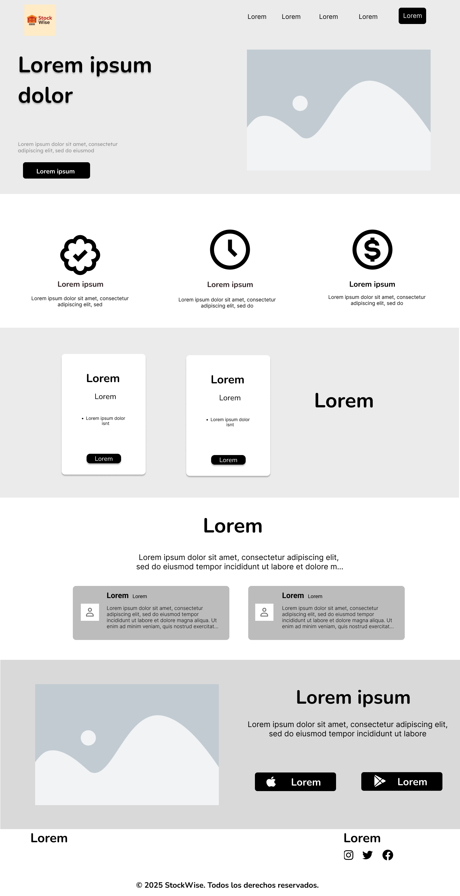 </center>
<br>

**Wireframe Mobile**

En la versión mobile el navbar se reemplaza por un menu desplegable.

<center>  </center>
<br>

### 4.3.2. Landing Page Mock-up

**Wireframe Desktop**

<center> 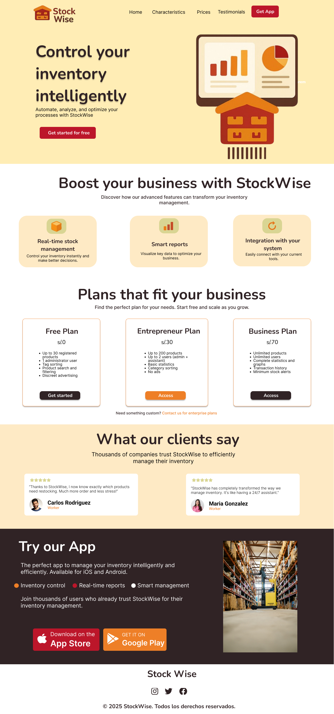 </center>
<br>


**Wireframe Mobile**

En la versión mobile el navbar se reemplaza por un menu desplegable.
<center>  </center>

## 4.4. Mobile Applications UX/UI Design

### 4.4.1. Mobile Applications Wireframes

Los wireframes ayudan a los diseñadores y desarrolladores a planificar la arquitectura y la funcionalidad de la aplicación, permitiendo visualizar cómo los usuarios interactuarán con ella. Son esenciales en las primeras etapas de desarrollo, ya que facilitan la comunicación de ideas, la identificación de problemas potenciales y la alineación de todos los involucrados en el proyecto antes de pasar al diseño detallado y la programación.

**Iniciar sesión**

La siguiente imagen evidencia el wireframe de la sección de “inicio de sesión” desde la vista desktop web browser. En ella, los usuarios deberán ingresar las credenciales necesarias para poder acceder a la aplicación, siempre y cuando posean con una cuenta previamente creada.
<center>  </center>
<br>

**Crear cuenta**

La siguiente imagen presenta la sección de “registro de usuario”, a través de la cual los administradores podrán remitir a la aplicación la información necesaria para crear una cuenta.
<center> 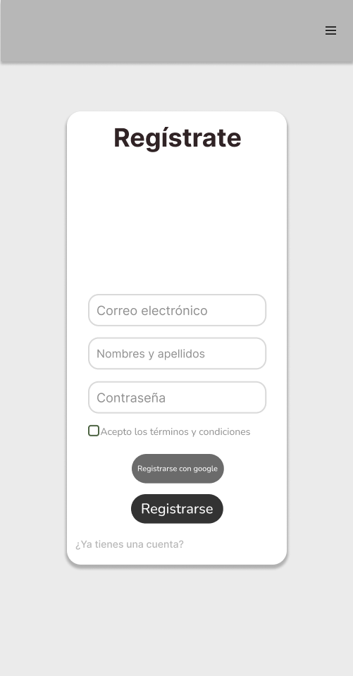 </center>
<br>

**Elegir plan de pago**

La siguiente imagen presenta la sección “Elegir plan de pago”, la cual despliega las categorías de planes disponibles en la plataforma. Los tres planes están diseñados para adaptarse a las necesidades de los administradores de tienda acorde a sus necesidades.
<center>  </center>
<br>

**Pasarela de pagos**

La siguiente imagen corresponde a la sección “Pasarela de pagos” donde los usuarios son dirigidas a un formulario para seleccionar y registrar su método de pago. Una vez que el proceso de pago es completado exitosamente, se notifica al usuario con un mensaje confirmando el vinculo de su tarjeta con la plataforma. Del mismo modo, si el usuario desea retirar su información o actualizar lo podra hacer a travéz de su perfil.
<center> 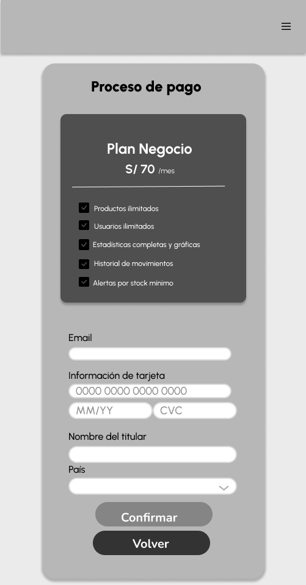 </center>
<br>

**Mi perfil**

La sección titulada “Mi perfil” solicita al usuario que complete información en dos categorías para registrar sus datos. Adicionalmente, la categoría "cambiar cuenta" ofrece la opción de permitir al usuario cambiar de cuenta a una de empleador y utilizar las herramientas de este por la plataforma. Tambien, tiene libertad de cambiar el plan si es necesario.

_Perfil Administrador_

En este perfil, el usuario puede ver a la derecha sus herramientas correpondientes a su cuenta.
<center> 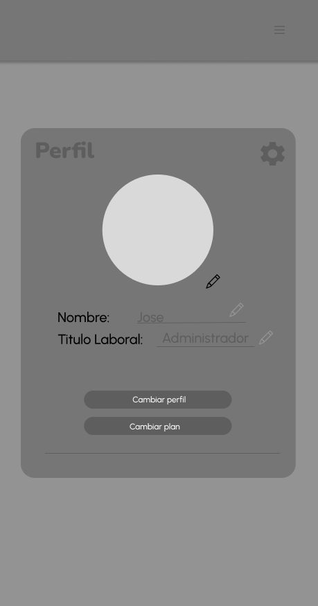 </center>
<br>
<center>  </center>
<br>

**Panel de control (Dashboard)**

Esta pantalla representa el panel de control principal del sistema StockWise. Su objetivo es proporcionar al usuario una vista general del estado del inventario y acceso rápido a funciones clave. Entre sus elementos principales se encuentran:

- Resumen de información:
  - Total de Productos: número total de ítems registrados.
  - Fecha del Último Proveedor: muestra la última fecha de ingreso de productos (por proveedor).
  - Próximos a Caducar: productos con fecha de vencimiento próxima, indicando la fecha y el stock restante.
- Accesos rápidos:
  - Historial de Movimientos: seguimiento de entradas y salidas del inventario.
  - Inventario: acceso directo a la lista completa de productos.
- Botones de acción:
  - Agregar Productos: para registrar nuevos productos en el sistema.
  - Kits de Productos: permite combinar productos individuales en un kit.
  - Devolución de Productos: facilita el registro de productos devueltos por proveedores o clientes.
<center> 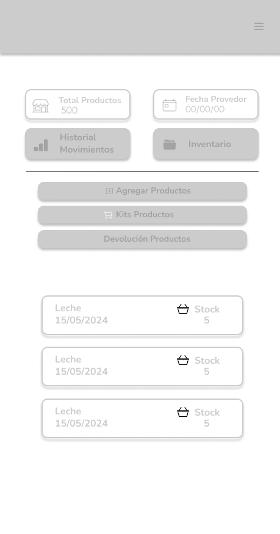 </center>
<br>

**Combinación de Productos en Kits**

Esta sección está dedicada a la funcionalidad de crear kits de productos, una herramienta útil para negocios que venden combos o paquetes predefinidos. Las características principales incluyen:

Buscador de productos: permite al usuario localizar rápidamente productos por nombre. Listado de productos existentes: Muestra el nombre, precio y stock disponible de cada producto. Incluye un botón de acción en cada fila para añadir productos al kit. Botón “Seleccionar para kit”: una vez seleccionados los productos deseados, el usuario puede avanzar para crear el kit final. Esta funcionalidad mejora la gestión del stock agrupado y permite optimizar estrategias de venta, como combos promocionales o paquetes de temporada.
<center>  </center>
<br>

**Agregar Producto**

Esta pantalla permite visualizar todos los productos actualmente registrados en el inventario, con acceso rápido para editar o ver más detalles. Las funcionalidades clave incluyen:

- Tarjetas de producto con información relevante:
  - Nombre del producto (ej. Galleta).
  - Categoría/etiqueta (ej. Golosina).
  - Stock disponible.
- Botón “+ Detalle” para ver información adicional o editar.
- Botón “+”: permite agregar un nuevo producto desde cero
- Buscador de productos y opción de filtro por categoría o stock.
<center>  </center>
<br>

**Registro de Nuevo Producto**

Pantalla que aparece al presionar el botón “+”, diseñada para agregar un nuevo producto al sistema. Incluye los siguientes campos:

- Nombre del producto.
- Etiquetas/Categorías (por ejemplo: Golosina, Bebida).
- Precio de compra y de venta.
- Cantidad inicial del producto.
- Número de lote y fecha de caducidad.
- Notas adicionales, si se desea registrar observaciones específicas.

Una vez completado el formulario, se debe presionar "Guardar" para registrar el nuevo ítem.
<center>  </center>
<br>  

_Edición Rápida de Producto_

Este modal aparece al hacer clic en “+ Detalle” sobre cualquier tarjeta de producto en la pantalla principal. Permite realizar modificaciones rápidas sobre un producto específico:

- Editar etiquetas.
- Actualizar cantidad.
- Modificar fecha de caducidad.
- Agregar notas.

Incluye botones para “Duplicar” (crear una copia rápida del producto) y “Eliminar” (quitar del sistema).
<center>  </center>
<br>  

**Historial de Movimientos**

Esta vista permite al usuario consultar todos los movimientos registrados en el sistema, ya sea por producto individual, por categoría o mediante cálculo del ticket promedio.

- Filtros disponibles:
  - Tipo de gestión: Producto, Categoría o Stock Promedio.
  - Rango de fecha: permite buscar registros por fechas específicas.
- Resultados organizados en tarjetas que muestran:
  - Producto o categoría
  - Fecha del movimiento
  - Precio unitario (si aplica)
  - Cantidad gestionada
  - Total del movimiento
- También cuenta con botones para:
  - Editar un registro
  - Eliminar un registro (con confirmación previa).
<center> 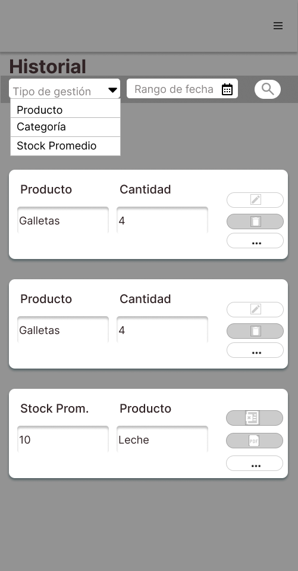 </center>
<br>  

_Confirmación de Eliminación_

Al presionar el botón de eliminar, se despliega una ventana emergente de confirmación que advierte al usuario antes de borrar un registro del historial.
<center>  </center>
<br>  

**Ticket Promedio**

Al seleccionar “Stock Promedio” como tipo de gestión, se habilita el acceso al cálculo de Ticket Promedio, que estima el valor promedio de venta por unidad en un rango de fechas. Este recurso permite realizar un análisis financiero rápido sobre el comportamiento de productos específicos.

- Campos del formulario:
  -  Rango de fecha.
  -  Producto a analizar.
  -  Cantidad de ventas.
  - Precio total de ventas.
  - Resultado del ticket promedio (calculado automáticamente).
- Botones:
  - Crear: Guarda el registro del ticket.
  - Cancelar: Cierra el modal sin guardar.
<center>  </center>
<br> 

**Pantalla principal de Inventario por Lote**

Esta pantalla permite la visualización y gestión del inventario agrupado por lote de entrada.

- Filtros en la parte superior:
  - Búsqueda por Producto
  - Proveedor
  - Fecha de ingreso
  - Cantidad
  - Precio
- Lista de productos ingresados por lote:
  - Proveedor
  - Producto
  - Fecha de entrada
  - Cantidad por unidad
  - Precio por unidad
  - Unidad de medida
- Botón rojo “Generar Nuevo Lote” ubicado a la derecha, que permite agregar un nuevo registro.
<center>  </center>
<br> 

_Busqueda Avanzada_
<center>  </center>
<br> 

**Pantalla de Inventario por Producto**

Visualización clara de todos los productos del inventario, con opción de filtrar por condiciones específicas, lo cual optimiza el control individualizado del stock.

- Filtros:
  - Categoría
  - Productos
  - Rango de Fecha
  - Stock Mínimo.
- Tabla:
  - Categoría
  - Producto
  - Fecha de entrada
  - Cantidad
  - Precio
  - Stock mínimo
  - Unidad de medida.
- Botón: “Generar Nuevo Lote”.
<center>  </center>
<br> 

_Edición de Registro_

Facilita la actualización de datos en tiempo real, permitiendo mantener el inventario siempre actualizado y preciso.

- Elementos mostrados:
  - Formulario editable con campos: Categoría, Producto, Cantidad por unidad, Precio por unidad, Unidad de medida.
  - Botones de acción: “Crear” (confirmar edición) y “Cancelar”.
<center>  </center>
<br> 

### 4.4.2. Mobile Applications Wireflow Diagrams

Los Mobile Applications Wireflow Diagrams son una combinación de wireframes y flujos de usuario (user flows) que ilustran no solo la estructura y disposición de las pantallas de una Mobile Application, sino también cómo los usuarios navegarán entre ellas. Estos diagramas proporcionan una visión detallada del recorrido del usuario, mostrando las interacciones clave y las transiciones de una pantalla a otra dentro de la aplicación.

**User Goal Registrar:** El usuario desea crear una nueva cuenta para comenzar a usar la plataforma y vincular su método de pago según el plan seleccionado.

**Flujo funcional:**

1. El usuario selecciona la opción “Registrar” en la Landing Page.
2. Ingresa los datos solicitados: correo electrónico, nombre y contraseña.
3. Selecciona el tipo de plan.
4. Si elige el Plan Negocio, completa los datos de la tarjeta y confirma el pago.
5. El sistema valida la transacción.
6. Si el pago es exitoso, se muestra una ventana flotante indicando “Pago realizado correctamente”.
7. Si el pago falla, se muestra una alerta de error con el mensaje “No se pudo procesar el pago”.
8. Finalmente, se redirige al usuario a la pantalla de Inicio de sesión.
<center>  </center>
<br> 

**User Goal: Iniciar sesión**

El usuario desea iniciar sesión en la plataforma utilizando sus credenciales y acceder a las funciones principales del sistema.

**Flujo funcional:**

1. El usuario ingresa su correo electrónico y contraseña.
2. El usuario selecciona la opción “Iniciar sesión”.
3. El sistema valida las credenciales ingresadas.
4. Si las credenciales son correctas, el sistema autoriza el acceso y muestra el panel principal (Dashboard).
5. Desde el panel principal, el usuario puede acceder al módulo de Perfil y editar su información personal.
6. Si las credenciales son incorrectas, el sistema muestra un mensaje de error: “Correo o contraseña incorrectos” y permite reintentar el acceso.
<center>  </center>
<br> 

**User Goal: Navegar por el Dashboard**

El usuario explora la vista principal y accede a las herramientas clave del sistema.

**Flujo funcional:**

1. El usuario accede al Dashboard después de iniciar sesión.
2. Visualiza el total de productos registrados y fecha del último proveedor.
3. Observa un resumen de productos próximos a caducar con stock y fecha.
4. Accede a botones de acción rápida (Historial de Movimientos, Inventario, Agregar Productos, Kits y Devolución de productos)
5. Selecciona cualquiera de las secciones para continuar su gestión.
<center>  </center>
<br> 

**User Goal: Inventario (Producto / Lote)**

El usuario explora la vista de inventario y accede a los registros de productos y lotes.

**Flujo funcional:**

1. Ingresa a la sección de Inventario.
2. Revisa el listado de productos presionando el botón "por producto".
3. Filtra los productos por categoría, nombre del producto, fecha o stock mínimo.
4. Consulta el listado con información clave: fecha de entrada, cantidad por unidad, precio, stock mínimo y unidad de medida.
<center>  </center>
<br> 

**User Goal: Botones Principales (Agregar Producto y Kits)**

El usuario visualiza la sección principal y gestiona productos y kits desde las opciones disponibles.

**Flujo funcional:**

1. Pulsa el botón "Agregar Producto".
2. Rellena los campos solicitados para registrar uno nuevo.
3. Pulsa el botón "Crear Kit".
4. Combina productos existentes para crear un kit nuevo.
5. El usuario pulsa el botón “Añadir Productos” desde el Dashboard.
6. Visualiza una galería de productos existentes y accede a opciones para editarlos o duplicarlos.
7. Puede agregar uno nuevo haciendo clic en el botón “+”, donde se despliega un formulario con campos como nombre,etiquetas, cantidad, lote, precios, fecha de caducidad y notas.
8. Desde el menú principal, también accede a la opción “Kits”.
<center>  </center>
<br> 

**User Goal: Historial de Movimientos**

El usuario consulta y analiza los movimientos del inventario, accediendo a información de entradas, salidas y métricas relacionadas.

**Flujo funcional:**

1. Navega a la sección de Historial.
2. Visualiza entradas y salidas de productos.
3. Filtra movimientos por fecha, producto o lote.
4. El usuario accede a la sección de Historial desde el panel principal.
5. Filtra los registros por tipo de gestión, categoría, stock promedio y fecha.
6. Visualiza los movimientos realizados, incluyendo datos como nombre del producto, fecha de consulta, precio unitario, cantidad y total.
7. Consulta métricas como el stock promedio, estado del producto y stock ideal.
8. Cuenta con botones para editar o eliminar cada registro y, para los stock promedio, exportar la información y realiza un ticket promedio.
<center>  </center>
<br> 

### 4.4.3. Mobile Applications Mock-ups

**Iniciar sesión**
<center>  </center>
<br>

**Crear cuenta**
<center>  </center>
<br> 

**Elegir plan de pago**
<center>  </center>
<br> 

**Pasarela de pagos**
<center>  </center>
<br> 

**Mi perfil**

*Perfil Administrador*
<center> 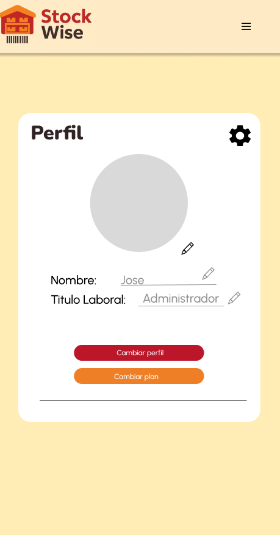 </center>
<br> 
<center>  </center>
<br> 

**Panel de control (Dashboard)**
<center> 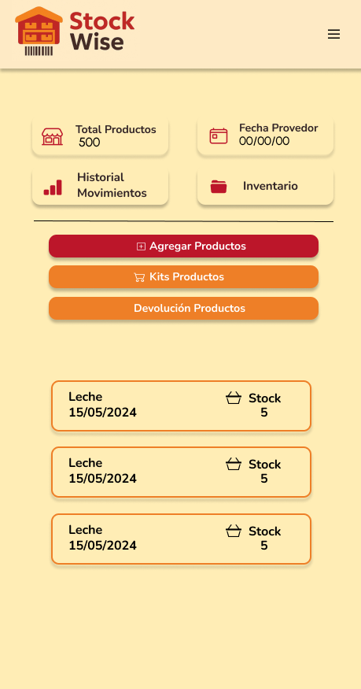 </center>
<br> 

**Combinación de Productos en Kits**
<center>  </center>
<br> 

**Agregar Producto**
<center>  </center>
<br> 

**Registro de Nuevo Producto**
<center>  </center>
<br> 

*Edición Rápida de Producto*
<center>  </center>
<br> 

**Historial de Movimientos**
<center> 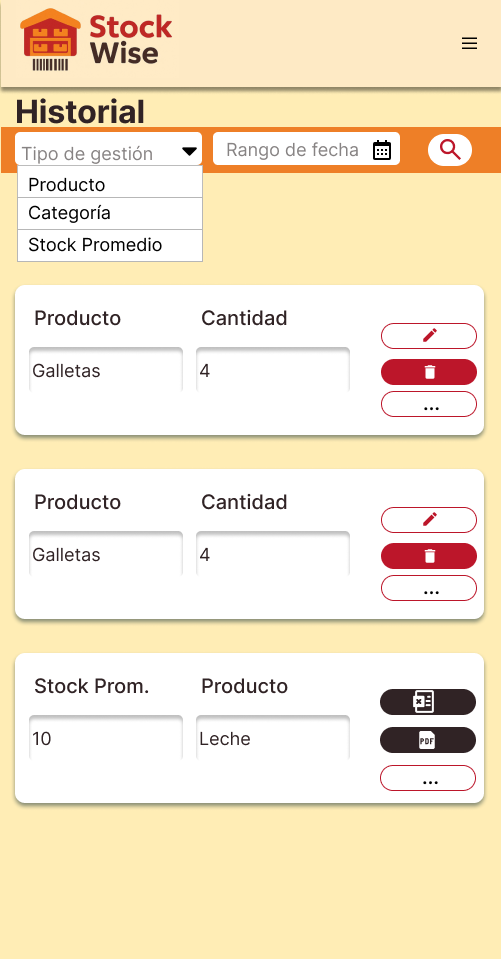 </center>
<br> 

*Confirmación de Eliminación*
<center>  </center>
<br> 

**Ticket Promedio**   
<center>  </center>
<br> 

**Pantalla principal de Inventario por Lote**
<center> 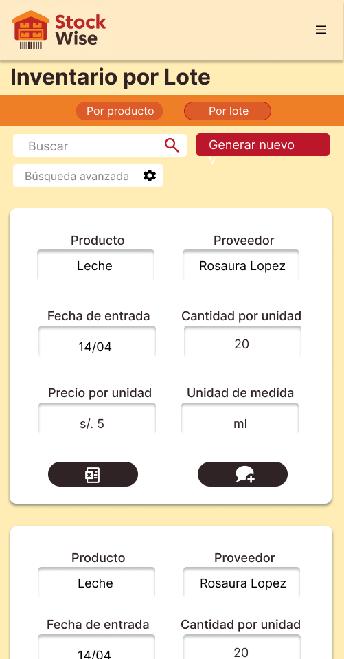 </center>
<br> 

*Busqueda Avanzada*
<center>  </center>
<br>

**Pantalla de Inventario por Producto**
<center>  </center>
<br>

*Edición de Registro*
<center>  </center>
<br>

### 4.4.4. Mobile Applications User Flow Diagrams

**User Goal: Registrar**
<center>  </center>
<br>

**User Goal: Iniciar sesión**
<center>  </center>
<br>

**User Goal: Navegar por el dashboard**
<center>  </center>
<br>

**User Goal: Inventario (Producto/Lote)**
<center>  </center>
<br>

**User Goal: Botones Principales (Agregar Producto y Kits)**
<center>  </center>
<br>

**User Goal: Historial de Movimientos**
<center>  </center>
<br>

## 4.5. Mobile Applications Prototyping

El apartado de Mobile Application Prototyping muestra el primer acercamiento visual e interactivo al diseño de la aplicación. A través del uso de herramientas de prototipado, se crean representaciones dinámicas que permiten simular la navegación, disposición de módulos y flujos de interacción del usuario antes de pasar a la fase de desarrollo.

Durante este proceso, se estructuran pantallas clave como el login, panel de control, gestión de productos, movimientos de stock, generación de reportes y alertas de inventario. El objetivo es anticipar posibles mejoras de usabilidad y validar la propuesta funcional con los usuarios finales.

El prototipo también permite identificar ajustes necesarios en la experiencia de usuario (UX) y verificar que los requisitos funcionales definidos en las User Stories se reflejen correctamente en las interfaces propuestas.

A continuación, se presenta el enlace para visualizar el video de navegación del prototipo interactivo:

[.png>)](assets/Chapter-3/Grabación%20de%20pantalla%202025-10-09%20165528.mp4)

### 4.5.1. Android Mobile Applications Prototyping

A continuación, se presenta el enlace para visualizar el video de navegación del prototipo interactivo:

[](assets/Chapter-3/Grabación%20de%20pantalla%202025-10-09%20165528.mp4)

### 4.5.2. iOS Mobile Applications Prototyping

A continuación, se presenta el enlace para visualizar el video de navegación del prototipo interactivo:

[](assets/Chapter-3/Grabación%20de%20pantalla%202025-10-09%20165528.mp4)

## 4.6. Web Applications UX/UI Design

 
 
 
 
 
 
 
 
 
 
 
 
 


### 4.6.2. Web Applications Wireflow Diagrams

 

### User Goal: “Crear cuenta e ingresar a la aplicación”

User persona: Empresa — Administrador
**Happy path**

1. En Regístrate, completa Nombre, Email y Contraseña → pulsa Registrarse.
2. El sistema valida y crea la cuenta (opcional: confirma email).
3. En Iniciar sesión, ingresa Email y Contraseña → Entrar.
4. Accede al Dashboard (métricas y notificaciones cargadas).

**Unhappy paths**

* Email ya registrado o formato inválido → mensaje y bloqueo.
* Contraseña débil/incorrecta → mensaje y reintento.
* Cuenta inactiva/no verificada → aviso con instrucciones.
* Falla de red/sesión → error; el formulario conserva los datos.

<br>

 

### User Goal: “Crear un nuevo rol para el personal”

User persona: Empresa — Administrador

**Happy path**

1. Desde el Dashboard, abre Administración del personal.
2. Pulsa Nuevo Rol.
3. En el modal, indica Nombre del rol y Permisos (p. ej., Inventario, Compras, Estadísticas, Cuentas).
4. Guardar → el rol se crea y queda disponible para asignarlo a usuarios.

**Unhappy paths**

* Cancelar → no se guarda nada.
* Nombre de rol vacío/duplicado → mensaje y bloqueo.
* Sin permisos seleccionados (si es obligatorio) → aviso para completar.
* Falla de red/sesión → error y preservación del formulario para reintentar.
<br>

### 4.6.3. Web Applications Mock-ups

 
 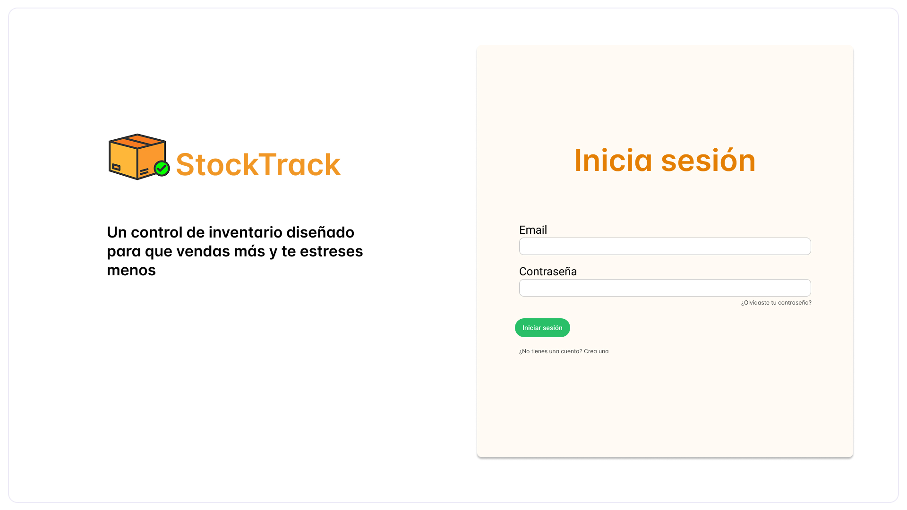
 
 
 
 
 
 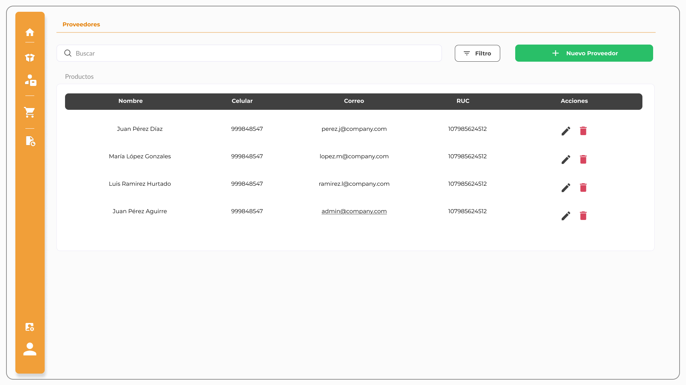
 
 
 
 
 


<br>

### 4.6.4. Web Applications User Flow Diagrams

 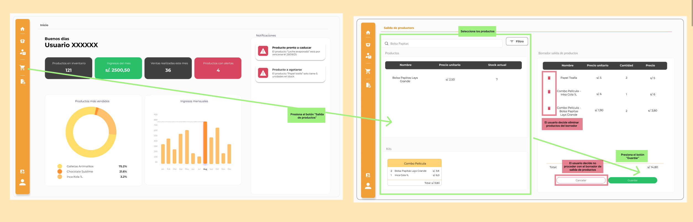

### User Goal: “Registrar salida de productos (venta/consumo/merma)”

User persona: Tienda/Almacén — Operador(a)
**Happy path**

1. Desde Inicio, abre Salida de productos (barra lateral).
2. En Salida de productos:

   * Busca/filtra por nombre o código (ej. “Bolsa Papitas”).
   * Selecciona uno o varios productos (ve Precio unitario y Stock actual).
   * (Opcional) agrega un Kit desde Kits (p. ej., “Combo Película”).
3. En el panel Borrador salida de productos (derecha):

   * Ajusta la Cantidad por ítem.
   * Se calcula Precio por línea y Total automáticamente.
   * (Opcional) elimina líneas.
4. Guardar:

   * Se valida stock, se registra el movimiento y se descuenta inventario (los kits se desglosan en componentes).


**Unhappy paths**

* Cancelar → se descarta el borrador; no se registra ningún movimiento.
* Cantidad > stock → alerta y bloqueo hasta corregir.

<br>

 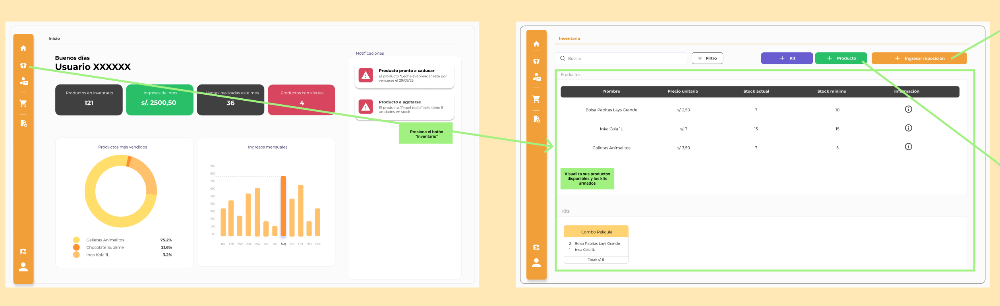
 
 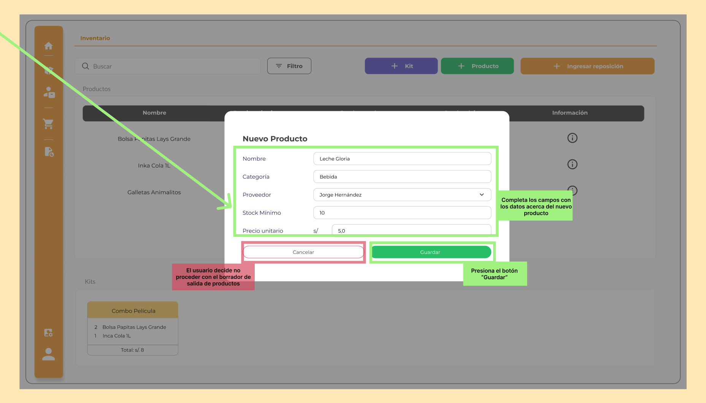


### User Goal: “Gestionar inventario (ingresar reposición y crear producto)”

User persona: Tienda/Almacén — Operador(a)

A) Ingresar reposición

**Happy path**

1. Desde Inicio, abre Inventario (barra lateral).
2. Revisa Productos y Kits; pulsa Ingresar reposición.
3. En el modal, completa Lote, Fecha de recepción y Fecha de vencimiento.
4. Define Cantidad ingresando por producto; se calcula el Total.
5. Guardar → se registra la reposición, aumenta el stock y se actualizan alertas/métricas.

**Unhappy paths**

* Cancelar → se descarta el formulario, no se registra nada.
* Fechas inválidas (vencimiento < recepción) → error y bloqueo.
* Cantidades inválidas (0, negativas o vacías) → validación en línea.
* Falla de red/sesión → error y preservación del formulario para reintentar.

B) Crear nuevo producto

**Happy path**

1. En Inventario, pulsa + Producto.
2. Completa Nombre, Categoría, Proveedor, Stock mínimo y Precio unitario.
3. Guardar → se crea el producto, aparece en la lista y queda disponible para reposiciones/kits.

**Unhappy paths**

* Cancelar → no se crea el producto.
* Campos obligatorios vacíos** o nombre duplicado → mensaje y bloqueo.
* Valores inválidos (precio ≤ 0, stock mínimo < 0) → validación en línea.
* Falla de red/sesión → error y preservación del formulario.


## 4.7. Web Applications Prototyping

El prototipo web ha sido concebido aplicando principios de arquitectura de información, diseño centrado en el usuario y las heurísticas de usabilidad, con el propósito de brindar una experiencia intuitiva, eficiente y accesible. La navegación se organiza de manera jerárquica y lógica, lo que facilita a los usuarios localizar rápidamente las funciones principales, como el registro de movimientos de inventario, la visualización de reportes y configuración de personal. La interfaz mantiene una disposición visual uniforme, apoyada en una paleta de colores equilibrada y tipografía clara, reforzando la identidad de la plataforma. Los elementos interactivos se han colocado estratégicamente para optimizar la interacción y minimizar la carga cognitiva del usuario. Cada componente del prototipo asegura coherencia visual, visibilidad del estado del sistema y retroalimentación inmediata ante cada acción. Asimismo, se adoptan buenas prácticas y estándares de diseño web contemporáneos para garantizar una experiencia fluida y adaptable en distintos dispositivos.

<https://www.figma.com/proto/jKNuDhwMS5qe3o6zF4ugo8/OPEN-SOURCE?node-id=150-3805&p=f&t=C8AMNn5sgvqnuoFs-1&scaling=min-zoom&content-scaling=fixed&page-id=0%3A1&starting-point-node-id=150%3A5901>

## 4.8. Domain-Driven Software Architecture

### 4.8.1. Software Architecture Context Diagram
 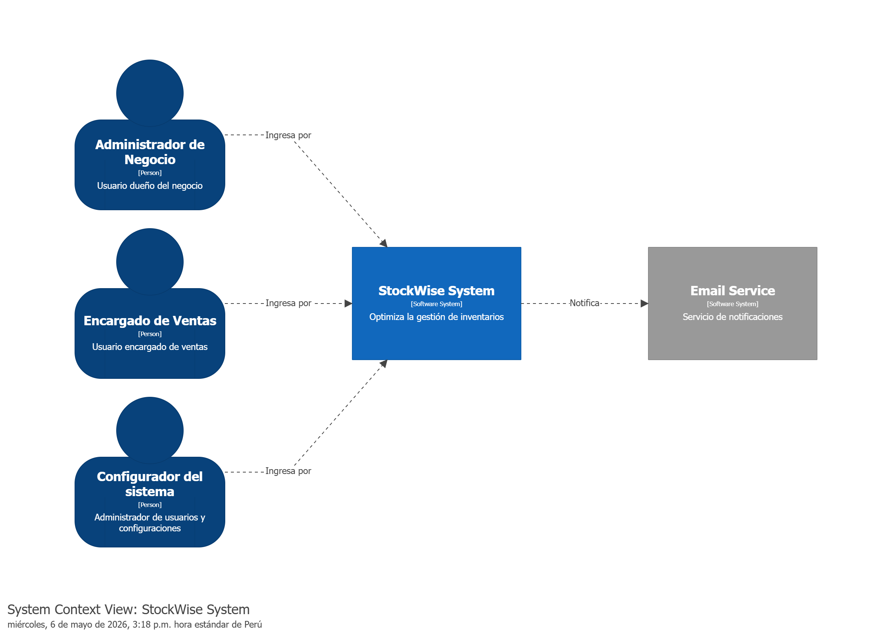

### 4.8.2. Software Architecture Container Diagrams
 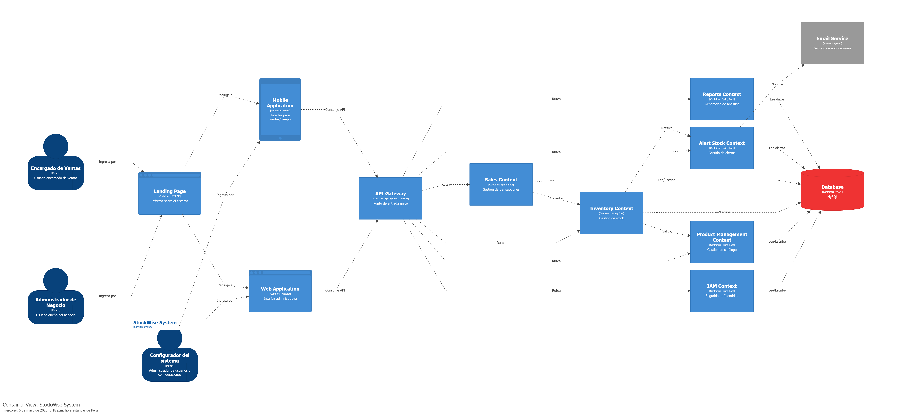

### 4.8.3. Software Architecture Components Diagrams

- IAM Context
 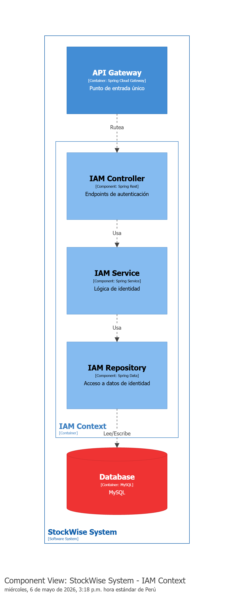

 - Product Context
 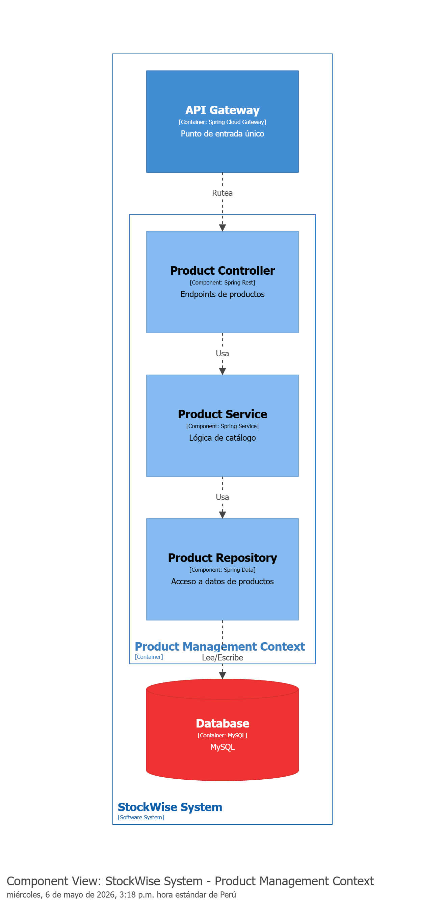

 - Inventory Context
 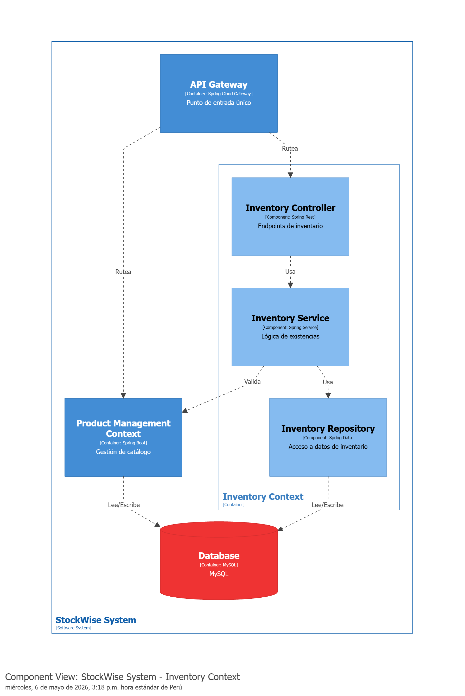

 - Sales Context
 
 
 - Alert Context
 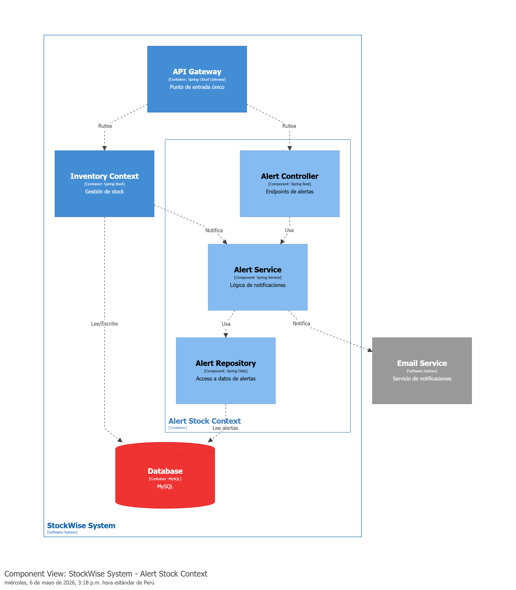


## 4.9. Software Object-Oriented Design

### 4.9.1. Class Diagrams

 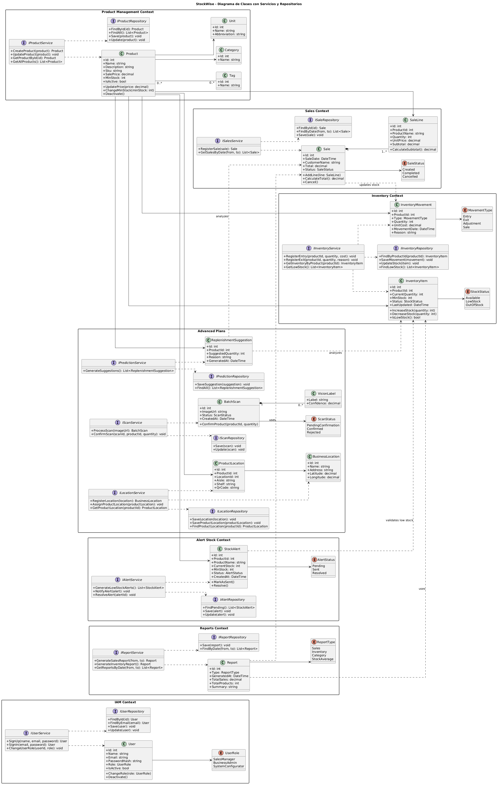


### 4.9.2. Class Dictionary
El presente diccionario de clases describe los principales elementos del diagrama de clases de StockWise. Se incluyen entidades del dominio, servicios, repositorios y enumeraciones agrupadas por contexto, con el objetivo de explicar su responsabilidad dentro del sistema.

<br>

### IAM Context

| Clase / Interfaz | Tipo | Descripción | Atributos principales | Métodos principales |
|---|---|---|---|---|
| `User` | Clase | Representa a un usuario registrado en StockWise. Puede ser encargado de ventas, administrador de negocio o configurador del sistema. | `Id`, `Name`, `Email`, `PasswordHash`, `Role`, `IsActive` | `ChangeRole(role)`, `Deactivate()` |
| `UserRole` | Enum | Define los roles disponibles para los usuarios del sistema. | `SalesManager`, `BusinessAdmin`, `SystemConfigurator` | No aplica |
| `IUserService` | Interface | Define las operaciones de negocio relacionadas con usuarios, autenticación y cambio de roles. | No aplica | `SignUp(name, email, password)`, `SignIn(email, password)`, `ChangeUserRole(userId, role)` |
| `IUserRepository` | Interface | Define las operaciones de acceso a datos para usuarios. | No aplica | `FindById(id)`, `FindByEmail(email)`, `Save(user)`, `Update(user)` |


### Product Management Context

| Clase / Interfaz | Tipo | Descripción | Atributos principales | Métodos principales |
|---|---|---|---|---|
| `Product` | Clase | Representa un producto registrado en el catálogo del negocio. Es una de las entidades centrales del sistema. | `Id`, `Name`, `Description`, `Sku`, `SalePrice`, `MinStock`, `IsActive` | `UpdatePrice(price)`, `ChangeMinStock(minStock)`, `Deactivate()` |
| `Category` | Clase | Representa la categoría a la que pertenece un producto. | `Id`, `Name` | No aplica |
| `Unit` | Clase | Representa la unidad de medida utilizada por un producto. | `Id`, `Name`, `Abbreviation` | No aplica |
| `Tag` | Clase | Representa una etiqueta asociada a productos para facilitar su clasificación o búsqueda. | `Id`, `Name` | No aplica |
| `IProductService` | Interface | Define las operaciones de negocio para la gestión del catálogo de productos. | No aplica | `CreateProduct(product)`, `UpdateProduct(product)`, `GetProductById(id)`, `GetAllProducts()` |
| `IProductRepository` | Interface | Define las operaciones de persistencia para productos. | No aplica | `FindById(id)`, `FindAll()`, `Save(product)`, `Update(product)` |


### Inventory Context

| Clase / Interfaz | Tipo | Descripción | Atributos principales | Métodos principales |
|---|---|---|---|---|
| `InventoryItem` | Clase | Representa el stock actual de un producto dentro del inventario. | `Id`, `ProductId`, `CurrentQuantity`, `MinStock`, `Status`, `LastUpdated` | `IncreaseStock(quantity)`, `DecreaseStock(quantity)`, `IsLowStock()` |
| `InventoryMovement` | Clase | Representa un movimiento de inventario, como entrada, salida, ajuste o venta. | `Id`, `ProductId`, `Type`, `Quantity`, `UnitCost`, `MovementDate`, `Reason` | No aplica |
| `MovementType` | Enum | Define los tipos de movimientos que pueden registrarse en el inventario. | `Entry`, `Exit`, `Adjustment`, `Sale` | No aplica |
| `StockStatus` | Enum | Define el estado del stock de un producto. | `Available`, `LowStock`, `OutOfStock` | No aplica |
| `IInventoryService` | Interface | Define las operaciones de negocio relacionadas con el inventario. | No aplica | `RegisterEntry(productId, quantity, cost)`, `RegisterExit(productId, quantity, reason)`, `GetInventoryByProduct(productId)`, `GetLowStock()` |
| `IInventoryRepository` | Interface | Define las operaciones de acceso a datos para el inventario. | No aplica | `FindByProductId(productId)`, `SaveMovement(movement)`, `UpdateStock(item)`, `FindLowStock()` |


### Sales Context

| Clase / Interfaz | Tipo | Descripción | Atributos principales | Métodos principales |
|---|---|---|---|---|
| `Sale` | Clase | Representa una venta realizada dentro del sistema. Contiene información general de la transacción. | `Id`, `SaleDate`, `CustomerName`, `Total`, `Status` | `AddLine(line)`, `CalculateTotal()`, `Cancel()` |
| `SaleLine` | Clase | Representa el detalle de una venta, incluyendo producto, cantidad, precio unitario y subtotal. | `Id`, `ProductId`, `ProductName`, `Quantity`, `UnitPrice`, `Subtotal` | `CalculateSubtotal()` |
| `SaleStatus` | Enum | Define los estados posibles de una venta. | `Created`, `Completed`, `Cancelled` | No aplica |
| `ISalesService` | Interface | Define las operaciones de negocio relacionadas con el registro y consulta de ventas. | No aplica | `RegisterSale(sale)`, `GetSalesByDate(from, to)` |
| `ISaleRepository` | Interface | Define las operaciones de persistencia para ventas. | No aplica | `FindById(id)`, `FindByDate(from, to)`, `Save(sale)` |


### Alert Stock Context

| Clase / Interfaz | Tipo | Descripción | Atributos principales | Métodos principales |
|---|---|---|---|---|
| `StockAlert` | Clase | Representa una alerta generada cuando el stock de un producto está por debajo del mínimo permitido. | `Id`, `ProductId`, `ProductName`, `CurrentStock`, `MinStock`, `Status`, `CreatedAt` | `MarkAsSent()`, `Resolve()` |
| `AlertStatus` | Enum | Define el estado de una alerta de stock. | `Pending`, `Sent`, `Resolved` | No aplica |
| `IAlertService` | Interface | Define la lógica para generar, notificar y resolver alertas de bajo stock. | No aplica | `GenerateLowStockAlerts()`, `NotifyAlert(alert)`, `ResolveAlert(alertId)` |
| `IAlertRepository` | Interface | Define las operaciones de persistencia para las alertas de stock. | No aplica | `FindPending()`, `Save(alert)`, `Update(alert)` |


### Reports Context

| Clase / Interfaz | Tipo | Descripción | Atributos principales | Métodos principales |
|---|---|---|---|---|
| `Report` | Clase | Representa un reporte generado por el sistema, basado en ventas, inventario o categorías. | `Id`, `Type`, `GeneratedAt`, `TotalSales`, `TotalProducts`, `Summary` | No aplica |
| `ReportType` | Enum | Define los tipos de reportes disponibles en StockWise. | `Sales`, `Inventory`, `Category`, `StockAverage` | No aplica |
| `IReportService` | Interface | Define la lógica para generar y consultar reportes del sistema. | No aplica | `GenerateSalesReport(from, to)`, `GenerateInventoryReport()`, `GetReportsByDate(from, to)` |
| `IReportRepository` | Interface | Define las operaciones de persistencia para reportes. | No aplica | `Save(report)`, `FindByDate(from, to)` |


## 4.10. Database Design
### 4.10.1. Relational/Non-Relational Database Diagram

 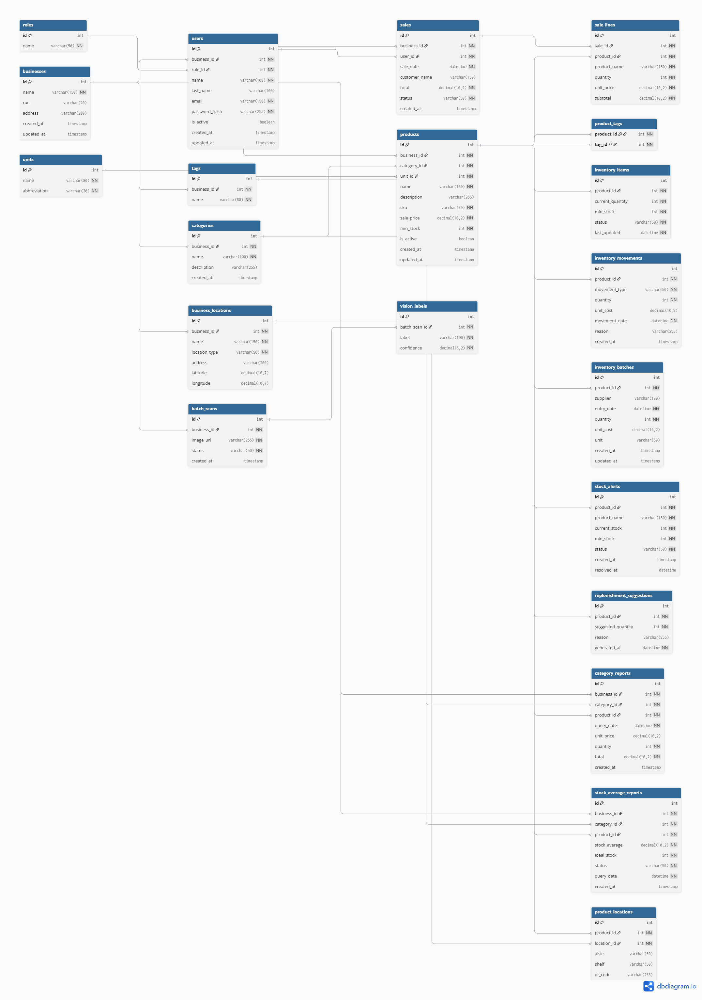


# Capitulo V: Product Implementation

## 5.1. Software Configuration Management
En la siguiente sección se describe la ruta de referencia de cada uno de los productos de software para que cualquier miembro del equipo pueda desarrollar cada punto del trabajo.

### 5.1.1. Software Development Environment Configuration
  * **UXPressia:** Plataforma colaborativa que nos permitirá crear user personas e integrarlos con los múltiples mapas para evaluar sus prioridades.
* **Figma:** Herramienta colaborativa que nos permitirá desarrollar wireframes y mockups de la interfaz móvil.
* **Miro:** Plataforma en línea que facilita la colaboración en tiempo real mediante pizarras digitales para crear diagramas, mapas mentales y flujos de trabajo móvil.
* **Lucidchart / Diagrams.net:** Aplicaciones destinadas a la elaboración de Wireflows, User Flows móviles y diagramas de clases.
* **Kotlin and Flutter:** Lenguaje y framework principal utilizado para el desarrollo de la aplicación móvil nativa o híbrida.
* **Jetpack Compose:** Frameworks modernos utilizados para la construcción de la interfaz de usuario móvil mediante componentes declarativos.
* **HTML** Es el lenguaje de marcado que se utiliza para estructurar y organizar el contenido de una página web.
* **CSS** Es el lenguaje de estilos que se utiliza para controlar la apariencia visual de la página.


#### Software Deployment
* **Git:** Herramienta de control de versiones que nos permitirá rastrear cambios, colaborar de manera eficiente y mantener un historial detallado de las modificaciones en el código fuente.
* **GitHub:** Plataforma de alojamiento que facilitará la colaboración en equipo, la gestión de ramas, el seguimiento de issues y la integración continua (CI/CD).


### 5.1.2. Source Code Management
El proyecto seguirá las convenciones de flujo de trabajo establecidas por el modelo **GitFlow** para el control de versiones, utilizando **GitHub** como plataforma y sistema de control de versiones. A continuación, se detallará cómo se implementará GitFlow como Workflow de control de versiones, además de proporcionar los URL de los repositorios de GitHub para cada producto: Landing Page, Web Services y Frontend Web Applications.

*   **Repositorio Landing Page:** [https://github.com/upc-1ASI0732-2610-16879-Stoq/Stoq-LandingPage.git](https://github.com/upc-pre-202510-1asi0730-4366-AyniTech/Landing-Page)
*   **Repositorio Web Services:** [https://github.com/upc-1ASI0732-2610-16879-Stoq/Stoq-Manager-General-BackEnd.git](https://github.com/upc-pre-202510-1asi0730-4366-AyniTech/Web-Services)
*   **Repositorio Mobil Applications:** [https://github.com/upc-1ASI0732-2610-16879-Stoq/MobileAppMobileApp.git](https://github.com/upc-pre-202510-1asi0730-4366-AyniTech/Frontend-Web-Applications)
*   **Repositorio Web Applications:** [https://github.com/upc-1ASI0732-2610-16879-Stoq/Stoq-FrontendWeb.git](https://github.com/upc-pre-202510-1asi0730-4366-AyniTech/Frontend-Web-Applications)

#### GitFlow

**Estructura de branches (Ramas):**

1.  **Master branch (Rama principal):** Esta rama será considerada como la principal para la aplicación, y contendrá versiones estables y finales del desarrollo. Solo se permitirán cambios que hayan sido previamente probados y verificados en otras ramas de prueba.
2.  **Develop branch (Rama de desarrollo):** El propósito de esta rama es llevar a cabo los avances del proyecto en equipo y de mantener los archivos centrales del desarrollo continuo.
3.  **Feature branches (Ramas de funcionalidad):** Cada funcionalidad desarrollada por el equipo o separada del enfoque actual del desarrollo tendrá su propia rama. Una vez que una funcionalidad esté completamente trabajada, se fusionará con la rama de desarrollo del proyecto. Las convenciones para nombrar las ramas de funcionalidad seguirán un patrón descriptivo y único, por ejemplo, `feature/nombre-de-la-funcionalidad`.
4.  **Release branches (Ramas de lanzamiento):** Estas ramas se utilizarán para mantener una instancia de la rama develop que esté próxima a ser incluida en la rama principal. Se seguirá el sistema de versionamiento semántico (Semantic Versioning) para nombrar las Releases.

**Versionamiento Semántico:**

Para nombrar las Releases, se aplicará el sistema de versionamiento semántico (**Semantic Versioning 2.0.0**).

**Convenciones de Commits:**

Para los mensajes de los commits realizados, se utilizará la especificación **Conventional Commits** basada en *Angular Commit Guidelines*. La estructura a seguir será la siguiente:

`git commit -m "<type>[optional scope]:<title>" -m"<description>"`

### 5.1.3. Source Code Style Guide & Conventions
#### Mobile Development (UI & Logic)
Para garantizar la mantenibilidad de la aplicación móvil, se seguirán las siguientes convenciones:

* **Nomenclatura de Recursos:** Todos los archivos de recursos (iconos, layouts, drawables) deben utilizar `snake_case` (ej. `ic_back_button.xml`, `fragment_login.xml`).
* **Estilo de Código (Kotlin/Swift):** Se seguirá la guía oficial de estilo del lenguaje elegido (ej. Google Kotlin Style Guide). Uso de `camelCase` para variables y funciones, y `PascalCase` para clases.
* **Arquitectura:** Se implementará el patrón **MVVM (Model-View-ViewModel)** para separar la lógica de negocio de la interfaz de usuario.
* **Gestión de Strings:** No se debe escribir texto directamente ("hardcoded") en la interfaz. Todos los textos deben estar definidos en archivos de recursos de strings para facilitar la localización (multi-idioma).
* **Componentes Reutilizables:** Se priorizará la creación de componentes de UI pequeños y reutilizables para mantener la consistencia visual en todas las pantallas de la app.

* **Sintaxis de Elementos HTML:** Todos los elementos deben cerrarse obligatoriamente para garantizar un código coherente y ordenado (ej. `<p>Esto es un párrafo.</p>`).
* **Nomenclatura y Case Sensitivity:** Se limitará el uso de minúsculas en nombres de elementos y atributos, evitando combinar mayúsculas para mantener la legibilidad y el orden.
* **Atributos y Comillas:** Se deben utilizar comillas en los atributos, especialmente en casos donde existan espacios entre los valores.
* **Disponibilidad de Contenido (Multimedia):** Es obligatorio especificar el texto `alt` y las dimensiones `width` y `height` en las imágenes para facilitar la disponibilidad y carga del contenido.
* **Nomenclatura CSS:** Los nombres de las clases deben ser breves, autodescriptivos y utilizar guiones para separar palabras (ej. `#video-id`, `.hero-shadow`).
* **Optimización de Unidades:** Se debe evitar especificar la unidad de medida (px, %, em) cuando el valor utilizado sea `0`.
* **Legibilidad y Estructura CSS:** Las declaraciones y selectores deben separarse en nuevas líneas para agilizar la lectura y el mantenimiento del código.

### 5.1.4. Software Deployment Configuration
Para el despliegue de la Landing Page, es necesario contar con una cuenta de GitHub, una organización establecida y un repositorio dedicado. El proceso de despliegue se realizará aprovechando las capacidades de **GitHub Pages**. A continuación, se detallan los requisitos y pasos a seguir:

#### Requisitos de Estructura
Para un despliegue correcto, el repositorio debe mantener la siguiente estructura de archivos y nomenclaturas:
* **index.html**: Archivo principal que contiene la estructura y contenido de la landing page.
* **style.css**: Archivo que contiene las hojas de estilo del sitio.
* **assets/**: Carpeta raíz para recursos multimedia.
    * **img/**: Subcarpeta dedicada exclusivamente a las imágenes del sitio.

#### Pasos para el Despliegue
1. **Creación del Repositorio:** Crear un repositorio específico dentro de la organización de GitHub para alojar exclusivamente el código de la Landing Page.
2. **Carga de Archivos:** Subir los archivos siguiendo la estructura mencionada anteriormente mediante un `commit` inicial a la rama principal.
3. **Configuración de GitHub Pages:** 
   * Dirigirse a la sección de **Settings** del repositorio.
   * En el menú lateral, seleccionar **Pages**.
   * En el apartado "Build and deployment", seleccionar la rama correspondiente (generalmente `main` o `master`) y la carpeta raíz (`/root`).
4. **Verificación y Lanzamiento:** 
   * Esperar a que GitHub realice las comprobaciones automáticas (*GitHub Actions*). 
   * Una vez culminado el proceso, GitHub proporcionará una URL pública (ej. `https://nombre-organizacion.github.io/repo-name/`) donde la Landing Page estará oficialmente desplegada.

## 5.2. Product Implementation & Deployment

### 5.2.1. Sprint Backlogs
A continuación, se detallan los Sprint Backlogs trabajados a lo largo del desarrollo de la plataforma Stoq. La planificación abarca desde la configuración inicial y desarrollo del núcleo móvil, hasta la integración de funcionalidades avanzadas como geolocalización y escaneo por código de barras.

### Sprint 1: Núcleo Móvil, APIs Base y Landing Page

El objetivo de este primer sprint fue establecer la infraestructura base, desarrollar los servicios de autenticación y construir los módulos principales de gestión de inventario para la aplicación móvil.

| Story Id | Story Title | Task Id | Task Title | Description | Est. (Hrs) | Assigned To | Status |
| :--- | :--- | :--- | :--- | :--- | :--- | :--- | :--- |
| TS02 | APIs IAM | TSK-11 | Endpoint de Login | Desarrollo de los endpoints para emisión de JWT y validación de credenciales. | 4 | Luciana Choquehuanca | Done |
| US01 | Registro de Producto | TSK-01 | Formulario de Productos | Interfaz móvil para crear productos con validación de campos obligatorios. | 6 | Fabiola Saldaña | Done |
| TS03 | APIs Product | TSK-12 | Endpoint de Creación | Construcción del endpoint para almacenar nuevos productos y validar unicidad. | 5 | Roy Fernandez | Done |
| US06 | Búsqueda en Inventario | TSK-05 | Filtros Avanzados | Implementación de barra de búsqueda en tiempo real por nombre o código. | 5 | Sanchez Camila | Done |
| US12 | Reportes Base | TSK-08 | Vista de Estadísticas | Visualización de reportes por fecha/categoría y exportación a PDF. | 6 | Ronald Peralta | Done |
| US17 | Registro por Lotes | TSK-09 | Ingreso Masivo | Interfaz para registro de lotes de productos con proveedor y fecha de vencimiento. | 5 | Fabiola Saldaña | Done |


### Sprint 2: Funcionalidades Avanzadas y Alertas

Durante este sprint, el equipo se enfocó en optimizar el flujo de inventario, integrando sistemas de alertas tempranas, gestión de roles y la exploración de comandos por voz.

| Story Id | Story Title | Task Id | Task Title | Description | Est. (Hrs) | Assigned To | Status |
| :--- | :--- | :--- | :--- | :--- | :--- | :--- | :--- |
| US19 | Alertas de Stock | TSK-27 | Lógica de Notificaciones | Sistema de alertas automáticas en la app cuando el stock cae por debajo del mínimo. | 5 | Ronald Peralta | Done |
| US22 | Alertas de Caducidad | TSK-28 | Control de Vencimientos | Detección de productos perecibles próximos a vencer con alertas visuales. | 5 | Fabiola Saldaña | Done |
| US18 | Historial de Movimientos | TSK-26 | Gráficas de Evolución | Construcción de la vista histórica con filtros de periodo y gráficas de stock. | 5 | Roy Fernandez | Done |
| US15 | Configuración de Roles | TSK-24 | Gestión de Usuarios | Pantalla móvil para administrar accesos (Admin/Empleado) vinculada al backend. | 5 | Sanchez Camila | Done |
| US16 | Proveedores | TSK-25 | Directorio de Contactos | Módulo para registrar y enlazar proveedores con los lotes de ingreso. | 5 | Luciana Choquehuanca | Done |
| US14 | Devoluciones | TSK-23 | Flujo de Retornos | Funcionalidad para registrar mermas o devoluciones actualizando el stock central. | 5 | Ronald Peralta | Done |
| SPK01 | Innovación UX | TSK-31 | Entrada por Voz (Spike) | Prototipo de integración Speech-to-Text para comandos básicos de inventario. | 6 | Luciana Choquehuanca | In-Process |
| US01 | Gestión de Productos (Web) | TSK-W03 | Web Inventory CRUD | Desarrollo de las tablas de gestión de productos (Crear, Editar, Listar) en la versión Web. | 7 | Fabiola Saldaña | Done |

### Sprint 3: Integración de Hardware, Geolocalización y Cierre

El último sprint culminó el desarrollo con el acceso al dispositivo (GPS), mejoras de seguridad y las pruebas integrales y unitarias de calidad.

| Story Id | Story Title | Task Id | Task Title | Description | Est. (Hrs) | Assigned To | Status |
| :--- | :--- | :--- | :--- | :--- | :--- | :--- | :--- |
| TS07 | Quality Assurance | TSK-38 | Testing Final | Pruebas de integración E2E validando la comunicación completa entre app y API. | 6 | Luciana Choquehuanca | Done |
| US31 | Escáner de Barras | TSK-33 | Lector de Cámara | Integración de la cámara del dispositivo móvil para escanear y registrar ventas. | 6 | Sanchez Camila | Done |
| US27 | Ubicación | TSK-34 | Geolocalización de Sedes | Integración de mapas para gestionar ubicaciones de sedes y almacenes. | 5 | Roy Fernandez | Done |
| US33 | Legal & Compliance | TSK-35 | Términos y Condiciones | Checkbox y vista de aceptación obligatoria de T&C durante el proceso de registro. | 4 | Fabiola Saldaña | Done |
| US34 | Seguridad IAM | TSK-36 | Restricciones de Acceso | Aplicación estricta de permisos por rol en las pantallas críticas de la app. | 5 | Ronald Peralta | Done |
| US32 | Optimización UI/UX | TSK-37 | Refinamiento Visual | Mejoras finales en la interfaz, optimización de tiempos y fluidez de navegación. | 4 | Sanchez Camila | Done |

### 5.2.2. Implemented Landing Page Evidence
En esta sección se presenta la evidencia visual de la Landing Page oficial de Stoq, la cual sirve como el punto de contacto principal para los clientes potenciales. La página ha sido diseñada bajo un enfoque de conversión, resaltando la propuesta de valor de la plataforma (gestión inteligente y movilidad) e integrando internacionalización (i18n) para soportar múltiples idiomas. Se incluyen capturas de las secciones clave: Hero Section, Beneficios, Planes de Suscripción y Footer.

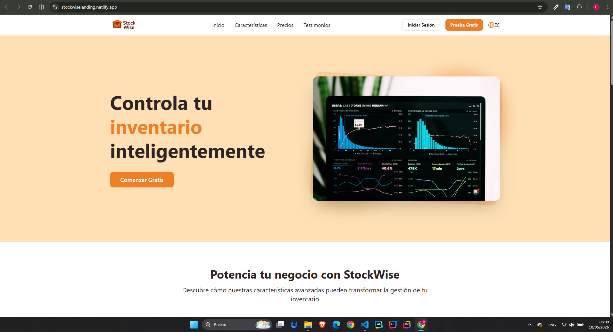

Link: [https://landing_page.com](https://stockwiselanding.netlify.app/)

### 5.2.3. Implemented Frontend-Web Application Evidence
Se detallan a continuación las interfaces que componen el Dashboard Web de Administración. Este componente está orientado al dueño de negocio o administrador, permitiendo una gestión centralizada y profunda del inventario que complementa la operación móvil. Las capturas muestran el panel de control con métricas en tiempo real, la tabla de gestión de productos con opciones avanzadas de filtrado y el módulo de administración de usuarios para la asignación de roles.

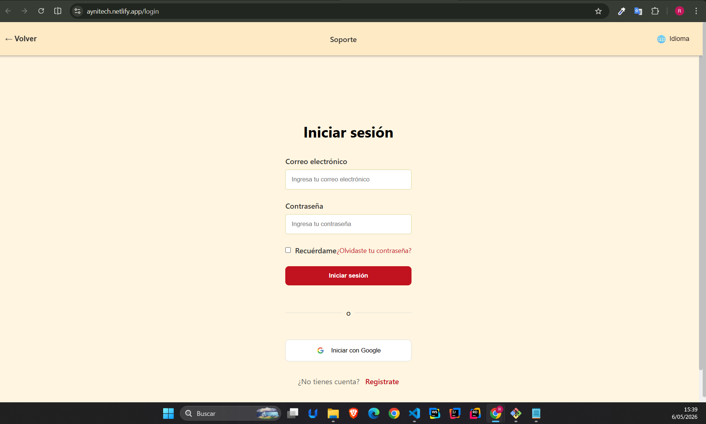

Link: [https://front_app.com](https://stocktrack-frontend.vercel.app/auth/register)

### 5.2.4. Acuerdo de Servicio - SaaS
El presente Acuerdo de Servicio regula los términos y condiciones bajo los cuales los usuarios acceden y utilizan la plataforma Stoq, una solución SaaS (Software as a Service) desarrollada para optimizar la gestión de inventarios y control de stock en pequeñas y medianas empresas (pymes), startups y bodegas especializadas en el Perú.

Este acuerdo se incorpora como parte integral de los "Términos y Condiciones" disponibles en el sitio web oficial de Stoq, y su aceptación es obligatoria para completar el registro y uso de las aplicaciones web y móviles.

#### 1. Definiciones
"Plataforma": Ecosistema compuesto por la aplicación móvil (Kotlin/Flutter), el dashboard web y el backend operado por el equipo de desarrollo de Stoq.

"Usuario": Persona natural o jurídica que accede a la plataforma en calidad de Administrador o Empleado.

"Comercio/Pyme": Negocio registrado que utiliza Stoq para la gestión de sus activos y mercadería.

"Cuenta": Perfil de acceso individual vinculado a una organización específica.

"Plan": Modalidad de suscripción (Freemium o Premium) que determina las funcionalidades activas y límites de registros.

#### 2. Objeto del Acuerdo
Stoq concede al usuario una licencia limitada, no exclusiva, intransferible y revocable para utilizar la plataforma exclusivamente con fines de gestión operativa de inventarios, logística y administración de ventas internas.

#### 3. Registro y Acceso
El uso de la plataforma requiere la creación de una cuenta mediante el formulario de registro oficial.

Cada usuario es responsable de la confidencialidad de sus credenciales (correo y contraseña) y del uso que se realice bajo su sesión.

Stoq se reserva el derecho de suspender o eliminar cuentas que realicen actividades fraudulentas o infrinjan la integridad del sistema.

#### 4. Tarifas y Planes
La plataforma opera bajo un modelo de suscripción SaaS. El Plan Premium permite el acceso a funciones avanzadas como el escaneo por código de barras, geolocalización de sedes y reportes de analítica profunda.

Las suscripciones se renuevan automáticamente al finalizar el periodo contratado, a menos que el usuario gestione la cancelación antes del vencimiento.

Ante el impago del servicio, Stoq se reserva el derecho de restringir el acceso a las funciones premium, manteniendo la cuenta en modo de consulta o bajo las limitaciones del plan gratuito.

#### 5. Propiedad Intelectual
Todos los derechos sobre la plataforma, incluyendo código fuente (Backend, Web y Mobile), diseño de interfaces (UI), marcas y algoritmos de predicción pertenecen exclusivamente al equipo de desarrollo de Stoq.

#### 6. Uso Aceptable
Queda expresamente prohibido:

- Manipular el código fuente o intentar realizar ingeniería inversa sobre las aplicaciones.

- Utilizar la plataforma para el registro de productos o actividades ilícitas según la normativa peruana.

- Interferir con la operación técnica de los Web Services o realizar ataques de denegación de servicio.

#### 7. Protección de Datos y Privacidad
Stoq garantiza el cumplimiento estricto de la Ley N.º 29733 - Ley de Protección de Datos Personales del Perú.

Los datos de inventario y personales serán tratados únicamente para fines operativos y estadísticos de la plataforma.

Los usuarios tienen derecho a acceder, rectificar o suprimir sus datos mediante los canales de soporte establecidos.

Se emplean medidas de seguridad técnicas (encriptación y tokens JWT) para proteger la información almacenada.

#### 8. Disponibilidad del Servicio
Stoq busca mantener una alta disponibilidad del servicio (99.5%). No obstante, el acceso puede interrumpirse temporalmente por mantenimientos programados o fallas en servicios de terceros (hosting/nube).

#### 9. Limitación de Responsabilidad
Stoq no se responsabiliza por errores en el conteo físico de productos, decisiones financieras basadas en los reportes generados o pérdidas de mercadería derivadas de un mal uso de la plataforma por parte del usuario.

#### 10. Modificaciones del Acuerdo
Stoq podrá actualizar este acuerdo para reflejar nuevas funcionalidades o cambios legales. Se notificará a los usuarios con al menos 5 días de anticipación a través de la aplicación o correo electrónico registrado.

### 5.2.5. Implemented Native-Mobile Application Evidence
Este apartado presenta la evidencia de la implementación de la aplicación móvil nativa. Se muestran capturas de la interfaz y funcionalidades principales, destacando la interacción del usuario y el correcto funcionamiento de la aplicación en el entorno móvil.

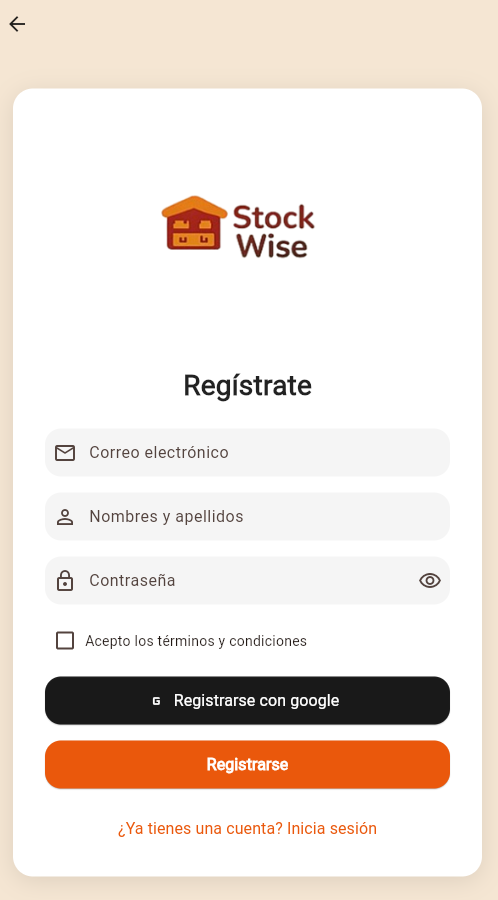
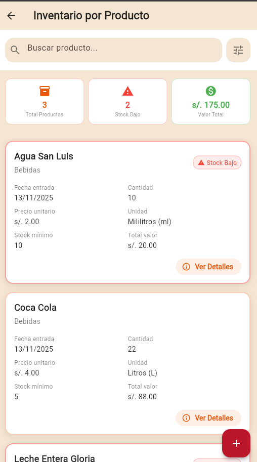

### 5.2.6. Implemented RESTful API and/or Serverless Backend Evidence
Este apartado muestra la evidencia de la implementación de una API RESTful, documentada mediante Swagger. Se presentan los endpoints disponibles, sus métodos HTTP, parámetros y respuestas, lo que facilita la comprensión, prueba e integración del backend del sistema.

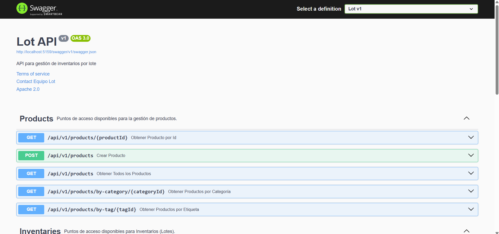
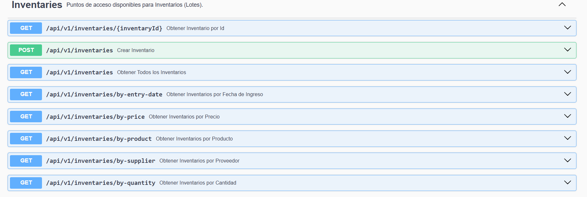

### 5.2.7. RESTful API documentation
La documentación de la API RESTful fue generada mediante **Swagger / OpenAPI**, accesible desde el entorno de desarrollo. A continuación se detallan todos los endpoints disponibles, agrupados por módulo funcional.

---

#### Authentication
*Gestión de autenticación y roles de usuario.*

| Método | Endpoint | Descripción |
|--------|----------|-------------|
| `POST` | `/api/v1/authentication/sign-up` | Registrar una nueva cuenta de usuario |
| `POST` | `/api/v1/authentication/sign-in` | Autenticar e iniciar sesión |
| `PUT` | `/api/v1/authentication/change-role` | Cambiar el rol de un usuario |

---

#### Products
*Puntos de acceso disponibles para la gestión de productos.*

| Método | Endpoint | Descripción |
|--------|----------|-------------|
| `GET` | `/api/v1/products/{productId}` | Obtener Producto por Id |
| `POST` | `/api/v1/products` | Crear Producto |
| `GET` | `/api/v1/products` | Obtener todos los Productos |
| `GET` | `/api/v1/products/by-category/{categoryId}` | Obtener Productos por Categoría |
| `GET` | `/api/v1/products/by-tag/{tagId}` | Obtener Productos por Etiqueta |

---

#### Combos
*Puntos de acceso disponibles para la gestión de combos (kits).*

| Método | Endpoint | Descripción |
|--------|----------|-------------|
| `GET` | `/api/v1/combos/{comboId}` | Obtener Combo por Id |
| `POST` | `/api/v1/combos` | Crear Combo |
| `GET` | `/api/v1/combos` | Obtener todos los Combos |

---

#### Tags
*Puntos de acceso para la gestión de etiquetas.*

| Método | Endpoint | Descripción |
|--------|----------|-------------|
| `GET` | `/api/v1/tags` | Obtener todas las etiquetas |

---

#### Units
*Puntos de acceso para la gestión de unidades de medida.*

| Método | Endpoint | Descripción |
|--------|----------|-------------|
| `GET` | `/api/v1/units` | Obtener todas las unidades de medida |

---

#### Sales
*Operaciones de ventas con integración automática de inventario y reportes.*

| Método | Endpoint | Descripción |
|--------|----------|-------------|
| `POST` | `/api/v1/sales` | Realizar venta con stock automático |
| `GET` | `/api/v1/sales/{id}` | Obtener venta por ID |
| `GET` | `/api/v1/sales/check-stock/{productId}` | Verificar stock disponible |

---

#### Inventory
*Operaciones del inventario general, por producto y por lote.*

| Método | Endpoint | Descripción |
|--------|----------|-------------|
| `GET` | `/api/v1/inventory` | Obtener todos los registros de inventario |
| `POST` | `/api/v1/inventory/by-product` | Crear Inventario por Producto |
| `GET` | `/api/v1/inventory/by-product` | Listar todos los Inventarios por Producto con filtros |
| `GET` | `/api/v1/inventory/by-product/{id}` | Obtener Inventario por Producto por ID |
| `DELETE` | `/api/v1/inventory/by-product/{id}` | Eliminar Inventario por Producto por ID |
| `POST` | `/api/v1/inventory/by-batch` | Crear Inventario por Lote |
| `GET` | `/api/v1/inventory/by-batch` | Listar todos los Inventarios por Lote con filtros |
| `GET` | `/api/v1/inventory/by-batch/{id}` | Obtener Inventario por Lote por ID |
| `DELETE` | `/api/v1/inventory/by-batch/{id}` | Eliminar Inventario por Lote por ID |

---

#### StockAlert
*Gestión de alertas de stock y nivel de inventario.*

| Método | Endpoint | Descripción |
|--------|----------|-------------|
| `GET` | `/api/alerts` | Obtener alertas de stock |
| `GET` | `/api/alerts/by-category` | Obtener alertas por categoría |
| `GET` | `/api/alerts/summary` | Obtener resumen de alertas |

---

#### Report
*Puntos de acceso disponibles para la gestión de reportes de categoría y de stock promedio.*

| Método | Endpoint | Descripción |
|--------|----------|-------------|
| `GET` | `/api/v1/reports` | Obtener todos los reportes generales |
| `POST` | `/api/v1/reports/category` | Crear CategoryReport |
| `GET` | `/api/v1/reports/category` | Listar CategoryReports |
| `GET` | `/api/v1/reports/category/{id}` | Obtener CategoryReport por ID |
| `GET` | `/api/v1/reports/category/by-date` | Filtrar CategoryReports por fecha |
| `POST` | `/api/v1/reports/stock-average` | Crear StockAverageReport |
| `GET` | `/api/v1/reports/stock-average` | Listar StockAverageReports |
| `GET` | `/api/v1/reports/stock-average/{id}` | Obtener StockAverageReport por ID |
| `GET` | `/api/v1/reports/stock-average/by-date` | Filtrar StockAverageReports por fecha |

### 5.2.8. Team Collaboration Insights

## 5.3. Video About-the-Product
StockWise es una aplicación digital y móvil creada para optimizar la gestión de inventarios, permitiendo controlar de manera automática los vencimientos, los niveles mínimos de stock y la organización de kits de productos. Su propuesta está dirigida principalmente a pequeños y medianos negocios, ofreciéndoles una solución práctica, económica y sencilla de utilizar, con el objetivo de disminuir pérdidas y mejorar la toma de decisiones.

A través de la aplicación, los usuarios pueden escanear productos directamente desde su celular, recibir notificaciones anticipadas cuando un artículo está próximo a agotarse o vencer, y acceder a un panel en tiempo real con métricas importantes y reportes completos. En el video se observa cómo el usuario registra productos, verifica el estado del inventario y confirma pedidos de forma rápida con un solo toque, evidenciando la eficiencia y facilidad de uso del sistema. Según comenta uno de los usuarios: “StockWise me ha ayudado a mantener mi inventario organizado sin invertir demasiado tiempo; ahora todo está al alcance de un clic y nunca más se me venció un producto”.

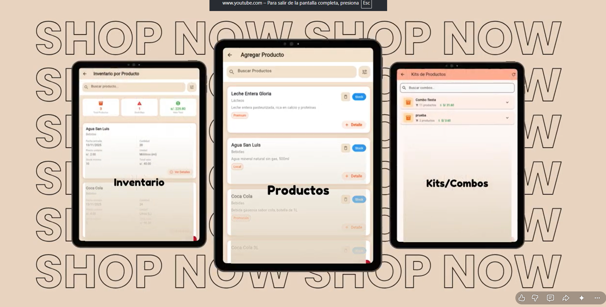

Link: [https://Video_About_Product.com](https://youtu.be/OPvuExjrxCY)


# Part II: Verification, Validation & Pipeline

# Capitulo VI: Product Verification & Validation

## 6.1. Testing Suites & Validation

### 6.1.1. Core Entities Unit Tests

Se muestra evidencia de los test a las historios de usuario del proyecto

US01 - Crear producto válido: valida que el agregado Product se construye correctamente con datos completos y normaliza los valores de texto.


US01 / US19 - Stock inicial y mínimo: valida que minStock acepta valores válidos, incluyendo cero, y rechaza negativos.


US19 - Configurar stock mínimo: valida que el producto permita actualizar el límite mínimo de stock correctamente.


US03 - Registrar salida de producto: valida que Batch descuenta stock correctamente al registrar una salida.


US14 - Registrar devolución: valida que el stock aumente al registrar una devolución.


### 6.1.2. Core Integration Tests
En esta sección se presentan las pruebas de integración desarrolladas para validar la correcta comunicación e interacción entre los componentes principales de StockWise, garantizando el funcionamiento coordinado y consistente de los distintos módulos que conforman el sistema.

### Información General Test-1

| Elemento | Descripción |
|---|---|
| Clase de Test | `ProductControllerIntegrationTest` |
| Módulo(s) | inventory, shared, iam - US12, US13 |
| Descripción General | Validar la integración completa del módulo de productos dentro del sistema StockTrack, comprobando que las operaciones relacionadas con la gestión de productos funcionen correctamente desde la capa HTTP hasta la persistencia en base de datos. |


### Escenario 1 

| Evidencia | Descripción |
|---|---|
| 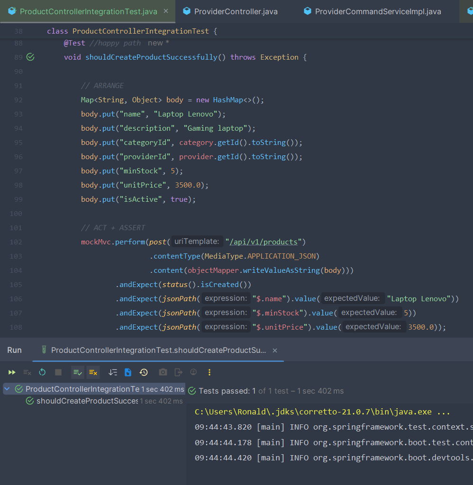  | Este escenario valida que el sistema pueda registrar correctamente un nuevo producto cuando se envían datos válidos, verificando el flujo completo desde la solicitud HTTP hasta la persistencia en base de datos. Se comprueba la integración entre controller, servicios de aplicación, aggregate Product, repositorios JPA y la base de datos H2. Esta validación es importante porque asegura que la funcionalidad principal de creación de productos opere correctamente y que la información registrada mantenga consistencia dentro del inventario. |

### Escenario 2

| Evidencia | Descripción |
|---|---|
| 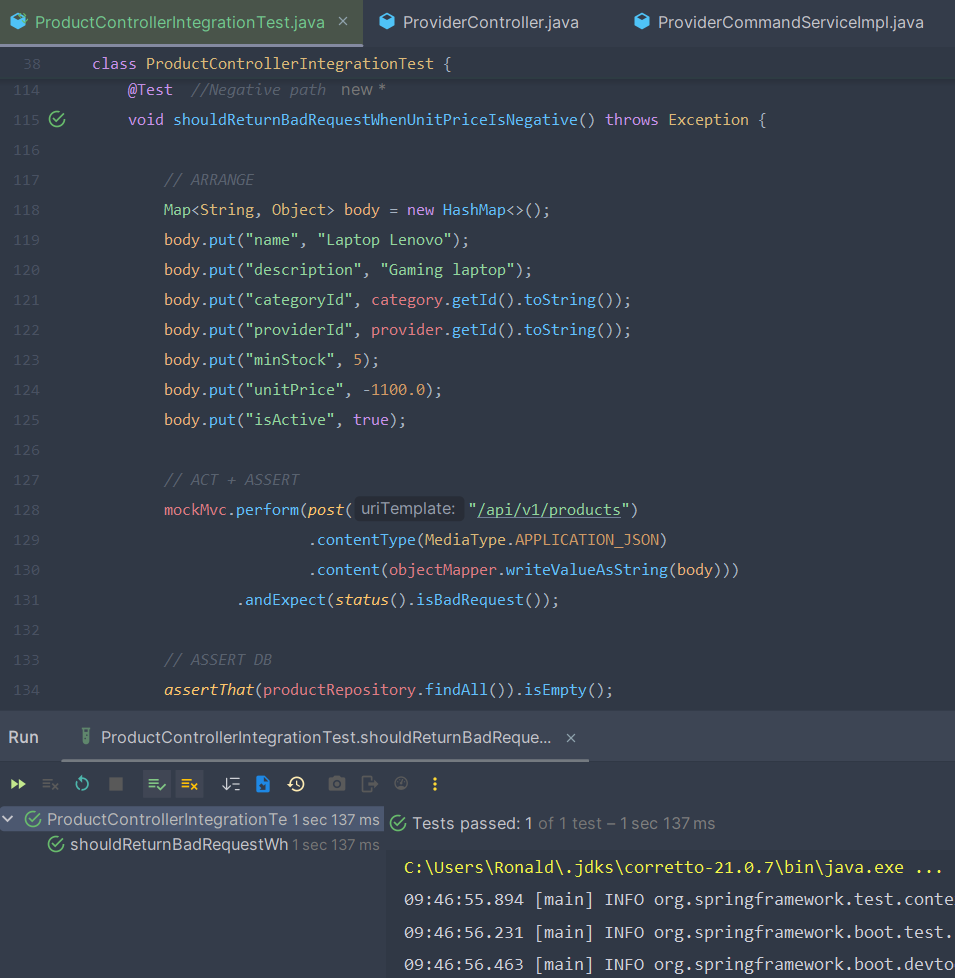 | Este escenario valida que el sistema rechace productos con un precio unitario inválido, específicamente valores negativos, comprobando que las reglas de negocio definidas en el dominio sean respetadas antes de persistir información. La prueba garantiza que las validaciones del aggregate y el manejo de excepciones funcionen correctamente a través de toda la integración del sistema. Esto es importante para proteger la integridad de los datos financieros y evitar inconsistencias en cálculos de ventas, reportes y valorización de inventario. |

### Escenario 3 
| Evidencia | Descripción |
|---|---|
| 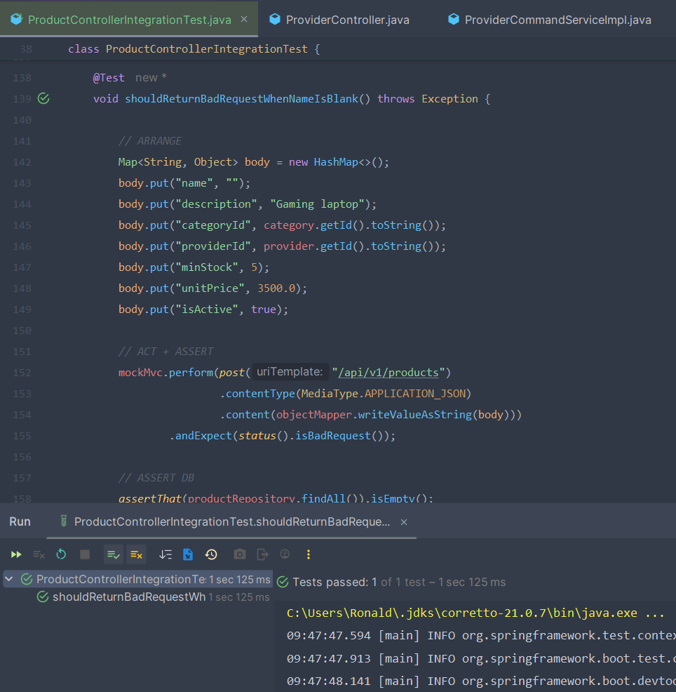 | Este escenario verifica que el sistema no permita registrar productos sin nombre o con nombres vacíos, validando las restricciones obligatorias del dominio y el correcto manejo de respuestas HTTP ante entradas inválidas. La prueba asegura que los datos esenciales del catálogo sean obligatorios y que el sistema prevenga registros incompletos que puedan afectar búsquedas, clasificación de productos y operaciones posteriores dentro del inventario.|

### Escenario 4 

| Evidencia | Descripción |
|---|---|
| 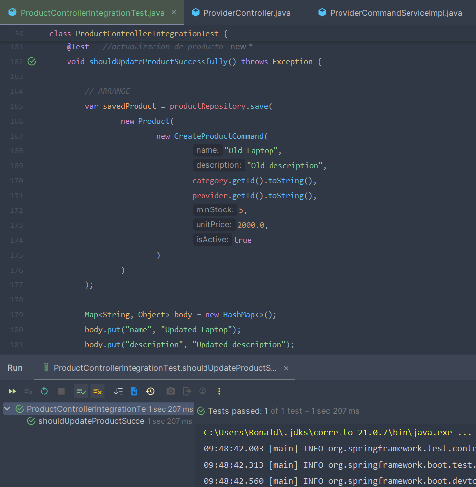 | Este escenario valida que el sistema pueda actualizar correctamente la información de un producto existente, verificando la integración entre el endpoint REST, los servicios de actualización, el aggregate Product, el repositorio JPA y la persistencia en base de datos. Se comprueba que los cambios enviados sean reflejados correctamente y que las validaciones del dominio continúen aplicándose durante la edición. Esta validación es importante porque garantiza que la información del catálogo pueda mantenerse actualizada y consistente a lo largo del tiempo. |

---
### Información General Test-2

| Elemento | Descripción |
|---|---|
| Clase de Test | `ProviderProductIntegrationTest` |
| Módulo(s) | inventory, shared - US24, US26 |
| Descripción General | Validar la integración entre los módulos de proveedores y productos, asegurando que las relaciones funcionales entre ambos aggregates se comporten correctamente dentro del sistema. |


### Escenario 1 

| Evidencia | Descripción |
|---|---|
| 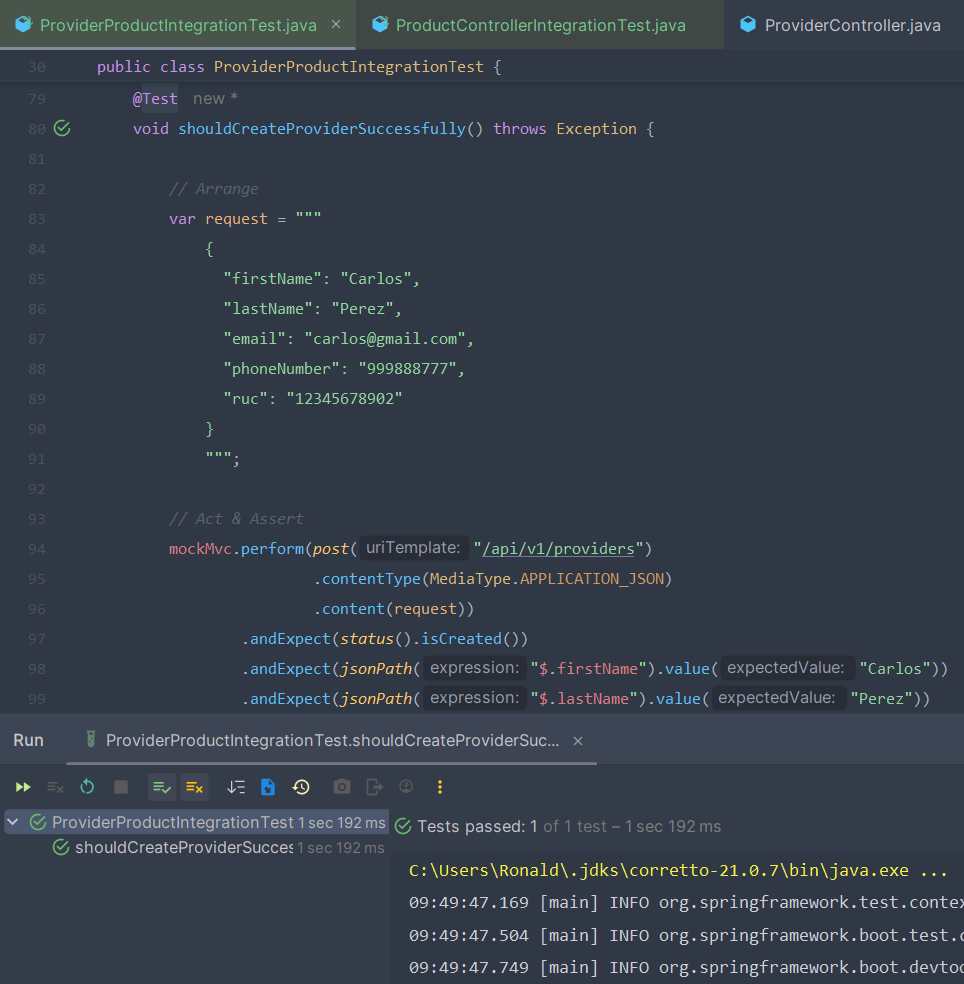 | Este escenario valida que el sistema pueda registrar correctamente un nuevo proveedor utilizando datos válidos, comprobando el flujo completo desde la solicitud HTTP hasta la persistencia en base de datos. La prueba verifica la integración entre controller, servicios de aplicación, aggregate Provider, value objects, repositorios JPA y la base de datos H2. Esta validación es importante porque garantiza que los proveedores puedan ser gestionados correctamente y que la información crítica de abastecimiento quede almacenada de manera consistente y segura. |

### Escenario 2

| Evidencia | Descripción |
|---|---|
| 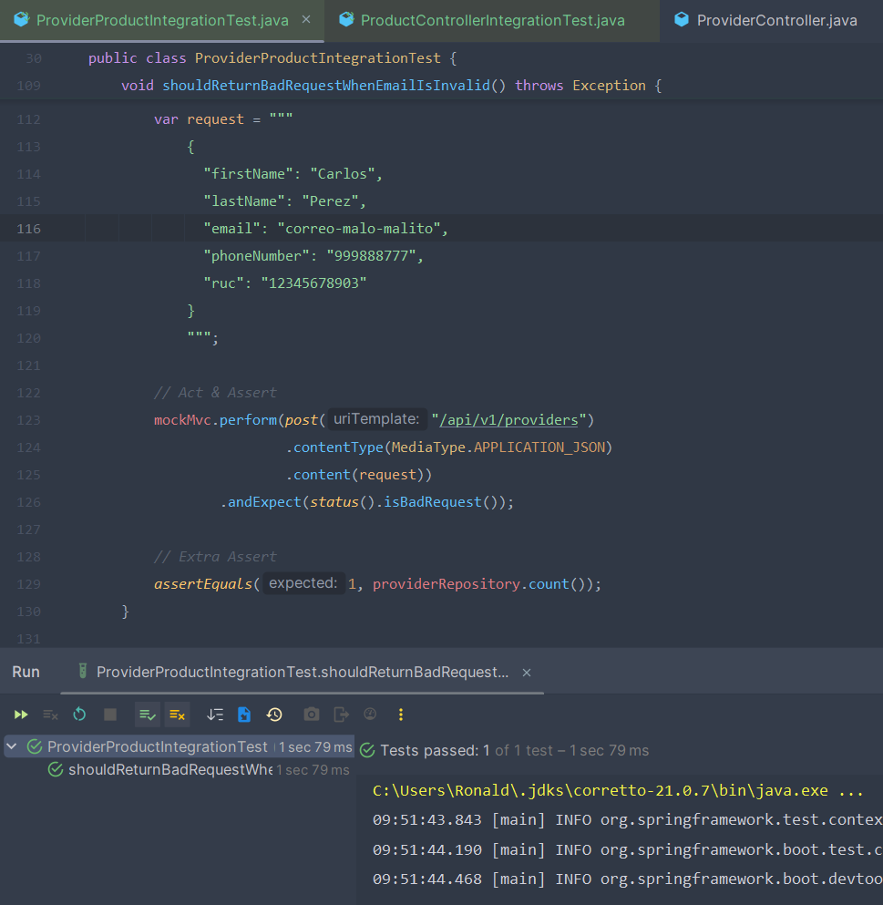 | Este escenario valida que el sistema rechace proveedores con correos electrónicos inválidos, comprobando que las reglas de validación implementadas en los value objects del dominio funcionen correctamente durante todo el flujo de integración. La prueba asegura que las excepciones generadas por datos inconsistentes sean manejadas adecuadamente y que la información inválida no llegue a persistirse en la base de datos. Esta validación es importante porque protege la calidad de los datos y evita problemas posteriores relacionados con notificaciones, contacto con proveedores y trazabilidad del sistema. |

### Escenario 3

| Evidencia | Descripción |
|---|---|
| 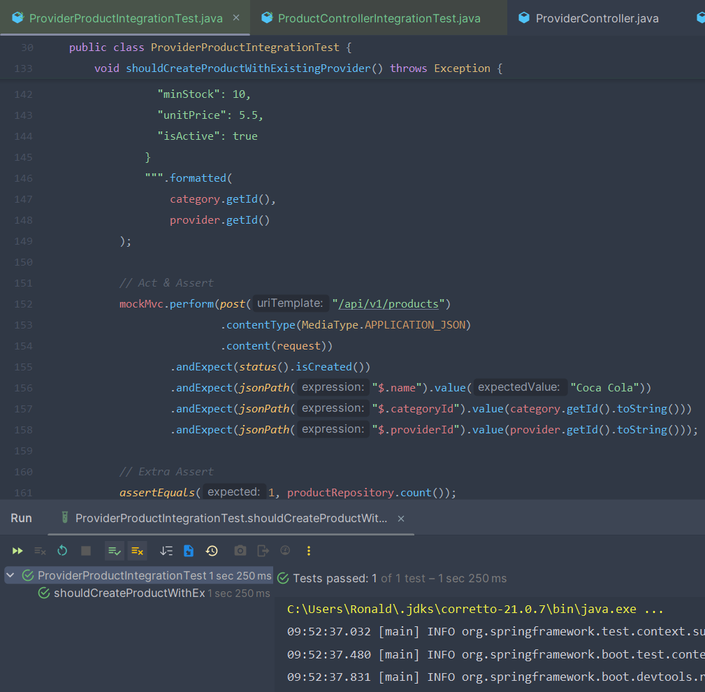 | Este escenario valida la integración funcional entre los módulos de productos y proveedores, verificando que un producto solo pueda registrarse cuando se encuentra asociado a un proveedor existente dentro del sistema. La prueba comprueba la interacción entre múltiples aggregates, servicios de aplicación, repositorios y validaciones de negocio relacionadas con integridad referencial. Esta validación es importante porque asegura consistencia entre entidades del inventario y evita relaciones inválidas que puedan afectar procesos de compras, abastecimiento y trazabilidad de productos. |

---

### 6.1.3. Core Behavior-Driven Development

En esta sección se presentan las pruebas Behavior-Driven Development desarrolladas para validar el comportamiento esperado de las funcionalidades principales de StockWise desde la perspectiva del usuario. El desarrollo de estas pruebas se basó en las User Stories priorizadas del Product Backlog, específicamente US01 - Registrar producto nuevo y US05 - Generar alertas por bajo stock, ambas pertenecientes al epic EP01 - Funciones básicas de inventario. Estas historias fueron seleccionadas porque representan funciones centrales del sistema de inventario.

#### Evidence 1: Product Registration Feature File

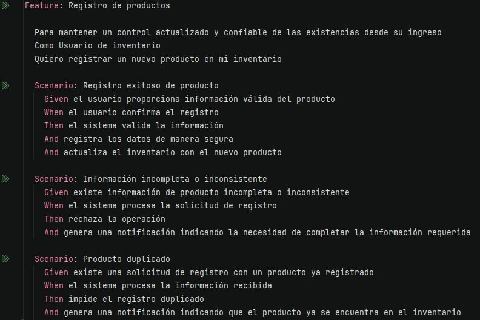

#### Evidence 2: Low Stock Alert Feature File

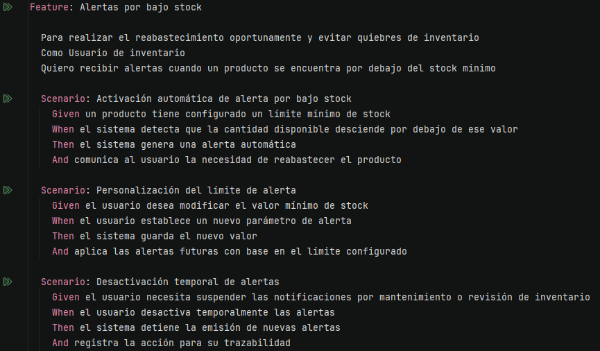

#### Evidence 3: BDD Test Execution Results

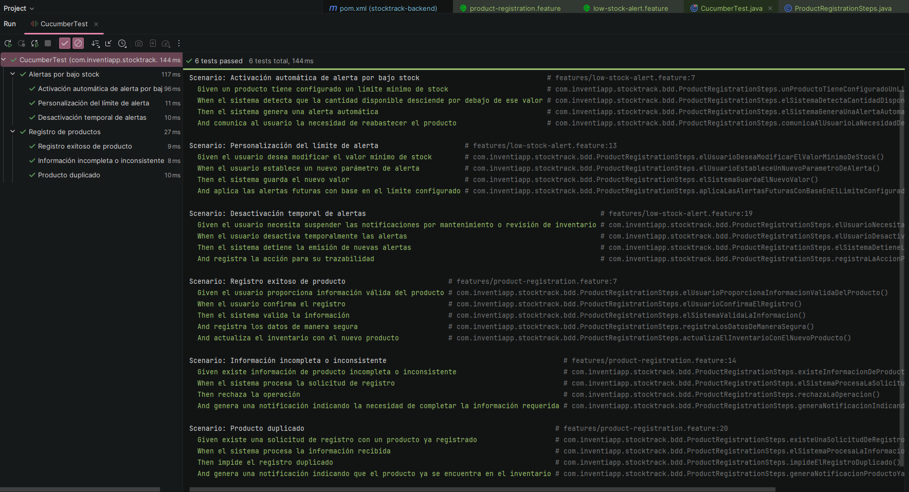


### 6.1.4. Core System Tests

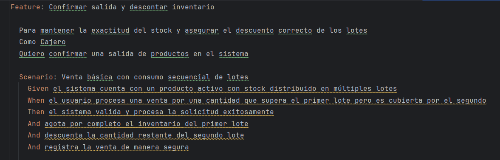

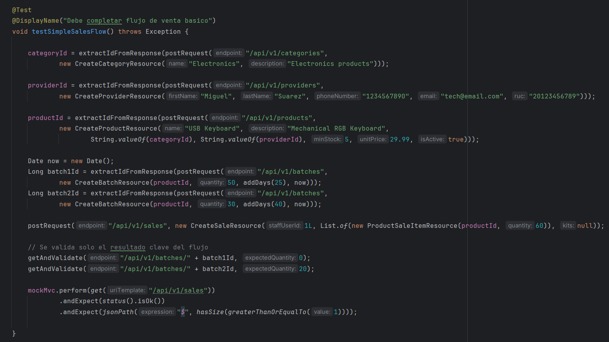

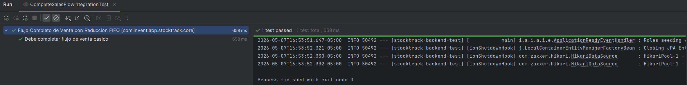


# Capitulo VII: DevOps Practices

## 7.1. Continuous Integration

### 7.1.1. Tools and Practices

### 7.1.2. Build & Test Suite Pipeline Components

## 7.2. Continuous Delivery

### 7.2.1. Tools and Practices

### 7.2.2. Stages Deployment Pipeline Components

## 7.3. Continuous deployment

### 7.3.1. Tools and Practices

### 7.3.2. Production Deployment Pipeline Components

## 7.4. Continuous Monitoring

### 7.4.1. Tools and Practices

### 7.4.2. Monitoring Pipeline Components

### 7.4.3. Alerting Pipeline Components

### 7.4.4. Notification Pipeline Components

# Part III: Experiment-Driven Lifecycle

# Capitulo VIII: Experiment-Driven Development

## 8.1. Experiment Planning

### 8.1.1. As-Is Summary

### 8.1.2. Raw Material: Assumptions, Knowledge Gaps, Ideas, Claims

### 8.1.3. Experiment-Ready Questions

### 8.1.4. Question Backlog

### 8.1.5. Experiment Cards

## 8.2. Experiment Design

### 8.2.1. Hypotheses

### 8.2.2. Domain Business Metrics

### 8.2.3. Measures

### 8.2.4. Conditions

### 8.2.5. Scale Calculations and Decisions

### 8.2.6. Methods Selection

### 8.2.7. Data Analytics: Goals, KPIs and Metrics Selection

### 8.2.8. Web and Mobile Tracking Plan

## 8.3. Experimentation

### 8.3.1. To-Be User Stories

### 8.3.2. To-Be Product Backlog

### 8.3.3. Pipeline-supported, Experiment-Driven To-Be Software Platform Lifecycle

#### 8.3.3.1. To-Be Sprint Backlogs

#### 8.3.3.2. Implemented To-Be Landing Page Evidence

### 5.2.3. Implemented Frontend-Web Application Evidence

#### 8.3.3.4. Implemented To-Be Native-Mobile Application Evidence

#### 8.3.3.5. Implemented To-Be RESTful API and/or Serverless Backend Evidence

#### 8.3.3.6. Team Collaboration Insights

### 8.3.4. To-Be Validation Interviews

#### 8.3.4.1. Diseno de Entrevistas

#### 8.3.4.2. Registro de Entrevistas

## 8.4. Experiment Aftermath & Analysis

### 8.4.1. Analysis and Interpretation of Results

### 8.4.2. Re-scored and Re-prioritized Question Backlog

## 8.5. Continuous Learning

### 8.5.1. Shareback Session Artifacts: Learning Workflow

## 8.6. To-Be Software Platform Pre-launch

### 8.6.1. About-the-Product Intro Video

# Conclusiones

# Conclusiones y recomendaciones

# Bibliografia

# Anexos
