

  

<h2 align="center">Universidad Peruana de Ciencias Aplicadas</h2>
<h3 align="center">Ingeniería de Software</h3>

    Periodo: 202610  
    1ASI0732 | Diseño de Experimentos de Ingeniería de Software  
    NRC: 16879  
    Docente: Alex Humberto Sánchez Ponce  

    <h5><strong>Informe del Trabajo Final</strong></h5>
    Startup: Stoq  
    Producto: StockWise  

    <h5><strong>Integrantes</strong></h5>
    

        U – Luciana Carolina Choquehuanca Nuñez  
        U – Ronald Joel Peralta Chipa  
        U202210973 – Sanchez Rios, Camila Cristina  
        U – Fabiola Del Rocio Saldaña Ayalan  
        U –   
    

    
<em>Abril, 2026</em>

 

# Registro de Versiones del Informe

| Version | Fecha | Autor | Descripcion de modificaciones |
|---|---|---|---|
|  |  |  |  |

# Project Report Collaboration Insights

## Enlace del repositorio del informe

## Enlace de los repositorios de la organizacion

# Contenido

## Tabla de contenidos

- [Registro de Versiones del Informe](#registro-de-versiones-del-informe)
- [Project Report Collaboration Insights](#project-report-collaboration-insights)
  - [Enlace del repositorio del informe](#enlace-del-repositorio-del-informe)
  - [Enlace de los repositorios de la organizacion](#enlace-de-los-repositorios-de-la-organizacion)
- [Contenido](#contenido)
  - [Tabla de contenidos](#tabla-de-contenidos)
- [Student Outcome](#student-outcome)
- [Part I: As-Is Software Project](#part-i-as-is-software-project)
- [Capitulo I: Introduccion](#capitulo-i-introduccion)
  - [1.1. Startup Profile](#11-startup-profile)
    - [1.1.1. Descripcion de la Startup](#111-descripcion-de-la-startup)
    - [1.1.2. Perfiles de integrantes del equipo](#112-perfiles-de-integrantes-del-equipo)
  - [1.2. Solution Profile](#12-solution-profile)
    - [1.2.1. Antecedentes y problematica](#121-antecedentes-y-problematica)
    - [1.2.2. Lean UX Process](#122-lean-ux-process)
      - [1.2.2.1. Lean UX Problem Statements](#1221-lean-ux-problem-statements)
      - [1.2.2.2. Lean UX Assumptions](#1222-lean-ux-assumptions)
      - [1.2.2.3. Lean UX Hypothesis Statements](#1223-lean-ux-hypothesis-statements)
      - [1.2.2.4. Lean UX Canvas](#1224-lean-ux-canvas)
  - [1.3. Segmentos objetivo](#13-segmentos-objetivo)
- [Capitulo II: Requirements Elicitation \& Analysis](#capitulo-ii-requirements-elicitation--analysis)
  - [2.1. Competidores](#21-competidores)
    - [2.1.1. Analisis competitivo](#211-analisis-competitivo)
    - [2.1.2. Estrategias y tacticas frente a competidores](#212-estrategias-y-tacticas-frente-a-competidores)
  - [2.2. Entrevistas](#22-entrevistas)
    - [2.2.1. Diseno de entrevistas](#221-diseno-de-entrevistas)
    - [2.2.2. Registro de entrevistas](#222-registro-de-entrevistas)
    - [2.2.3. Analisis de entrevistas](#223-analisis-de-entrevistas)
  - [2.3. Needfinding](#23-needfinding)
    - [2.3.1. User Personas](#231-user-personas)
    - [2.3.2. User Task Matrix](#232-user-task-matrix)
    - [2.3.3. User Journey Mapping](#233-user-journey-mapping)
    - [2.3.4. Empathy Mapping](#234-empathy-mapping)
    - [2.3.5. As-is Scenario Mapping](#235-as-is-scenario-mapping)
  - [2.4. Ubiquitous Language](#24-ubiquitous-language)
- [Capitulo III: Requirements Specification](#capitulo-iii-requirements-specification)
  - [3.1. To-Be Scenario Mapping](#31-to-be-scenario-mapping)
  - [3.2. User Stories](#32-user-stories)
  - [3.3. Product Backlog](#33-product-backlog)
  - [3.4. Impact Mapping](#34-impact-mapping)
- [Capitulo IV: Product Design](#capitulo-iv-product-design)
  - [4.1. Style Guidelines](#41-style-guidelines)
    - [4.1.1. General Style Guidelines](#411-general-style-guidelines)
    - [4.1.2. Web Style Guidelines](#412-web-style-guidelines)
    - [4.1.3. Mobile Style Guidelines](#413-mobile-style-guidelines)
      - [4.1.3.1. iOS Mobile Style Guidelines](#4131-ios-mobile-style-guidelines)
      - [4.1.3.2. Android Mobile Style Guidelines](#4132-android-mobile-style-guidelines)
  - [4.2. Information Architecture](#42-information-architecture)
    - [4.2.1. Organization Systems](#421-organization-systems)
    - [4.2.2. Labeling Systems](#422-labeling-systems)
    - [4.2.3. SEO Tags and Meta Tags](#423-seo-tags-and-meta-tags)
    - [4.2.4. Searching Systems](#424-searching-systems)
    - [4.2.5. Navigation Systems](#425-navigation-systems)
  - [4.3. Landing Page UI Design](#43-landing-page-ui-design)
    - [4.3.1. Landing Page Wireframe](#431-landing-page-wireframe)
    - [4.3.2. Landing Page Mock-up](#432-landing-page-mock-up)
  - [4.4. Mobile Applications UX/UI Design](#44-mobile-applications-uxui-design)
    - [4.4.1. Mobile Applications Wireframes](#441-mobile-applications-wireframes)
    - [4.4.2. Mobile Applications Wireflow Diagrams](#442-mobile-applications-wireflow-diagrams)
    - [4.4.3. Mobile Applications Mock-ups](#443-mobile-applications-mock-ups)
    - [4.4.4. Mobile Applications User Flow Diagrams](#444-mobile-applications-user-flow-diagrams)
  - [4.5. Mobile Applications Prototyping](#45-mobile-applications-prototyping)
    - [4.5.1. Android Mobile Applications Prototyping](#451-android-mobile-applications-prototyping)
    - [4.5.2. iOS Mobile Applications Prototyping](#452-ios-mobile-applications-prototyping)
  - [4.6. Web Applications UX/UI Design](#46-web-applications-uxui-design)
    - [4.6.1. Web Applications Wireframes](#461-web-applications-wireframes)
    - [4.6.2. Web Applications Wireflow Diagrams](#462-web-applications-wireflow-diagrams)
    - [4.6.3. Web Applications Mock-ups](#463-web-applications-mock-ups)
    - [4.6.4. Web Applications User Flow Diagrams](#464-web-applications-user-flow-diagrams)
  - [4.7. Web Applications Prototyping](#47-web-applications-prototyping)
  - [4.8. Domain-Driven Software Architecture](#48-domain-driven-software-architecture)
    - [4.8.1. Software Architecture Context Diagram](#481-software-architecture-context-diagram)
    - [4.8.2. Software Architecture Container Diagrams](#482-software-architecture-container-diagrams)
    - [4.8.3. Software Architecture Components Diagrams](#483-software-architecture-components-diagrams)
  - [4.9. Software Object-Oriented Design](#49-software-object-oriented-design)
    - [4.9.1. Class Diagrams](#491-class-diagrams)
    - [4.9.2. Class Dictionary](#492-class-dictionary)
  - [4.10. Database Design](#410-database-design)
    - [4.10.1. Relational/Non-Relational Database Diagram](#4101-relationalnon-relational-database-diagram)
- [Capitulo V: Product Implementation](#capitulo-v-product-implementation)
  - [5.1. Software Configuration Management](#51-software-configuration-management)
    - [5.1.1. Software Development Environment Configuration](#511-software-development-environment-configuration)
    - [5.1.2. Source Code Management](#512-source-code-management)
    - [5.1.3. Source Code Style Guide \& Conventions](#513-source-code-style-guide--conventions)
    - [5.1.4. Software Deployment Configuration](#514-software-deployment-configuration)
  - [5.2. Product Implementation \& Deployment](#52-product-implementation--deployment)
    - [5.2.1. Sprint Backlogs](#521-sprint-backlogs)
    - [5.2.2. Implemented Landing Page Evidence](#522-implemented-landing-page-evidence)
    - [5.2.3. Implemented Frontend-Web Application Evidence](#523-implemented-frontend-web-application-evidence)
    - [5.2.4. Acuerdo de Servicio - SaaS](#524-acuerdo-de-servicio---saas)
    - [5.2.5. Implemented Native-Mobile Application Evidence](#525-implemented-native-mobile-application-evidence)
    - [5.2.6. Implemented RESTful API and/or Serverless Backend Evidence](#526-implemented-restful-api-andor-serverless-backend-evidence)
    - [5.2.7. RESTful API documentation](#527-restful-api-documentation)
    - [5.2.8. Team Collaboration Insights](#528-team-collaboration-insights)
  - [5.3. Video About-the-Product](#53-video-about-the-product)
- [Part II: Verification, Validation \& Pipeline](#part-ii-verification-validation--pipeline)
- [Capitulo VI: Product Verification \& Validation](#capitulo-vi-product-verification--validation)
  - [6.1. Testing Suites \& Validation](#61-testing-suites--validation)
    - [6.1.1. Core Entities Unit Tests](#611-core-entities-unit-tests)
    - [6.1.2. Core Integration Tests](#612-core-integration-tests)
    - [Información General Test-1](#información-general-test-1)
    - [Escenario 1](#escenario-1)
    - [Escenario 2](#escenario-2)
    - [Escenario 3](#escenario-3)
    - [Escenario 4](#escenario-4)
    - [Información General Test-2](#información-general-test-2)
    - [Escenario 1](#escenario-1-1)
    - [Escenario 2](#escenario-2-1)
    - [Escenario 3](#escenario-3-1)
    - [Información General Test-3](#información-general-test-3)
    - [Escenario 1](#escenario-1-2)
    - [Escenario 2](#escenario-2-2)
    - [Escenario 3](#escenario-3-2)
    - [Información General Test-4](#información-general-test-4)
    - [Escenario 1](#escenario-1-3)
    - [Escenario 2](#escenario-2-3)
    - [Información General Test-5](#información-general-test-5)
    - [Escenario 1](#escenario-1-4)
    - [Escenario 2](#escenario-2-4)
    - [Escenario 3](#escenario-3-3)
    - [6.1.3. Core Behavior-Driven Development](#613-core-behavior-driven-development)
      - [Evidence 1: Product Registration Feature File](#evidence-1-product-registration-feature-file)
      - [Evidence 2: Low Stock Alert Feature File](#evidence-2-low-stock-alert-feature-file)
      - [Evidence 3: BDD Test Execution Results](#evidence-3-bdd-test-execution-results)
    - [6.1.4. Core System Tests](#614-core-system-tests)
  - [6.2. Static testing \& Verification](#62-static-testing--verification)
    - [6.2.1. Static Code Analysis](#621-static-code-analysis)
      - [6.2.1.1. .Coding standard \& Code conventions](#6211-coding-standard--code-conventions)
      - [6.2.1.2. Code Quality \& Code Security.](#6212-code-quality--code-security)
    - [6.2.2. Reviews](#622-reviews)
  - [6.3. Validation Interviews.](#63-validation-interviews)
    - [6.3.1. Diseño de Entrevistas.](#631-diseño-de-entrevistas)
    - [6.3.2. Registro de Entrevistas.](#632-registro-de-entrevistas)
    - [6.3.3. Evaluaciones segun heuristicas.](#633-evaluaciones-segun-heuristicas)
  - [6.4. Auditoria de Experiencias de Usuario.](#64-auditoria-de-experiencias-de-usuario)
    - [6.4.1. Auditoria realizada.](#641-auditoria-realizada)
      - [6.4.1.1. Información del grupo auditado.](#6411-información-del-grupo-auditado)
      - [6.4.1.2. Cronograma de auditoria realizada.](#6412-cronograma-de-auditoria-realizada)
      - [6.4.1.3. Contenido de auditoría realizada.](#6413-contenido-de-auditoría-realizada)
    - [6.4.2. Auditoria recibida.](#642-auditoria-recibida)
      - [6.4.2.1. Información del grupo auditor.](#6421-información-del-grupo-auditor)
      - [6.4.2.2. Cronograma de auditoría recibida.](#6422-cronograma-de-auditoría-recibida)
      - [6.4.2.3. Contenido de auditoría recibida.](#6423-contenido-de-auditoría-recibida)
      - [6.4.2.4. Resumen de modificaciones para subsanar hallazgos.](#6424-resumen-de-modificaciones-para-subsanar-hallazgos)
- [Capitulo VII: DevOps Practices](#capitulo-vii-devops-practices)
  - [7.1. Continuous Integration](#71-continuous-integration)
    - [7.1.1. Tools and Practices](#711-tools-and-practices)
    - [7.1.2. Build \& Test Suite Pipeline Components](#712-build--test-suite-pipeline-components)
  - [7.2. Continuous Delivery](#72-continuous-delivery)
    - [7.2.1. Tools and Practices](#721-tools-and-practices)
    - [7.2.2. Stages Deployment Pipeline Components](#722-stages-deployment-pipeline-components)
  - [7.3. Continuous deployment](#73-continuous-deployment)
    - [7.3.1. Tools and Practices](#731-tools-and-practices)
    - [7.3.2. Production Deployment Pipeline Components](#732-production-deployment-pipeline-components)
  - [7.4. Continuous Monitoring](#74-continuous-monitoring)
    - [7.4.1. Tools and Practices](#741-tools-and-practices)
    - [7.4.2. Monitoring Pipeline Components](#742-monitoring-pipeline-components)
    - [7.4.3. Alerting Pipeline Components](#743-alerting-pipeline-components)
    - [7.4.4. Notification Pipeline Components](#744-notification-pipeline-components)
- [Part III: Experiment-Driven Lifecycle](#part-iii-experiment-driven-lifecycle)
- [Capitulo VIII: Experiment-Driven Development](#capitulo-viii-experiment-driven-development)
  - [8.1. Experiment Planning](#81-experiment-planning)
    - [8.1.1. As-Is Summary](#811-as-is-summary)
    - [8.1.2. Raw Material: Assumptions, Knowledge Gaps, Ideas, Claims](#812-raw-material-assumptions-knowledge-gaps-ideas-claims)
    - [8.1.3. Experiment-Ready Questions](#813-experiment-ready-questions)
    - [8.1.4. Question Backlog](#814-question-backlog)
    - [8.1.5. Experiment Cards](#815-experiment-cards)
  - [8.2. Experiment Design](#82-experiment-design)
    - [8.2.1. Hypotheses](#821-hypotheses)
    - [8.2.2. Domain Business Metrics](#822-domain-business-metrics)
    - [8.2.3. Measures](#823-measures)
    - [8.2.4. Conditions](#824-conditions)
    - [8.2.5. Scale Calculations and Decisions](#825-scale-calculations-and-decisions)
    - [8.2.6. Methods Selection](#826-methods-selection)
    - [8.2.7. Data Analytics: Goals, KPIs and Metrics Selection](#827-data-analytics-goals-kpis-and-metrics-selection)
    - [8.2.8. Web and Mobile Tracking Plan](#828-web-and-mobile-tracking-plan)
  - [8.3. Experimentation](#83-experimentation)
    - [8.3.1. To-Be User Stories](#831-to-be-user-stories)
    - [8.3.2. To-Be Product Backlog](#832-to-be-product-backlog)
    - [8.3.3. Pipeline-supported, Experiment-Driven To-Be Software Platform Lifecycle](#833-pipeline-supported-experiment-driven-to-be-software-platform-lifecycle)
      - [8.3.3.1. To-Be Sprint Backlogs](#8331-to-be-sprint-backlogs)
      - [8.3.3.2. Implemented To-Be Landing Page Evidence](#8332-implemented-to-be-landing-page-evidence)
    - [5.2.3. Implemented Frontend-Web Application Evidence](#523-implemented-frontend-web-application-evidence-1)
      - [8.3.3.4. Implemented To-Be Native-Mobile Application Evidence](#8334-implemented-to-be-native-mobile-application-evidence)
      - [8.3.3.5. Implemented To-Be RESTful API and/or Serverless Backend Evidence](#8335-implemented-to-be-restful-api-andor-serverless-backend-evidence)
      - [8.3.3.6. Team Collaboration Insights](#8336-team-collaboration-insights)
    - [8.3.4. To-Be Validation Interviews](#834-to-be-validation-interviews)
      - [8.3.4.1. Diseno de Entrevistas](#8341-diseno-de-entrevistas)
      - [8.3.4.2. Registro de Entrevistas](#8342-registro-de-entrevistas)
  - [8.4. Experiment Aftermath \& Analysis](#84-experiment-aftermath--analysis)
    - [8.4.1. Analysis and Interpretation of Results](#841-analysis-and-interpretation-of-results)
    - [8.4.2. Re-scored and Re-prioritized Question Backlog](#842-re-scored-and-re-prioritized-question-backlog)
  - [8.5. Continuous Learning](#85-continuous-learning)
    - [8.5.1. Shareback Session Artifacts: Learning Workflow](#851-shareback-session-artifacts-learning-workflow)
  - [8.6. To-Be Software Platform Pre-launch](#86-to-be-software-platform-pre-launch)
    - [8.6.1. About-the-Product Intro Video](#861-about-the-product-intro-video)
- [Conclusiones](#conclusiones)
- [Conclusiones y recomendaciones](#conclusiones-y-recomendaciones)
- [Bibliografia](#bibliografia)
- [Anexos](#anexos)

# Student Outcome

ABET – EAC - Student Outcome 4

**Criterio:** La capacidad de reconocer responsabilidades éticas y profesionales en situaciones de ingeniería y hacer juicios informados, que deben considerar el impacto de las soluciones de ingeniería en contextos globales, económicos, ambientales y sociales.

En el siguiente cuadro se describe las acciones realizadas y enunciados de conclusiones por parte del grupo, que permiten sustentar el haber alcanzado el logro del ABET – EAC - Student Outcome 4.

<table>
  <tr>
    <td><b>Criterio específico</b></td>
    <td><b>Acciones realizadas</b></td>
    <td><b>Conclusiones</b></td>
  </tr>
  <tbody>
    <tr>
      <td><b>Reconoce responsabilidad ética y profesional en situaciones de ingeniería de software</b></td>
      <td>
        
<b>Miranda Ayasta, Rogger Faryd</b>

        
<b>AV1: </b> 

        
<b>TB1: </b> 

        
<b>AV2: </b> 

        
<b>TB2: </b> 

        
<b>Vargas Javier, Jose Enrique</b>

        
<b>AV1: </b> 

        
<b>TB1: </b> 

        
<b>AV2: </b> 

        
<b>TB2: </b> 

        
<b>Sanchez Rios, Camila</b>

        
<b>AV1: </b> 

        
<b>TB1: </b> 

        
<b>AV2: </b> 

        
<b>TB2: </b> 

        
<b>Luciana Carolina Choquehuanca Nuñez</b>

        
<b>AV1: </b> 

        
<b>TB1: </b> 

        
<b>AV2: </b> 

        
<b>TB2: </b> 

        
<b>Ronald Joel Peralta Chipa</b>

        
<b>AV1: </b> 

        
<b>TB1: </b> 

        
<b>AV2: </b> 

        
<b>TB2: </b> 

      </td>
      <td></td>
    </tr>
    <tr>
      <td><b>Emite juicios informados considerando el impacto de las soluciones de ingeniería de software en contextos globales, económicos, ambientales y sociales</b></td>
      <td>
        
<b>Miranda Ayasta, Rogger Faryd</b>

        
<b>AV1: </b> 

        
<b>TB1: </b> 

        
<b>AV2: </b> 

        
<b>TB2: </b> 

        
<b>Vargas Javier, Jose Enrique</b>

        
<b>AV1: </b> 

        
<b>TB1: </b> 

        
<b>AV2: </b> 

        
<b>TB2: </b> 

        
<b>Sanchez Rios, Camila</b>

        
<b>AV1: </b> 

        
<b>TB1: </b> 

        
<b>AV2: </b> 

        
<b>TB2: </b> 

        
<b>Luciana Carolina Choquehuanca Nuñez</b>

        
<b>AV1: </b> 

        
<b>TB1: </b> 

        
<b>AV2: </b> 

        
<b>TB2: </b> 

        
<b>Ronald Joel Peralta Chipa</b>

        
<b>AV1: </b> 

        
<b>TB1: </b> 

        
<b>AV2: </b> 

        
<b>TB2: </b> 

      </td>
      <td></td>
    </tr>
  </tbody>
</table>

# Part I: As-Is Software Project

# Capitulo I: Introduccion

## 1.1. Startup Profile

### 1.1.1. Descripcion de la Startup

### 1.1.2. Perfiles de integrantes del equipo

## 1.2. Solution Profile

### 1.2.1. Antecedentes y problematica

### 1.2.2. Lean UX Process

#### 1.2.2.1. Lean UX Problem Statements

#### 1.2.2.2. Lean UX Assumptions

#### 1.2.2.3. Lean UX Hypothesis Statements

#### 1.2.2.4. Lean UX Canvas

## 1.3. Segmentos objetivo

# Capitulo II: Requirements Elicitation & Analysis

## 2.1. Competidores

### 2.1.1. Analisis competitivo

### 2.1.2. Estrategias y tacticas frente a competidores

## 2.2. Entrevistas

### 2.2.1. Diseno de entrevistas

### 2.2.2. Registro de entrevistas

### 2.2.3. Analisis de entrevistas

## 2.3. Needfinding

### 2.3.1. User Personas

### 2.3.2. User Task Matrix

### 2.3.3. User Journey Mapping

### 2.3.4. Empathy Mapping

### 2.3.5. As-is Scenario Mapping

## 2.4. Ubiquitous Language

# Capitulo III: Requirements Specification

## 3.1. To-Be Scenario Mapping

## 3.2. User Stories

## 3.3. Product Backlog

## 3.4. Impact Mapping

# Capitulo IV: Product Design

## 4.1. Style Guidelines

### 4.1.1. General Style Guidelines

### 4.1.2. Web Style Guidelines

### 4.1.3. Mobile Style Guidelines

#### 4.1.3.1. iOS Mobile Style Guidelines

#### 4.1.3.2. Android Mobile Style Guidelines

## 4.2. Information Architecture

### 4.2.1. Organization Systems

### 4.2.2. Labeling Systems

### 4.2.3. SEO Tags and Meta Tags

### 4.2.4. Searching Systems

### 4.2.5. Navigation Systems
  
## 4.3. Landing Page UI Design

### 4.3.1. Landing Page Wireframe

### 4.3.2. Landing Page Mock-up

## 4.4. Mobile Applications UX/UI Design

### 4.4.1. Mobile Applications Wireframes

### 4.4.2. Mobile Applications Wireflow Diagrams

### 4.4.3. Mobile Applications Mock-ups

### 4.4.4. Mobile Applications User Flow Diagrams

## 4.5. Mobile Applications Prototyping

### 4.5.1. Android Mobile Applications Prototyping

### 4.5.2. iOS Mobile Applications Prototyping

## 4.6. Web Applications UX/UI Design

### 4.6.1. Web Applications Wireframes

### 4.6.2. Web Applications Wireflow Diagrams

### 4.6.3. Web Applications Mock-ups

### 4.6.4. Web Applications User Flow Diagrams

## 4.7. Web Applications Prototyping

## 4.8. Domain-Driven Software Architecture

### 4.8.1. Software Architecture Context Diagram

### 4.8.2. Software Architecture Container Diagrams

### 4.8.3. Software Architecture Components Diagrams

## 4.9. Software Object-Oriented Design

### 4.9.1. Class Diagrams

### 4.9.2. Class Dictionary

## 4.10. Database Design

### 4.10.1. Relational/Non-Relational Database Diagram

# Capitulo V: Product Implementation

## 5.1. Software Configuration Management

### 5.1.1. Software Development Environment Configuration

### 5.1.2. Source Code Management

### 5.1.3. Source Code Style Guide & Conventions

### 5.1.4. Software Deployment Configuration

## 5.2. Product Implementation & Deployment

### 5.2.1. Sprint Backlogs

### 5.2.2. Implemented Landing Page Evidence

### 5.2.3. Implemented Frontend-Web Application Evidence

### 5.2.4. Acuerdo de Servicio - SaaS

### 5.2.5. Implemented Native-Mobile Application Evidence

### 5.2.6. Implemented RESTful API and/or Serverless Backend Evidence

### 5.2.7. RESTful API documentation

### 5.2.8. Team Collaboration Insights

## 5.3. Video About-the-Product

# Part II: Verification, Validation & Pipeline

# Capitulo VI: Product Verification & Validation

## 6.1. Testing Suites & Validation

### 6.1.1. Core Entities Unit Tests

Se muestra evidencia de los test a las historios de usuario del proyecto

US01 - Crear producto válido: valida que el agregado Product se construye correctamente con datos completos y normaliza los valores de texto.

US01 / US19 - Stock inicial y mínimo: valida que minStock acepta valores válidos, incluyendo cero, y rechaza negativos.

US19 - Configurar stock mínimo: valida que el producto permita actualizar el límite mínimo de stock correctamente.

US03 - Registrar salida de producto: valida que Batch descuenta stock correctamente al registrar una salida.

US14 - Registrar devolución: valida que el stock aumente al registrar una devolución.

### 6.1.2. Core Integration Tests
En esta sección se presentan las pruebas de integración desarrolladas para validar la correcta comunicación e interacción entre los componentes principales de StockWise, garantizando el funcionamiento coordinado y consistente de los distintos módulos que conforman el sistema.

### Información General Test-1

| Elemento | Descripción |
|---|---|
| Clase de Test | `ProductControllerIntegrationTest` |
| Módulo(s) | inventory, shared, iam - US12, US13 |
| Descripción General | Validar la integración completa del módulo de productos dentro del sistema StockTrack, comprobando que las operaciones relacionadas con la gestión de productos funcionen correctamente desde la capa HTTP hasta la persistencia en base de datos. |

### Escenario 1 

| Evidencia | Descripción |
|---|---|
| 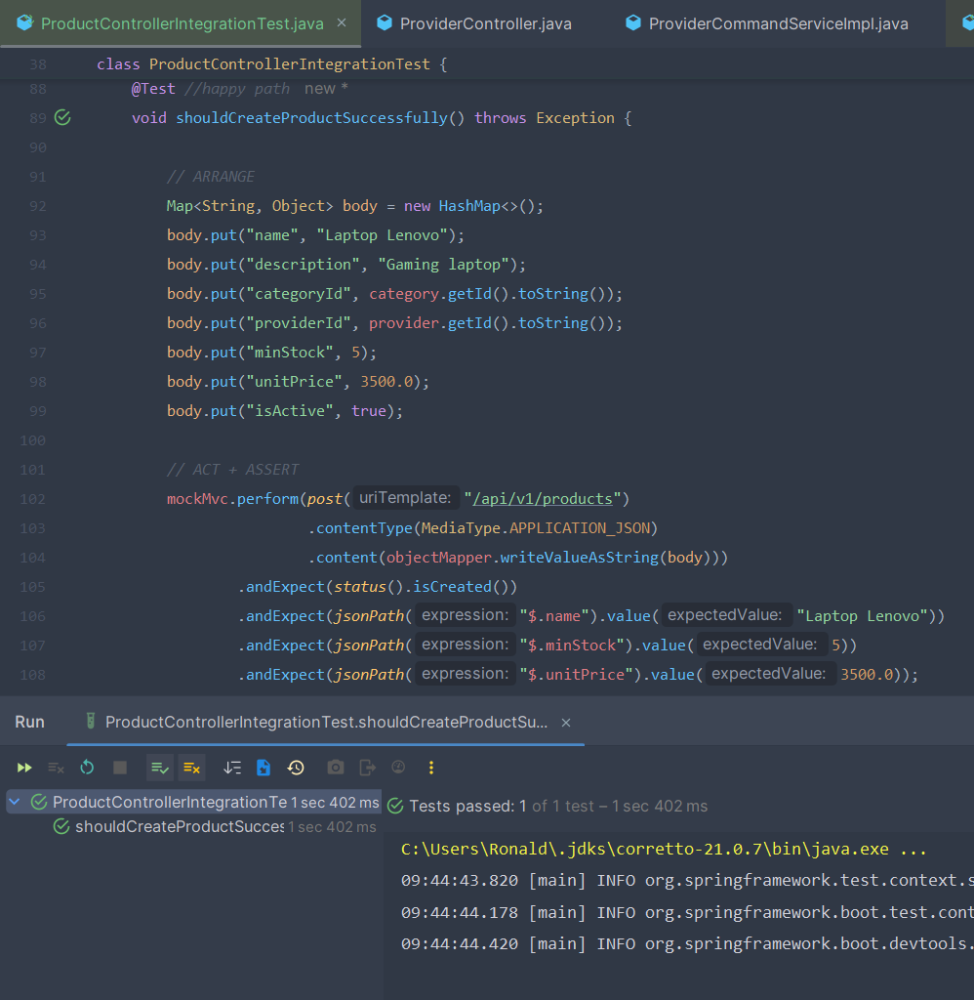  | Este escenario valida que el sistema pueda registrar correctamente un nuevo producto cuando se envían datos válidos, verificando el flujo completo desde la solicitud HTTP hasta la persistencia en base de datos. Se comprueba la integración entre controller, servicios de aplicación, aggregate Product, repositorios JPA y la base de datos H2. Esta validación es importante porque asegura que la funcionalidad principal de creación de productos opere correctamente y que la información registrada mantenga consistencia dentro del inventario. |

### Escenario 2

| Evidencia | Descripción |
|---|---|
| 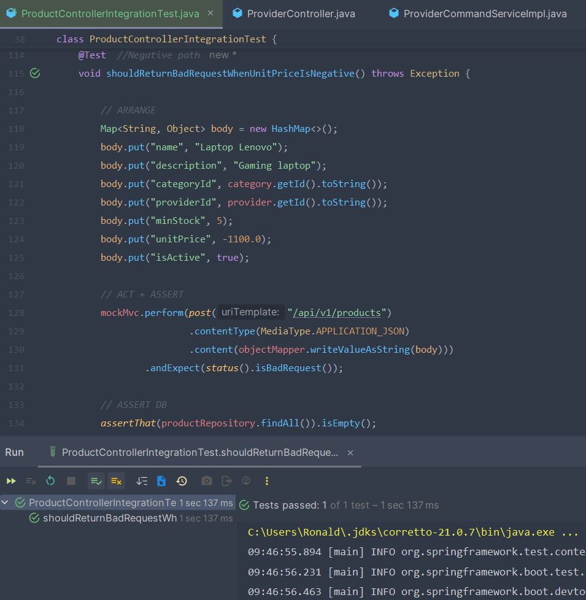 | Este escenario valida que el sistema rechace productos con un precio unitario inválido, específicamente valores negativos, comprobando que las reglas de negocio definidas en el dominio sean respetadas antes de persistir información. La prueba garantiza que las validaciones del aggregate y el manejo de excepciones funcionen correctamente a través de toda la integración del sistema. Esto es importante para proteger la integridad de los datos financieros y evitar inconsistencias en cálculos de ventas, reportes y valorización de inventario. |

### Escenario 3 
| Evidencia | Descripción |
|---|---|
| 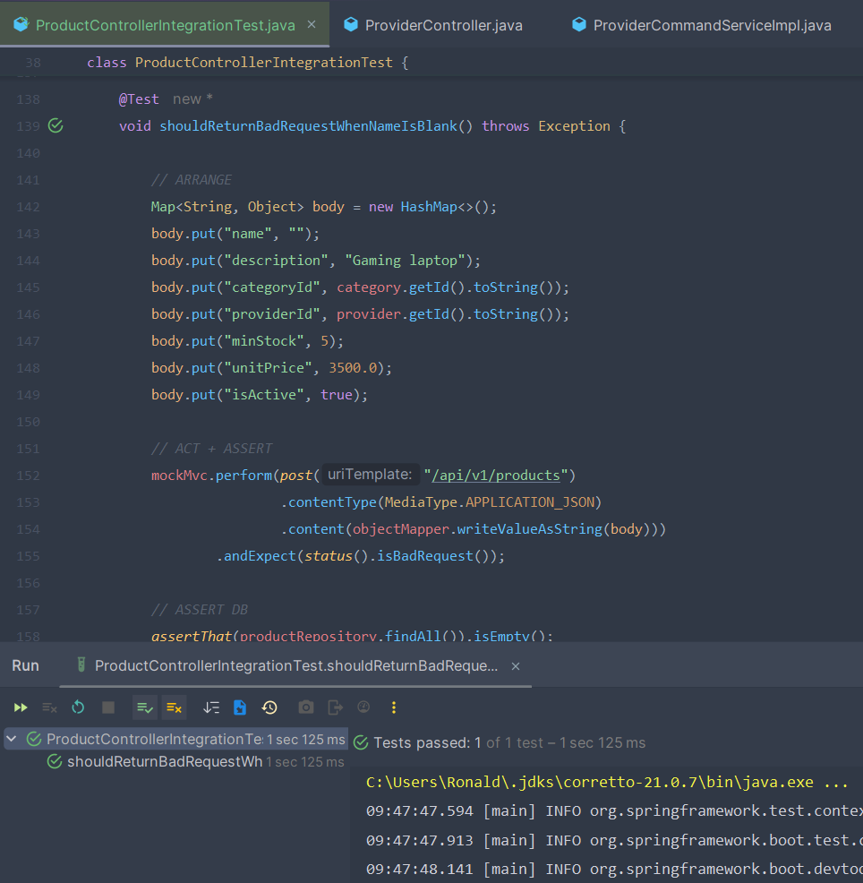 | Este escenario verifica que el sistema no permita registrar productos sin nombre o con nombres vacíos, validando las restricciones obligatorias del dominio y el correcto manejo de respuestas HTTP ante entradas inválidas. La prueba asegura que los datos esenciales del catálogo sean obligatorios y que el sistema prevenga registros incompletos que puedan afectar búsquedas, clasificación de productos y operaciones posteriores dentro del inventario.|

### Escenario 4 

| Evidencia | Descripción |
|---|---|
| 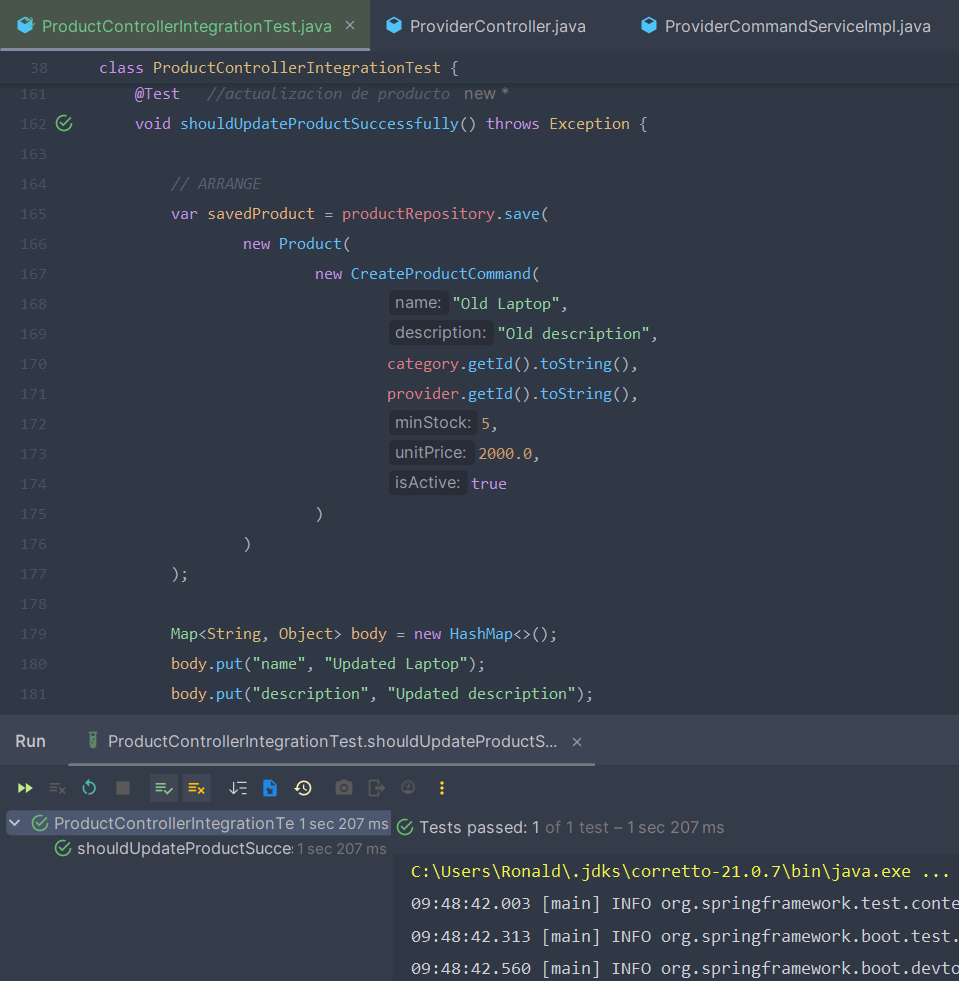 | Este escenario valida que el sistema pueda actualizar correctamente la información de un producto existente, verificando la integración entre el endpoint REST, los servicios de actualización, el aggregate Product, el repositorio JPA y la persistencia en base de datos. Se comprueba que los cambios enviados sean reflejados correctamente y que las validaciones del dominio continúen aplicándose durante la edición. Esta validación es importante porque garantiza que la información del catálogo pueda mantenerse actualizada y consistente a lo largo del tiempo. |

---
### Información General Test-2

| Elemento | Descripción |
|---|---|
| Clase de Test | `ProviderProductIntegrationTest` |
| Módulo(s) | inventory, shared - US24, US26 |
| Descripción General | Validar la integración entre los módulos de proveedores y productos, asegurando que las relaciones funcionales entre ambos aggregates se comporten correctamente dentro del sistema. |

### Escenario 1 

| Evidencia | Descripción |
|---|---|
| 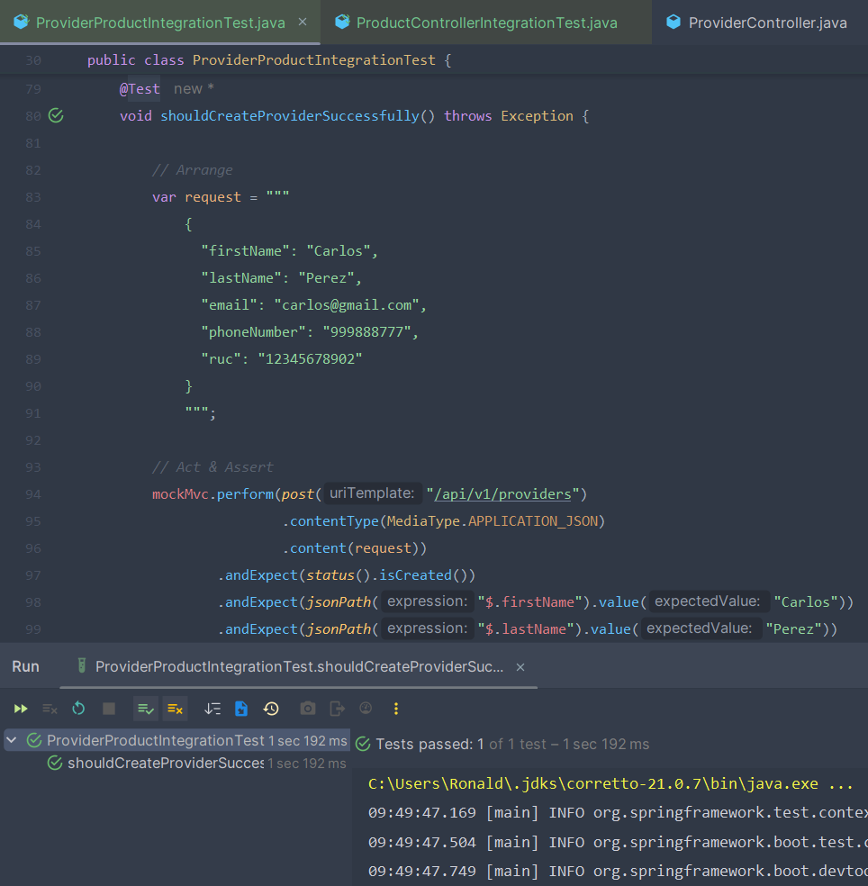 | Este escenario valida que el sistema pueda registrar correctamente un nuevo proveedor utilizando datos válidos, comprobando el flujo completo desde la solicitud HTTP hasta la persistencia en base de datos. La prueba verifica la integración entre controller, servicios de aplicación, aggregate Provider, value objects, repositorios JPA y la base de datos H2. Esta validación es importante porque garantiza que los proveedores puedan ser gestionados correctamente y que la información crítica de abastecimiento quede almacenada de manera consistente y segura. |

### Escenario 2

| Evidencia | Descripción |
|---|---|
| 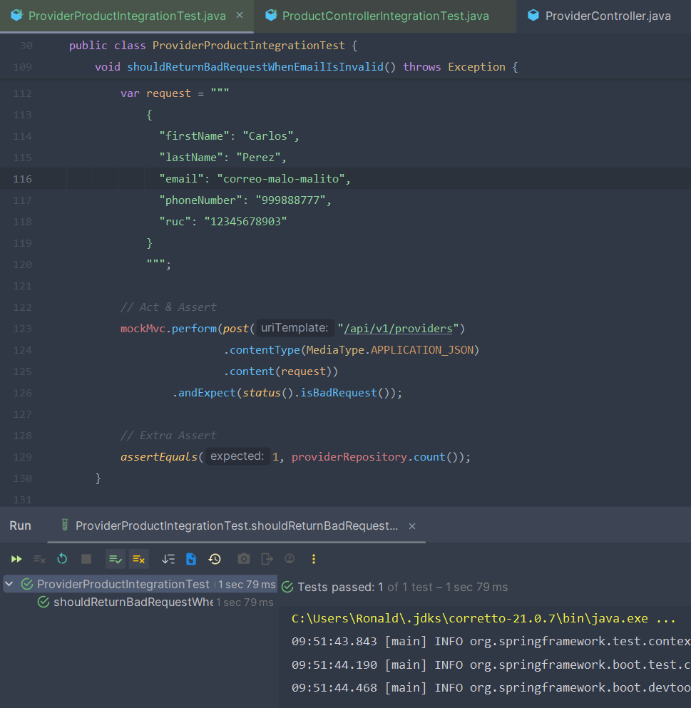 | Este escenario valida que el sistema rechace proveedores con correos electrónicos inválidos, comprobando que las reglas de validación implementadas en los value objects del dominio funcionen correctamente durante todo el flujo de integración. La prueba asegura que las excepciones generadas por datos inconsistentes sean manejadas adecuadamente y que la información inválida no llegue a persistirse en la base de datos. Esta validación es importante porque protege la calidad de los datos y evita problemas posteriores relacionados con notificaciones, contacto con proveedores y trazabilidad del sistema. |

### Escenario 3

| Evidencia | Descripción |
|---|---|
| 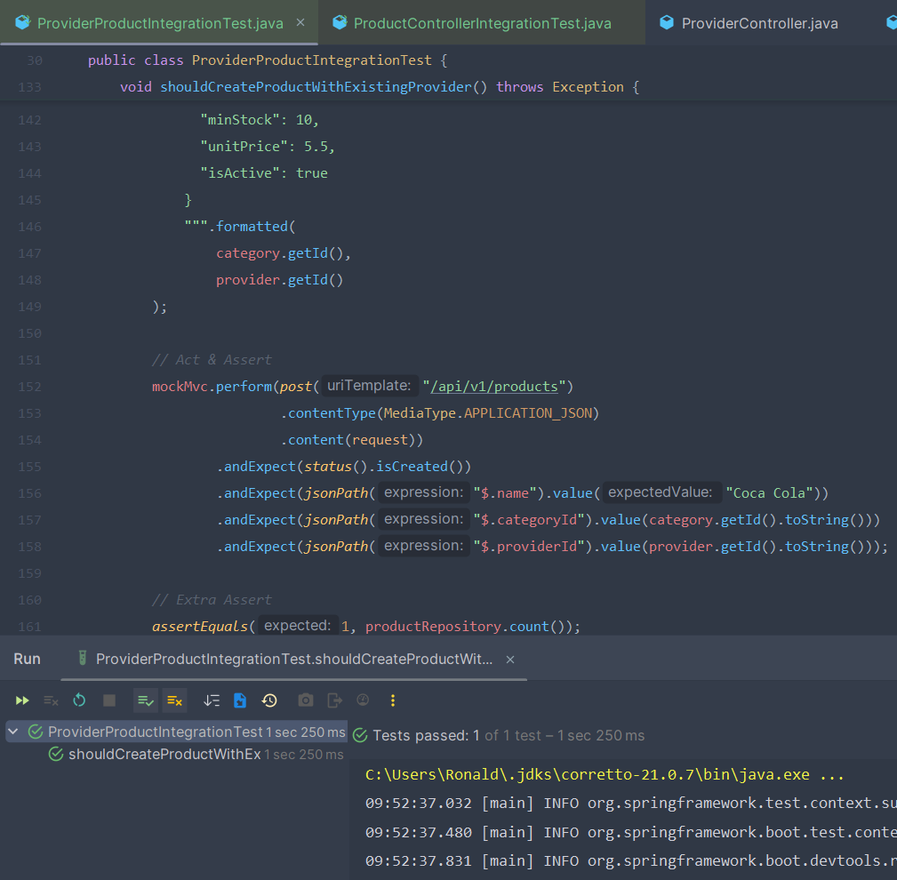 | Este escenario valida la integración funcional entre los módulos de productos y proveedores, verificando que un producto solo pueda registrarse cuando se encuentra asociado a un proveedor existente dentro del sistema. La prueba comprueba la interacción entre múltiples aggregates, servicios de aplicación, repositorios y validaciones de negocio relacionadas con integridad referencial. Esta validación es importante porque asegura consistencia entre entidades del inventario y evita relaciones inválidas que puedan afectar procesos de compras, abastecimiento y trazabilidad de productos. |

---

### Información General Test-3

| Elemento | Descripción |
|---|---|
| Clase de Test | `MovementControllerIntegrationTest` |
| Módulo(s) | inventory, sales - US03, US14 |
| Descripción General | Validar la integración entre los módulos de inventario y ventas, comprobando que los movimientos de entrada y salida de stock actualicen correctamente la cantidad disponible en base de datos, y que el sistema rechace operaciones que excedan el stock disponible. |

### Escenario 1

| Evidencia | Descripción |
|---|---|
| 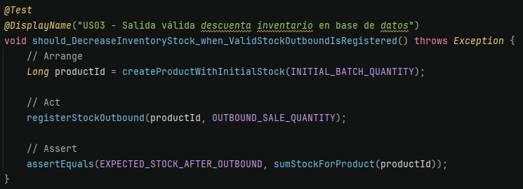 | Este escenario valida que el sistema descuente correctamente el stock de un producto cuando se registra una venta válida, verificando el flujo completo desde la solicitud HTTP hasta la persistencia en base de datos H2. Se comprueba la integración entre el controlador de ventas, los servicios de aplicación, el repositorio de lotes y la lógica de descuento del aggregate. Esta validación es importante porque garantiza que cada transacción de salida mantenga la consistencia del inventario y refleje el stock real disponible para operaciones posteriores. |

### Escenario 2

| Evidencia | Descripción |
|---|---|
| 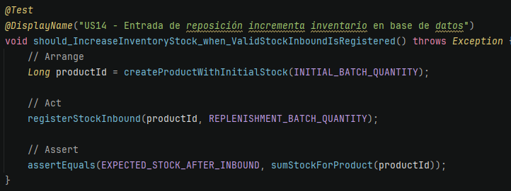 | Este escenario valida que el sistema incremente correctamente el stock de un producto cuando se registra un lote de reposición, comprobando la integración entre el endpoint de lotes, los servicios de aplicación, el repositorio JPA y la base de datos H2. La prueba verifica que la cantidad del nuevo lote se sume correctamente al stock existente del producto. Esta validación es importante porque asegura que el proceso de reabastecimiento opere de forma confiable y que el inventario refleje en todo momento las entradas registradas por el equipo de almacén. |

### Escenario 3

| Evidencia | Descripción |
|---|---|
| 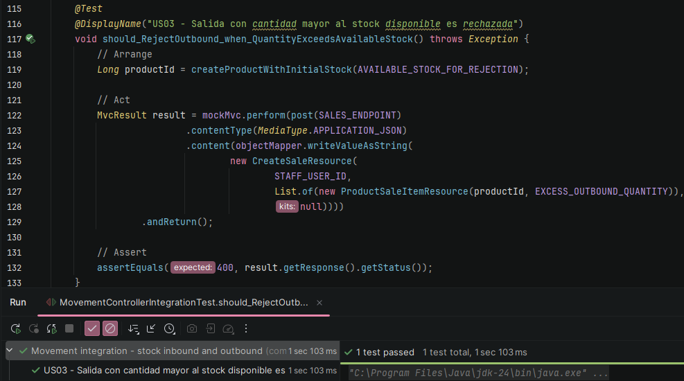 | Este escenario verifica que el sistema rechace una solicitud de venta cuya cantidad supera el stock disponible del producto, comprobando que las reglas de negocio del dominio sean aplicadas correctamente antes de persistir cualquier cambio. La prueba garantiza que el sistema retorne un error HTTP 400 ante este tipo de operación inválida. Esta validación es importante porque protege la integridad del inventario y evita que el sistema registre ventas que no pueden ser satisfechas con el stock existente. |

---

### Información General Test-4

| Elemento | Descripción |
|---|---|
| Clase de Test | `StockAlertIntegrationTest` |
| Módulo(s) | inventory, alertstock - US05 |
| Descripción General | Validar la integración entre los módulos de inventario y alertas de stock, comprobando que el sistema genere y persista automáticamente una alerta cuando una salida de stock deja el nivel por debajo del mínimo configurado, y que no genere alertas innecesarias cuando el stock se mantiene dentro del rango aceptable. |

### Escenario 1

| Evidencia | Descripción |
|---|---|
| 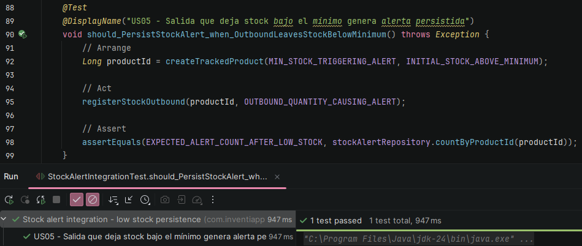 | Este escenario valida que el sistema genere y persista automáticamente una alerta de stock bajo cuando una venta reduce el inventario por debajo del mínimo configurado para el producto, comprobando la integración entre el módulo de ventas, el servicio de alertas y el repositorio de alertas en base de datos H2. Esta validación es importante porque garantiza que el mecanismo de alerta temprana funcione de forma automática y confiable, permitiendo al equipo de almacén reaccionar oportunamente ante situaciones de desabastecimiento. |

### Escenario 2

| Evidencia | Descripción |
|---|---|
|  | Este escenario verifica que el sistema no genere alertas de stock cuando una salida de inventario deja el nivel igual o por encima del mínimo configurado, comprobando que la lógica de disparo de alertas sea precisa y no produzca falsos positivos. La prueba consulta directamente el repositorio de alertas para confirmar que ningún registro fue persistido. Esta validación es importante porque evita que el equipo de almacén reciba notificaciones innecesarias que puedan generar ruido operativo y reducir la efectividad del sistema de alertas. |

---

### Información General Test-5

| Elemento | Descripción |
|---|---|
| Clase de Test | `IamInventoryIntegrationTest` |
| Módulo(s) | iam, inventory - US01, US12 |
| Descripción General | Validar la integración entre el módulo de autenticación y autorización (IAM) y los endpoints de inventario, comprobando que el sistema proteja correctamente el acceso a los recursos según el token y los permisos del usuario autenticado. |

### Escenario 1

| Evidencia | Descripción |
|---|---|
| 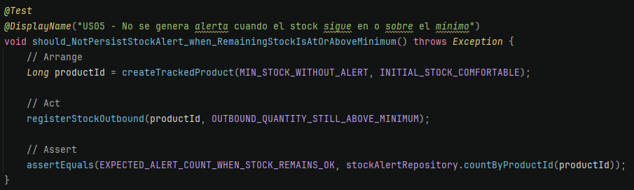 | Este escenario valida que el sistema rechace con HTTP 401 cualquier solicitud al endpoint de productos que no incluya un token de autenticación, comprobando que los filtros de seguridad estén activos y configurados correctamente. Esta validación es importante porque garantiza que los recursos del inventario estén protegidos frente a accesos anónimos y que el sistema cumpla con los requisitos de seguridad definidos para la plataforma SaaS. |

### Escenario 2

| Evidencia | Descripción |
|---|---|
| 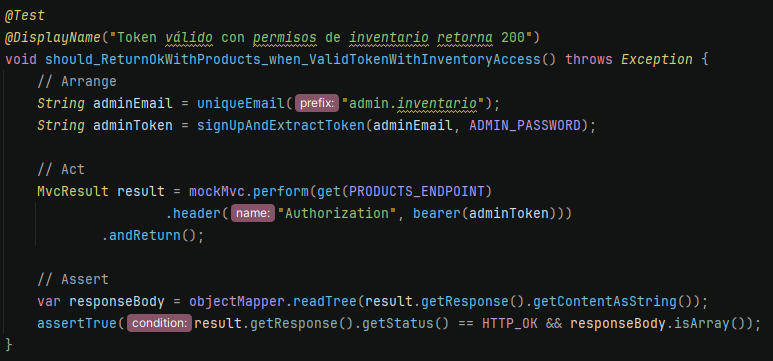 | Este escenario valida que un usuario autenticado con permisos de inventario pueda acceder correctamente al endpoint de productos, recibiendo una respuesta HTTP 200 con el listado correspondiente. La prueba comprueba la integración completa entre el proceso de registro, la generación del token JWT y la autorización en el endpoint protegido. Esta validación es importante porque asegura que el flujo de autenticación funcione de extremo a extremo y que los usuarios con los permisos correctos puedan operar sin restricciones. |

### Escenario 3

| Evidencia | Descripción |
|---|---|
| 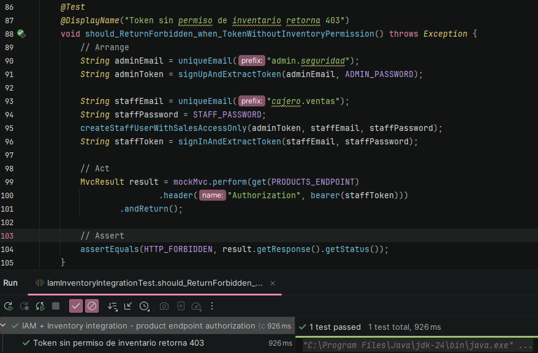 | Este escenario verifica que un usuario autenticado pero sin permisos de inventario reciba una respuesta HTTP 403 al intentar acceder al endpoint de productos, comprobando que el sistema aplique correctamente las reglas de autorización por rol. La prueba crea un usuario con acceso exclusivo a ventas e intenta acceder a un recurso restringido. Esta validación es importante porque garantiza el principio de mínimo privilegio en la plataforma, protegiendo los datos del inventario frente a accesos no autorizados de usuarios con roles insuficientes. |

### 6.1.3. Core Behavior-Driven Development

En esta sección se presentan las pruebas Behavior-Driven Development desarrolladas para validar el comportamiento esperado de las funcionalidades principales de StockWise desde la perspectiva del usuario. El desarrollo de estas pruebas se basó en las User Stories priorizadas del Product Backlog, específicamente US01 - Registrar producto nuevo y US05 - Generar alertas por bajo stock, ambas pertenecientes al epic EP01 - Funciones básicas de inventario. Estas historias fueron seleccionadas porque representan funciones centrales del sistema de inventario.

#### Evidence 1: Product Registration Feature File

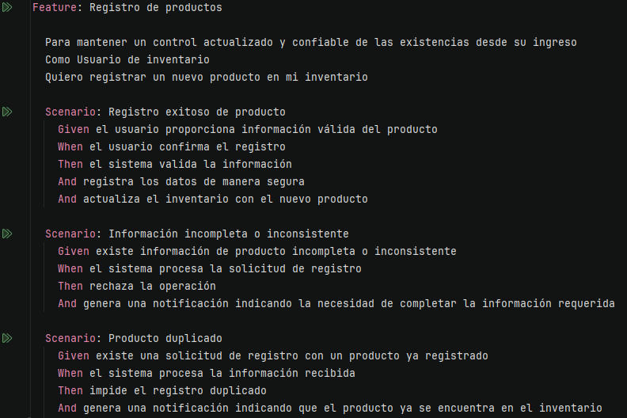

#### Evidence 2: Low Stock Alert Feature File

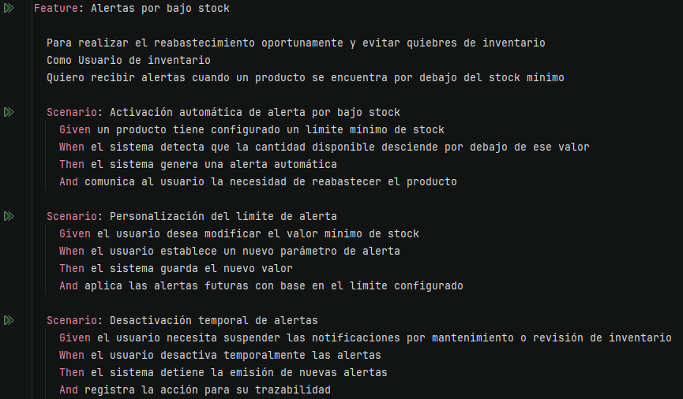

#### Evidence 3: BDD Test Execution Results

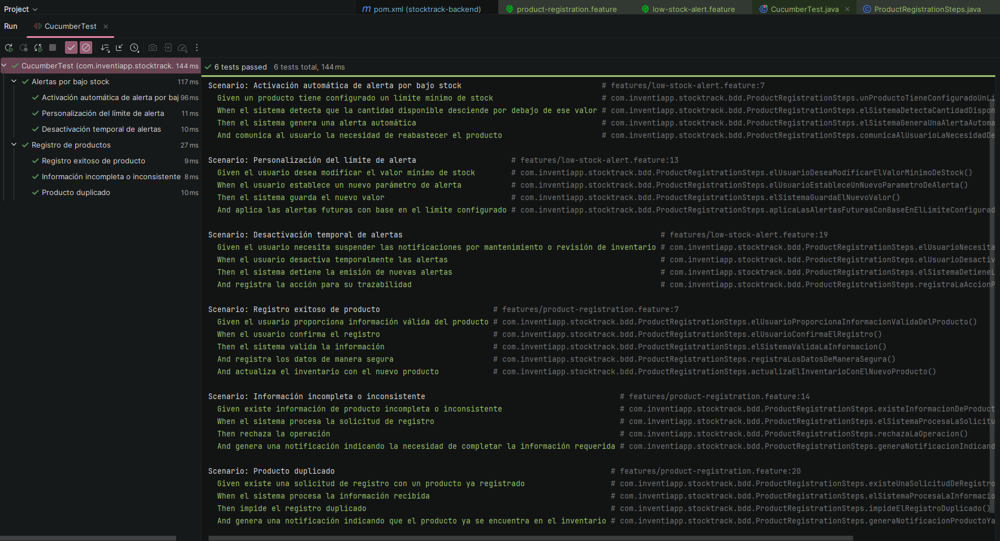

### 6.1.4. Core System Tests

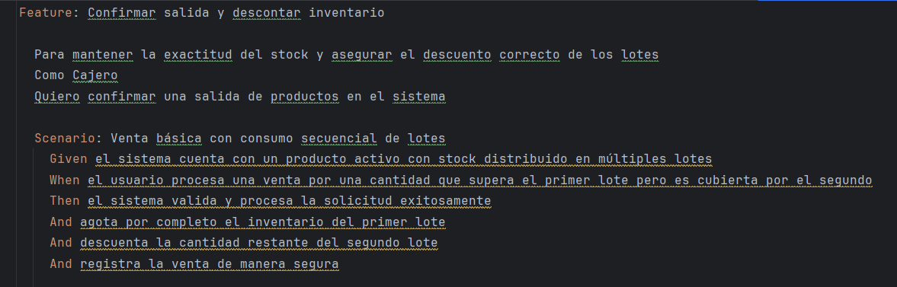

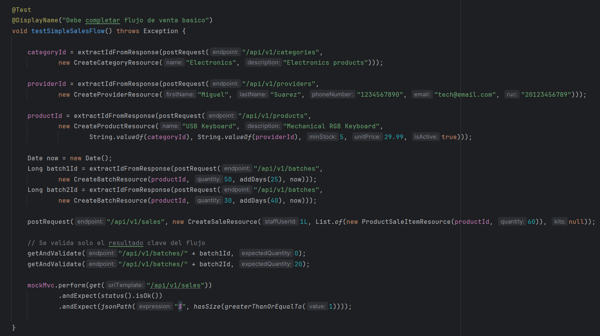

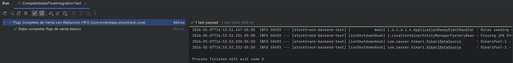

## 6.2. Static testing & Verification 
Esta sección describe las actividades de control de calidad que se ejecutan directamente sobre el código fuente, especificaciones y artefactos del proyecto sin necesidad de poner el sistema en marcha. Su objetivo es identificar de manera temprana ambigüedades, defectos de diseño, vulnerabilidades de seguridad y desviaciones de las pautas de desarrollo establecidas.

### 6.2.1. Static Code Analysis

Consiste en la evaluación automatizada del código base utilizando herramientas especializadas. A través de este análisis se audita la mantenibilidad, el cumplimiento de reglas sintácticas, la deuda técnica y los posibles riesgos de seguridad antes de que el código sea integrado a las ramas principales del repositorio.

#### 6.2.1.1. .Coding standard & Code conventions

**Backend - Java/Spring Boot**  
El backend implementa convenciones de código rigurosas basadas en los estándares oficiales de Spring Framework y las mejores prácticas de la arquitectura limpia. La nomenclatura sigue patrones semánticos y descriptivos: los controladores utilizan el sufijo Controller, los servicios emplean Service o la distinción CommandService / QueryService para segregar las operaciones de lectura y escritura (patrón CQRS), y los componentes de transformación adoptan el sufijo Assembler para la conversión eficiente entre entidades del dominio y recursos REST (DTOs).

La estructura de paquetes refleja fielmente una arquitectura hexagonal, donde cada contexto acotado (Bounded Context) está claramente delimitado en los paquetes domain, application, interfaces.rest e infrastructure, facilitando una estricta separación de responsabilidades. Adicionalmente, todos los métodos públicos incluyen documentación técnica mediante Javadoc, detallando parámetros y valores de retorno. El manejo de excepciones es homogéneo mediante una capa global de captura de errores, la cual procesa excepciones de negocio específicas (tales como ProductAlreadyExistsException o ProductNotFoundException) y las traduce en códigos de estado HTTP semánticos (201, 400, 404, 500).

Las anotaciones nativas de Spring (@RestController, @PostMapping, @GetMapping) y de documentación (@Operation, @ApiResponse) se aplican de forma transversal para generar de manera automática el contrato de la API mediante OpenAPI/Swagger. Finalmente, la inyección de dependencias se realiza exclusivamente a través de constructores, promoviendo la inmutabilidad de los componentes y simplificando el diseño de pruebas unitarias.

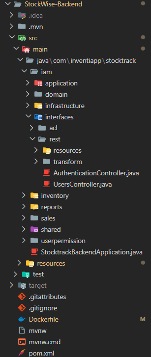
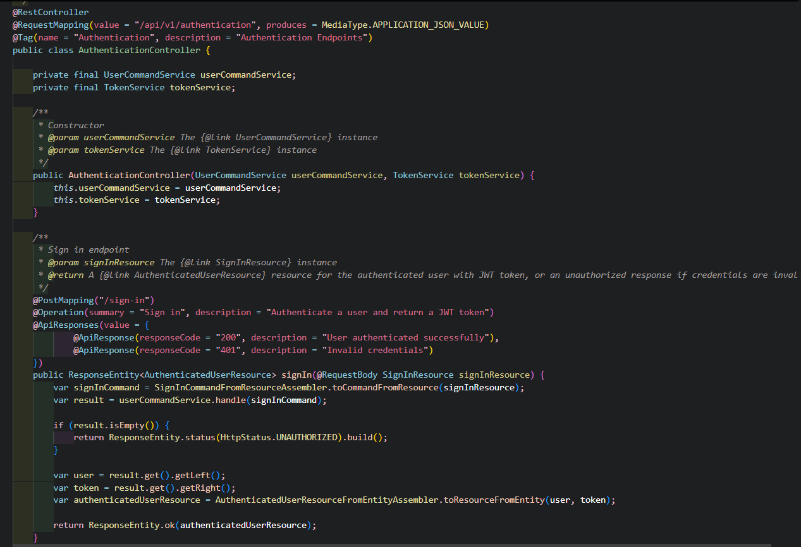

**Frontend - Angular/TypeScript**  
El frontend se alinea con las convenciones oficiales recomendadas por el equipo de Angular y las directrices de TypeScript, estructurándose mediante una arquitectura modular orientada a características (Features). Cada módulo de negocio (auth, inventory, dashboard, etc.) replica la filosofía de separación de responsabilidades en las capas de presentation, domain, infrastructure y application.

Los archivos se nombran estrictamente utilizando la convención kebab-case (auth-api.ts, auth-guard.ts, inventory.store.ts), mientras que las clases e interfaces emplean PascalCase (AuthApi, InventoryStore, AuthGuard). Los servicios inyectables se configuran mediante el decorador @Injectable({ providedIn: 'root' }), lo que optimiza el empaquetado mediante tree-shaking y previene la duplicidad de instancias. Se destaca el uso de Angular Signals para la gestión del estado reactivo de la interfaz, adoptando así la API moderna del framework para reducir la complejidad operativa frente a patrones RxJS tradicionales.

La documentación mediante JSDoc es mandatoria en métodos críticos, especialmente en guards y servicios de dominio. Los guards de protección de rutas implementan la interfaz funcional CanActivateFn, validando la vigencia del token JWT, los estados de autenticación y los roles del usuario antes de permitir el acceso a las vistas. El código prohíbe la lógica compleja dentro de los templates HTML, delegando dicha responsabilidad a los componentes y almacenes (stores) fuertemente tipados.

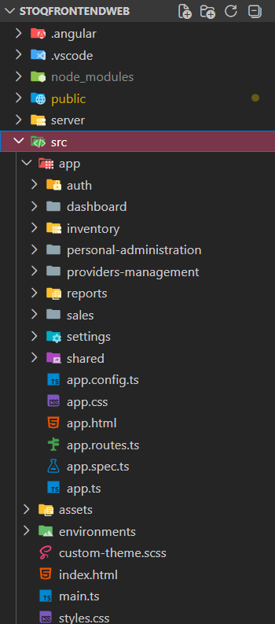
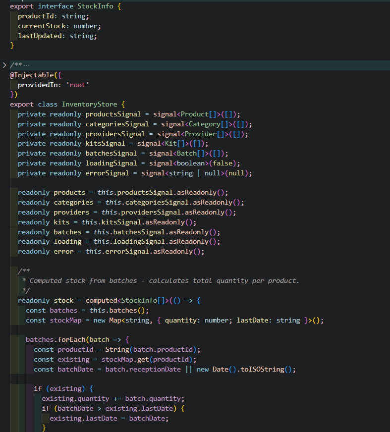

**Landing Page - React/TypeScript**  
La landing page se construye mediante componentes funcionales de React basados en TypeScript, asegurando la tipación estática (type safety) en toda la capa de presentación. Los componentes se nombran en PascalCase (Header, HeroSection, PricingSection) y se centralizan dentro del directorio src/components/. Cada componente declara y recibe propiedades (Props) fuertemente tipadas, mitigando errores comunes en tiempo de compilación.

Para el diseño visual se utiliza Tailwind CSS, aplicando clases utilitarias directamente sobre el atributo className, lo que resulta en un estilo cohesivo, ágil y libre de archivos CSS externos innecesarios. Los colores corporativos de la marca se encuentran centralizados en el archivo de configuración de Tailwind, evitando valores arbitrarios dispersos.

La internacionalización del sitio se gestiona a través de un LanguageContext que expone el hook personalizado useLanguage(), permitiendo a los componentes acceder y alternar el idioma de manera global sin incurrir en prop drilling. El código mantiene un acceso unificado a las variables de entorno y URLs de redirección mediante constantes globales. Asimismo, componentes clave como ImageWithFallback implementan patrones defensivos para mitigar fallos en la carga de recursos multimedia externos, garantizando una experiencia de usuario fluida.

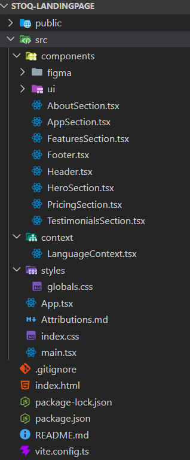

#### 6.2.1.2. Code Quality & Code Security.

**Backend - Java/Spring Boot**  
La calidad en el backend se asegura mediante el desacoplamiento de la arquitectura hexagonal y el uso de DTOs, lo que reduce la complejidad ciclomática y la deuda técnica. En el ámbito de la seguridad a nivel de código, el sistema destaca por:
- Control de Acceso: Integración de Spring Security y tokens JWT. Los endpoints se protegen mediante autorización basada en roles con la anotación @PreAuthorize.
- Validación Defensiva: Aplicación estricta de Bean Validation (@Valid, @NotNull) en controladores para sanitizar los datos de entrada y prevenir ataques de inyección (SQLi) o XSS.
- Transparencia: Todos los flujos de autorización y códigos de respuesta están completamente documentados y declarados en el contrato de OpenAPI/Swagger.

**Frontend - Angular/TypeScript**  
La calidad del frontend se basa en una arquitectura modular por features y en el uso estricto de TypeScript (strict: true), garantizando un tipado fuerte que elimina errores en tiempo de compilación. Las prácticas de seguridad y estabilidad aplicadas incluyen:

- Protección de Navegación: Implementación de guards funcionales (CanActivateFn) que interceptan las rutas y validan la vigencia del JWT y los permisos antes de renderizar cualquier vista.
- Gestión de Estado Inmutable: El uso de Angular Signals previene fugas de memoria (memory leaks) y asegura un flujo de datos reactivo y predecible.
- Saneamiento: Confianza en los mecanismos nativos del framework para sanitizar el DOM y neutralizar vulnerabilidades de Client-Side XSS.

**Landing Page - React/TypeScript**  
A pesar de su naturaleza informativa, la landing page se rige por estándares de calidad basados en componentes funcionales reutilizables y tipados estáticos que evitan caídas de la interfaz. Sus medidas de seguridad y buenas prácticas comprenden:

- Navegación Segura: Uso mandatorio del atributo rel="noopener noreferrer" en enlaces externos para mitigar ataques de manipulación de pestañas (Tabnabbing).
- Gestión de Contexto: Centralización de traducciones mediante LanguageContext fuertemente tipado, evitando referencias nulas en la interfaz.
- Aislamiento: Configuración hermética de variables de entorno para evitar la filtración accidental de URLs o credenciales de desarrollo en el build de producción.

### 6.2.2. Reviews

## 6.3. Validation Interviews.
### 6.3.1. Diseño de Entrevistas.

**Segmento #1: Bodegas especializadas por rubro**

**Presentación del entrevistado:**

¿Cuál es tu nombre?

¿Qué edad tienes?

¿Desde cuándo gestionas esta bodega?

¿Cuál es el rubro principal de tu bodega?

El usuario interactúa con la app móvil de la plataforma para gestión de inventarios.

Landing page

Acciones clave dentro del sistema

Navegación interactivo por la interfaz app móvil

**User Goal: Registrar**

El usuario selecciona la opción "Register", completa los campos solicitados y hace clic en el botón "Registrar".

A continuación, se muestra el panel "Add Card", donde debe llenar los campos relacionados con su tarjeta y correo electrónico.

Una vez que el proceso de pago se complete exitosamente, se notifica al usuario con un mensaje confirmando el vínculo de su tarjeta con la plataforma.

Del mismo modo, si el usuario desea retirar su información o actualizarla, lo podrá hacer a través de su perfil.

Finalmente, hacer clic en el botón "Aceptar".

**User Goal: Iniciar sesión**

El usuario introduce su correo y contraseña.

Luego hace clic en el botón "Log In".

Después, se le redirige al panel de perfil.

Allí puede editar su información personal y acceder a herramientas según su perfil ("Administrador" o "Empleado").

**User Goal: Navegar por el Dashboard**

El usuario inicia sesión desde la Landing Page.

Ingresa a la vista principal del Dashboard.

Visualiza el total de productos registrados y la fecha del último proveedor.

Visualiza un resumen de productos próximos a caducar con su respectiva fecha y stock disponible.

Accede a botones de acción rápida como “Historial”, “Inventario”, “Añadir Productos”, “Kits” y “Devolución de productos”.

**User Goal: Inventario (Producto / Lote)**

Ingresa a la sección de Inventario.

Revisa el listado de productos presionando el botón "por producto".

Filtra los productos por categoría, nombre del producto, fecha o stock mínimo.

Consulta el listado con información clave: fecha de entrada, cantidad por unidad, precio, stock mínimo y unidad de medida.

User Goal: Botones Principales (Agregar Producto y Kits)

Pulsa el botón "Agregar Producto".

Rellena los campos solicitados para registrar uno nuevo.

Pulsa el botón "Crear Kit".

Combina productos existentes para crear un kit nuevo.

El usuario pulsa el botón “Añadir Productos” desde el Dashboard.

Visualiza una galería de productos existentes y accede a opciones para editarlos o duplicarlos.

Puede agregar uno nuevo haciendo clic en el botón “+”, donde se despliega un formulario con campos como nombre, etiquetas, cantidad, lote, precios, fecha de caducidad y notas.

Desde el menú principal, también accede a la opción “Kits”.

En esta sección, selecciona productos existentes y los combina mediante el botón “Seleccionar para kit”, indicando cantidad e inventario disponible.

**User Goal: Historial de Movimientos**

Navega a la sección de Historial.

Visualiza entradas y salidas de productos.

Filtra movimientos por fecha, producto o lote.

El usuario accede a la sección de Historial desde el panel principal.

Filtra los registros por tipo de gestión, categoría, stock promedio y fecha.

Visualiza los movimientos realizados, incluyendo datos como nombre del producto, fecha de consulta, precio unitario, cantidad y total.

Consulta métricas como el stock promedio, estado del producto y stock ideal.

Cuenta con botones para editar o eliminar cada registro y, para los stock promedio, exportar la información y realiza un ticket promedio.

**User Goal: Alerta de Stock**

El usuario accede a la sección de Alertas desde el menú superior.

Consulta una lista de productos que presentan alertas por stock mínimo o por cercanía a su fecha de vencimiento.

Visualiza detalles como categoría de alerta, tipo de producto, nombre y fecha de alerta.

Puede ingresar a una vista de detalles, generar reportes o confirmar acciones desde botones individuales por producto.

También puede eliminar una alerta específica luego de una confirmación emergente.

Preguntas principales:

- ¿Te resultó fácil encontrar cómo agregar un producto?
- ¿Qué tal fue el proceso para registrar el stock por producto y por lote?
- ¿Te resultó claro el apartado de “Próximos a caducar”? ¿Te pareció útil?
- ¿Probaste la sección de kits? ¿Te resultó útil combinar productos?
- ¿Hubo algo que no entendiste o que te confundió mientras usabas la app?
- ¿Qué te pareció el diseño general de la landing page?
- ¿Tuviste alguna dificultad visual o técnica durante la navegación?

Valoración de experiencia

- Del 1 al 10, ¿qué tan útil te pareció la app para tu bodega?
- ¿Qué funcionalidad te pareció más valiosa?
- ¿Qué función le agregarías sí o sí?
- ¿Recomendarías esta plataforma a otros dueños de bodegas? ¿Por qué?
- 
**Segmento #2: Startups y emprendedores con necesidades logísticas**

Presentación del entrevistado

- ¿Cuál es tu nombre?
- ¿Qué edad tienes?
- ¿Qué tipo de producto vendes o almacenas?
- ¿Tienes local físico, almacén propio o trabajas con terceros?
- Interactúa el usuario con la landing page y la versión web de nuestra plataforma para gestión gestionar stock, registrar compras y generar reportes.

Landing page

Acciones clave dentro del sistema

Navegación interactivo por la interfaz app móvil

**User Goal: Registrar**

El usuario selecciona la opción "Register", completa los campos solicitados y hace clic en el botón "Registrar".

A continuación, se muestra el panel "Add Card", donde debe llenar los campos relacionados con su tarjeta y correo electrónico.

Una vez que el proceso de pago se complete exitosamente, se notifica al usuario con un mensaje confirmando el vínculo de su tarjeta con la plataforma.

Del mismo modo, si el usuario desea retirar su información o actualizarla, lo podrá hacer a través de su perfil.

Finalmente, hacer clic en el botón "Aceptar".

**User Goal: Iniciar sesión**

El usuario introduce su correo y contraseña.

Luego hace clic en el botón "Log In".

Después, se le redirige al panel de perfil.

Allí puede editar su información personal y acceder a herramientas según su perfil ("Administrador" o "Empleado").

**User Goal: Navegar por el Dashboard**

El usuario inicia sesión desde la Landing Page.

Ingresa a la vista principal del Dashboard.

Visualiza el total de productos registrados y la fecha del último proveedor.

Visualiza un resumen de productos próximos a caducar con su respectiva fecha y stock disponible.

Accede a botones de acción rápida como “Historial”, “Inventario”, “Añadir Productos”, “Kits” y “Devolución de productos”.

**User Goal: Inventario (Lote)**

Accede a la sección de Inventario por lote.

Filtra los lotes por nombre del producto, proveedor, fecha de entrada, cantidad o precio.

Consulta el listado con información detallada como proveedor, producto, fecha, cantidad por unidad, precio y unidad de medida.

Gestiona las acciones disponibles para cada lote desde la columna correspondiente.

**User Goal: Botones Principales (Agregar Producto y Kits)**

Pulsa el botón "Agregar Producto".

Rellena los campos solicitados para registrar uno nuevo.

Pulsa el botón "Crear Kit".

Combina productos existentes para crear un kit nuevo.

El usuario pulsa el botón “Añadir Productos” desde el Dashboard.

Visualiza una galería de productos existentes y accede a opciones para editarlos o duplicarlos.

Puede agregar uno nuevo haciendo clic en el botón “+”, donde se despliega un formulario con campos como nombre, etiquetas, cantidad, lote, precios, fecha de caducidad y notas.

Desde el menú principal, también accede a la opción “Kits”.

En esta sección, selecciona productos existentes y los combina mediante el botón “Seleccionar para kit”, indicando cantidad e inventario disponible.

**User Goal: Historial de Movimientos**

Navega a la sección de Historial.

Visualiza entradas y salidas de productos.

Filtra movimientos por fecha, producto o lote.

El usuario accede a la sección de Historial desde el panel principal.

Filtra los registros por tipo de gestión, categoría, stock promedio y fecha.

Visualiza los movimientos realizados, incluyendo datos como nombre del producto, fecha de consulta, precio unitario, cantidad y total.

Consulta métricas como el stock promedio, estado del producto y stock ideal.

Cuenta con botones para editar o eliminar cada registro y, para los stock promedio, exportar la información y realiza un ticket promedio.

**User Goal: Alerta de Stock**

El usuario accede a la sección de Alertas desde el menú superior.

Consulta una lista de productos que presentan alertas por stock mínimo o por cercanía a su fecha de vencimiento.

Visualiza detalles como categoría de alerta, tipo de producto, nombre y fecha de alerta.

Puede ingresar a una vista de detalles, generar reportes o confirmar acciones desde botones individuales por producto.

También puede eliminar una alerta específica luego de una confirmación emergente.

**Preguntas principales:**

- ¿Qué opinas de las alertas de stock mínimo/máximo y vencimiento? ¿Son suficientes?
- ¿La sección de historial de movimientos te pareció útil para revisar tus registros?
- ¿Te resultó útil la opción de devolución de productos?
- ¿Los reportes del historial son útiles para tomar decisiones?
- ¿Hubo algo que no entendiste o que te confundió mientras usabas la app?
- ¿Qué te pareció el diseño general de la landing page?
- ¿Tuviste alguna dificultad visual o técnica durante la navegación?

**Valoración de experiencia**

- Del 1 al 10, ¿qué tan útil te pareció la app móvil para tu bodega?
- ¿Qué funcionalidad te pareció más valiosa?
- ¿Qué función le agregarías sí o sí?
- ¿Recomendarías esta plataforma a otros emprendedores? ¿Por qué?

### 6.3.2. Registro de Entrevistas.
### 6.3.3. Evaluaciones segun heuristicas.

## 6.4. Auditoria de Experiencias de Usuario.
La auditoría de experiencias de usuario fue llevada a cabo con el objetivo de obtener retroalimentación externa sobre la calidad de la interfaz y la arquitectura de información de StockWise, así como de brindar retroalimentación a otro equipo de trabajo. El proceso contempló dos dimensiones: la auditoría realizada a un grupo externo y la auditoría recibida por parte de otro grupo evaluador.

### 6.4.1. Auditoria realizada.
#### 6.4.1.1. Información del grupo auditado.

| Campo                    | Detalle                                                       |
| ------------------------ | ------------------------------------------------------------- |
| Grupo auditado           | Grupo 2                                                       |
| Startup                  | Pendiente de confirmación                                     |
| Producto evaluado        | Pendiente de confirmación                                     |
| Integrantes del equipo   | Persona 1, Persona 2, Persona 3, Persona 4 y Persona 5        |
| Repositorio del proyecto | Pendiente de confirmación                                     |
| Landing Page             | https://demy-edulabs.netlify.app/                             |
| Aplicación web           | https://edulabs-experimentos.github.io/demy-admin-web/sign-up |

#### 6.4.1.2. Cronograma de auditoría realizada

| Actividad                                                | Fecha      | Responsable          | Duración estimada |
| -------------------------------------------------------- | ---------- | -------------------- | ----------------- |
| Recepción del informe de auditoría externa               | 11/06/2026 | Ronald Peralta  | 30 minutos        |
| Revisión y análisis de hallazgos identificados           | 11/06/2026 | Ronald Peralta  | 1 hora            |
| Priorización de observaciones y acciones correctivas     | 12/06/2026 | Ronald Peralta  | 30 minutos        |
| Evaluación integral del flujo funcional de la aplicación | 13/06/2026 | Ronald Peralta  | 1 hora            |
| Implementación de mejoras y corrección de incidencias    | 13/06/2026 | Ronald Peralta  | 30 minutos        |

#### 6.4.1.3. Contenido de la auditoría realizada
La presente auditoría tuvo como objetivo evaluar la usabilidad y experiencia de usuario del producto desarrollado por el grupo auditado. Para ello, se analizaron los principales flujos de interacción de la aplicación, identificando problemas relacionados con navegación, retroalimentación del sistema, accesibilidad, consistencia visual y comprensión de la interfaz.

#### Tareas evaluadas

Durante la auditoría se ejecutaron las siguientes tareas representativas del flujo de uso de la aplicación:

| N.° | Tarea evaluada       | Descripción                            |
| --- | -------------------- | -------------------------------------- |
| 1   | Navegación global | Interacción con la barra de navegación (Header) para retornar a la vista principal. |
| 2   | Visualización de contenido | Carga y renderizado de los recursos multimedia en las distintas secciones informativas. |
| 3   | Análisis de rendimiento | Evaluación de métricas de carga, accesibilidad y SEO utilizando la herramienta Google Lighthouse. |
| 4   | Arquitectura de la información | Recorrido por las secciones de la Landing Page para evaluar la carga cognitiva y relevancia del contenido. |
| 5   | Flujo de conversión | Búsqueda del enlace o botón principal (Call to Action) para iniciar el proceso de registro en la Web App. |

| 6   | [Nombre de la tarea] | [Acciones realizadas por el evaluador] |
| 7   | [Nombre de la tarea] | [Acciones realizadas por el evaluador] |
| 8   | [Nombre de la tarea] | [Acciones realizadas por el evaluador] |
| 9   | [Nombre de la tarea] | [Acciones realizadas por el evaluador] |
| 10  | [Nombre de la tarea] | [Acciones realizadas por el evaluador] |

#### Escala de severidad utilizada

| Nivel | Descripción                                                                       |
| ----- | --------------------------------------------------------------------------------- |
| 1     | Problema superficial que no afecta significativamente la experiencia del usuario. |
| 2     | Problema menor que genera cierta dificultad pero permite completar la tarea.      |
| 3     | Problema importante que dificulta considerablemente la interacción.               |
| 4     | Problema crítico que impide completar la tarea o continuar utilizando el sistema. |

#### Resumen de hallazgos identificados

| ID   | Tarea                    | Problema identificado                                                | Severidad | Heurística vulnerada              |
| ---- | ------------------------ | ------------------------------------------------------------------- | --------- | --------------------------------- |
| H-01 | Navegación global        | Logotipo inactivo sin redirección a la página de inicio.            | 2         | Consistencia y estándares         |
| H-02 | Visualización de contenido | Imagen rota o no renderizada en la sección "Nosotros".             | 2         | Diseño estético y minimalista     |
| H-03 | Análisis de rendimiento  | Bajo puntaje de rendimiento (59/100) en la métrica de Lighthouse.   | 3         | Flexibilidad y eficiencia de uso  |
| H-04 | Arquitectura de la información | Exceso de secciones y contenido redundante (sección "Pasos"). | 1         | Diseño estético y minimalista     |
| H-05 | Flujo de conversión      | Ausencia total de botón CTA hacia el registro de la aplicación web. | 4         | Control y libertad del usuario    |
| H-01 | [Tarea evaluada] | [Descripción breve del problema] | [1-4]     | [Nombre de la heurística] |
| H-02 | [Tarea evaluada] | [Descripción breve del problema] | [1-4]     | [Nombre de la heurística] |
| H-03 | [Tarea evaluada] | [Descripción breve del problema] | [1-4]     | [Nombre de la heurística] |
| H-04 | [Tarea evaluada] | [Descripción breve del problema] | [1-4]     | [Nombre de la heurística] |
| H-05 | [Tarea evaluada] | [Descripción breve del problema] | [1-4]     | [Nombre de la heurística] |

---

### Detalle de hallazgos

#### Hallazgo H-01

| Campo                   | Detalle                                                                                                                                                                                                                |
| ----------------------- | ---------------------------------------------------------------------------------------------------------------------------------------------------------------------------------------------------------------------- |
| Tarea evaluada          | Navegación global                                                                                                                                                                                                      |
| Ubicación               | Landing Page - Barra de navegación superior (Header)                                                                                                                                                                   |
| Problema identificado   | Logotipo de la marca inactivo sin hipervínculo al Home                                                                                                                                                                 |
| Severidad               | 2                                                                                                                                                                                                                      |
| Heurística vulnerada    | Consistencia y estándares                                                                                                                                                                                              |
| Descripción             | Al navegar por las distintas secciones de la página, el usuario intenta hacer clic en el logotipo "Demy" para regresar rápidamente al inicio, pero este elemento es estático y no contiene un enlace (etiqueta `<a>`). |
| Impacto para el usuario | Genera fricción en la navegación. El usuario se ve obligado a hacer scroll manual hacia arriba o buscar alternativas para regresar, rompiendo una convención estándar de diseño web.                                   |
| Recomendación           | Envolver el logotipo en una etiqueta de ancla (`<a>`) o componente de enrutamiento que apunte a la ruta raíz (`/` o `#home`).                                                                                          |

**Evidencia**

*Figura 1. Barra de navegación donde se observa el logotipo estático.*

---

#### Hallazgo H-02

| Campo                   | Detalle                                                                                                                                                                                                         |
| ----------------------- | --------------------------------------------------------------------------------------------------------------------------------------------------------------------------------------------------------------- |
| Tarea evaluada          | Visualización de contenido                                                                                                                                                                                      |
| Ubicación               | Landing Page - Sección "Nosotros"                                                                                                                                                                               |
| Problema identificado   | Elemento de imagen no disponible (Enlace roto)                                                                                                                                                                  |
| Severidad               | 2                                                                                                                                                                                                               |
| Heurística vulnerada    | Diseño estético y minimalista / Prevención de errores                                                                                                                                                           |
| Descripción             | Dentro del apartado "Nosotros", uno de los recursos gráficos no logra cargar correctamente, mostrando el icono estándar de "imagen rota" o un espacio en blanco en el navegador.                                |
| Impacto para el usuario | Disminuye la percepción de calidad y profesionalismo del producto. Puede generar desconfianza en el usuario sobre el mantenimiento del sitio.                                                                   |
| Recomendación           | Verificar la ruta del atributo `src` en la etiqueta ``. Asegurar que el archivo exista en el directorio de despliegue o proveer un atributo `alt` descriptivo junto con una imagen de respaldo (fallback). |

**Evidencia**

*Figura 2. Sección "Nosotros" evidenciando el error de carga del recurso multimedia.*

---

#### Hallazgo H-03

| Campo                   | Detalle                                                                                                                                                                                                                      |
| ----------------------- | ---------------------------------------------------------------------------------------------------------------------------------------------------------------------------------------------------------------------------- |
| Tarea evaluada          | Análisis de rendimiento                                                                                                                                                                                                      |
| Ubicación               | Landing Page - Entorno global                                                                                                                                                                                                |
| Problema identificado   | Puntaje deficiente de Performance (59/100) en Lighthouse                                                                                                                                                                     |
| Severidad               | 3                                                                                                                                                                                                                            |
| Heurística vulnerada    | Flexibilidad y eficiencia de uso                                                                                                                                                                                             |
| Descripción             | La auditoría técnica con Google Lighthouse arroja resultados contrastantes: Accesibilidad (90), Buenas prácticas (77), SEO (91), pero el Rendimiento cae a 59/100, indicando tiempos de carga lentos para el hilo principal. |
| Impacto para el usuario | Un bajo rendimiento impacta directamente en los Core Web Vitals (como el LCP). Los usuarios con conexiones inestables pueden abandonar la página antes de que termine de cargar.                                             |
| Recomendación           | Optimizar el tamaño y formato de las imágenes (usar WebP), diferir la carga de JavaScript no crítico y minificar los archivos estáticos CSS/JS para mejorar el First Contentful Paint (FCP).                                 |

**Evidencia**

*Figura 3. Resultados del análisis de Google Lighthouse.*

---

#### Hallazgo H-04

| Campo                   | Detalle                                                                                                                                                                                                                                                          |
| ----------------------- | ---------------------------------------------------------------------------------------------------------------------------------------------------------------------------------------------------------------------------------------------------------------- |
| Tarea evaluada          | Arquitectura de la información                                                                                                                                                                                                                                   |
| Ubicación               | Landing Page - Cuerpo de la página (Sección "Pasos")                                                                                                                                                                                                             |
| Problema identificado   | Sobrecarga de información y redundancia de secciones                                                                                                                                                                                                             |
| Severidad               | 1                                                                                                                                                                                                                                                                |
| Heurística vulnerada    | Diseño estético y minimalista                                                                                                                                                                                                                                    |
| Descripción             | La página presenta un volumen excesivo de secciones verticales (Características, Pasos, Testimonios, Nosotros, Precios, Preguntas, Contacto). Específicamente, la sección "Pasos" describe un proceso que resulta ser demasiado trivial, sin aportar valor real. |
| Impacto para el usuario | Incrementa la fatiga visual y la carga cognitiva del usuario al tener que hacer demasiado scroll. Diluye la atención y desvía al usuario de la acción principal que debe realizar.                                                                               |
| Recomendación           | Simplificar la estructura de la Landing Page. Eliminar la sección "Pasos" y condensar u ocultar información secundaria en acordeones o enlaces internos para mantener un flujo más directo.                                                                      |

**Evidencia**

*Figura 4. Sección "Pasos" que aporta baja relevancia al flujo de la página.*

---

#### Hallazgo H-05

| Campo                   | Detalle                                                                                                                                                                                                             |
| ----------------------- | ------------------------------------------------------------------------------------------------------------------------------------------------------------------------------------------------------------------- |
| Tarea evaluada          | Flujo de conversión                                                                                                                                                                                                 |
| Ubicación               | Landing Page - Menú de navegación y Hero Section                                                                                                                                                                    |
| Problema identificado   | Ausencia de un botón de llamada a la acción (CTA) hacia la aplicación web                                                                                                                                           |
| Severidad               | 4                                                                                                                                                                                                                   |
| Heurística vulnerada    | Control y libertad del usuario / Prevención de errores                                                                                                                                                              |
| Descripción             | El propósito principal de la Landing Page es captar usuarios, pero no existe un botón prominente (como "Regístrate" o "Ingresar a la App") que dirija al usuario al flujo de registro (`/sign-up`) de la Web App.   |
| Impacto para el usuario | Impide por completo la conversión. El usuario interesado en el producto se queda estancado en la Landing Page sin un camino claro para comenzar a utilizar la aplicación, frustrando el objetivo de negocio.        |
| Recomendación           | Implementar botones CTA de alto contraste y tamaño adecuado tanto en la esquina superior derecha del menú de navegación como en la sección principal (Hero Section), enlazados directamente a la vista de registro. |

**Evidencia**

*Figura 5. Ausencia de botones de registro en el primer impacto visual de la página.*

### 6.4.2. Auditoria recibida.

#### 6.4.2.1. Información del grupo auditor.
#### 6.4.2.2. Cronograma de auditoría recibida.
#### 6.4.2.3. Contenido de auditoría recibida.
#### 6.4.2.4. Resumen de modificaciones para subsanar hallazgos.

# Capitulo VII: DevOps Practices

## 7.1. Continuous Integration

### 7.1.1. Tools and Practices

### 7.1.2. Build & Test Suite Pipeline Components

## 7.2. Continuous Delivery

### 7.2.1. Tools and Practices

### 7.2.2. Stages Deployment Pipeline Components

## 7.3. Continuous deployment

### 7.3.1. Tools and Practices

### 7.3.2. Production Deployment Pipeline Components

## 7.4. Continuous Monitoring

### 7.4.1. Tools and Practices

### 7.4.2. Monitoring Pipeline Components

### 7.4.3. Alerting Pipeline Components

### 7.4.4. Notification Pipeline Components

# Part III: Experiment-Driven Lifecycle

# Capitulo VIII: Experiment-Driven Development

## 8.1. Experiment Planning

### 8.1.1. As-Is Summary

### 8.1.2. Raw Material: Assumptions, Knowledge Gaps, Ideas, Claims

### 8.1.3. Experiment-Ready Questions

### 8.1.4. Question Backlog

### 8.1.5. Experiment Cards

## 8.2. Experiment Design

### 8.2.1. Hypotheses

### 8.2.2. Domain Business Metrics

### 8.2.3. Measures

### 8.2.4. Conditions

### 8.2.5. Scale Calculations and Decisions

### 8.2.6. Methods Selection

### 8.2.7. Data Analytics: Goals, KPIs and Metrics Selection

### 8.2.8. Web and Mobile Tracking Plan

## 8.3. Experimentation

### 8.3.1. To-Be User Stories

### 8.3.2. To-Be Product Backlog

### 8.3.3. Pipeline-supported, Experiment-Driven To-Be Software Platform Lifecycle

#### 8.3.3.1. To-Be Sprint Backlogs

#### 8.3.3.2. Implemented To-Be Landing Page Evidence

### 5.2.3. Implemented Frontend-Web Application Evidence

#### 8.3.3.4. Implemented To-Be Native-Mobile Application Evidence

#### 8.3.3.5. Implemented To-Be RESTful API and/or Serverless Backend Evidence

#### 8.3.3.6. Team Collaboration Insights

### 8.3.4. To-Be Validation Interviews

#### 8.3.4.1. Diseno de Entrevistas

#### 8.3.4.2. Registro de Entrevistas

## 8.4. Experiment Aftermath & Analysis

### 8.4.1. Analysis and Interpretation of Results

### 8.4.2. Re-scored and Re-prioritized Question Backlog

## 8.5. Continuous Learning

### 8.5.1. Shareback Session Artifacts: Learning Workflow

## 8.6. To-Be Software Platform Pre-launch

### 8.6.1. About-the-Product Intro Video

# Conclusiones

# Conclusiones y recomendaciones

# Bibliografia

# Anexos
