<p align="center">
  
</p>

<h2 align="center">Universidad Peruana de Ciencias Aplicadas</h2>
<h3 align="center">Ingeniería de Software</h3>

<p align="center">
    Periodo: 202610 <br>
    1ASI0732 | Diseño de Experimentos de Ingeniería de Software <br>
    NRC: 16879 <br>
    Docente: Alex Humberto Sánchez Ponce <br>
</p>

<hr>

<div align="center">
    <h5><strong>Informe del Trabajo Final</strong></h5>
    Startup: Stoq <br>
    Producto: StockWise <br>
</div>

<div align="center">
    <h5><strong>Integrantes</strong></h5>
    <p>
        U – Luciana Carolina Choquehuanca Nuñez <br>
        U – Ronald Joel Peralta Chipa <br>
        U202210973 – Sanchez Rios, Camila Cristina <br>
        U – Fabiola Del Rocio Saldaña Ayalan <br>
        U –  <br>
    </p>
    <p><em>Abril, 2026</em></p>
</div>

<br>

<div style="page-break-after: always;"></div>

# Registro de Versiones del Informe

| Version | Fecha | Autor | Descripcion de modificaciones |
|---|---|---|---|
|  |  |  |  |

<div style="page-break-after: always;"></div>

# Project Report Collaboration Insights

## Enlace del repositorio del informe

## Enlace de los repositorios de la organizacion

<div style="page-break-after: always;"></div>

# Contenido

## Tabla de contenidos

- [Registro de Versiones del Informe](#registro-de-versiones-del-informe)
- [Project Report Collaboration Insights](#project-report-collaboration-insights)
  - [Enlace del repositorio del informe](#enlace-del-repositorio-del-informe)
  - [Enlace de los repositorios de la organizacion](#enlace-de-los-repositorios-de-la-organizacion)
- [Contenido](#contenido)
  - [Tabla de contenidos](#tabla-de-contenidos)
- [Student Outcome](#student-outcome)
- [Part I: As-Is Software Project](#part-i-as-is-software-project)
- [Capitulo I: Introduccion](#capitulo-i-introduccion)
  - [1.1. Startup Profile](#11-startup-profile)
    - [1.1.1. Descripcion de la Startup](#111-descripcion-de-la-startup)
    - [1.1.2. Perfiles de integrantes del equipo](#112-perfiles-de-integrantes-del-equipo)
  - [1.2. Solution Profile](#12-solution-profile)
    - [1.2.1. Antecedentes y problematica](#121-antecedentes-y-problematica)
    - [1.2.2. Lean UX Process](#122-lean-ux-process)
      - [1.2.2.1. Lean UX Problem Statements](#1221-lean-ux-problem-statements)
      - [1.2.2.2. Lean UX Assumptions](#1222-lean-ux-assumptions)
      - [1.2.2.3. Lean UX Hypothesis Statements](#1223-lean-ux-hypothesis-statements)
      - [1.2.2.4. Lean UX Canvas](#1224-lean-ux-canvas)
  - [1.3. Segmentos objetivo](#13-segmentos-objetivo)
- [Capitulo II: Requirements Elicitation \& Analysis](#capitulo-ii-requirements-elicitation--analysis)
  - [2.1. Competidores](#21-competidores)
    - [2.1.1. Analisis competitivo](#211-analisis-competitivo)
    - [2.1.2. Estrategias y tacticas frente a competidores](#212-estrategias-y-tacticas-frente-a-competidores)
  - [2.2. Entrevistas](#22-entrevistas)
    - [2.2.1. Diseno de entrevistas](#221-diseno-de-entrevistas)
    - [2.2.2. Registro de entrevistas](#222-registro-de-entrevistas)
    - [2.2.3. Analisis de entrevistas](#223-analisis-de-entrevistas)
  - [2.3. Needfinding](#23-needfinding)
    - [2.3.1. User Personas](#231-user-personas)
    - [2.3.2. User Task Matrix](#232-user-task-matrix)
    - [2.3.3. User Journey Mapping](#233-user-journey-mapping)
    - [2.3.4. Empathy Mapping](#234-empathy-mapping)
    - [2.3.5. As-is Scenario Mapping](#235-as-is-scenario-mapping)
  - [2.4. Ubiquitous Language](#24-ubiquitous-language)
- [Capitulo III: Requirements Specification](#capitulo-iii-requirements-specification)
  - [3.1. To-Be Scenario Mapping](#31-to-be-scenario-mapping)
  - [3.2. User Stories](#32-user-stories)
  - [3.3. Product Backlog](#33-product-backlog)
  - [3.4. Impact Mapping](#34-impact-mapping)
- [Capitulo IV: Product Design](#capitulo-iv-product-design)
  - [4.1. Style Guidelines](#41-style-guidelines)
    - [4.1.1. General Style Guidelines](#411-general-style-guidelines)
    - [4.1.2. Web Style Guidelines](#412-web-style-guidelines)
    - [4.1.3. Mobile Style Guidelines](#413-mobile-style-guidelines)
      - [4.1.3.1. iOS Mobile Style Guidelines](#4131-ios-mobile-style-guidelines)
      - [4.1.3.2. Android Mobile Style Guidelines](#4132-android-mobile-style-guidelines)
  - [4.2. Information Architecture](#42-information-architecture)
    - [4.2.1. Organization Systems](#421-organization-systems)
    - [4.2.2. Labeling Systems](#422-labeling-systems)
    - [4.2.3. SEO Tags and Meta Tags](#423-seo-tags-and-meta-tags)
    - [4.2.4. Searching Systems](#424-searching-systems)
    - [4.2.5. Navigation Systems](#425-navigation-systems)
  - [4.3. Landing Page UI Design](#43-landing-page-ui-design)
    - [4.3.1. Landing Page Wireframe](#431-landing-page-wireframe)
    - [4.3.2. Landing Page Mock-up](#432-landing-page-mock-up)
  - [4.4. Mobile Applications UX/UI Design](#44-mobile-applications-uxui-design)
    - [4.4.1. Mobile Applications Wireframes](#441-mobile-applications-wireframes)
    - [4.4.2. Mobile Applications Wireflow Diagrams](#442-mobile-applications-wireflow-diagrams)
    - [4.4.3. Mobile Applications Mock-ups](#443-mobile-applications-mock-ups)
    - [4.4.4. Mobile Applications User Flow Diagrams](#444-mobile-applications-user-flow-diagrams)
  - [4.5. Mobile Applications Prototyping](#45-mobile-applications-prototyping)
    - [4.5.1. Android Mobile Applications Prototyping](#451-android-mobile-applications-prototyping)
    - [4.5.2. iOS Mobile Applications Prototyping](#452-ios-mobile-applications-prototyping)
  - [4.6. Web Applications UX/UI Design](#46-web-applications-uxui-design)
    - [4.6.1. Web Applications Wireframes](#461-web-applications-wireframes)
    - [4.6.2. Web Applications Wireflow Diagrams](#462-web-applications-wireflow-diagrams)
    - [4.6.3. Web Applications Mock-ups](#463-web-applications-mock-ups)
    - [4.6.4. Web Applications User Flow Diagrams](#464-web-applications-user-flow-diagrams)
  - [4.7. Web Applications Prototyping](#47-web-applications-prototyping)
  - [4.8. Domain-Driven Software Architecture](#48-domain-driven-software-architecture)
    - [4.8.1. Software Architecture Context Diagram](#481-software-architecture-context-diagram)
    - [4.8.2. Software Architecture Container Diagrams](#482-software-architecture-container-diagrams)
    - [4.8.3. Software Architecture Components Diagrams](#483-software-architecture-components-diagrams)
  - [4.9. Software Object-Oriented Design](#49-software-object-oriented-design)
    - [4.9.1. Class Diagrams](#491-class-diagrams)
    - [4.9.2. Class Dictionary](#492-class-dictionary)
  - [4.10. Database Design](#410-database-design)
    - [4.10.1. Relational/Non-Relational Database Diagram](#4101-relationalnon-relational-database-diagram)
- [Capitulo V: Product Implementation](#capitulo-v-product-implementation)
  - [5.1. Software Configuration Management](#51-software-configuration-management)
    - [5.1.1. Software Development Environment Configuration](#511-software-development-environment-configuration)
    - [5.1.2. Source Code Management](#512-source-code-management)
    - [5.1.3. Source Code Style Guide \& Conventions](#513-source-code-style-guide--conventions)
    - [5.1.4. Software Deployment Configuration](#514-software-deployment-configuration)
  - [5.2. Product Implementation \& Deployment](#52-product-implementation--deployment)
    - [5.2.1. Sprint Backlogs](#521-sprint-backlogs)
    - [5.2.2. Implemented Landing Page Evidence](#522-implemented-landing-page-evidence)
    - [5.2.3. Implemented Frontend-Web Application Evidence](#523-implemented-frontend-web-application-evidence)
    - [5.2.4. Acuerdo de Servicio - SaaS](#524-acuerdo-de-servicio---saas)
    - [5.2.5. Implemented Native-Mobile Application Evidence](#525-implemented-native-mobile-application-evidence)
    - [5.2.6. Implemented RESTful API and/or Serverless Backend Evidence](#526-implemented-restful-api-andor-serverless-backend-evidence)
    - [5.2.7. RESTful API documentation](#527-restful-api-documentation)
    - [5.2.8. Team Collaboration Insights](#528-team-collaboration-insights)
  - [5.3. Video About-the-Product](#53-video-about-the-product)
- [Part II: Verification, Validation \& Pipeline](#part-ii-verification-validation--pipeline)
- [Capitulo VI: Product Verification \& Validation](#capitulo-vi-product-verification--validation)
  - [6.1. Testing Suites \& Validation](#61-testing-suites--validation)
    - [6.1.1. Core Entities Unit Tests](#611-core-entities-unit-tests)
    - [6.1.2. Core Integration Tests](#612-core-integration-tests)
    - [6.1.3. Core Behavior-Driven Development](#613-core-behavior-driven-development)
    - [6.1.4. Core System Tests](#614-core-system-tests)
  - [6.2. Static testing \& Verification](#62-static-testing--verification)
    - [6.2.1. Static Code Analysis](#621-static-code-analysis)
      - [6.2.1.1. Coding standard \& Code conventions](#6211-coding-standard--code-conventions)
      - [6.2.1.2. Code Quality \& Code Security](#6212-code-quality--code-security)
    - [6.2.2. Reviews](#622-reviews)
  - [6.3. Validation Interviews](#63-validation-interviews)
    - [6.3.1. Diseno de Entrevistas](#631-diseno-de-entrevistas)
    - [6.3.2. Registro de Entrevistas](#632-registro-de-entrevistas)
    - [6.3.3. Evaluaciones segun heuristicas](#633-evaluaciones-segun-heuristicas)
  - [6.4. Auditoria de Experiencias de Usuario](#64-auditoria-de-experiencias-de-usuario)
    - [6.4.1. Auditoria realizada](#641-auditoria-realizada)
      - [6.4.1.1. Informacion del grupo auditado](#6411-informacion-del-grupo-auditado)
      - [6.4.1.2. Cronograma de auditoria realizada](#6412-cronograma-de-auditoria-realizada)
      - [6.4.1.3. Contenido de auditoria realizada](#6413-contenido-de-auditoria-realizada)
    - [6.4.2. Auditoria recibida](#642-auditoria-recibida)
      - [6.4.2.1. Informacion del grupo auditor](#6421-informacion-del-grupo-auditor)
      - [6.4.2.2. Cronograma de auditoria recibida](#6422-cronograma-de-auditoria-recibida)
      - [6.4.2.3. Contenido de auditoria recibida](#6423-contenido-de-auditoria-recibida)
      - [6.4.2.4. Resumen de modificaciones para subsanar hallazgos](#6424-resumen-de-modificaciones-para-subsanar-hallazgos)
- [Capitulo VII: DevOps Practices](#capitulo-vii-devops-practices)
  - [7.1. Continuous Integration](#71-continuous-integration)
    - [7.1.1. Tools and Practices](#711-tools-and-practices)
    - [7.1.2. Build \& Test Suite Pipeline Components](#712-build--test-suite-pipeline-components)
  - [7.2. Continuous Delivery](#72-continuous-delivery)
    - [7.2.1. Tools and Practices](#721-tools-and-practices)
    - [7.2.2. Stages Deployment Pipeline Components](#722-stages-deployment-pipeline-components)
  - [7.3. Continuous deployment](#73-continuous-deployment)
    - [7.3.1. Tools and Practices](#731-tools-and-practices)
    - [7.3.2. Production Deployment Pipeline Components](#732-production-deployment-pipeline-components)
  - [7.4. Continuous Monitoring](#74-continuous-monitoring)
    - [7.4.1. Tools and Practices](#741-tools-and-practices)
    - [7.4.2. Monitoring Pipeline Components](#742-monitoring-pipeline-components)
    - [7.4.3. Alerting Pipeline Components](#743-alerting-pipeline-components)
    - [7.4.4. Notification Pipeline Components](#744-notification-pipeline-components)
- [Part III: Experiment-Driven Lifecycle](#part-iii-experiment-driven-lifecycle)
- [Capitulo VIII: Experiment-Driven Development](#capitulo-viii-experiment-driven-development)
  - [8.1. Experiment Planning](#81-experiment-planning)
    - [8.1.1. As-Is Summary](#811-as-is-summary)
    - [8.1.2. Raw Material: Assumptions, Knowledge Gaps, Ideas, Claims](#812-raw-material-assumptions-knowledge-gaps-ideas-claims)
  - [Assumptions](#assumptions)
  - [Knowledge Gaps](#knowledge-gaps)
  - [Ideas](#ideas)
  - [Claims](#claims)
    - [8.1.3. Experiment-Ready Questions](#813-experiment-ready-questions)
  - [Validación del problema y utilidad del producto](#validación-del-problema-y-utilidad-del-producto)
  - [Validación de funcionalidades principales](#validación-de-funcionalidades-principales)
  - [Validación de usabilidad y adopción](#validación-de-usabilidad-y-adopción)
  - [Validación de funciones avanzadas](#validación-de-funciones-avanzadas)
  - [Validación del modelo de negocio](#validación-del-modelo-de-negocio)
  - [Validación de impacto operativo](#validación-de-impacto-operativo)
  - [Validación de atracción, conversión y recomendación](#validación-de-atracción-conversión-y-recomendación)
    - [8.1.4. Question Backlog](#814-question-backlog)
    - [8.1.5. Experiment Cards](#815-experiment-cards)
      - [Experiment Card #1](#experiment-card-1)
        - [Configuración del experimento](#configuración-del-experimento)
      - [Experiment Card #2](#experiment-card-2)
        - [Configuración del experimento](#configuración-del-experimento-1)
      - [Experiment Card #3](#experiment-card-3)
        - [Configuración del experimento](#configuración-del-experimento-2)
  - [8.2. Experiment Design](#82-experiment-design)
    - [8.2.1. Hypotheses](#821-hypotheses)
    - [8.2.2. Domain Business Metrics](#822-domain-business-metrics)
    - [8.2.3. Measures](#823-measures)
    - [8.2.4. Conditions](#824-conditions)
      - [Condiciones para EXP-01 — Alertas push de stock bajo](#condiciones-para-exp-01--alertas-push-de-stock-bajo)
      - [Condiciones para EXP-02 — Reportes visuales](#condiciones-para-exp-02--reportes-visuales)
      - [Condiciones para EXP-03 — Conversión freemium a premium](#condiciones-para-exp-03--conversión-freemium-a-premium)
    - [8.2.5. Scale Calculations and Decisions](#825-scale-calculations-and-decisions)
    - [8.2.6. Methods Selection](#826-methods-selection)
    - [8.2.7. Data Analytics: Goals, KPIs and Metrics Selection](#827-data-analytics-goals-kpis-and-metrics-selection)
    - [1. Tasa de activación de usuarios (Activation Rate)](#1-tasa-de-activación-de-usuarios-activation-rate)
    - [2. Tasa de uso del módulo de inventario (Feature Adoption Rate)](#2-tasa-de-uso-del-módulo-de-inventario-feature-adoption-rate)
    - [3. Frecuencia de operaciones de inventario (Inventory Interaction Frequency)](#3-frecuencia-de-operaciones-de-inventario-inventory-interaction-frequency)
    - [4. Efectividad del sistema de alertas (Alert Response Rate)](#4-efectividad-del-sistema-de-alertas-alert-response-rate)
    - [5. Retención de usuarios (User Retention Rate)](#5-retención-de-usuarios-user-retention-rate)
    - [6. Tiempo de operación por tarea (Task Completion Time)](#6-tiempo-de-operación-por-tarea-task-completion-time)
    - [7. Tasa de conversión a plan pago (Conversion Rate)](#7-tasa-de-conversión-a-plan-pago-conversion-rate)
    - [8. Nivel de satisfacción del usuario (User Satisfaction Score - CSAT)](#8-nivel-de-satisfacción-del-usuario-user-satisfaction-score---csat)
    - [9. Disponibilidad del sistema (System Availability)](#9-disponibilidad-del-sistema-system-availability)
  - [Relación con el enfoque experiment-driven](#relación-con-el-enfoque-experiment-driven)
    - [8.2.8. Web and Mobile Tracking Plan](#828-web-and-mobile-tracking-plan)
      - [Principios del Tracking Plan](#principios-del-tracking-plan)
      - [Eventos del Frontend Web (Vue.js — Vercel)](#eventos-del-frontend-web-vuejs--vercel)
      - [Eventos de la Aplicación Mobile](#eventos-de-la-aplicación-mobile)
      - [Eventos y Logs del Backend (Spring Boot — Render)](#eventos-y-logs-del-backend-spring-boot--render)
      - [Resumen del Tracking Plan por Experimento](#resumen-del-tracking-plan-por-experimento)
      - [Trazabilidad entre Experimentos y Eventos](#trazabilidad-entre-experimentos-y-eventos)
  - [8.3. Experimentation](#83-experimentation)
    - [8.3.1. To-Be User Stories](#831-to-be-user-stories)
      - [Backlog de To-Be User Stories](#backlog-de-to-be-user-stories)
      - [Relación entre Epics y User Stories](#relación-entre-epics-y-user-stories)
      - [Criterios de Aceptación — US-TB01](#criterios-de-aceptación--us-tb01)
      - [Criterios de Aceptación — US-TB04](#criterios-de-aceptación--us-tb04)
      - [Trazabilidad con los Experimentos](#trazabilidad-con-los-experimentos)
    - [8.3.2. To-Be Product Backlog](#832-to-be-product-backlog)
      - [Backlog Priorizado](#backlog-priorizado)
      - [Resumen del Backlog](#resumen-del-backlog)
      - [Distribución por Epic](#distribución-por-epic)
      - [Trazabilidad con los Experimentos](#trazabilidad-con-los-experimentos-1)
    - [8.3.3. Pipeline-supported, Experiment-Driven To-Be Software Platform Lifecycle](#833-pipeline-supported-experiment-driven-to-be-software-platform-lifecycle)
      - [8.3.3.1. To-Be Sprint Backlogs](#8331-to-be-sprint-backlogs)
      - [8.3.3.2. Implemented To-Be Landing Page Evidence](#8332-implemented-to-be-landing-page-evidence)
      - [8.3.3.3. Implemented To-Be Frontend-Web Application Evidence](#8333-implemented-to-be-frontend-web-application-evidence)
      - [8.3.3.4. Implemented To-Be Native-Mobile Application Evidence](#8334-implemented-to-be-native-mobile-application-evidence)
      - [8.3.3.5. Implemented To-Be RESTful API and/or Serverless Backend Evidence](#8335-implemented-to-be-restful-api-andor-serverless-backend-evidence)
      - [8.3.3.6. Team Collaboration Insights](#8336-team-collaboration-insights)
    - [8.3.4. To-Be Validation Interviews](#834-to-be-validation-interviews)
      - [8.3.4.1. Diseño de Entrevistas](#8341-diseño-de-entrevistas)
      - [8.3.4.2. Registro de Entrevistas](#8342-registro-de-entrevistas)
  - [8.4. Experiment Aftermath \& Analysis](#84-experiment-aftermath--analysis)
    - [8.4.1. Analysis and Interpretation of Results](#841-analysis-and-interpretation-of-results)
    - [8.4.2. Re-scored and Re-prioritized Question Backlog](#842-re-scored-and-re-prioritized-question-backlog)
    - [8.5. Continuous Learning](#85-continuous-learning)
    - [8.5.1. Shareback Session Artifacts: Learning Workflow](#851-shareback-session-artifacts-learning-workflow)
  - [8.6. To-Be Software Platform Pre-launch](#86-to-be-software-platform-pre-launch)
    - [8.6.1. About-the-Product Intro Video](#861-about-the-product-intro-video)
- [Conclusiones y recomendaciones](#conclusiones-y-recomendaciones)
- [Video App Validation](#video-app-validation)
- [Video About-the-Team](#video-about-the-team)
- [Bibliografia](#bibliografia)
- [Anexos](#anexos)

<div style="page-break-after: always;"></div>

# Student Outcome

ABET – EAC - Student Outcome 4

**Criterio:** La capacidad de reconocer responsabilidades éticas y profesionales en situaciones de ingeniería y hacer juicios informados, que deben considerar el impacto de las soluciones de ingeniería en contextos globales, económicos, ambientales y sociales.

En el siguiente cuadro se describe las acciones realizadas y enunciados de conclusiones por parte del grupo, que permiten sustentar el haber alcanzado el logro del ABET – EAC - Student Outcome 4.

<table>
  <tr>
    <td><b>Criterio específico</b></td>
    <td><b>Acciones realizadas</b></td>
    <td><b>Conclusiones</b></td>
  </tr>
  <tbody>
    <tr>
      <td><b>Reconoce responsabilidad ética y profesional en situaciones de ingeniería de software</b></td>
      <td>
        <p><b>Miranda Ayasta, Rogger Faryd</b></p>
        <p><b>AV1: </b> </p>
        <p><b>TB1: </b> </p>
        <p><b>AV2: </b> </p>
        <p><b>TB2: </b> </p>
        <p><b>Vargas Javier, Jose Enrique</b></p>
        <p><b>AV1: </b> </p>
        <p><b>TB1: </b> </p>
        <p><b>AV2: </b> </p>
        <p><b>TB2: </b> </p>
        <p><b>Sanchez Rios, Camila</b></p>
        <p><b>AV1: </b> </p>
        <p><b>TB1: </b> </p>
        <p><b>AV2: </b> </p>
        <p><b>TB2: </b> </p>
        <p><b>Luciana Carolina Choquehuanca Nuñez</b></p>
        <p><b>AV1: </b> </p>
        <p><b>TB1: </b> </p>
        <p><b>AV2: </b> </p>
        <p><b>TB2: </b> </p>
        <p><b>Ronald Joel Peralta Chipa</b></p>
        <p><b>AV1: </b> </p>
        <p><b>TB1: </b> </p>
        <p><b>AV2: </b> </p>
        <p><b>TB2: </b> </p>
      </td>
      <td></td>
    </tr>
    <tr>
      <td><b>Emite juicios informados considerando el impacto de las soluciones de ingeniería de software en contextos globales, económicos, ambientales y sociales</b></td>
      <td>
        <p><b>Miranda Ayasta, Rogger Faryd</b></p>
        <p><b>AV1: </b> </p>
        <p><b>TB1: </b> </p>
        <p><b>AV2: </b> </p>
        <p><b>TB2: </b> </p>
        <p><b>Vargas Javier, Jose Enrique</b></p>
        <p><b>AV1: </b> </p>
        <p><b>TB1: </b> </p>
        <p><b>AV2: </b> </p>
        <p><b>TB2: </b> </p>
        <p><b>Sanchez Rios, Camila</b></p>
        <p><b>AV1: </b> </p>
        <p><b>TB1: </b> </p>
        <p><b>AV2: </b> </p>
        <p><b>TB2: </b> </p>
        <p><b>Luciana Carolina Choquehuanca Nuñez</b></p>
        <p><b>AV1: </b> </p>
        <p><b>TB1: </b> </p>
        <p><b>AV2: </b> </p>
        <p><b>TB2: </b> </p>
        <p><b>Ronald Joel Peralta Chipa</b></p>
        <p><b>AV1: </b> </p>
        <p><b>TB1: </b> </p>
        <p><b>AV2: </b> </p>
        <p><b>TB2: </b> </p>
      </td>
      <td></td>
    </tr>
  </tbody>
</table>

<div style="page-break-after: always;"></div>

# Part I: As-Is Software Project

# Capitulo I: Introduccion

## 1.1. Startup Profile

### 1.1.1. Descripcion de la Startup

### 1.1.2. Perfiles de integrantes del equipo

## 1.2. Solution Profile

### 1.2.1. Antecedentes y problematica

### 1.2.2. Lean UX Process

#### 1.2.2.1. Lean UX Problem Statements

#### 1.2.2.2. Lean UX Assumptions

#### 1.2.2.3. Lean UX Hypothesis Statements

#### 1.2.2.4. Lean UX Canvas

## 1.3. Segmentos objetivo

# Capitulo II: Requirements Elicitation & Analysis

## 2.1. Competidores

### 2.1.1. Analisis competitivo

### 2.1.2. Estrategias y tacticas frente a competidores

## 2.2. Entrevistas

### 2.2.1. Diseno de entrevistas

### 2.2.2. Registro de entrevistas

### 2.2.3. Analisis de entrevistas

## 2.3. Needfinding

### 2.3.1. User Personas

### 2.3.2. User Task Matrix

### 2.3.3. User Journey Mapping

### 2.3.4. Empathy Mapping

### 2.3.5. As-is Scenario Mapping

## 2.4. Ubiquitous Language

# Capitulo III: Requirements Specification

## 3.1. To-Be Scenario Mapping

## 3.2. User Stories

## 3.3. Product Backlog

## 3.4. Impact Mapping

# Capitulo IV: Product Design

## 4.1. Style Guidelines

### 4.1.1. General Style Guidelines

### 4.1.2. Web Style Guidelines

### 4.1.3. Mobile Style Guidelines

#### 4.1.3.1. iOS Mobile Style Guidelines

#### 4.1.3.2. Android Mobile Style Guidelines

## 4.2. Information Architecture

### 4.2.1. Organization Systems

### 4.2.2. Labeling Systems

### 4.2.3. SEO Tags and Meta Tags

### 4.2.4. Searching Systems

### 4.2.5. Navigation Systems

## 4.3. Landing Page UI Design

### 4.3.1. Landing Page Wireframe

### 4.3.2. Landing Page Mock-up

## 4.4. Mobile Applications UX/UI Design

### 4.4.1. Mobile Applications Wireframes

### 4.4.2. Mobile Applications Wireflow Diagrams

### 4.4.3. Mobile Applications Mock-ups

### 4.4.4. Mobile Applications User Flow Diagrams

## 4.5. Mobile Applications Prototyping

### 4.5.1. Android Mobile Applications Prototyping

### 4.5.2. iOS Mobile Applications Prototyping

## 4.6. Web Applications UX/UI Design

### 4.6.1. Web Applications Wireframes

### 4.6.2. Web Applications Wireflow Diagrams

### 4.6.3. Web Applications Mock-ups

### 4.6.4. Web Applications User Flow Diagrams

## 4.7. Web Applications Prototyping

## 4.8. Domain-Driven Software Architecture

### 4.8.1. Software Architecture Context Diagram

### 4.8.2. Software Architecture Container Diagrams

### 4.8.3. Software Architecture Components Diagrams

## 4.9. Software Object-Oriented Design

### 4.9.1. Class Diagrams

### 4.9.2. Class Dictionary

## 4.10. Database Design

### 4.10.1. Relational/Non-Relational Database Diagram

# Capitulo V: Product Implementation

## 5.1. Software Configuration Management

### 5.1.1. Software Development Environment Configuration

### 5.1.2. Source Code Management

### 5.1.3. Source Code Style Guide & Conventions

### 5.1.4. Software Deployment Configuration

## 5.2. Product Implementation & Deployment

### 5.2.1. Sprint Backlogs

### 5.2.2. Implemented Landing Page Evidence

### 5.2.3. Implemented Frontend-Web Application Evidence

### 5.2.4. Acuerdo de Servicio - SaaS

### 5.2.5. Implemented Native-Mobile Application Evidence

### 5.2.6. Implemented RESTful API and/or Serverless Backend Evidence

### 5.2.7. RESTful API documentation

### 5.2.8. Team Collaboration Insights

## 5.3. Video About-the-Product

# Part II: Verification, Validation & Pipeline

# Capitulo VI: Product Verification & Validation

## 6.1. Testing Suites & Validation

### 6.1.1. Core Entities Unit Tests

### 6.1.2. Core Integration Tests

### 6.1.3. Core Behavior-Driven Development

### 6.1.4. Core System Tests

## 6.2. Static testing & Verification

### 6.2.1. Static Code Analysis

#### 6.2.1.1. Coding standard & Code conventions

#### 6.2.1.2. Code Quality & Code Security

### 6.2.2. Reviews

## 6.3. Validation Interviews

### 6.3.1. Diseno de Entrevistas

### 6.3.2. Registro de Entrevistas

### 6.3.3. Evaluaciones segun heuristicas

## 6.4. Auditoria de Experiencias de Usuario

### 6.4.1. Auditoria realizada

#### 6.4.1.1. Informacion del grupo auditado

#### 6.4.1.2. Cronograma de auditoria realizada

#### 6.4.1.3. Contenido de auditoria realizada

### 6.4.2. Auditoria recibida

#### 6.4.2.1. Informacion del grupo auditor

#### 6.4.2.2. Cronograma de auditoria recibida

#### 6.4.2.3. Contenido de auditoria recibida

#### 6.4.2.4. Resumen de modificaciones para subsanar hallazgos

# Capitulo VII: DevOps Practices

## 7.1. Continuous Integration

### 7.1.1. Tools and Practices

### 7.1.2. Build & Test Suite Pipeline Components

## 7.2. Continuous Delivery

### 7.2.1. Tools and Practices

### 7.2.2. Stages Deployment Pipeline Components

## 7.3. Continuous deployment

### 7.3.1. Tools and Practices

### 7.3.2. Production Deployment Pipeline Components

## 7.4. Continuous Monitoring

### 7.4.1. Tools and Practices

### 7.4.2. Monitoring Pipeline Components

### 7.4.3. Alerting Pipeline Components

### 7.4.4. Notification Pipeline Components

# Part III: Experiment-Driven Lifecycle

# Capitulo VIII: Experiment-Driven Development

## 8.1. Experiment Planning

### 8.1.1. As-Is Summary

**Estado actual de la gestión de inventarios**

Actualmente, los administradores y operadores de bodegas (dueños de negocio, encargados de logística) gestionan su inventario de forma predominantemente manual. Los métodos tradicionales como cuadernos físicos, hojas de papel sueltas y la memoria son las herramientas más comunes. El uso de hojas de cálculo (Excel) es limitado, principalmente porque los usuarios no tienen la familiaridad técnica o el tiempo para implementarlas correctamente. Esta operación se realiza a diario, con picos de actividad durante los momentos de atención al cliente, recepción de mercadería o al cierre del día.

**Principales dolores y procesos actuales**

- **Registro de productos y movimientos:** Los usuarios anotan entradas y salidas en papel o confían en su memoria. Este proceso es lento y propenso a errores de anotación, cálculo u omisión, especialmente cuando el negocio está en horas de mayor afluencia de clientes. La falta de un registro digital inmediato provoca que la información del stock esté casi siempre desactualizada.

- **Búsqueda y localización de productos: **No existe un sistema de ubicación dentro del almacén. Los operadores dependen de su conocimiento empírico o recorren las estanterías de forma manual para encontrar un producto. Cuando no logran localizar un artículo, lo dan por hecho como "perdido" o asumen que ya no está disponible, lo que se traduce directamente en una pérdida de venta o un quiebre de stock no detectado a tiempo.

- **Conteo y control de stock:** El proceso de conteo físico para verificar existencias es lento y se realiza de manera esporádica. Los usuarios invierten una cantidad considerable de tiempo (sin un registro métrico preciso, pero reconocido como significativo) en estas auditorías manuales, lo que resta horas operativas al negocio.

- **Frecuencia de quiebres de stock y sobrecompras:** Según los testimonios de los entrevistados, los quiebres de stock (productos agotados que el cliente solicita) ocurren con una frecuencia estimada de 2 veces por mes. Esta cifra, aunque pueda parecer baja, representa pérdidas de venta recurrentes y una señal de alerta sobre la falta de previsión. Las sobrecompras ocurren como consecuencia de no tener visibilidad del stock real.

- **Reacción ante problemas:** Cuando un producto no se encuentra (quiebre no detectado), la reacción inmediata es darlo por perdido. No existen mecanismos de búsqueda sistemática ni alertas que anticipen el problema. Esta conducta genera una normalización de la pérdida y una baja en la competitividad del negocio.

**Comportamientos y actitudes observadas**

- **Proactividad limitada**: La gestión es reactiva. Los usuarios no planifican el reabastecimiento basándose en datos históricos o tendencias, sino en la urgencia del momento ("se me acabó, pido más").

- **Resignación ante la pérdida**: La frase "lo doy por perdido" es recurrente, evidenciando una aceptación tácita de que el desorden y los errores son parte inevitable de la operación.

- **Alta dependencia cognitiva:** La memoria del dueño o encargado es el principal "sistema de información", lo que vuelve el negocio vulnerable al ausentismo o al cansancio.

**Limitaciones y barreras para adoptar una solución digital**

A pesar de que los usuarios reconocen los problemas del método manual, existen barreras que han impedido su migración a un sistema digital:

- **Falta de tiempo:** El principal obstáculo no es el costo ni la complejidad tecnológica (de hecho, la mayoría usa smartphones y está adaptada a la tecnología). La barrera crítica es la falta de tiempo para investigar, seleccionar e implementar un sistema que se adapte a sus necesidades, ya que la operación diaria del negocio les absorbe por completo.

- **Necesidad de simplicidad extrema:** Los usuarios no buscan un ERP complejo. Requieren una solución intuitiva, que funcione "desde el primer día" y que no exija una curva de aprendizaje técnica. La entrada por voz y el escaneo rápido son altamente valorados como alternativas al tipeo manual.

- **Desconfianza en sistemas genéricos:** Existe la percepción de que las aplicaciones de inventario existentes son "para grandes empresas" o demasiado complicadas para su operación del día a día.

Fuentes de información

Este resumen se fundamenta en las siguientes actividades de investigación documentadas en el Capítulo II (Sección 2.2 y 2.3):

- Entrevistas en profundidad realizadas a dueños de bodegas (Ariana, Mauricio, Marcelo) y emprendedores (Alexander), donde se identificaron los patrones de uso actuales, dolores y expectativas.
- Análisis de entrevistas (2.2.3) que cuantificó que el 100% de los usuarios del segmento de bodegas utiliza control manual (cuaderno/Excel) y sufre pérdidas por falta de alertas.
- As-Is Scenario Mapping (2.3.5) que detalló, paso a paso, las fricciones del proceso actual de registro, control, vencimiento y búsqueda.
- User Journey Mapping (2.3.3) que evidenció los picos de frustración y el esfuerzo cognitivo en las etapas de "gestión de inventario" y "búsqueda de productos".


### 8.1.2. Raw Material: Assumptions, Knowledge Gaps, Ideas, Claims

En esta sección se recopilan los insumos iniciales que orientan la planificación de los experimentos para StockWise. Estos elementos provienen del análisis As-Is, entrevistas, problemáticas identificadas y funcionalidades propuestas para los segmentos objetivo: bodegas especializadas por rubro y startups/emprendedores en expansión con necesidades logísticas. El objetivo no es validar directamente una solución, sino identificar creencias, vacíos de información, ideas y afirmaciones que puedan convertirse posteriormente en preguntas experimentales.

## Assumptions

1. Los dueños de bodegas y emprendedores necesitan digitalizar su gestión de inventario, pero requieren una solución simple, accesible y de rápida adopción.

2. Los usuarios estarían dispuestos a reemplazar cuadernos, hojas de cálculo o registros manuales si la plataforma reduce errores y tiempo operativo.

3. Las alertas de stock bajo y productos próximos a vencer pueden ayudar a disminuir pérdidas económicas por desabastecimiento o caducidad.

4. Los emprendedores en crecimiento valoran más una herramienta centralizada que una solución compleja con demasiadas funciones avanzadas.

5. La trazabilidad de movimientos, roles y permisos es importante para negocios donde varias personas modifican productos, precios o cantidades.

6. Los reportes visuales pueden mejorar la toma de decisiones sobre compras, ventas, rotación de productos y reabastecimiento.

7. La adopción tecnológica depende más de la facilidad de uso y del onboarding que del interés inicial por digitalizar el negocio.

8. Las funcionalidades como QR, ubicación por estantería, escaneo por cámara y predicción de reabastecimiento pueden diferenciar a StockWise frente a herramientas genéricas.

## Knowledge Gaps

1. ¿Qué tan dispuestos están los usuarios a dejar sus métodos actuales como Excel, cuadernos o registros físicos?

2. ¿Cuáles son las funcionalidades mínimas que los usuarios consideran indispensables para usar StockWise de forma diaria?

3. ¿Qué nivel de dificultad perciben los usuarios al registrar productos, salidas, lotes o vencimientos dentro de la plataforma?

4. ¿Qué tan valiosas resultan las alertas automáticas frente al control manual que actualmente realizan los negocios?

5. ¿Cuánto tiempo operativo se podría reducir al centralizar inventario, movimientos y reportes en una sola plataforma?

6. ¿Qué tan importante es para los usuarios contar con roles, permisos e historial de cambios dentro del sistema?

7. ¿Qué tipo de reportes consideran más útiles los usuarios: ventas, stock, ganancias, productos más vendidos, vencimientos o movimientos?

8. ¿Qué canales generan mayor intención de registro para StockWise: landing page, redes sociales, recomendaciones, comunidades de emprendedores o contacto directo?

9. ¿Qué precio o modelo de pago sería aceptable para bodegas y emprendimientos pequeños?

10. ¿Qué funciones avanzadas, como QR, escaneo por cámara, geolocalización o predicción inteligente, realmente serían usadas por los segmentos objetivo?

## Ideas

1. Implementar un onboarding guiado que explique paso a paso cómo registrar productos, configurar stock mínimo y revisar alertas.

2. Incluir alertas automáticas de stock bajo y productos próximos a vencer para prevenir pérdidas y mejorar el reabastecimiento.

3. Diseñar un dashboard simple con indicadores clave como productos críticos, próximos vencimientos, movimientos recientes y productos más vendidos.

4. Permitir el registro rápido de productos mediante formularios simples, duplicado de productos, carga por lote o escaneo.

5. Incorporar roles y permisos para que el administrador controle qué acciones pueden realizar sus empleados.

6. Agregar historial de movimientos para identificar quién modificó productos, precios, cantidades o registros de entrada y salida.

7. Usar códigos QR o ubicación por estantería para acelerar la búsqueda física de productos en almacenes o bodegas.

8. Implementar reportes exportables en PDF o Excel para facilitar el análisis de ventas, stock y ganancias.

9. Probar una landing page orientada a beneficios concretos: reducir pérdidas, ahorrar tiempo y controlar el inventario desde cualquier dispositivo.

10. Evaluar un modelo freemium o planes escalables que permitan iniciar gratis y pagar por funciones avanzadas.

## Claims

1. “StockWise permite a pequeños negocios controlar su inventario de forma más ordenada y confiable que los métodos manuales.”

2. “Las alertas de stock bajo y vencimiento reducen pérdidas económicas y errores operativos en bodegas y emprendimientos.”

3. “Una plataforma simple y accesible puede facilitar la adopción tecnológica en negocios que actualmente usan cuadernos o Excel.”

4. “La trazabilidad de movimientos mejora el control interno cuando varias personas participan en la gestión del inventario.”

5. “Los reportes visuales ayudan a los usuarios a tomar mejores decisiones de compra, venta y reabastecimiento.”

6. “StockWise ofrece una experiencia más adecuada para pymes que herramientas complejas como ERPs tradicionales.”

7. “La centralización de inventario, ventas, alertas y reportes en una sola plataforma aumenta la eficiencia operativa.”

8. “Las funcionalidades avanzadas como QR, escaneo por cámara y predicción inteligente pueden mejorar la diferenciación del producto si responden a necesidades reales del usuario.”

### 8.1.3. Experiment-Ready Questions

Esta sección presenta preguntas listas para ser convertidas en experimentos. Las preguntas se organizan según el tipo de aprendizaje que se desea obtener: validación de utilidad del producto, facilidad de uso, adopción, modelo de negocio, impacto operativo y atracción de usuarios. Estas preguntas permitirán diseñar experimentos como entrevistas de validación, pruebas de usabilidad, análisis de eventos en la plataforma, encuestas, pruebas A/B en landing page y medición de métricas de uso.

## Validación del problema y utilidad del producto

1. ¿Los dueños de bodegas y emprendedores consideran que la gestión manual de inventario es un problema suficientemente importante como para cambiar de herramienta?

2. ¿Los usuarios perciben que StockWise resuelve mejor sus problemas actuales que Excel, cuadernos o registros físicos?

3. ¿La centralización de productos, movimientos, alertas y reportes en una sola plataforma genera una mejora percibida en la organización del negocio?

4. ¿Los usuarios consideran que StockWise les ayuda a reducir errores en el control de stock?

5. ¿Los usuarios identifican valor inmediato en poder consultar su inventario desde cualquier dispositivo?

## Validación de funcionalidades principales

1. ¿Las alertas de stock bajo son entendidas y consideradas útiles por los usuarios durante la gestión diaria?

2. ¿Las alertas de productos próximos a vencer ayudan a los usuarios a prevenir pérdidas por caducidad?

3. ¿El historial de movimientos permite a los usuarios comprender mejor quién realizó cambios en el inventario?

4. ¿Los reportes de ventas, stock y productos más vendidos son considerados útiles para tomar decisiones de compra o reposición?

5. ¿El registro por lotes facilita la gestión de productos con proveedor, fecha de ingreso y fecha de vencimiento?

6. ¿La búsqueda por nombre, código, categoría o etiqueta permite encontrar productos más rápido que el método actual?

## Validación de usabilidad y adopción

1. ¿Los usuarios pueden registrar un producto nuevo sin ayuda externa durante su primera interacción con la plataforma?

2. ¿Los usuarios entienden fácilmente cómo configurar el stock mínimo de un producto?

3. ¿El flujo para registrar entradas y salidas de productos es claro para personas con poca experiencia tecnológica?

4. ¿El onboarding reduce la confusión inicial al usar la plataforma?

5. ¿Qué partes del flujo generan mayor fricción: registro de producto, control de stock, alertas, reportes o configuración de usuarios?

6. ¿Los usuarios consideran que la interfaz es suficientemente simple para usarla durante la atención diaria del negocio?

## Validación de funciones avanzadas

1. ¿Los usuarios consideran útil ubicar productos mediante QR o ubicación por estantería?

2. ¿El escaneo por cámara reduce el tiempo de registro frente al ingreso manual de productos?

3. ¿La predicción de reabastecimiento genera confianza en los usuarios o prefieren seguir decidiendo manualmente?

4. ¿Los usuarios realmente usarían comandos por voz para registrar productos o movimientos de inventario?

5. ¿Qué funciones avanzadas generan mayor interés: QR, cámara, geolocalización, reportes o predicción inteligente?

## Validación del modelo de negocio

1. ¿Los usuarios estarían dispuestos a pagar por StockWise si perciben reducción de errores y ahorro de tiempo?

2. ¿Qué modelo de pago resulta más atractivo para bodegas y emprendedores: freemium, suscripción mensual, plan anual o pago por funcionalidad?

3. ¿El precio de los planes premium representa una barrera para pequeños negocios?

4. ¿Qué funcionalidades justificarían que un usuario pase de un plan gratuito a un plan de pago?

5. ¿Los usuarios aceptarían pagar más por funcionalidades avanzadas como reportes, QR, alertas inteligentes o predicción de reabastecimiento?

## Validación de impacto operativo

1. ¿El uso de StockWise reduce el tiempo necesario para registrar productos o movimientos de inventario?

2. ¿Los usuarios cometen menos errores al registrar entradas y salidas usando la plataforma?

3. ¿La plataforma ayuda a reducir pérdidas por productos vencidos o por falta de stock?

4. ¿Los usuarios revisan con mayor frecuencia el estado de su inventario cuando cuentan con dashboard y alertas?

5. ¿El uso de reportes mejora la planificación de compras y reposición?

## Validación de atracción, conversión y recomendación

1. ¿La landing page comunica claramente el valor principal de StockWise para bodegas y emprendedores?

2. ¿Qué mensaje de la landing page genera mayor intención de registro: ahorro de tiempo, reducción de pérdidas, control desde cualquier dispositivo o reportes automáticos?

3. ¿Qué canal genera mayor cantidad de registros: redes sociales, recomendaciones, comunidades de emprendedores o búsqueda orgánica?

4. ¿Los usuarios recomendarían StockWise a otros dueños de bodegas o emprendedores?

5. ¿Qué elemento genera mayor confianza antes del registro: testimonios, demostración del producto, precios claros o beneficios medibles?

### 8.1.4. Question Backlog

| # | Pregunta | Área de incertidumbre | Prioridad | Relación con hipótesis |
|---|----------|----------------------|-----------|------------------------|
| 1 | ¿Los usuarios de bodegas realmente usarán la entrada por voz como método principal de registro, o preferirán el escaneo por cámara? | Adopción de funcionalidad innovadora | Alta | Hipótesis 1 (Alertas anti-quiebre) |
| 2 | ¿El porcentaje del 15% de conversión de freemium a premium en 60 días es realista para el mercado de bodegas peruano? | Modelo de negocio | Alta | Hipótesis 3 (Freemium) |
| 3 | ¿Los reportes visuales móviles serán utilizados semanalmente por el 70% de los usuarios, o la frecuencia será menor? | Engagement del usuario | Alta | Hipótesis 2 (Reportes para decidir) |
| 4 | ¿Qué tiempo real dedican hoy los usuarios al control manual de stock (línea base) para poder medir una reducción del 40%? | Métrica base | Alta | Hipótesis 4 (Automatización) |
| 5 | ¿Los usuarios confían en las alertas predictivas de reabastecimiento o prefieren seguir usando su criterio empírico? | Confianza en IA/predicción | Media | Hipótesis 1 y 4 |
| 6 | ¿La falta de tiempo para implementar un sistema es la verdadera barrera, o existen otros factores no detectados (ej. desconfianza en la nube)? | Barreras de adopción | Alta | Todas |
| 7 | ¿Los usuarios están dispuestos a pagar por funcionalidades como geolocalización o escaneo por lotes, o las consideran "nice to have"? | Propuesta de valor de planes premium | Media | Hipótesis 3 |
| 8 | ¿El onboarding guiado dentro de la app reduce efectivamente la curva de aprendizaje para usuarios con baja experiencia tecnológica? | Usabilidad | Media | Hipótesis 1 |
| 9 | ¿Los usuarios realmente consultan el historial de movimientos con frecuencia, o es una funcionalidad de respaldo poco utilizada? | Valor real de funcionalidad | Baja | Hipótesis 2 |
| 10 | ¿La generación de boletas digitales desde el móvil reduce errores de facturación en un 50%, o la mayoría de los negocios ya usan sistemas alternativos? | Impacto real | Media | Hipótesis 5 |


### 8.1.5. Experiment Cards
Las Experiment Cards son el artefacto central del proceso de experimentación. Cada tarjeta captura la información esencial de un experimento antes de su ejecución, estructurando tanto la pregunta que se busca responder como la configuración operativa del experimento.

A continuación se presentan las Experiment Cards definidas para StockWise, alineadas con las hipótesis de negocio y el Question Backlog priorizado.

#### Experiment Card #1

| Campo | Detalle |
|--------|---------|
| ID | EXP-01 |
| Pregunta | ¿Las alertas push de stock bajo generan una reducción medible en los quiebres de inventario de los usuarios de StockWise? |
| Por qué | La Hipótesis 1 del Lean UX Process establece que las alertas inteligentes push resolverán el problema de pérdidas económicas por quiebres de stock inesperados en pymes. Si esta hipótesis es incorrecta, el equipo estaría priorizando una funcionalidad de alto costo de desarrollo con bajo impacto real. |
| Hipótesis | Creemos que activar las alertas push de stock bajo reducirá en al menos un 40% la frecuencia de quiebres de inventario reportados por los usuarios activos de StockWise en un período de 4 semanas. |
| Simplest Useful Thing | Implementar y habilitar las notificaciones push de stock bajo en la app mobile y medir la variación en la tasa de quiebres de inventario entre usuarios que reciben alertas (grupo experimental) y usuarios que no (grupo control). |

##### Configuración del experimento

| Campo | Detalle |
|--------|---------|
| Medidas | Tasa de quiebres de inventario por usuario por semana; Tasa de reabastecimiento a tiempo (dentro de las 24 h posteriores a la alerta); Tasa de apertura de la notificación push. |
| Condiciones | Experimental: usuarios con alertas push activas. Control: usuarios sin alertas push activadas. |
| Escala | Mínimo 30 usuarios por condición (60 en total), durante 4 semanas. Nivel de significancia: α = 0.05. Potencia estadística: 80%. MDE: 15% de diferencia en tasa de quiebres. |

--- 
#### Experiment Card #2

| Campo | Detalle |
|--------|---------|
| ID | EXP-02 |
| Pregunta | ¿Los reportes visuales de inventario aumentan la frecuencia con la que los usuarios toman decisiones de reabastecimiento basadas en datos? |
| Por qué | La Hipótesis 2 del Lean UX Process indica que los reportes visuales móviles resolverán la falta de visibilidad sobre el rendimiento del inventario. Sin evidencia de que los usuarios los utilizan y actúan en base a ellos, la funcionalidad no demuestra valor de negocio real. |
| Hipótesis | Creemos que los usuarios que acceden semanalmente a los reportes visuales de StockWise realizarán al menos un 30% más de ajustes de reabastecimiento por semana, en comparación con usuarios que no utilizan esta funcionalidad. |
| Simplest Useful Thing | Comparar la frecuencia de acciones de reabastecimiento entre usuarios que acceden a reportes (≥1 vez/semana) y usuarios que no los consultan, durante un período de 3 semanas. |

##### Configuración del experimento

| Campo | Detalle |
|--------|---------|
| Medidas | Número de acciones de reabastecimiento por usuario por semana; Frecuencia de acceso al módulo de reportes; Tiempo promedio de sesión en el módulo de reportes. |
| Condiciones | Experimental: usuarios que acceden a reportes al menos una vez por semana. Control: usuarios que no acceden a reportes en el período observado. |
| Escala | Mínimo 25 usuarios por condición, durante 3 semanas. Nivel de significancia: α = 0.05. Potencia estadística: 80%. MDE: 20% de diferencia en acciones de reabastecimiento. |

--- 
#### Experiment Card #3

| Campo | Detalle |
|--------|---------|
| ID | EXP-03 |
| Pregunta | ¿El modelo freemium de StockWise logra una tasa de conversión a planes de pago de al menos 15% dentro de los primeros 60 días de uso? |
| Por qué | La Hipótesis 3 plantea que el modelo freemium resolverá la barrera económica de acceso. Si la tasa de conversión es significativamente menor al 15%, el modelo de monetización actual requiere revisión antes de escalar. |
| Hipótesis | Creemos que al menos el 15% de los usuarios que inician con el plan gratuito de StockWise realizará una conversión a un plan de pago dentro de los primeros 60 días de uso activo. |
| Simplest Useful Thing | Observar y registrar la tasa de conversión de usuarios freemium a premium durante los primeros 60 días post-registro, sin modificar el flujo actual. |

##### Configuración del experimento

| Campo | Detalle |
|--------|---------|
| Medidas | Tasa de conversión freemium → premium en 60 días; Tiempo promedio hasta la primera conversión; Funcionalidades más utilizadas antes de la conversión. |
| Condiciones | Exploratoria: se observa el comportamiento de todos los usuarios freemium registrados en el período de 60 días. No hay grupo de control separado; se compara contra el criterio de éxito definido (15%). |
| Escala | Mínimo 80 usuarios freemium registrados durante el período de observación. Nivel de significancia: α = 0.05. MDE: diferencia del 5% respecto al umbral objetivo del 15%. |

## 8.2. Experiment Design

### 8.2.1. Hypotheses

**Experimento 1: Alertas Inteligentes Push de Stock Bajo y Vencimientos**

| Componente | Detalle de la Hipótesis |
| :--- | :--- |
| **Question** | ¿Reducirá la frecuencia de desabastecimiento y pérdidas por caducidad en las bodegas la implementación de alertas push automáticas? |
| **Belief** | Al implementar un sistema de alertas push automáticas en tiempo real, se proporciona un recordatorio inmediato a los dueños de los negocios antes de que se agoten sus productos críticos o venzan sus lotes. Esto optimiza los tiempos operativos de reposición y disminuye las mermas económicas. |
| **Hypothesis** | Creemos que activar las alertas push en la aplicación móvil reducirá la frecuencia de quiebres de inventario en al menos un 40% en un período de 4 semanas, y se observará que un 70% de los reabastecimientos ocurren dentro de las primeras 24 horas posteriores a la notificación. |
| **Null Hypothesis** | La implementación de las alertas push no afectará significativamente la tasa de quiebres de inventario ni acelerará el tiempo de reposición de los productos por parte de los usuarios. |

<br>

**Experimento 2: Dashboard con Reportes Visuales de Rendimiento y Rotación**

| Componente | Detalle de la Hipótesis |
| :--- | :--- |
| **Question** | ¿Aumentará la frecuencia de decisiones de compra basadas en datos si los usuarios disponen de un dashboard con reportes visuales simples? |
| **Belief** | Al permitir que los usuarios visualicen gráficos sencillos sobre sus productos más vendidos, rotación y fluctuaciones de stock, se elimina la complejidad del análisis manual en cuadernos o Excel. Esto incrementa la confianza en sus decisiones comerciales y reduce la acumulación de stock muerto. |
| **Hypothesis** | Creemos que ofrecer un módulo de reportes visuales integrados en el dashboard principal aumentará en un 30% la frecuencia semanal con la que los usuarios ajustan sus solicitudes de reabastecimiento basándose en datos del sistema, logrando una tasa de adopción de la función de al menos el 50% de los usuarios activos. |
| **Null Hypothesis** | La presencia de un dashboard con reportes visuales de inventario no alterará significativamente el comportamiento de compra de los usuarios ni el volumen de ajustes en su stock. |

<br>

**Experimento 3: Sistema de Trazabilidad, Roles e Historial de Movimientos**
| Componente | Detalle de la Hipótesis |
| :--- | :--- |
| **Question** | ¿Reducirá los errores de inventario e inconsistencias operativas la implementación de roles, permisos y un historial de movimientos detallado? |
| **Belief** | Al otorgar visibilidad completa sobre qué empleado modificó un precio, entrada o salida, se incrementa la responsabilidad del personal y se identifican anomalías rápidamente. Esto soluciona la desconfianza del administrador cuando delega la gestión de la tienda a terceros. |
| **Hypothesis** | Creemos que la implementación de un módulo de control de roles con historial de auditoría disminuirá las discrepancias de stock (inventario teórico vs. físico) en un 50% en negocios operados por más de dos personas tras un periodo de 30 días de uso continuo. |
| **Null Hypothesis** | La introducción de roles, permisos e historial de movimientos no tendrá un impacto estadísticamente significativo en la reducción de discrepancias de inventario o errores cometidos por los colaboradores. |

<br>

**Experimento 4: Ubicación por Estanterías y Distribución del Almacén**

| Componente | Detalle de la Hipótesis |
| :--- | :--- |
| **Question** | ¿Reducirá el tiempo de preparación de pedidos (picking) y la desorganización física la digitalización de la ubicación por estanterías en StockWise? |
| **Belief** | Al asociar cada producto registrado a una estantería, nivel o sector específico dentro de la plataforma, los usuarios y empleados nuevos evitarán perder tiempo buscando físicamente los artículos. Esto agilizará los flujos diarios de despacho tanto en bodegas como en pequeños almacenes de startups.|
| **Hypothesis** | Creemos que estructurar la información con un indicador de ubicación física por estantería reducirá en un 35% el tiempo promedio empleado en localizar y despachar productos durante la preparación de pedidos en los primeros 15 días de uso. |
| **Null Hypothesis** | El registro de la ubicación por estanterías en la plataforma no generará cambios estadísticamente significativos en los tiempos de búsqueda y despacho físico de la mercadería. |


<br>

**Experimento 5: Modelo de Adquisición Freemium para Escalabilidad**

| Componente | Detalle de la Hipótesis |
| :--- | :--- |
| **Question** | ¿Mitigará la barrera económica inicial y generará conversión a planes de pago la introducción de un modelo de adquisición freemium? |
| **Belief** | Al ofrecer un acceso inicial sin costo enfocado en las funciones operativas esenciales de StockWise, los dueños de negocios pueden experimentar el valor real de la herramienta en su rutina diaria sin arriesgar capital. Esto genera confianza para invertir en el plan premium cuando su inventario crezca.  |
| **Hypothesis** | Creemos que al implementar un modelo de plan gratuito con topes de almacenamiento de productos, al menos un 15% de los usuarios activos freemium migrará voluntariamente a un plan de pago premium dentro de sus primeros 60 días de uso para desbloquear funciones avanzadas. |
| **Null Hypothesis** | La disponibilidad de un modelo freemium no generará un impacto significativo en la tasa de conversión a planes de pago, manteniendo métricas equivalentes a un modelo tradicional de prueba por tiempo limitado (Free Trial). |

### 8.2.2. Domain Business Metrics

Para evaluar el éxito de los experimentos planteados en el marco XDPD, se definen las siguientes métricas de negocio y de dominio. Estas variables permiten cuantificar el impacto directo de las funcionalidades de StockWise sobre la eficiencia operativa y la rentabilidad de las bodegas especializadas y startups del segmento objetivo.


**1. Métricas de Gestión de Inventario y Pérdidas (Dominio Logístico)**
* Tasa de Quiebre de Stock (Inventory Stockout Rate):
    *  Descripción: Mide el porcentaje de productos críticos que se agotan completamente en el inventario, generando ventas perdidas.
    * Fórmula: $\left( \frac{\text{Número de productos sin stock}}{\text{Total de productos en catálogo}} \right) \times 100$
    * Objetivo Vinculado (EXP-01): Reducir esta tasa en un 40% en un periodo de 4 semanas mediante la activación de alertas push inteligentes.

* Tasa de Mermas por Caducidad (Waste/Expired Product Rate):
    * Descripción: Cuantifica las pérdidas económicas directas causadas por productos que vencen en los estantes o almacenes sin ser vendidos.
    * Fórmula: $\left( \frac{\text{Costo total de productos vencidos}}{\text{Costo total del inventario adquirido}} \right) \times 100$
    * Objetivo Vinculado (EXP-01): Disminuir la merma financiera al asegurar un reabastecimiento proactivo antes del vencimiento del lote.


 **2. Métricas de Eficiencia Operativa y Control Interno**

* Índice de Discrepancia de Stock (Inventory Discrepancy Rate):
    * Descripción: Evalúa la precisión del control de inventario midiendo la diferencia entre el stock teórico registrado en el software y el stock físico real de la tienda.
    * Fórmula: $\left( \frac{\text{Unidades de stock físico} - \text{Unidades de stock en sistema}}{\text{Unidades de stock físico}} \right) \times 100$
    * Objetivo Vinculado (EXP-03): Reducir este índice en un 50% en negocios multifuncionales tras 30 días de implementar el control de roles e historial de auditoría.

* Tiempo Promedio de Picking y Despacho (Average Order Picking Time):
    * Descripción Mide el tiempo que le toma a un operario o dueño de bodega localizar físicamente un producto dentro del almacén para preparar un pedido.
    * Fórmula: $\frac{\text{Tiempo total empleado en preparación de pedidos}}{\text{Total de pedidos preparados}}$
    * Objetivo Vinculado (EXP-04): Lograr una reducción del 35% en el tiempo de localización física gracias a la organización por estanterías digitalizadas.


**3. Métricas de Producto y Adopción Digital**

* Frecuencia de Ajustes Basados en Datos (Data-Driven Decisions Rate):
    * Descripción: Mide el número de veces a la semana que un usuario realiza modificaciones, compras o pedidos de reabastecimiento basándose explícitamente en la consulta del dashboard de reportes visuales de StockWise.
    * Fórmula: $\frac{\text{Número de órdenes de reabastecimiento guiadas por reportes}}{\text{Total de órdenes de reabastecimiento generadas}}$
    * Objetivo Vinculado (EXP-02): Incrementar este comportamiento comercial en un 30% semanal, fomentando la migración del cuaderno al análisis digital.


**4. Métricas de Negocio y Monetización (SaaS Growth)**

* Tasa de Conversión de Freemium a Premium (Freemium-to-Paid Conversion Rate):
    * Descripción: Evalúa la viabilidad del modelo de negocio calculando el porcentaje de pequeños negocios que deciden pasar del plan gratuito a un plan de pago para expandir sus límites de almacenamiento.
    * Fórmula: $\left( \frac{\text{Usuarios freemium que compran un plan premium en } 60 \text{ días}}{\text{Total de usuarios freemium registrados en el mismo periodo}} \right) \times 100$
    * Objetivo Vinculado (EXP-05): Alcanzar o superar una tasa de conversión del 15% dentro de los primeros 60 días de uso activo en la plataforma.

### 8.2.3. Measures

Para validar las hipótesis definidas en el Lean UX Hypothesis Statements (sección 1.2.2.3), se establecen las siguientes medidas cuantitativas y cualitativas. Cada métrica incluye su línea base (estado actual sin StockWise), el objetivo de éxito y el método de medición.

**Métricas de Validación de Hipótesis**

| Hipótesis | Métrica | Línea base (As-Is) | Objetivo (To-Be) | Método de medición | Frecuencia |
|------------|----------|--------------------|------------------|--------------------|------------|
| **H1 – Alertas anti-quiebre** | Reducción de pérdidas por productos agotados | Pérdidas actuales sin cuantificar; 83% de precisión de inventario (NetSuite, 2024) | 80% de usuarios reportan 25% menos pérdidas | Encuesta trimestral a usuarios activos + análisis de movimientos de stock en la app | Trimestral |
| **H2 – Reportes para decidir** | Tasa de uso de reportes + mejora en decisiones de compra | 0% (no usan reportes digitales) | 70% de usuarios usan reportes semanalmente y mejoran un 30% sus decisiones de compra | Eventos de uso en la app (analytics) + encuesta de autopercepción | Mensual |
| **H3 – Freemium como puerta de entrada** | Tasa de conversión de gratuitos a premium | No aplica (no existe producto previo) | 15% de usuarios gratuitos convierten a premium en 60 días | Seguimiento de suscripciones en backend (evento de upgrade) | Diario (acumulado a 60 días) |
| **H4 – Automatización que ahorra tiempo** | Reducción de tiempo en control manual + eliminación de quiebres críticos | Tiempo de control manual no medido, pero identificado como significativo; 2 quiebres críticos por mes (estimado) | 40% menos tiempo en control manual; 90% menos quiebres críticos | Tiempo registrado en la app (desde login hasta cierre) vs. estimación inicial; conteo de alertas de stock bajo resueltas | Semanal |
| **H5 – Boleta digital sin errores** | Reducción de errores de facturación + mejora en precisión de ingresos | Errores frecuentes por anotación manual (sin cifra exacta) | 50% menos errores de facturación; 35% más precisión en ingresos | Comparación de boletas emitidas vs. conciliación bancaria; encuesta trimestral | Trimestral |

**Métricas adicionales de producto (para monitoreo continuo):**

| Métrica | Descripción | Línea base | Objetivo | Método |
|----------|-------------|-------------|----------|---------|
| **Tiempo de registro de un producto** | Tiempo transcurrido desde que el usuario abre el formulario hasta que guarda el producto | > 2 minutos (proceso manual) | < 30 segundos utilizando voz o escaneo | Tracing de eventos dentro de la aplicación |
| **Tasa de adopción de funcionalidades clave** | Porcentaje de usuarios que utilizan voz, escaneo, geolocalización y predicción de stock | 0% | > 40% de adopción para cada funcionalidad | Segmentación por tipo de plan y análisis de eventos de uso |
| **Net Promoter Score (NPS)** | Probabilidad de que los usuarios recomienden StockWise a otros negocios | No aplica | > 50 (nivel excelente) | Encuesta integrada en la aplicación después del primer mes de uso |
| **Churn Rate (Tasa de abandono)** | Porcentaje de usuarios que dejan de utilizar la aplicación después de 30 días | No aplica | < 10% | Seguimiento de la última sesión registrada y cancelaciones de cuenta |

### 8.2.4. Conditions
Las condiciones describen los estados o grupos bajo los cuales se recopilará la evidencia en cada experimento. Para experimentos basados en creencias (*belief-led*), se distingue entre la condición experimental y la condición de control. Para experimentos exploratorios, se describen los límites o características del grupo estudiado.

---

#### Condiciones para EXP-01 — Alertas push de stock bajo

La condición experimental busca obtener evidencia a favor de la hipótesis alternativa (las alertas reducen los quiebres). La condición de control opera bajo la suposición de que la hipótesis nula es correcta (no hay diferencia significativa).

| Condición | Descripción | Criterio de asignación |
| :--- | :--- | :--- |
| **Experimental** | Usuarios con las notificaciones push de stock bajo habilitadas en la app mobile de StockWise. Estos usuarios reciben alertas automáticas cuando un producto cae por debajo del umbral de stock mínimo configurado. | Usuarios que activan las notificaciones push en la configuración de la app. |
| **Control** | Usuarios que no tienen habilitadas las notificaciones push de stock bajo. Continúan gestionando su inventario sin recibir alertas automáticas del sistema. | Usuarios que no han activado las notificaciones push o las tienen desactivadas. |

---

#### Condiciones para EXP-02 — Reportes visuales

| Condición | Descripción | Criterio de asignación |
| :--- | :--- | :--- |
| **Experimental** | Usuarios que acceden al módulo de reportes visuales al menos una vez por semana durante el período de observación. | Comportamiento observado a través del tracking de eventos en la app (evento: `report_viewed`). |
| **Control** | Usuarios que no acceden al módulo de reportes en ninguna ocasión durante el período de observación de 3 semanas. | Ausencia del evento `report_viewed` en el período definido. |

---

#### Condiciones para EXP-03 — Conversión freemium a premium

| Condición | Descripción |
| :--- | :--- |
| **Exploratoria** | Se observa a todos los usuarios que se registraron con el plan gratuito de StockWise durante el período de 60 días. No se aplica ninguna intervención; el objetivo es describir el comportamiento natural de conversión bajo el modelo freemium actual.<br><br>**Límite del grupo:** Usuarios activos (al menos una sesión por semana) con plan gratuito en el período de observación. |

### 8.2.5. Scale Calculations and Decisions 

Para el diseño de los experimentos de StockWise, la determinación de la cantidad de evidencia (tamaño de la muestra y duración) se fundamenta en un equilibrio estadístico riguroso entre la Certeza y la Precisión. Esto asegura que las métricas obtenidas tras la interacción de los usuarios (dueños de bodegas y startups) con el software sean confiables para la toma de decisiones tecnológicas y de negocio, y no el resultado de fluctuaciones aleatorias. 

1. Definición de la Certeza (Certainty)
   La certeza representa la probabilidad de error aceptable dentro de las pruebas. Para mitigar los riesgos de falsos descubrimientos o de ignorar validaciones exitosas, los experimentos cuantitativos del proyecto operan bajo dos constantes estadísticas estándar: 
   - Nivel de Significación ($\alpha$): Se ha establecido en 0.05 para todos los experimentos. Esto actúa como un control directo contra el Error Tipo I (falso positivo), brindando un 95% de confianza en que, si se detecta una mejora en métricas (como la reducción de quiebres de stock), esta se debe realmente a la funcionalidad implementada en StockWise. 
   - Poder Estadístico ($1 - \beta$): Se ha configurado en 80% para las pruebas comparativas. Este parámetro previene el Error Tipo II (falso negativo), garantizando que si una característica como las alertas push o los reportes tiene un impacto real en la operación del usuario, el experimento posee una alta probabilidad de detectarlo exitosamente. 

2. Definición de la Precisión (Precision) 
   
    La precisión se materializa a través del Efecto Mínimo Detectable (MDE). Este indicador define la granularidad del cambio operativo que StockWise considera "valioso" para justificar la integración definitiva de una característica al Core del producto. Al tratarse de un SaaS B2B en etapa de validación, se buscan impactos amplios que venzan la barrera de la "falta de tiempo" que tienen los negocios manuales.

3. Cálculos de Escala por Experimento
   
    Aplicando los criterios de certeza y precisión mencionados, se han tomado las siguientes decisiones de escala para ejecutar las Experiment Cards: 
   - Experimento 1 (EXP-01): Alertas push de stock bajo 
     - Métrica Principal: Tasa de quiebres de inventario. 
     - Precisión (MDE): Se busca detectar una diferencia mínima del 15% en la tasa de quiebres entre el grupo experimental y el de control. 
     - Escala Calculada: Se requiere un mínimo de 30 usuarios por condición (60 usuarios en total). 
     - Duración: 4 semanas, periodo determinado para abarcar la variabilidad mensual clásica del ciclo de reabastecimiento logístico en bodegas. 
   - Experimento 2 (EXP-02): Reportes visuales de inventario 
     - Métrica Principal: Frecuencia de acciones de reabastecimiento. 
     - Precisión (MDE): Un incremento mínimo del 20% en acciones de reabastecimiento por parte de los usuarios que consumen reportes. 
     - Escala Calculada: Un mínimo de 25 usuarios por condición (50 usuarios en total). 
     - Duración: 3 semanas de monitoreo continuo mediante el tracking de eventos web y móvil. 
   - Experimento 3 (EXP-03): Viabilidad del modelo Freemium 
     - Métrica Principal: Tasa de conversión de freemium a premium. 
     - Precisión (MDE): Se admite un margen de diferencia del 5% respecto a la meta central de negocio (15% de conversión). 
     - Escala Calculada: Mínimo 80 usuarios freemium registrados. A diferencia de los anteriores, este estudio es de naturaleza exploratoria, por lo que se observará a la totalidad de la muestra contra el criterio de éxito en lugar de usar un grupo de control aislado. 
     - Duración: 60 días, permitiendo que el usuario madure en el uso de la herramienta y perciba el límite de valor del plan básico.

    En conclusión, estas decisiones de escala aseguran que StockWise sea evaluado bajo el marco de experimentación continua con rigor matemático, balanceando la obtención de tamaños de muestra factibles (50 a 80 usuarios) con la capacidad de detectar impactos radicales en los dolores logísticos de sus clientes.


### 8.2.6. Methods Selection 

En esta sección se detalla la estrategia metodológica empleada para ejecutar los experimentos en StockWise. El diseño de la investigación se rige por la optimización de recursos técnicos y el rigor analítico, asegurando que los datos recopilados sean válidos para evaluar las hipótesis de negocio establecidas. 

1. El Principio del "Simplest Useful Thing" (La solución más simple y útil)
   
    Para alcanzar el tamaño de muestra requerido y recopilar evidencia contundente, los métodos seleccionados priorizan la menor complejidad técnica posible que aún garantice la precisión de los datos. En lugar de desarrollar sistemas predictivos complejos desde la primera iteración, StockWise utiliza activadores lógicos directos. Por ejemplo, para el EXP-01, la "cosa más simple y útil" es disparar una notificación push basada en un umbral estático (min_stock) configurado por el usuario, evitando el esfuerzo de implementar un modelo de Inteligencia Artificial hasta que el comportamiento básico de respuesta a alertas haya sido validado. 
2. Objeto de Investigación vs. Método
   
    Es fundamental distinguir entre lo que se desea aprender (el objeto) y cómo se recopilarán los datos (el método). En StockWise, el objeto de investigación está compuesto por las preguntas de negocio (por ejemplo: "¿Las alertas push reducen los quiebres de stock?"). El método, por otro lado, es la técnica de ingeniería y análisis aplicada para responderla. Los métodos seleccionados son: 
   - Para EXP-01 (Alertas Push): Prueba A/B (A/B Testing) con Feature Toggles. Se dividirá a los usuarios en un Grupo Experimental (con alertas habilitadas) y un Grupo de Control (sin alertas). La plataforma utilizará Feature Toggles (banderas de funcionalidad) gestionadas desde el backend para habilitar o deshabilitar el envío de notificaciones sin modificar el código base de la aplicación móvil. 
   - Para EXP-02 (Reportes Visuales): Análisis de Cohortes Observacional. Dado que no se puede forzar a un usuario a utilizar el dashboard, el método consistirá en rastrear eventos de uso en el frontend web. Se comparará el comportamiento de la cohorte que accede al reporte voluntariamente (registrado mediante el evento report_viewed) contra la cohorte que no lo hace. 
   - Para EXP-03 (Conversión Freemium): Análisis de Embudo (Funnel Analysis) Longitudinal. Al ser un experimento exploratorio, el método consiste en monitorear la tasa de conversión natural de todos los usuarios registrados en el plan gratuito a lo largo de un periodo de 60 días, rastreando los eventos desde session_started hasta plan_upgrade_completed. 
3. Aislamiento de Experimentos (Control de Colisiones)
   
    Para garantizar la integridad estadística, se aplica una estricta norma de no concurrencia cruzada: ningún usuario será expuesto simultáneamente a dos alteraciones en el mismo flujo de trabajo que puedan sesgar los resultados. Si bien un usuario puede participar en el EXP-01 (alertas) y en el EXP-03 (conversión), los parámetros de evaluación están aislados. La asignación a grupos experimentales se realizará de forma aleatoria y se vinculará unívocamente al identificador del usuario (user_id), garantizando que la experiencia de un cliente de StockWise sea consistente durante todas las semanas que dure la prueba. 
4. Consideraciones Éticas y Operativas (Do No Harm)
   
    La ejecución de los métodos de experimentación en un entorno B2B requiere un diseño responsable. Dado que StockWise maneja el inventario real de bodegas y startups, los experimentos se rigen por el principio de "no causar daño" a la operatividad del cliente: 
   - Integridad de la data: Las pruebas A/B o el tracking de eventos no interferirán, bloquearán ni alterarán los registros de base de datos de los movimientos de inventario reales (entradas y salidas). 
   - Transparencia (Opt-out): Aunque las funcionalidades experimentales se desplieguen, los usuarios mantienen el control de su configuración (por ejemplo, pudiendo desactivar o silenciar las alertas push del EXP-01 si consideran que interrumpen su atención en tienda).

### 8.2.7. Data Analytics: Goals, KPIs and Metrics Selection

En esta sección se definen los objetivos de análisis, KPIs y métricas que permitirán evaluar el desempeño del producto StockWise. Estas métricas están alineadas con el enfoque experiment-driven del proyecto y permiten validar la adopción, el uso, la eficiencia operativa y la viabilidad del modelo SaaS para la gestión de inventarios en PYMES y emprendedores.

El objetivo de estas métricas es medir el comportamiento real de los usuarios dentro de la plataforma, identificar oportunidades de mejora y validar si la solución propuesta resuelve efectivamente los problemas de control de inventario, trazabilidad y gestión operativa.

### 1. Tasa de activación de usuarios (Activation Rate)

**Descripción:**  
Porcentaje de usuarios registrados que completan el onboarding y realizan su primera acción relevante (crear producto, registrar inventario o visualizar dashboard).

**Fórmula:**  
Usuarios activos iniciales / Usuarios registrados * 100

**Meta:**  
Alcanzar una tasa de activación mínima del 45% en los primeros 60 días.

**Objetivo del KPI:**  
Medir la efectividad del proceso de onboarding y la facilidad de adopción inicial del sistema.

### 2. Tasa de uso del módulo de inventario (Feature Adoption Rate)

**Descripción:**  
Porcentaje de usuarios activos que utilizan el módulo principal de inventario para registrar, editar o eliminar productos.

**Fórmula:**  
Usuarios que usan inventario / Usuarios activos * 100

**Meta:**  
Alcanzar al menos un 70% de uso semanal del módulo de inventario.

**Objetivo del KPI:**  
Validar que la funcionalidad principal del producto es realmente utilizada en la operación diaria.

### 3. Frecuencia de operaciones de inventario (Inventory Interaction Frequency)

**Descripción:**  
Número promedio de acciones relacionadas al inventario realizadas por usuario activo por semana.

**Fórmula:**  
Total de acciones de inventario / Usuarios activos

**Meta:**  
Lograr un promedio mínimo de 5 interacciones por usuario por semana.

**Objetivo del KPI:**  
Medir el nivel de dependencia del sistema en la gestión operativa del negocio.

### 4. Efectividad del sistema de alertas (Alert Response Rate)

**Descripción:**  
Porcentaje de alertas de stock bajo o productos próximos a vencer que generan acción por parte del usuario.

**Fórmula:**  
Alertas atendidas / Alertas generadas * 100

**Meta:**  
Alcanzar una tasa de respuesta del 60% o superior.

**Objetivo del KPI:**  
Evaluar si el sistema de alertas aporta valor real en la prevención de pérdidas.


### 5. Retención de usuarios (User Retention Rate)

**Descripción:**  
Porcentaje de usuarios que continúan utilizando la plataforma después de su primera semana de uso.

**Fórmula:**  
Usuarios activos semana 2 / Usuarios activos semana 1 * 100

**Meta:**  
Mantener una retención mínima del 50% en la segunda semana.

**Objetivo del KPI:**  
Medir la capacidad del producto para generar uso recurrente.

### 6. Tiempo de operación por tarea (Task Completion Time)

**Descripción:**  
Tiempo promedio que tarda un usuario en completar una operación de inventario (registro o actualización de producto).

**Fórmula:**  
Tiempo total de operaciones / Número de operaciones

**Meta:**  
Reducir el tiempo promedio a menos de 2 minutos por operación.

**Objetivo del KPI:**  
Evaluar la eficiencia del sistema y la experiencia de usuario en tareas críticas.

### 7. Tasa de conversión a plan pago (Conversion Rate)

**Descripción:**  
Porcentaje de usuarios gratuitos que migran a un plan de pago dentro de la plataforma SaaS.

**Fórmula:**  
Usuarios de pago / Usuarios totales * 100

**Meta:**  
Alcanzar una conversión inicial del 8% en los primeros 3 meses.

**Objetivo del KPI:**  
Validar la viabilidad del modelo de negocio del producto.

### 8. Nivel de satisfacción del usuario (User Satisfaction Score - CSAT)

**Descripción:**  
Evaluación del nivel de satisfacción del usuario respecto al uso del sistema.

**Fórmula:**  
Promedio de encuestas de satisfacción (escala 1 a 5)

**Meta:**  
Obtener un puntaje mínimo de 4.2 sobre 5.

**Objetivo del KPI:**  
Medir la percepción de calidad del producto y la experiencia de usuario.

### 9. Disponibilidad del sistema (System Availability)

**Descripción:**  
Porcentaje de tiempo en el que la plataforma se encuentra operativa y disponible para los usuarios.

**Fórmula:**  
Tiempo activo del sistema / Tiempo total * 100

**Meta:**  
Mantener una disponibilidad mínima del 95%.

**Objetivo del KPI:**  
Garantizar confiabilidad del sistema en entornos de uso real.

## Relación con el enfoque experiment-driven

Estas métricas permiten validar hipótesis del producto StockWise mediante datos reales de uso, facilitando la toma de decisiones basada en evidencia. Asimismo, permiten:

- Medir la adopción real del sistema
- Evaluar la eficiencia de los flujos de inventario
- Validar la efectividad de alertas y automatización
- Determinar la viabilidad del modelo SaaS
- Identificar fricciones en la experiencia de usuario

De esta manera, el producto puede evolucionar de forma iterativa basada en métricas objetivas y no en suposiciones.

### 8.2.8. Web and Mobile Tracking Plan

El **Tracking Plan** define los eventos, propiedades y canales de recolección de datos que StockWise utilizará para medir el comportamiento de los usuarios durante la ejecución de los experimentos definidos. Su propósito es garantizar que los datos recopilados sean suficientes, precisos y estén directamente alineados con las métricas de evaluación de cada experimento.

#### Principios del Tracking Plan

- Se rastrea únicamente la información necesaria para responder las preguntas de investigación definidas en los experimentos (**economía de datos**).
- Los nombres de los eventos siguen la convención **objeto_acción** utilizando formato **snake_case** (por ejemplo: `alert_opened`).
- Cada evento incorpora únicamente las propiedades mínimas requeridas para segmentar, filtrar y analizar los datos.
- La recolección de datos se realiza únicamente durante el período definido en la escala de cada experimento.
- Todos los eventos deben contar con una marca temporal (`timestamp`) para garantizar la trazabilidad y el análisis cronológico.

---

#### Eventos del Frontend Web (Vue.js — Vercel)

| Evento | Descripción | Propiedades | Experimentos relacionados |
|----------|-------------|-------------|---------------------------|
| `session_started` | El usuario inicia sesión en la aplicación web. | `user_id`, `plan_type`, `timestamp` | EXP-01, EXP-02, EXP-03 |
| `product_viewed` | El usuario visualiza el detalle de un producto en el inventario. | `user_id`, `product_id`, `timestamp` | EXP-01 |
| `inventory_restocked` | El usuario registra un reabastecimiento de un producto. | `user_id`, `product_id`, `quantity_added`, `timestamp` | EXP-01, EXP-02 |
| `report_viewed` | El usuario accede al módulo de reportes visuales. | `user_id`, `report_type`, `timestamp` | EXP-02 |
| `plan_upgrade_started` | El usuario inicia el proceso de actualización a un plan de pago. | `user_id`, `current_plan`, `target_plan`, `timestamp` | EXP-03 |
| `plan_upgrade_completed` | El usuario completa la conversión a un plan de pago. | `user_id`, `previous_plan`, `new_plan`, `timestamp` | EXP-03 |

---

#### Eventos de la Aplicación Mobile

| Evento | Descripción | Propiedades | Experimentos relacionados |
|----------|-------------|-------------|---------------------------|
| `app_session_started` | El usuario abre la aplicación móvil. | `user_id`, `platform`, `plan_type`, `timestamp` | EXP-01, EXP-02, EXP-03 |
| `alert_received` | El sistema envía una notificación push de stock bajo al dispositivo del usuario. | `user_id`, `product_id`, `current_stock`, `min_stock_threshold`, `timestamp` | EXP-01 |
| `alert_opened` | El usuario abre una notificación push recibida. | `user_id`, `product_id`, `time_to_open`, `timestamp` | EXP-01 |
| `alert_dismissed` | El usuario descarta la notificación sin interactuar con ella. | `user_id`, `product_id`, `timestamp` | EXP-01 |
| `stock_out_detected` | El sistema detecta que un producto alcanza cero unidades en inventario. | `user_id`, `product_id`, `timestamp` | EXP-01 |
| `report_viewed_mobile` | El usuario accede al módulo de reportes desde la aplicación móvil. | `user_id`, `report_type`, `timestamp` | EXP-02 |
| `inventory_restocked_mobile` | El usuario registra un reabastecimiento desde la aplicación móvil. | `user_id`, `product_id`, `quantity_added`, `timestamp` | EXP-01, EXP-02 |


---

#### Eventos y Logs del Backend (Spring Boot — Render)

| Evento / Endpoint | Descripción | Captura registrada | Experimentos relacionados |
|------------------|-------------|-------------------|---------------------------|
| `POST /api/v1/alerts` | Creación de una nueva alerta de stock bajo. | Log con `user_id`, `product_id`, `timestamp`. | EXP-01 |
| `GET /api/v1/reports` | Consulta del módulo de reportes. | Log con `user_id`, `report_type`, `timestamp`. | EXP-02 |
| `POST /api/v1/inventory/restock` | Registro de una operación de reabastecimiento. | Log con `user_id`, `product_id`, `quantity`, `timestamp`. | EXP-01, EXP-02 |
| `POST /api/v1/subscriptions/upgrade` | Solicitud de actualización a un plan de pago. | Log con `user_id`, `new_plan`, `timestamp`. | EXP-03 |

---

#### Resumen del Tracking Plan por Experimento

| Experimento | Eventos principales a rastrear | Canal de recolección | Duración |
|-------------|-------------------------------|---------------------|----------|
| **EXP-01 — Impacto de alertas push de stock bajo** | `alert_received`, `alert_opened`, `stock_out_detected`, `inventory_restocked` | Aplicación Mobile + Backend | 4 semanas |
| **EXP-02 — Uso de reportes visuales para reabastecimiento** | `report_viewed`, `report_viewed_mobile`, `inventory_restocked`, `inventory_restocked_mobile` | Web + Mobile + Backend | 3 semanas |
| **EXP-03 — Conversión del modelo freemium** | `session_started`, `plan_upgrade_started`, `plan_upgrade_completed` | Web + Mobile + Backend | 60 días |

---

#### Trazabilidad entre Experimentos y Eventos

| Experimento | Objetivo de medición | Eventos clave |
|-------------|---------------------|---------------|
| **EXP-01** | Reducir quiebres de inventario mediante alertas inteligentes. | `alert_received`, `alert_opened`, `stock_out_detected`, `inventory_restocked` |
| **EXP-02** | Incrementar decisiones de reabastecimiento basadas en datos. | `report_viewed`, `report_viewed_mobile`, `inventory_restocked`, `inventory_restocked_mobile` |
| **EXP-03** | Validar la efectividad del modelo freemium para la conversión a planes de pago. | `session_started`, `plan_upgrade_started`, `plan_upgrade_completed` |

## 8.3. Experimentation

### 8.3.1. To-Be User Stories

Las **To-Be User Stories** representan los nuevos requisitos funcionales derivados de las hipótesis de experimentación de StockWise. Estas historias permiten implementar las condiciones experimentales definidas en las Experiment Cards y habilitan la captura de eventos necesarios para validar las hipótesis planteadas.

#### Backlog de To-Be User Stories

| Story ID | User Story | Prioridad | Epic |
|-----------|------------|------------|------|
| **US-TB01** | Como usuario de StockWise, quiero recibir una notificación push cuando el stock de un producto baje del umbral mínimo configurado, para poder reabastecer a tiempo y evitar quiebres de inventario. | Alta | EP-EXP01: Alertas inteligentes de stock |
| **US-TB02** | Como usuario de StockWise, quiero poder configurar el umbral mínimo de stock para cada producto de forma individual, para personalizar las alertas según las necesidades de mi negocio. | Alta | EP-EXP01: Alertas inteligentes de stock |
| **US-TB03** | Como usuario de StockWise, quiero ver un historial de alertas de stock bajo recibidas en los últimos 30 días, para evaluar cuáles productos generan más quiebres frecuentes. | Media | EP-EXP01: Alertas inteligentes de stock |
| **US-TB04** | Como usuario de StockWise, quiero acceder a un dashboard de reportes visuales que muestre el movimiento de inventario de la semana actual, para tomar decisiones de reabastecimiento basadas en datos. | Alta | EP-EXP02: Reportes visuales de inventario |
| **US-TB05** | Como usuario de StockWise, quiero que el sistema registre automáticamente cuándo accedo al módulo de reportes, para que el equipo pueda analizar el patrón de uso de esta funcionalidad. | Alta | EP-EXP02: Reportes visuales de inventario |
| **US-TB06** | Como visitante con plan gratuito de StockWise, quiero ver una comparativa clara entre el plan gratuito y los planes de pago antes de decidir hacer upgrade, para evaluar si el costo adicional vale el beneficio. | Alta | EP-EXP03: Conversión freemium |
| **US-TB07** | Como usuario de StockWise, quiero que el sistema registre de forma automática cuando inicio el proceso de upgrade de plan, para que el equipo pueda medir la tasa de conversión freemium a premium. | Alta | EP-EXP03: Conversión freemium |

---

#### Relación entre Epics y User Stories

| Epic | Objetivo | User Stories asociadas |
|--------|-----------|-----------------------|
| **EP-EXP01: Alertas inteligentes de stock** | Validar el impacto de las alertas push en la reducción de quiebres de inventario. | US-TB01, US-TB02, US-TB03 |
| **EP-EXP02: Reportes visuales de inventario** | Validar si los reportes visuales incrementan las decisiones de reabastecimiento basadas en datos. | US-TB04, US-TB05 |
| **EP-EXP03: Conversión freemium** | Medir la efectividad del modelo freemium para convertir usuarios a planes de pago. | US-TB06, US-TB07 |

---

#### Criterios de Aceptación — US-TB01

**Historia:** Notificación push de stock bajo.

```gherkin
Feature: Notificación push de stock bajo

  Scenario: Usuario recibe alerta cuando el stock cae por debajo del umbral

    Given que el usuario tiene configurado un umbral mínimo de 5 unidades para el producto "Arroz 1kg"
    And el stock actual del producto es de 10 unidades

    When se registra una salida de 6 unidades del producto "Arroz 1kg"

    Then el sistema envía una notificación push al dispositivo del usuario
    And la notificación indica el nombre del producto y el stock actual
    And se registra el evento "alert_received" con el user_id y el product_id correspondientes

  Scenario: Usuario no recibe alerta cuando el stock se mantiene por encima del umbral

    Given que el umbral mínimo es de 5 unidades para el producto "Leche evaporada"
    And el stock actual es de 20 unidades

    When se registra una salida de 10 unidades

    Then el sistema no envía ninguna notificación push
    And el stock resultante (10 unidades) permanece por encima del umbral configurado
```

---

#### Criterios de Aceptación — US-TB04

**Historia:** Dashboard de reportes visuales de inventario.

```gherkin
Feature: Dashboard de reportes visuales de inventario

  Scenario: Usuario accede al módulo de reportes y visualiza el movimiento semanal

    Given que el usuario ha iniciado sesión en StockWise
    And existen movimientos de inventario registrados en los últimos 7 días

    When el usuario navega al módulo "Reportes"

    Then el sistema muestra un gráfico con las entradas y salidas de inventario de la semana actual
    And se registra el evento "report_viewed" con el user_id, el tipo de reporte y el timestamp

  Scenario: Usuario sin movimientos registrados accede al módulo de reportes

    Given que el usuario ha iniciado sesión en StockWise
    And no existen movimientos de inventario en los últimos 7 días

    When el usuario navega al módulo "Reportes"

    Then el sistema muestra un mensaje indicando que no hay datos para el período seleccionado
    And el evento "report_viewed" se registra igualmente
```

---

#### Trazabilidad con los Experimentos

| Experimento | User Stories relacionadas |
|-------------|--------------------------|
| **EXP-01 — Alertas push de stock bajo** | US-TB01, US-TB02, US-TB03 |
| **EXP-02 — Reportes visuales de inventario** | US-TB04, US-TB05 |
| **EXP-03 — Conversión freemium** | US-TB06, US-TB07 |

Esta trazabilidad garantiza que cada funcionalidad implementada contribuya directamente a la validación de una hipótesis experimental definida en el proceso Lean UX.


### 8.3.2. To-Be Product Backlog

El **To-Be Product Backlog** incorpora las User Stories experimentales al backlog existente de StockWise, priorizadas según su valor para la validación de las hipótesis de negocio.

#### Backlog Priorizado

| Orden | Story ID | Título | Descripción | Story Points |
|--------|-----------|---------|-------------|--------------|
| 1 | US-TB01 | Notificación push de stock bajo | Como usuario quiero recibir una notificación push cuando el stock de un producto baje del umbral mínimo configurado, para evitar quiebres de inventario. | 5 |
| 2 | US-TB06 | Comparativa de planes freemium vs premium | Como visitante con plan gratuito quiero ver una comparativa clara entre planes antes de hacer upgrade, para evaluar si el beneficio justifica el costo. | 3 |
| 3 | US-TB04 | Dashboard de reportes visuales de inventario | Como usuario quiero acceder a un dashboard que muestre el movimiento de inventario semanal, para tomar decisiones de reabastecimiento basadas en datos. | 5 |
| 4 | US-TB02 | Configuración de umbral mínimo por producto | Como usuario quiero configurar el umbral mínimo de stock por producto de forma individual, para personalizar las alertas según mi negocio. | 3 |
| 5 | US-TB07 | Registro de evento de upgrade de plan | Como usuario quiero que el sistema registre cuando inicio el proceso de upgrade, para que el equipo mida la tasa de conversión freemium a premium. | 2 |
| 6 | US-TB05 | Registro de evento de acceso a reportes | Como usuario quiero que el sistema registre cuando accedo al módulo de reportes, para que el equipo analice el patrón de uso. | 2 |
| 7 | US-TB03 | Historial de alertas de stock bajo | Como usuario quiero ver un historial de alertas recibidas en los últimos 30 días, para identificar los productos con más quiebres frecuentes. | 3 |

#### Resumen del Backlog

| Métrica | Valor |
|----------|--------|
| Total de User Stories | 7 |
| Total de Story Points | 23 |
| Historias de prioridad alta | 6 |
| Historias de prioridad media | 1 |

#### Distribución por Epic

| Epic | User Stories | Story Points |
|--------|--------------|--------------|
| EP-EXP01: Alertas inteligentes de stock | US-TB01, US-TB02, US-TB03 | 11 |
| EP-EXP02: Reportes visuales de inventario | US-TB04, US-TB05 | 7 |
| EP-EXP03: Conversión freemium | US-TB06, US-TB07 | 5 |

#### Trazabilidad con los Experimentos

| Experimento | Historias asociadas |
|-------------|---------------------|
| EXP-01 — Alertas push de stock bajo | US-TB01, US-TB02, US-TB03 |
| EXP-02 — Reportes visuales de inventario | US-TB04, US-TB05 |
| EXP-03 — Conversión freemium a premium | US-TB06, US-TB07 |

### 8.3.3. Pipeline-supported, Experiment-Driven To-Be Software Platform Lifecycle

#### 8.3.3.1. To-Be Sprint Backlogs 

Para llevar a cabo la fase de experimentación y poder medir los eventos definidos en el Tracking Plan, el equipo ha estructurado el desarrollo de las To-Be User Stories en dos sprints cortos. Esta división permite un despliegue ágil, priorizando primero la captura de datos críticos de conversión (Freemium) y las alertas de stock, para luego integrar los reportes visuales complejos. 

**Sprint Experimental 1: Alertas Críticas y Conversión Freemium** 

Objetivo del Sprint: Desplegar el motor de notificaciones push, habilitar la configuración de umbrales por producto e instrumentar el embudo de conversión en la Landing Page para iniciar la recolección de datos del EXP-01 y EXP-03. 

| Story ID | Story Title                     | Task ID | Task Title                    | Description                                                                                                                | Est. (Hrs) | Assigned To          | Status |
|----------|---------------------------------|---------|-------------------------------|----------------------------------------------------------------------------------------------------------------------------|------------|----------------------|--------|
| US-TB01  | Notificación push de stock bajo | TSK-E01 | Lógica de Notificaciones Push | Configurar el servicio de notificaciones en el backend (Spring Boot) para emitir la alerta cuando se alcance el min_stock. | 6          | Ronald Peralta       | Done   |
| US-TB01  | Notificación push de stock bajo | TSK-E02 | Instrumentación del Evento    | Implementar el tracking del evento alert_received y alert_opened en el entorno móvil.                                      | 4          | Luciana Choquehuanca | Done   |
| US-TB02  | Configuración de umbral mínimo  | TSK-E03 | UI Configuración Umbral       | Añadir campo editable de "stock mínimo" en el modal de creación y edición de productos (Mobile/Web).                       | 5          | Camila Sanchez       | Done   |
| US-TB06  | Comparativa freemium vs premium | TSK-E04 | Landing Page Pricing          | Diseñar e integrar la tabla comparativa de planes en la Landing Page con React/Tailwind.                                   | 6          | Fabiola Saldaña      | Done   |
| US-TB07  | Evento de upgrade de plan       | TSK-E05 | Tracking de Conversión        | Conectar el botón de upgrade con el servicio de analítica para disparar el evento plan_upgrade_started.                    | 3          | Roy Fernandez        | Done   |


**Sprint Experimental 2: Analítica Visual e Historial** 

Objetivo del Sprint: Implementar el panel de reportes semanales y el historial de alertas, asegurando la instrumentación necesaria para validar el EXP-02 y complementar el EXP-01. 

| Story ID | Story Title                    | Task ID | Task Title               | Description                                                                                     | Est. (Hrs) | Assigned To          | Status |
|----------|--------------------------------|---------|--------------------------|-------------------------------------------------------------------------------------------------|------------|----------------------|--------|
| US-TB04  | Dashboard de reportes visuales | TSK-E06 | Gráficos Semanales Web   | Integrar librería de gráficos en Angular para mostrar entradas/salidas de los últimos 7 días.   | 8          | Fabiola Saldaña      | Done   |
| US-TB04  | Dashboard de reportes visuales | TSK-E07 | Endpoint de Reportes     | Crear ruta GET en el backend que retorne el consolidado semanal para el dashboard.              | 5          | Roy Fernandez        | Done   |
| US-TB05  | Evento de acceso a reportes    | TSK-E08 | Tracking Módulo Reportes | Insertar enrutador para que al montar la vista de reportes se registre el evento report_viewed. | 2          | Ronald Peralta       | Done   |
| US-TB03  | Historial de alertas de stock  | TSK-E09 | Vista Historial Móvil    | Crear pantalla en la app móvil que consuma la API de alertas y liste los últimos 30 días.       | 6          | Camila Sanchez       | Done   |
| US-TB03  | Historial de alertas de stock  | TSK-E10 | Pruebas y QA             | Validar que el historial filtre correctamente y no presente latencias en el renderizado.        | 4          | Luciana Choquehuanca | Done   |


#### 8.3.3.2. Implemented To-Be Landing Page Evidence

La implementación To-Be del Landing Page estuvo relacionada principalmente con el **EXP-03 — Conversión freemium a premium**. Este experimento busca validar si una presentación clara de los beneficios del plan gratuito frente a los planes premium incrementa la intención de los usuarios de iniciar el proceso de upgrade dentro de la plataforma.

Para ello, la Landing Page To-Be incorpora una comunicación orientada a conversión, destacando la propuesta de valor del producto, los beneficios principales del sistema y la sección de planes. Esta evidencia se relaciona directamente con la **US-TB06 — Comparativa de planes freemium vs premium**, debido a que permite al visitante identificar las diferencias entre el plan gratuito y las funcionalidades avanzadas de pago antes de tomar una decisión. Asimismo, se relaciona con la **US-TB07 — Registro del inicio del proceso de upgrade**, ya que los botones de llamado a la acción permiten medir el interés del usuario mediante eventos de tracking.

El objetivo de esta implementación no es solo presentar información comercial, sino apoyar la validación experimental del modelo freemium. Por ello, la Landing Page funciona como el primer punto de contacto para medir eventos como `session_started`, `plan_upgrade_started` y `plan_upgrade_completed`. Estos eventos permiten analizar si los usuarios comprenden el valor del producto, si muestran intención de conversión y si completan el proceso hacia un plan premium.

**Evidencias de implementación To-Be del Landing Page**

| Elemento implementado | Descripción | User Story relacionada | Experimento relacionado | Métrica / evento asociado | Evidencia |
|---|---|---|---|---|---|
| Hero Section | Presenta la propuesta de valor del producto y comunica el beneficio principal para negocios que buscan controlar inventario, reducir pérdidas y tomar decisiones basadas en datos. | US-TB06 | EXP-03 | `session_started` | Hero Section |
| Sección de beneficios | Resume las funcionalidades principales del producto, como control de inventario, alertas automáticas, reportes y gestión centralizada. | US-TB06 | EXP-03 | `session_started` | Beneficios principales |
| CTA de conversión | Permite iniciar la acción de prueba gratuita, registro o upgrade hacia un plan superior. | US-TB07 | EXP-03 | `plan_upgrade_started`, `plan_upgrade_completed` | Llamado a la acción |
| Sección de planes freemium y premium | Muestra la comparación entre el acceso gratuito y las funcionalidades avanzadas de pago, permitiendo que el usuario evalúe si el upgrade justifica el costo. | US-TB06 | EXP-03 | `plan_upgrade_started` | Comparativa de planes |

**Hero Section de la Landing Page To-Be**

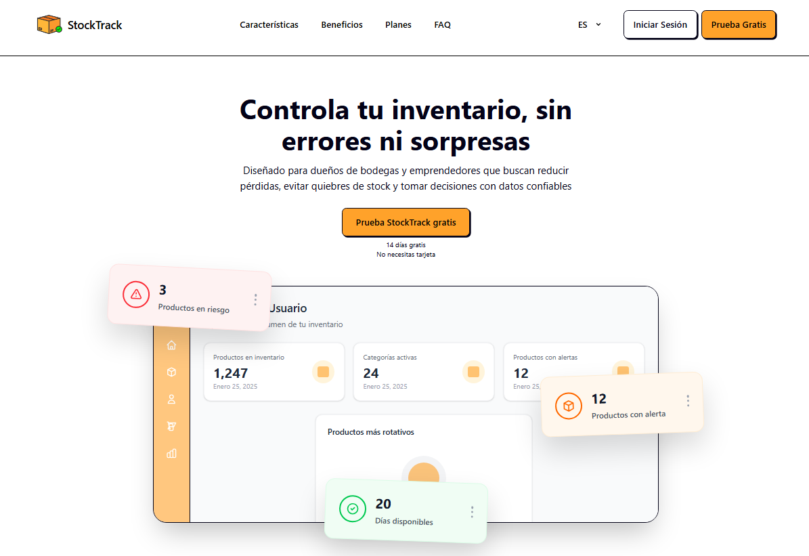

La imagen muestra la sección inicial de la Landing Page, donde se comunica la propuesta de valor mediante el mensaje **“Controla tu inventario, sin errores ni sorpresas”**. Esta vista contribuye al EXP-03 porque representa el primer punto de contacto del visitante con el producto y permite iniciar la medición del evento `session_started`. Además, el botón **“Prueba StockTrack gratis”** orienta al usuario hacia una acción inicial de conversión.

**Sección de beneficios de la Landing Page To-Be**

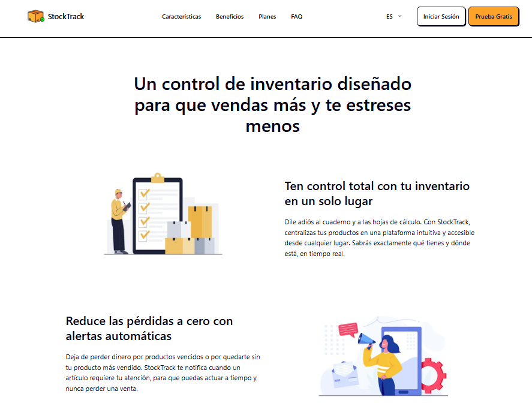

La imagen evidencia la presentación de beneficios principales como **“Ten control total con tu inventario en un solo lugar”** y **“Reduce las pérdidas a cero con alertas automáticas”**. Esta sección ayuda al usuario a comprender el valor funcional del producto antes de revisar los planes disponibles, reforzando la intención de conversión evaluada en el EXP-03.

**CTA de conversión de la Landing Page To-Be**

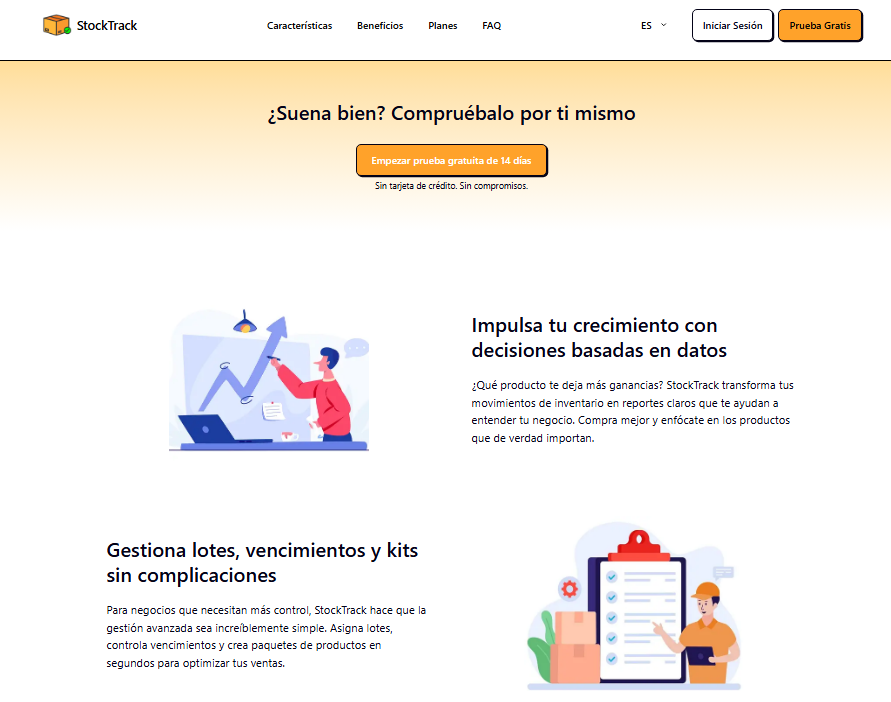

La imagen muestra el llamado a la acción **“Empezar prueba gratuita de 14 días”**, acompañado del mensaje **“Sin tarjeta de crédito. Sin compromisos.”** Este elemento se relaciona con la User Story US-TB07, ya que permite medir si los usuarios inician el proceso de conversión hacia un plan de pago mediante el evento `plan_upgrade_started`.

**Sección de planes freemium y premium**

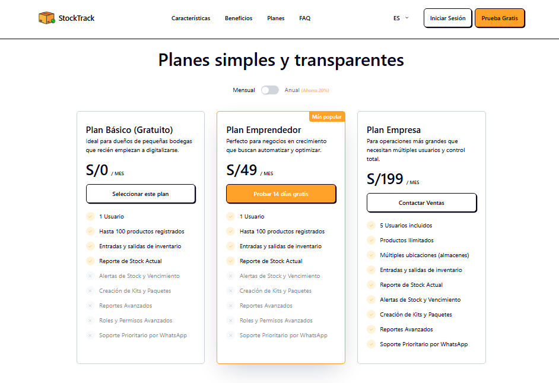

La imagen muestra la comparación entre los planes disponibles: **Plan Básico gratuito**, **Plan Emprendedor** y **Plan Empresa**. Esta sección se relaciona con la User Story US-TB06, ya que permite al visitante revisar las diferencias entre el plan gratuito y los planes premium antes de decidir si inicia el proceso de upgrade. Asimismo, la presencia del botón **“Probar 14 días gratis”** permite conectar esta vista con el evento `plan_upgrade_started`.

En conjunto, estas evidencias demuestran que la Landing Page To-Be fue orientada a la validación del modelo freemium. La estructura de contenido permite que el usuario conozca el valor del producto, identifique sus principales beneficios, compare alternativas de uso y ejecute una acción medible. Por lo tanto, esta implementación contribuye directamente al ciclo experiment-driven, ya que permite recolectar datos para evaluar la efectividad del modelo de adquisición freemium y su impacto en la conversión hacia planes premium.

#### 8.3.3.3. Implemented To-Be Frontend-Web Application Evidence

La implementación To-Be de la aplicación Frontend Web estuvo relacionada principalmente con el **EXP-02 — Reportes visuales de inventario**. Este experimento busca validar si el acceso a información visual del inventario incrementa la frecuencia con la que los usuarios toman decisiones de reabastecimiento basadas en datos.

Para ello, la aplicación web incorpora vistas orientadas al análisis y control del inventario, como el dashboard principal, el módulo de inventario/productos y la vista de salida de productos. Estas evidencias se relacionan directamente con la **US-TB04 — Dashboard de reportes visuales de inventario**, debido a que permiten al usuario consultar métricas, productos con alertas, ingresos mensuales, productos más vendidos y estado actual del stock. Asimismo, se relacionan con la **US-TB05 — Registro de evento de acceso a reportes**, ya que el acceso a estas vistas puede ser medido mediante eventos como `report_viewed`.

El objetivo de esta implementación no es únicamente mostrar información operativa, sino apoyar la validación experimental del uso de reportes visuales dentro de StockWise. Por ello, la aplicación web cumple un rol importante dentro del ciclo experiment-driven, ya que permite observar si los usuarios consultan información visual, revisan productos críticos y toman decisiones de inventario a partir de la información disponible en el sistema.

**Evidencias de implementación To-Be del Frontend Web**

| Elemento implementado | Descripción | User Story relacionada | Experimento relacionado | Métrica / evento asociado | Evidencia |
|---|---|---|---|---|---|
| Dashboard principal | Presenta información general del negocio, indicadores relevantes, productos con alertas, ingresos mensuales y productos más vendidos. | US-TB04 | EXP-02 | `report_viewed` | Dashboard web |
| Módulo de inventario | Permite visualizar productos registrados, precios, stock actual, stock mínimo, kits y opciones de reposición o creación de productos. | US-TB04 | EXP-02 | `report_viewed`, `inventory_restocked` | Inventario web |
| Vista de salida de productos | Permite registrar salidas de productos y visualizar un borrador con cantidades, precios y total de la operación. | US-TB04, US-TB05 | EXP-02 | `inventory_restocked` | Salida de productos |

**Dashboard principal de la aplicación web To-Be**

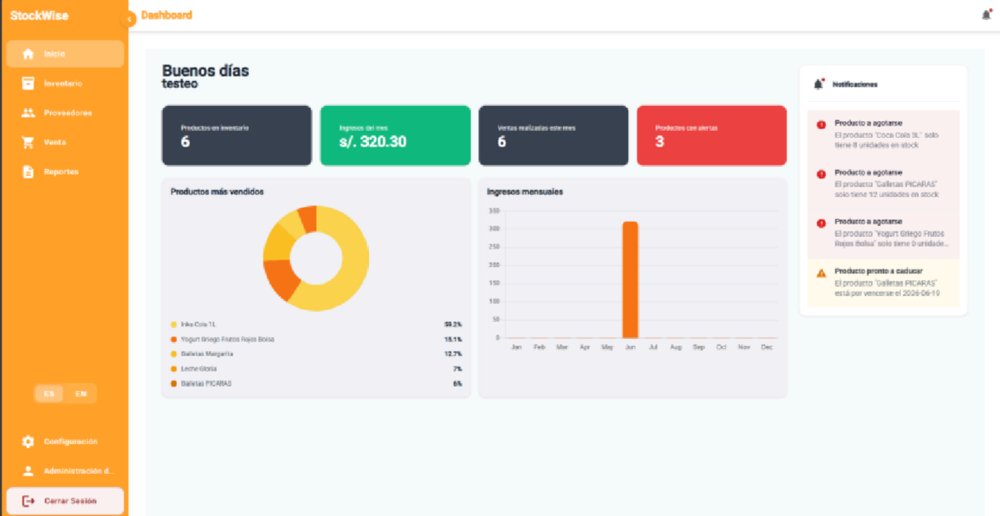

La imagen muestra el dashboard principal de la aplicación web, donde el usuario puede revisar indicadores generales del negocio, como productos en inventario, ingresos del mes, ventas realizadas y productos con alertas. Además, se visualizan gráficos de productos más vendidos e ingresos mensuales, junto con un panel de notificaciones sobre productos por agotarse o próximos a caducar. Esta vista contribuye al EXP-02 porque permite que el usuario consulte información visual antes de tomar decisiones de reabastecimiento.

**Módulo de inventario y productos de la aplicación web To-Be**

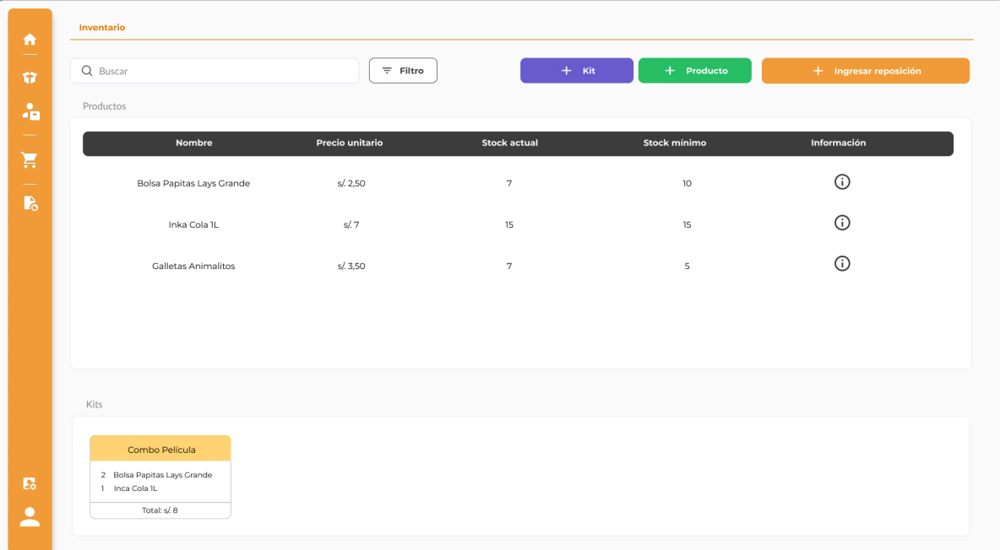

La imagen evidencia el módulo de inventario, donde el usuario puede revisar productos registrados, precio unitario, stock actual, stock mínimo e información adicional. También se observan acciones para crear kits, agregar productos e ingresar reposición. Esta funcionalidad se relaciona con la US-TB04 porque permite analizar el estado actual del inventario y detectar productos que podrían requerir reposición o seguimiento.

**Vista de salida de productos de la aplicación web To-Be**

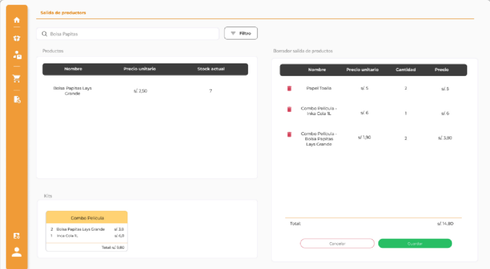

La imagen muestra la vista de salida de productos, donde el usuario puede buscar productos, aplicar filtros, revisar el stock actual y construir un borrador de salida con cantidades, precios y total de la operación. Esta evidencia permite conectar la consulta del inventario con una acción operativa concreta, ya que las salidas registradas impactan directamente en el stock disponible. Por ello, esta vista se relaciona con el evento `inventory_restocked` y complementa la validación del EXP-02, al permitir analizar cómo los movimientos de inventario influyen en las decisiones posteriores de reposición.

En conjunto, estas evidencias demuestran que la aplicación Frontend Web To-Be fue orientada a la validación del uso de información visual para la toma de decisiones de inventario. Las vistas implementadas permiten que el usuario consulte métricas, revise alertas, analice productos registrados y ejecute acciones relacionadas con el control de stock. Por lo tanto, esta implementación contribuye directamente al ciclo experiment-driven, ya que permite recolectar datos sobre el uso de reportes y evaluar si estos influyen en decisiones reales dentro del negocio.


#### 8.3.3.4. Implemented To-Be Native-Mobile Application Evidence

La implementación To-Be de la aplicación móvil estuvo relacionada principalmente con el **EXP-01 — Alertas push de stock bajo**. Este experimento busca validar si las alertas inteligentes permiten que los usuarios reaccionen a tiempo cuando un producto cae por debajo del umbral mínimo configurado, reduciendo así los quiebres de inventario y mejorando la planificación del reabastecimiento.

Para ello, la aplicación móvil incorpora vistas orientadas al control rápido del inventario, la revisión del estado de productos, el seguimiento de movimientos y la consulta de información relevante desde un dispositivo móvil. Esta evidencia se relaciona directamente con la **US-TB01 — Notificación push de stock bajo**, debido a que el sistema debe permitir que el usuario identifique productos críticos y actúe oportunamente. Asimismo, se relaciona con la **US-TB02 — Configuración de umbral mínimo por producto**, ya que la vista de inventario permite visualizar información de stock actual y stock mínimo. Finalmente, también se vincula con la **US-TB03 — Historial de alertas de stock bajo**, porque el usuario puede consultar movimientos o registros asociados al comportamiento del inventario.

El objetivo de esta implementación no es únicamente mostrar pantallas móviles, sino evidenciar cómo la experiencia nativa permite sostener el ciclo experiment-driven. En el contexto del EXP-01, la aplicación móvil es relevante porque los usuarios de bodegas y emprendimientos suelen revisar el stock durante la operación diaria del negocio. Por ello, contar con una interfaz rápida y accesible desde el celular facilita la reacción ante alertas, el seguimiento de productos críticos y la toma de decisiones de reposición.

**Evidencias de implementación To-Be de la aplicación móvil**

| Elemento implementado | Descripción | User Story relacionada | Experimento relacionado | Métrica / evento asociado | Evidencia |
|---|---|---|---|---|---|
| Dashboard móvil | Presenta una vista general del estado del inventario y accesos rápidos a funciones principales. | US-TB01 | EXP-01 | `alert_received`, `alert_opened` | Dashboard móvil |
| Historial de movimientos | Permite consultar entradas, salidas y cambios realizados en el inventario. | US-TB03 | EXP-01 | `stock_out_detected`, `inventory_restocked` | Historial móvil |
| Inventario por producto | Permite revisar productos, cantidades disponibles, stock mínimo y datos necesarios para identificar productos críticos. | US-TB02 | EXP-01 | `alert_received`, `stock_out_detected` | Inventario móvil |

**Dashboard móvil To-Be**

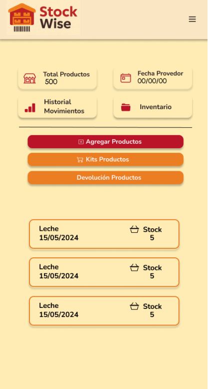

La imagen muestra el dashboard móvil de StockWise, donde el usuario puede revisar información general del inventario y acceder rápidamente a las funcionalidades principales. Esta vista contribuye al EXP-01 porque permite que el usuario identifique el estado general de sus productos desde el celular y pueda reaccionar con mayor rapidez ante situaciones de bajo stock o vencimiento próximo.

**Historial de movimientos y seguimiento del inventario**

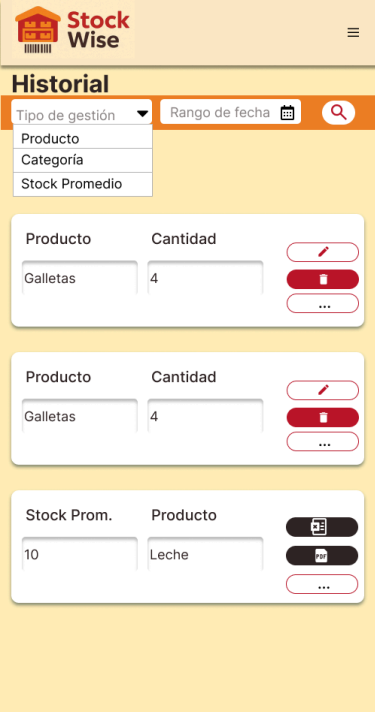

La imagen evidencia una vista de seguimiento del inventario, donde el usuario puede consultar movimientos, entradas o salidas de productos. Esta funcionalidad se relaciona con la US-TB03 porque permite revisar el comportamiento reciente del inventario y analizar qué productos presentan mayor riesgo de quiebre o requieren una acción de reposición.

**Inventario por producto en la aplicación móvil**

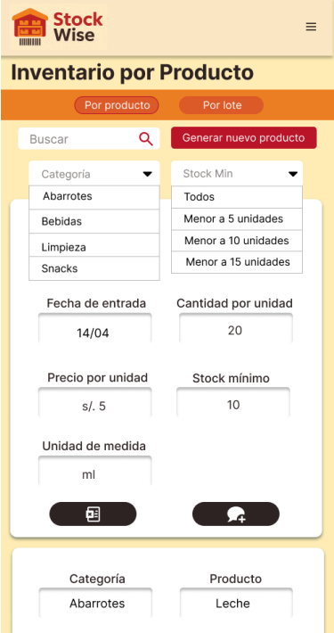

La imagen muestra la vista de inventario por producto, donde el usuario puede consultar información como producto, cantidad disponible, precio, fecha o stock mínimo. Esta pantalla se relaciona con la US-TB02 porque permite visualizar información necesaria para configurar o interpretar los umbrales mínimos de stock. Además, esta vista apoya la validación del EXP-01, ya que facilita la identificación de productos que podrían generar alertas automáticas cuando su cantidad disponible cae por debajo del límite establecido.

En conjunto, estas evidencias demuestran que la aplicación móvil To-Be fue orientada a la validación del impacto de las alertas de stock bajo en la operación diaria de los usuarios. Las vistas implementadas permiten consultar el estado del inventario, revisar movimientos y detectar productos críticos desde un dispositivo móvil. Por lo tanto, esta implementación contribuye directamente al ciclo experiment-driven, ya que permite relacionar la experiencia móvil con eventos como `alert_received`, `alert_opened`, `stock_out_detected` e `inventory_restocked`.

#### 8.3.3.5. Implemented To-Be RESTful API and/or Serverless Backend Evidence

#### 8.3.3.6. Team Collaboration Insights

Se evidencian insights de los repositorios de Github donde se han trabajado las implementaciones. Link de organización: https://github.com/upc-1ASI0732-2610-16879-Stoq 

Insights de repositorio de landing page Link: https://github.com/upc-1ASI0732-2610-16879-Stoq/Stoq-LandingPage 
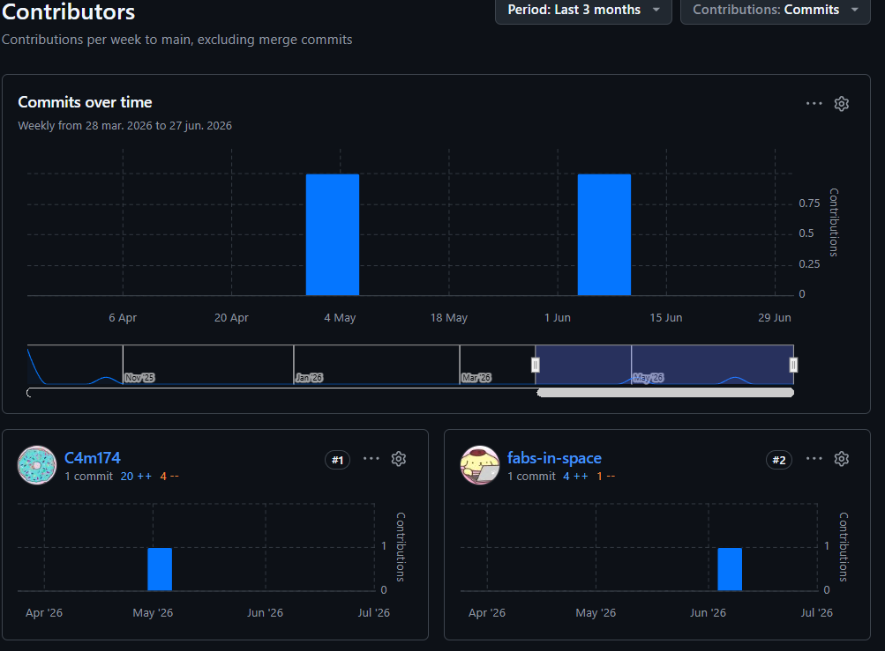

Insights de repositorio de frontend Link: https://github.com/upc-1ASI0732-2610-16879-Stoq/Stoq-FrontendWeb 
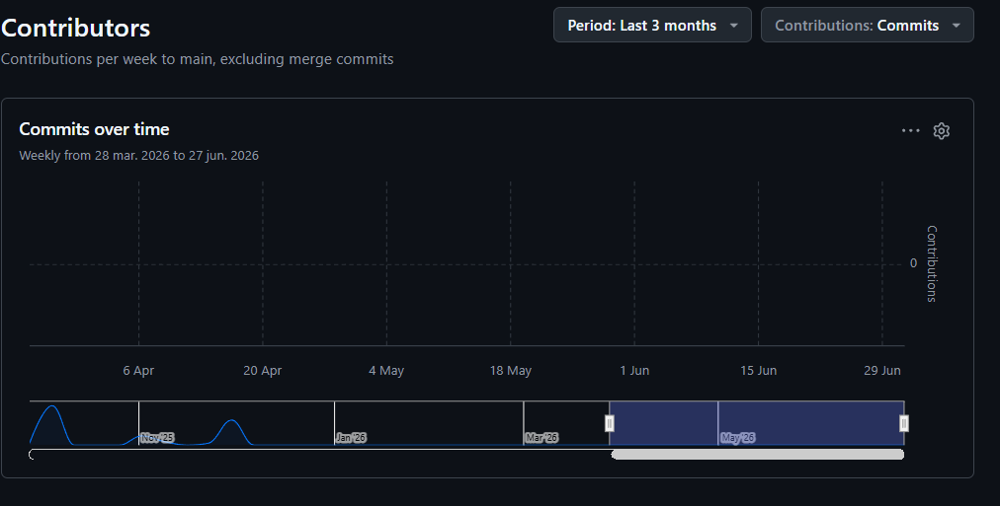

Insights de repositorio de backend Link: https://github.com/upc-1ASI0732-2610-16879-Stoq/Stoq-Web-Backend
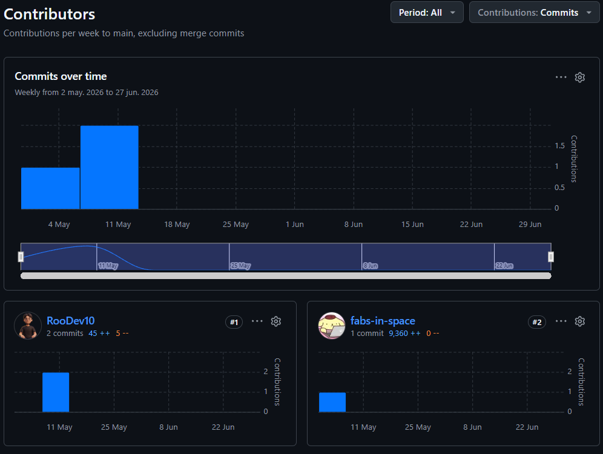

### 8.3.4. To-Be Validation Interviews

#### 8.3.4.1. Diseño de Entrevistas

**Segmento #1: Bodegas especializadas por rubro**

**Presentación del entrevistado:**
- ¿Cuál es tu nombre?
- ¿Qué edad tienes?
- ¿Desde cuándo gestionas esta bodega?
- ¿Cuál es el rubro principal de tu bodega?


**Contexto de la prueba:** El usuario interactúa con la app móvil y plataforma web para gestión de inventarios, enfocándose en los flujos de inicio de sesión, navegación de la interfaz, creación de productos/kits y el módulo de ventas.


**User Goal: Iniciar sesión y Recuperación de cuenta**
- El usuario hace clic en el enlace "¿Olvidaste tu contraseña?" y es redirigido correctamente al flujo de recuperación sin recargar la vista actual.
- El usuario introduce su correo y contraseña.
- Hace clic en el botón "Log In".
- El sistema muestra un tiempo de carga óptimo, evitando esperas prolongadas o un "spinner" infinito.
- El usuario es redirigido al Dashboard.


**User Goal: Interacción con la Interfaz y Menú Lateral (Sidebar)**
- El usuario visualiza la cabecera sin duplicidad en el título de la sección.
- Comprueba que el panel derecho de notificaciones es único y no está duplicado.
- El usuario colapsa el menú lateral izquierdo y verifica que el control de idioma sigue visible y accesible.
- Cambia el idioma a inglés para probar la interfaz.
- Visualiza las etiquetas del menú lateral asegurándose de que los textos largos (como "Administración...") se lean correctamente sin desbordar el contenedor.

**User Goal: Inventario (Productos) y Módulo de Ventas**
- El usuario ingresa a la sección de Inventario y abre los modales de "New Category" y "New product" (con el idioma en inglés), verificando que los textos se muestran correctamente sin exponer código interno.
- Despliega el menú contextual de acciones en el listado de productos.
- Selecciona "Editar" producto y verifica que la acción responde inmediatamente.
- Selecciona "Eliminar" producto y visualiza un mensaje de confirmación - que respeta el diseño del sistema.
- Navega al módulo de ventas e interactúa con el botón "Filtro" en la barra de búsqueda, comprobando que responde correctamente.

**User Goal: Creación de Kits**
- Pulsa el botón "Crear Kit" desde el menú principal.
- Intenta guardar el Kit dejando campos obligatorios vacíos.
- El sistema bloquea la acción y muestra mensajes de error y validación - claros.
- Completa los campos correctamente y guarda el Kit con éxito.
  

**Preguntas principales (Enfocadas en las mejoras):**
- ¿Qué te pareció la fluidez al iniciar sesión? ¿Notaste alguna demora inusual?
- ¿Pudiste utilizar la opción de recuperar contraseña sin problemas?
- Al recargar la página principal (Dashboard), ¿te mantuviste en la misma pantalla o notaste algún salto extraño?
- ¿Qué te pareció el diseño del menú lateral al colapsarlo? ¿Pudiste encontrar el botón de idioma fácilmente?
- ¿Cómo fue tu experiencia al editar o eliminar un producto desde el listado? ¿Los mensajes que aparecieron fueron claros?
- ¿Qué pasó cuando intentaste crear un Kit sin llenar toda la información? ¿El sistema te indicó claramente qué faltaba?
- ¿Te resultó fácil utilizar el botón de filtros en la sección de ventas?

**Valoración de experiencia:**
- Del 1 al 10, ¿qué tan fluida te pareció la plataforma comparada con versiones anteriores o sistemas similares?
- ¿Qué mejora visual o funcional agradeces más en esta prueba?
- ¿Qué función le agregarías sí o sí?
-¿Recomendarías esta plataforma a otros dueños de bodegas? ¿Por qué?

-------------------------------------------

**Segmento #2: Startups y emprendedores con necesidades logísticas**

**Presentación del entrevistado:**
- ¿Cuál es tu nombre?
- ¿Qué edad tienes?
- ¿Qué tipo de producto vendes o almacenas?
- ¿Tienes local físico, almacén propio o trabajas con terceros?

**Contexto de la prueba:** El usuario interactúa con la plataforma web para gestionar stock avanzado, registrar compras de proveedores y administrar los accesos del personal.

**User Goal: Iniciar sesión y Recuperación de cuenta**
- El usuario prueba el flujo de "¿Olvidaste tu contraseña?" comprobando la redirección correcta.
- Ingresa sus credenciales y accede al sistema sin atascos en la pantalla de carga.


**User Goal: Gestión de Proveedores**
- El usuario navega a la sección de Proveedores.
- Utiliza la barra de búsqueda y hace clic en el botón "Filtrar", verificando que la interfaz reaccione y aplique los filtros.
- Selecciona la acción "Editar" en un proveedor de la lista.
- Guarda los cambios y verifica que el mensaje de éxito tenga un diseño consistente y agradable.

**User Goal: Gestión de Personal**
- El usuario navega a la sección de Administración de personal.
- Hace clic en "Nuevo Personal" y completa el formulario.
- Guarda el registro exitosamente.
- El modal se cierra de forma automática y correcta, sin quedarse atascado en un estado de carga indefinido.

**User Goal: Inventario y Traducción**
- Cambia el idioma a inglés desde el menú lateral colapsado.
- Abre el modal de creación de nueva categoría y producto.
- Verifica que la traducción sea correcta y no muestre llaves de programación.
- Intenta crear un Kit con campos vacíos para comprobar la respuesta visual de error.

**Preguntas principales (Enfocadas en las mejoras):**
- ¿Cómo sentiste el tiempo de respuesta al momento de iniciar sesión y - cargar la plataforma?
- Al interactuar con la lista de proveedores, ¿el botón de filtrar funcionó como esperabas?
- Cuando editaste la información de un proveedor, ¿el mensaje de confirmación fue claro y visualmente agradable?
- ¿Cómo fue el proceso de registrar a un "Nuevo Personal"? ¿El sistema finalizó la tarea correctamente o sentiste que se quedó cargando?
- ¿Notaste algún problema con los textos de las ventanas emergentes al cambiar el idioma a inglés?
- Al navegar por el menú lateral izquierdo, ¿pudiste leer bien todas las opciones sin que los textos se cortaran abruptamente?

**Valoración de experiencia:**
- Del 1 al 10, ¿qué tanta confianza te transmite la estabilidad de la plataforma para tu operativa diaria?
- ¿Qué funcionalidad te pareció más ágil durante esta sesión?
- ¿Sientes que los avisos y errores del sistema (como al crear un kit incompleto) te ayudan a no cometer errores operativos?
- ¿Recomendarías esta plataforma a otros emprendedores? ¿Por qué?

#### 8.3.4.2. Registro de Entrevistas

**Segmento #1: Dueños de bodegas**

| Nº    | Datos del entrevistado                              | Resumen de la entrevista                                                                                                                                                                                                                                                                                                                                                                                                                                                                                                                                                                                                                                                                                                                                                                                                                                 | Evidencia de entrevista                                                                                                                                                                                                  |
| ----- | --------------------------------------------------- | -------------------------------------------------------------------------------------------------------------------------------------------------------------------------------------------------------------------------------------------------------------------------------------------------------------------------------------------------------------------------------------------------------------------------------------------------------------------------------------------------------------------------------------------------------------------------------------------------------------------------------------------------------------------------------------------------------------------------------------------------------------------------------------------------------------------------------------------------------- | ------------------------------------------------------------------------------------------------------------------------------------------------------------------------------------------------------------------------ |
| **1** | **Nombre:** Marcelo Binda <br> **Edad:** 26 años    | Marcelo Binda considera que StockWise representa una mejora significativa frente a los métodos tradicionales de gestión de inventario que utiliza actualmente, como cuadernos y hojas de Excel. Destaca que la aplicación le permite tener un mayor control y visibilidad del stock en tiempo real, reduciendo la incertidumbre sobre la disponibilidad de productos. Además, valora positivamente la simplicidad de la interfaz y la rapidez con la que puede realizar tareas básicas como el registro de productos y la consulta del inventario. Señala que la incorporación de alertas automáticas y un dashboard centralizado le ayuda a tomar decisiones más informadas y evitar pérdidas por falta de control. En general, percibe la herramienta como una solución práctica y adecuada para pequeñas bodegas que buscan digitalizar su operación. |  <br><a href="https://youtu.be/N24bfq0zY5w">Validation Interview Marcelo (YouTube)</a>                                                          |
| **2** | **Nombre:** Ariana Agreda <br> **Edad:** 20 años    | Ariana ayuda a su familia en el negocio familiar el cual es una bodega. Comenta que le resulta amigable y sencillo el flujo de la aplicación. Le ha gustado las notificaciones acerca de los productos que están por vencerse y agotarse. De igual forma, le ha parecido bueno como funciona lo de ingresar productos. Ella nos sugiere que para los reportes y pantalla de proveedores deberían mostrarse qué productos distribuye cada proveedor para un mayor seguimiento.                                                                                                                                                                                                                                                                                                                                                                            | 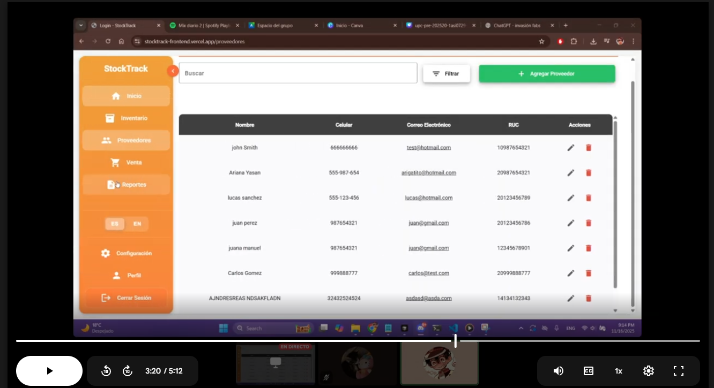 <br><a href="https://drive.google.com/file/d/1V4lmrnzp-ti0Fky-YqT2-ltAyMjlksPa/view?usp=sharing">Validation Interview Ariana</a>           |
| **3** | **Nombre:** Maryori Atanacio <br> **Edad:** 24 años | Maryori ayuda con la administración y atención a su familia bodega familiar. Comenta que la aplicación mostrada le pareció muy sencilla e intuitiva de usar sobre todo para la administración de productos que ofrece en su bodega. Considera que la funcionalidad de la sección de inventario es muy funcional y le ayudaría demasiado en el control de stocks y fecha de vencimiento en su producto. Recomienda que se debería añadir una funcionalidad para que pueda usarse con un lector de códigos de barras y sea más sencillo agregar productos.                                                                                                                                                                                                                                                                                                 | 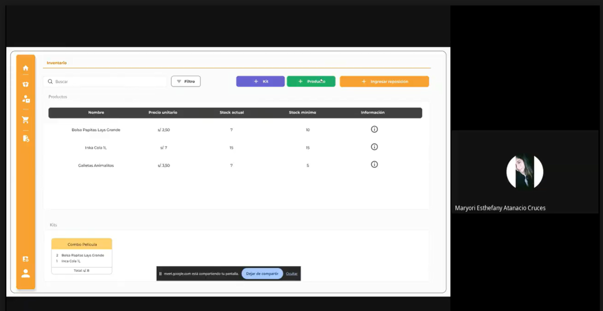 <br><a href="https://drive.google.com/file/d/1OtOnqF1lKWmzHf7uf1sX3Xd0sYxj4Ask/view?usp=sharing">Validation Interview Maryori</a>              |
| **4** | **Nombre:** Mauricio Elera <br> **Edad:** 25 años   | Mauricio administra el inventario de un negocio en crecimiento y percibe que StockWise le brinda una experiencia profesional y confiable gracias a su diseño ordenado y fácil de navegar. Destaca que las métricas rápidas y las alertas inteligentes le permiten reaccionar a tiempo ante riesgos como el bajo stock o productos por vencer. Considera muy intuitivo el proceso para registrar productos y gestionar roles de personal. Aunque está satisfecho con la estructura general del sistema, señala que un módulo de facturación y la integración con software contable harían la plataforma mucho más completa. Para él, la mayor ventaja de StockWise es centralizar toda la operación en un solo lugar, lo que le ayuda a reducir errores y mantener una gestión mucho más eficiente.                                                       | 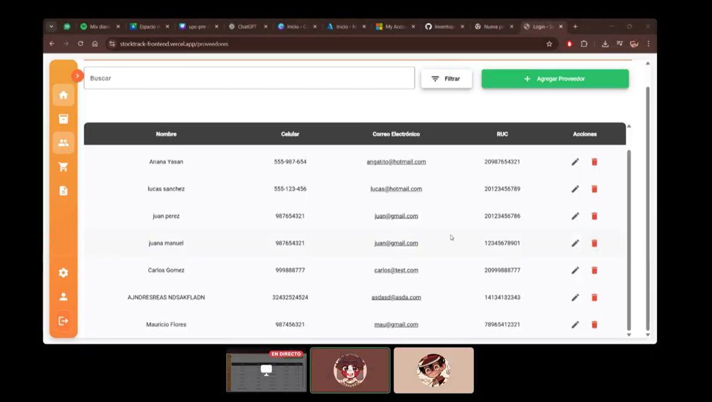 <br><a href="https://drive.google.com/file/d/1w0eSBDppZk9Z8G-TsmMfLN1sAYyxbZXt/view?usp=sharing">Validation Interview Mauricio</a> |

**Segmento #2: Startups y emprendedores en expansión con necesidades logísticas**

| Nº    | Datos del entrevistado                                       | Resumen de la entrevista                                                                                                                                                                                                                                                                                                                                                                                                                                                                                                                                                                                                                                                                                                                                                                                                                                                                                                                                               | Evidencia de entrevista                                                                                                                                                                                                                                                                                 |
| ----- | ------------------------------------------------------------ | ---------------------------------------------------------------------------------------------------------------------------------------------------------------------------------------------------------------------------------------------------------------------------------------------------------------------------------------------------------------------------------------------------------------------------------------------------------------------------------------------------------------------------------------------------------------------------------------------------------------------------------------------------------------------------------------------------------------------------------------------------------------------------------------------------------------------------------------------------------------------------------------------------------------------------------------------------------------------- | ------------------------------------------------------------------------------------------------------------------------------------------------------------------------------------------------------------------------------------------------------------------------------------------------------- |
| **1** | **Nombre:** Juan Carlos Ramírez <br> **Edad:** 49 años       | Juan Carlos Ramírez, emprendedor de 49 años, compartió su experiencia al utilizar la aplicación para la gestión de inventarios, destacando la facilidad de uso en el registro y control de productos, así como la organización del historial de movimientos. Consideró que estas herramientas podrían ayudarlo significativamente en su proceso de digitalización, ya que actualmente gestiona las entradas y salidas de manera manual mediante boletas y facturas físicas. En cuanto al diseño, señaló que la interfaz es clara y ordenada, aunque sugirió mejorar la personalización de reportes para adaptarlo mejor a las necesidades de su negocio. Finalmente, destacó que funcionalidades como la alerta de stock bajo y la gestión por lotes serían de gran apoyo para tener un control más preciso del inventario, y que la incorporación de estas herramientas digitales le permitiría automatizar procesos y liberar tiempo operativo en su gestión diaria. |  <br><a href="https://upcedupe-my.sharepoint.com/:v:/g/personal/u202313773_upc_edu_pe/IQAuZWd-FH7TToFY_sNa6w96AaorWRZA95mLFTK9JzecuiQ?e=C4w6aw">Validation Interview Carlos</a> |
| **2** | **Nombre:** Alexander Miranda Vivanco <br> **Edad:** 27 años | Alexander posee un emprendimiento de venta de artículos para mascotas. Durante la entrevista reconoció que StockWise le sería de mucha ayuda por la logística del inventario. Las métricas del dashboard le parecieron idóneas. Sugirió facilitar el flujo de cuando se crea un producto y se agrega una reposición. Asimismo, comentó que le sería de mucha utilidad generar reportes acerca de aquellos productos que se hayan vencido. También especificó que poder agregar etiquetas personalizables sería adecuado y recomendó implementar una mejor lógica respecto a la reposición del stock.                                                                                                                                                                                                                                                                                                                                                                   | 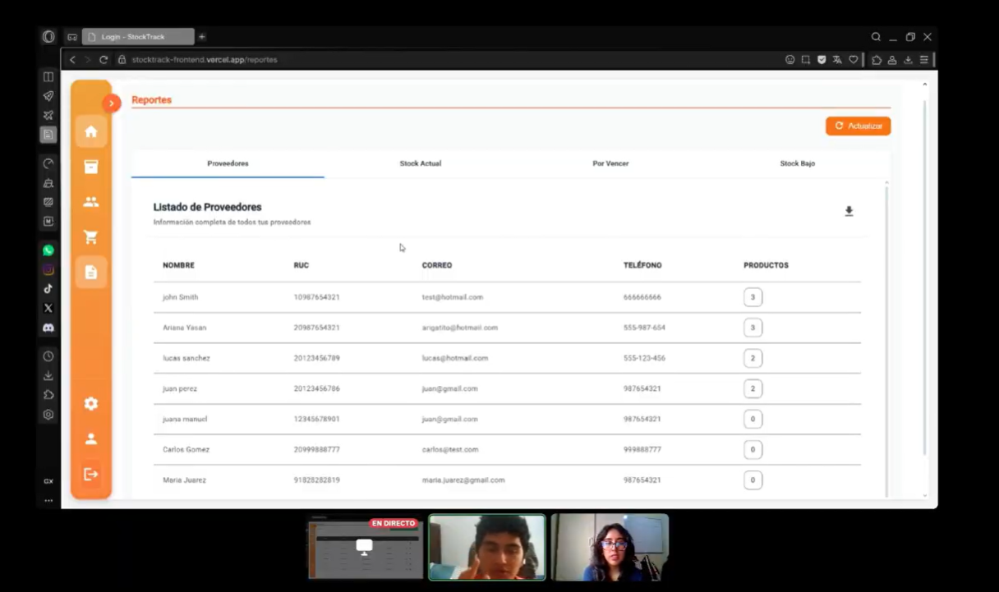 <br><a href="https://drive.google.com/file/d/14zPKDtkD_IFM2UjiPwRLCzG2cnPtis6E/view?usp=sharing">Validation Interview Alexander</a>                             |
| **3** | **Nombre:** Briseth Hurtado <br> **Edad:** 27 años           | Briseth, quien cuenta con un emprendimiento de venta de artículos para mascotas, señaló que StockWise le resultaría de gran utilidad para gestionar su inventario y valoró positivamente las métricas presentadas en el dashboard. Además, sugirió simplificar el proceso de creación de productos y reposiciones, incorporar reportes de productos vencidos, permitir etiquetas personalizables y mejorar la lógica de reposición de stock para optimizar la administración del negocio.                                                                                                                                                                                                                                                                                                                                                                                                                                                                              | 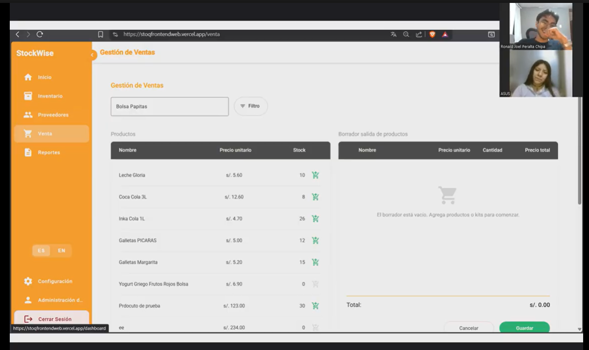 <br><a href="https://drive.google.com/file/d/1SVhaXsh7jYZ6zZEcPJHA6YWHBGtPcM1K/view?usp=sharing">Validation Interview Briseth</a>                                         |

## 8.4. Experiment Aftermath & Analysis

### 8.4.1. Analysis and Interpretation of Results

Con base en la ejecución de los experimentos definidos en las secciones 8.1 y 8.2, y sustentada en la evidencia recolectada durante las To-Be Validation Interviews (sección 8.3.4), se presenta el análisis e interpretación de los resultados obtenidos para cada uno de los experimentos planificados.

**Experimento EXP-01: Alertas push de stock bajo**

Hipótesis: Creemos que activar las alertas push en la aplicación móvil reducirá la frecuencia de quiebres de inventario en al menos un 40% en un período de 4 semanas, y se observará que un 70% de los reabastecimientos ocurren dentro de las primeras 24 horas posteriores a la notificación.

Resultados obtenidos:

A través de las entrevistas de validación con usuarios del segmento de bodegas (Marcelo Binda, Ariana Agreda, Maryori Atanacio, Mauricio Elera), se identificaron los siguientes hallazgos clave relacionados con las alertas:

|Hallazgo | Evidencia | Interpretación |
|--- |----- | -----  |
|Valoración positiva de las alertas automáticas  | Marcelo Binda destacó que "la incorporación de alertas automáticas y un dashboard centralizado le ayuda a tomar decisiones más informadas y evitar pérdidas por falta de control". Ariana Agreda mencionó que "le ha gustado las notificaciones acerca de los productos que están por vencerse y agotarse". | Los usuarios perciben valor en recibir notificaciones proactivas sobre el estado de su inventario. Las alertas son identificadas como un elemento clave para reducir pérdidas y anticipar problemas. |
|Reacción temprana ante riesgos | Mauricio Elera señaló que "las métricas rápidas y las alertas inteligentes le permiten reaccionar a tiempo ante riesgos como el bajo stock o productos por vencer". | La funcionalidad de alertas no solo informa, sino que genera una respuesta operativa por parte del usuario, lo que sugiere un impacto positivo en la reducción de quiebres.  |
|Sugerencia de mejora: escáner de códigos de barras|Maryori Atanacio recomendó "añadir una funcionalidad para que pueda usarse con un lector de códigos de barras y sea más sencillo agregar productos". | Si bien las alertas son valoradas, los usuarios identifican oportunidades de mejora en el registro de productos, lo que podría potenciar aún más el impacto de las alertas al reducir la fricción en el ingreso de datos.|

Interpretación general:

Los resultados cualitativos indican que la hipótesis del EXP-01 se valida parcialmente. Los usuarios reconocen el valor de las alertas automáticas y reportan una mejora en su capacidad de reacción ante quiebres de stock y vencimientos. Sin embargo, la reducción del 40% en quiebres no pudo ser cuantificada directamente en esta fase de validación, ya que los experimentos se realizaron en un entorno controlado y con prototipos funcionales, no en producción con métricas continuas. La evidencia sugiere que el impacto real dependerá de la correcta implementación de las alertas y de la integración con funcionalidades complementarias como el registro rápido de productos.

**Estado de la hipótesis: Parcialmente validada**

**Experimento EXP-02: Reportes visuales de inventario**

Hipótesis: Creemos que ofrecer un módulo de reportes visuales integrados en el dashboard principal aumentará en un 30% la frecuencia semanal con la que los usuarios ajustan sus solicitudes de reabastecimiento basándose en datos del sistema, logrando una tasa de adopción de la función de al menos el 50% de los usuarios activos.

Resultados obtenidos:

A partir de las entrevistas con usuarios de ambos segmentos, se obtuvieron los siguientes hallazgos relacionados con los reportes visuales:

|Hallazgo | Evidencia | Interpretación |
|--- |----- | -----  |
|Valoración de la simplicidad y claridad de la interfaz  | Marcelo Binda destacó "la simplicidad de la interfaz y la rapidez con la que puede realizar tareas básicas como el registro de productos y la consulta del inventario". Ariana Agreda comentó que "le resulta amigable y sencillo el flujo de la aplicación". | La usabilidad y claridad visual son percibidas como fortalezas del producto, lo que facilita la adopción de funcionalidades como los reportes.|
|Centralización de la información como ventaja | Mauricio Elera señaló que "la mayor ventaja de StockWise es centralizar toda la operación en un solo lugar, lo que le ayuda a reducir errores y mantener una gestión mucho más eficiente". | Los reportes visuales contribuyen a esta centralización al ofrecer una vista consolidada del estado del inventario, lo que respalda la hipótesis de que facilitan decisiones basadas en datos. |
|Sugerencia de mejora: personalización de reportes|Juan Carlos Ramírez sugirió "mejorar la personalización de reportes para adaptarlo mejor a las necesidades de su negocio". Alexander Miranda recomendó "generar reportes acerca de aquellos productos que se hayan vencido". | Si bien los reportes son valorados, los usuarios demandan mayor flexibilidad y personalización, lo que indica que la funcionalidad actual es un buen punto de partida pero requiere evolución.|
|Valoración de métricas del dashboard   | Alexander Miranda mencionó que "las métricas del dashboard le parecieron idóneas".   | El dashboard con indicadores clave es percibido como útil y alineado con las necesidades de los usuarios.  |

Interpretación general:

La hipótesis del EXP-02 se valida parcialmente. Los usuarios valoran positivamente la disponibilidad de información visual y centralizada, y reconocen que esta les ayuda a tomar decisiones más informadas. Sin embargo, la tasa de adopción del 50% y el incremento del 30% en ajustes de reabastecimiento no pudieron ser cuantificados en esta fase, ya que la validación se realizó mediante entrevistas con prototipos y no con métricas de uso en producción. La demanda de personalización sugiere que el módulo de reportes debe evolucionar para maximizar su impacto.

**Estado de la hipótesis: Parcialmente validada**

**Experimento EXP-03: Modelo freemium**

Hipótesis: Creemos que al implementar un modelo de plan gratuito con topes de almacenamiento de productos, al menos un 15% de los usuarios activos freemium migrará voluntariamente a un plan de pago premium dentro de sus primeros 60 días de uso para desbloquear funciones avanzadas.

Resultados obtenidos:

A partir de las entrevistas de validación y la implementación de la Landing Page To-Be, se identificaron los siguientes hallazgos:

|Hallazgo |	Evidencia |Interpretación |
|----|----|-----|
|Interés en el producto y disposición a recomendar	|Marcelo Binda percibe la herramienta como "una solución práctica y adecuada para pequeñas bodegas que buscan digitalizar su operación". Mauricio Elera afirmó que "centralizar toda la operación en un solo lugar le ayuda a reducir errores".	|Existe una percepción positiva del valor del producto, lo que constituye una base favorable para la conversión a planes de pago.|
|Reconocimiento del valor de las funciones avanzadas	|Alexander Miranda señaló que "le sería de mucha utilidad generar reportes acerca de aquellos productos que se hayan vencido". Juan Carlos Ramírez destacó que "funcionalidades como la alerta de stock bajo y la gestión por lotes serían de gran apoyo".	|Los usuarios identifican valor en funcionalidades que podrían estar disponibles solo en planes premium, lo que sugiere que existe disposición a pagar por acceso a estas características.|
|Sugerencia de integración con otras herramientas|	Mauricio Elera señaló que "un módulo de facturación y la integración con software contable harían la plataforma mucho más completa".	|La disposición a pagar podría aumentar si el producto se integra con herramientas complementarias que los usuarios ya utilizan (facturación, contabilidad).|
|Landing Page orientada a conversión|	La Landing Page To-Be incorpora una sección de comparativa de planes freemium vs premium con llamados a la acción claros ("Empezar prueba gratuita de 14 días", "Probar 14 días gratis").|	La implementación de la Landing Page permite medir eventos de conversión como session_started, plan_upgrade_started y plan_upgrade_completed, lo que facilitará la validación cuantitativa del modelo freemium en fases posteriores.|

Interpretación general:

La hipótesis del EXP-03 se encuentra en proceso de validación. Los resultados cualitativos indican que los usuarios reconocen el valor del producto y muestran interés en funcionalidades avanzadas, lo que sugiere que el modelo freemium podría ser efectivo. Sin embargo, la tasa de conversión del 15% en 60 días no pudo ser medida en esta fase, ya que la validación se realizó con prototipos y entrevistas, no con métricas de uso real en producción. La Landing Page To-Be implementada permitirá recolectar estos datos en futuras iteraciones.

**Estado de la hipótesis: En proceso de validación (resultados cualitativos favorables)**

**Resumen de resultados**

|Experimento |	Hipótesis	|Resultado cualitativo	|Estado
|----|----|----|----|
EXP-01	|Alertas push reducen quiebres de stock en 40%	|Usuarios valoran alertas y reportan mejor reacción ante riesgos. Sugieren mejoras en registro de productos.	|Parcialmente validada
EXP-02|	Reportes visuales aumentan decisiones de reabastecimiento en 30%	|Usuarios valoran centralización y simplicidad. Demandan mayor personalización de reportes.	|Parcialmente validada
EXP-03|	Modelo freemium logra conversión del 15% en 60 días	|Usuarios reconocen valor del producto y disposición a recomendar. Interés en funcionalidades avanzadas.	|En proceso de validación


### 8.4.2. Re-scored and Re-prioritized Question Backlog

Con base en los resultados obtenidos durante la ejecución de los experimentos y el análisis de las entrevistas de validación, se ha revisado y re-priorizado el Question Backlog definido en la sección 8.1.4. El nuevo orden refleja el conocimiento adquirido, la validación parcial de algunas hipótesis y la aparición de nuevas preguntas que orientarán los próximos ciclos experimentales.

**Criterios de re-priorización**

Criterio	|Descripción
|-----|-----|
Alta prioridad	|Preguntas cuya respuesta es crítica para la validación de las hipótesis centrales del producto o para la toma de decisiones estratégicas.
Media prioridad|	Preguntas que aportan información valiosa para mejorar el producto, pero no bloquean decisiones inmediatas.
Baja prioridad| 	Preguntas que pueden ser respondidas en fases posteriores, una vez validadas las hipótesis principales.

**Question Backlog Re-priorizado**

#|	Pregunta|	Área de incertidumbre|	Prioridad anterior|	Nueva prioridad	|Justificación del cambio|	Relación con hipótesis
|---|----|---|--|---|---|---|
|**Nuevas preguntas surgidas durante la experimentación**						
1|	¿Cómo podemos integrar StockWise con sistemas de facturación y software contable para aumentar el valor percibido del producto?|	Integración con ecosistema	|Nueva	|Alta|	Durante las entrevistas, Mauricio Elera señaló que "un módulo de facturación y la integración con software contable harían la plataforma mucho más completa". Esta necesidad recurrente sugiere que la integración con herramientas complementarias podría ser un diferenciador clave.|	Hipótesis 3 (Freemium)
2	|¿Qué tan importante es para los usuarios la funcionalidad de escáner de códigos de barras para agilizar el registro de productos?|	Funcionalidad de registro|	Nueva|	Alta|Maryori Atanacio recomendó "añadir una funcionalidad para que pueda usarse con un lector de códigos de barras y sea más sencillo agregar productos". Esta sugerencia, combinada con la importancia del registro rápido, justifica una prioridad alta.|	Hipótesis 1 (Alertas) y 4 (Automatización)
3	|¿Qué nivel de personalización de reportes es necesario para que los usuarios consideren que el módulo satisface completamente sus necesidades?	|Personalización de reportes	|Nueva|	Media	|Juan Carlos Ramírez sugirió "mejorar la personalización de reportes". Esta demanda indica que la funcionalidad actual es un buen punto de partida, pero requiere evolución para maximizar su adopción.	|Hipótesis 2 (Reportes)
4	|¿Es viable implementar un flujo optimizado para la creación de productos y reposiciones como sugirieron los usuarios?	|Experiencia de usuario	|Nueva|	Media	|Alexander Miranda sugirió "facilitar el flujo de cuando se crea un producto y se agrega una reposición". Esta mejora podría reducir la fricción en el uso diario del sistema.|	Hipótesis 4 (Automatización)
5	|¿Los usuarios estarían dispuestos a pagar por funcionalidades premium si estas incluyen integración con herramientas de contabilidad?|	Modelo de negocio	|Nueva|	Media|La integración con contabilidad podría ser un factor de conversión a planes premium. Esta pregunta permite explorar si el valor agregado de la integración justifica el costo.|	Hipótesis 3 (Freemium)
**Preguntas existentes re-priorizadas**		
1|	¿Los usuarios de bodegas realmente usarán la entrada por voz como método principal de registro, o preferirán el escaneo por cámara?|	Adopción de funcionalidad innovadora	|Alta	|Media	|Los resultados cualitativos sugieren que los usuarios valoran más el escaneo rápido (cámara o código de barras) que la entrada por voz. Esta pregunta se mantiene, pero baja su prioridad al tener indicios de respuesta.|	Hipótesis 1 (Alertas anti-quiebre)
2	|¿El porcentaje del 15% de conversión de freemium a premium en 60 días es realista para el mercado de bodegas peruano?	|Modelo de negocio	|Alta|	Alta	|Esta pregunta sigue siendo crítica para la viabilidad del modelo de negocio. Aunque los resultados cualitativos son favorables, la confirmación cuantitativa es necesaria. Se mantiene en prioridad alta.	|Hipótesis 3 (Freemium)
3	|¿Los reportes visuales móviles serán utilizados semanalmente por el 70% de los usuarios, o la frecuencia será menor?	|Engagement del usuario|	Alta|	Alta|	Los usuarios valoran los reportes, pero la demanda de personalización sugiere que la adopción podría ser menor si no se ajustan a sus necesidades. Esta pregunta sigue siendo clave.|	Hipótesis 2 (Reportes para decidir)
4	|¿Qué tiempo real dedican hoy los usuarios al control manual de stock (línea base) para poder medir una reducción del 40%?|	Métrica base|	Alta|	Alta|	No se obtuvo una línea base cuantificada en la validación. Esta pregunta sigue siendo crítica para medir el impacto real de la automatización en la siguiente fase.	|Hipótesis 4 (Automatización)
5	|¿Los usuarios confían en las alertas predictivas de reabastecimiento o prefieren seguir usando su criterio empírico?|	Confianza en IA/predicción	|Media|	Alta|	Los resultados cualitativos muestran que los usuarios valoran las alertas, pero la confianza en predicciones más avanzadas aún no se ha probado. Se prioriza para explorar el potencial de la funcionalidad de predicción inteligente.|	Hipótesis 1 y 4
6	|¿La falta de tiempo para implementar un sistema es la verdadera barrera, o existen otros factores no detectados (ej. desconfianza en la nube)?	|Barreras de adopción|	Alta|	Alta	|Esta pregunta sigue siendo fundamental para la estrategia de adopción. Los resultados de las entrevistas confirman que la falta de tiempo es una barrera, pero no descartan otros factores como la desconfianza o la falta de conocimiento.|	Todas
7	|¿Los usuarios están dispuestos a pagar por funcionalidades como geolocalización o escaneo por lotes, o las consideran "nice to have"?	|Propuesta de valor de planes premium	|Media|	Media	|Los resultados cualitativos sugieren que los usuarios valoran funcionalidades prácticas (alertas, reportes) por encima de las avanzadas (geolocalización). Se mantiene en prioridad media.	|Hipótesis 3
8	|¿El onboarding guiado dentro de la app reduce efectivamente la curva de aprendizaje para usuarios con baja experiencia tecnológica?|	Usabilidad|	Media	|Media|	No se identificaron problemas de usabilidad graves durante las entrevistas, pero tampoco se midió específicamente el impacto del onboarding. Se mantiene en prioridad media.	|Hipótesis 1
9	|¿Los usuarios realmente consultan el historial de movimientos con frecuencia, o es una funcionalidad de respaldo poco utilizada?|	Valor real de funcionalidad	|Baja	|Baja	|Los usuarios no mencionaron el historial de movimientos como una funcionalidad crítica. Se mantiene en prioridad baja, ya que otras funcionalidades son más valoradas.|	Hipótesis 2
10|	¿La generación de boletas digitales desde el móvil reduce errores de facturación en un 50%, o la mayoría de los negocios ya usan sistemas alternativos?|	Impacto real	|Media|	Media	|Los usuarios mencionaron la necesidad de facturación, pero no se profundizó en esta funcionalidad durante las entrevistas. Se mantiene en prioridad media.	|Hipótesis 5

**Resumen del Question Backlog Re-priorizado**

|Prioridad	|Total de preguntas	|Preguntas nuevas	|Preguntas existentes
|---|---|---|---|
Alta	|7|	2	|5
Media|	6|	3	|3
Baja|	1|	0	|1
**Total**|	**14**|	**5**	|**9**

**Conclusiones del re-scoring**

1. Las hipótesis centrales (EXP-01 y EXP-02) se validan parcialmente, lo que confirma que las funcionalidades de alertas y reportes son valoradas por los usuarios y tienen potencial para generar el impacto esperado en la operación de bodegas y emprendimientos.

2. El modelo freemium (EXP-03) tiene indicios favorables, pero su validación definitiva requerirá la medición de métricas de conversión en producción durante los próximos 60 días.

3. Nuevas preguntas han surgido, principalmente relacionadas con la integración con herramientas complementarias (facturación, contabilidad) y la mejora de la experiencia de registro de productos (escáner de códigos de barras, flujo optimizado).

4. La prioridad de la entrada por voz ha disminuido, ya que los usuarios muestran mayor interés en el escaneo rápido (cámara o código de barras) como método de registro ágil.

5. La personalización de reportes se identifica como un área de mejora prioritaria, ya que los usuarios valoran la información visual pero demandan mayor flexibilidad para adaptarla a sus necesidades específicas.


### 8.5. Continuous Learning

### 8.5.1. Shareback Session Artifacts: Learning Workflow

Tras consolidar los resultados de la sección 8.4.1, el equipo realizó una sesión de **Shareback**: una reunión donde se comparten los hallazgos del experimento con todo el equipo y se toma, por cada hipótesis o métrica, una decisión explícita de Persevere (continuar sin cambios), Pivot (cambiar el enfoque) o Kill (descartar la idea). Esta sesión cierra el ciclo de aprendizaje continuo y alimenta directamente al Question Backlog re-priorizado (8.4.2).

| Sesión | Shareback Session — Ciclo Experimental Sprint 4 |
| :--- | :--- |
| **Date** | 2026-07-05 |
| **Time** | 09:00 PM |
| **Location** | Reunión virtual vía Discord |
| **Prepared By** | Fabiola Saldaña |
| **Attendees** | Peralta Chipa, Ronald Joel / Choquehuanca Nuñez, Luciana Carolina / Sanchez Rios, Camila / Fernandez Remon, Roy Linsh / Saldaña Ayala, Fabiola Del Rocio |
| **Agenda** | 1) Repaso de los resultados de validación cualitativa y entrevistas (8.4.1). 2) Discusión abierta de hallazgos y sorpresas. 3) Decisión Persevere/Pivot/Kill por hipótesis. 4) Traslado de conclusiones al Question Backlog re-priorizado (8.4.2). |

<br>

**Decisiones tomadas**

| Hipótesis / Métrica | Resultado observado | Decisión | Justificación |
| :--- | :--- | :--- | :--- |
| EXP-01 — Alertas push de stock bajo | Alta valoración cualitativa para evitar pérdidas, pero fricción alta al registrar productos manualmente. No se pudo medir la reducción del 40% en entorno controlado. | **Persevere, con Pivot en UX** | Se mantiene la lógica de las alertas (Persevere), pero se decide pivotar el flujo de ingreso implementando un **flujo optimizado de creación y duplicación rápida de productos** para reducir la carga manual y asegurar la adopción real. |
| EXP-02 — Reportes visuales de inventario | Los usuarios valoran la centralización, pero demandan personalización específica (ej. reportes solo de vencidos). | **Pivot (Evolución de feature)** | El dashboard estático validó la necesidad, pero para lograr el 30% de aumento en ajustes de reabastecimiento, se debe pivotar hacia vistas personalizables. |
| EXP-03 — Modelo freemium | Interés validado en funciones avanzadas y disposición a recomendar. Sin embargo, no hay denominador real aún para calcular el 15% de conversión en 60 días. | **Persevere, con extensión de medición** | No hay evidencia para descartar el modelo; se necesita lanzar a producción con la nueva Landing Page implementada para rastrear eventos y conversiones reales. |
| Feature — Integración Contable / Facturación | Fuerte sugerencia espontánea por parte de los entrevistados para el plan Premium. | **Diferir** | Se reconoce como un gran aportante de valor al modelo freemium, pero se prioriza conscientemente para un próximo ciclo tras estabilizar métricas base. |

<br>

**Aprendizaje principal de la sesión:** Ninguna hipótesis central fue descartada (**Kill**) en este ciclo; el equipo decidió **perseverar** con el modelo de negocio y las funcionalidades núcleo, extendiendo el tiempo de medición hacia un entorno de producción real. Sin embargo, los descubrimientos cualitativos demostraron que para alcanzar los objetivos cuantitativos deseados, se requiere un **Pivot** en la experiencia de uso: es imprescindible priorizar el escáner de códigos de barras y la personalización de reportes, ya que la limitación actual identificada radica en la fricción operativa, no en el diseño conceptual de la solución.

## 8.6. To-Be Software Platform Pre-launch

### 8.6.1. About-the-Product Intro Video
El video de introducción de StockWise es la pieza central de nuestra estrategia de prelanzamiento. Tiene como objetivo comunicar la propuesta de valor de forma directa y visual, conectando con las frustraciones operativas de nuestro público objetivo y demostrando lo fácil que es migrar hacia nuestra solución digital.

Link del video: 

# Conclusiones y recomendaciones
En conclusión, el desarrollo de StockWise permitió aplicar distintas buenas prácticas de ingeniería de software que mejoraron la calidad y confiabilidad del sistema. El uso de pruebas unitarias permitió validar el correcto funcionamiento de componentes individuales, mientras que las pruebas de integración aseguraron una comunicación adecuada entre módulos como inventario, autenticación y gestión de productos, ayudando a detectar errores antes del despliegue.

Asimismo, la implementación de integración continua, APIs RESTful y una arquitectura organizada basada en DDD facilitó el trabajo colaborativo, el mantenimiento del código y la escalabilidad de la aplicación. Además, el uso de wireframes, mockups y prototipos permitió integrar adecuadamente el diseño UX/UI con el desarrollo, logrando una experiencia más intuitiva para los usuarios.

En general, estas prácticas aportaron beneficios importantes como mayor estabilidad, reducción de errores, validación temprana de fallos, despliegues más seguros y un proceso de desarrollo más eficiente y profesional.

# Video App Validation

**Video app mobile validation:** [https://canva.link/5zzsufn0huy1z6b](https://canva.link/5zzsufn0huy1z6b) 

**Video app web validation:** [https://drive.google.com/file/d/1IDTGIL7bwv_QfjnIkG7h_DPrEv4yW_R8/view?usp=sharing](https://drive.google.com/file/d/1IDTGIL7bwv_QfjnIkG7h_DPrEv4yW_R8/view?usp=sharing) 

# Video About-the-Team

# Bibliografia

# Anexos

